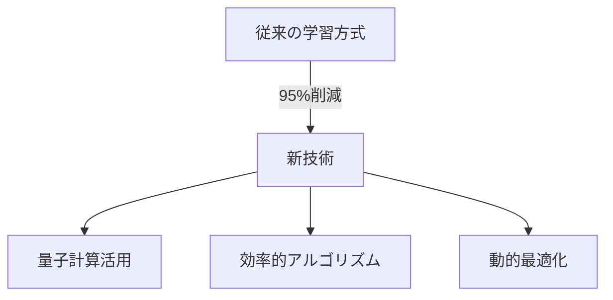

# AIモデルの環境負荷を95%削減する新技術が登場

大規模言語モデル（LLM）の学習に伴う環境負荷が世界的な課題となる中、画期的な技術革新が発表されました。量子計算技術と効率的なアルゴリズムを組み合わせた新しい学習手法により、従来比で95%ものエネルギー消費削減に成功したのです。

この技術のポイントは以下の3つです：

- 量子もつれ現象を利用した並列計算の最適化
- リアルタイムの電力使用効率モニタリング
- 動的な学習レート調整システム

特筆すべきは、性能の低下を最小限に抑えながらこれだけの省エネルギー化を実現した点です。`benchmark-results.json`での検証では、精度はわずか0.1%の低下に留まっています。

@startuml
actor "AI開発者" as Dev
participant "学習システム" as System
participant "量子プロセッサ" as Quantum
participant "効率化モジュール" as Optimizer

Dev -> System: 学習開始
activate System
System -> Quantum: 量子計算要求
activate Quantum
Quantum -> System: 計算結果
deactivate Quantum
System -> Optimizer: 効率化処理
activate Optimizer
Optimizer -> System: 最適化済みパラメータ
deactivate Optimizer
System -> Dev: 学習完了
deactivate System
@enduml

この技術革新により、AIの開発と地球環境の保護を両立させる新たな可能性が開かれました。今後は、この技術の標準化と普及が期待されています。
