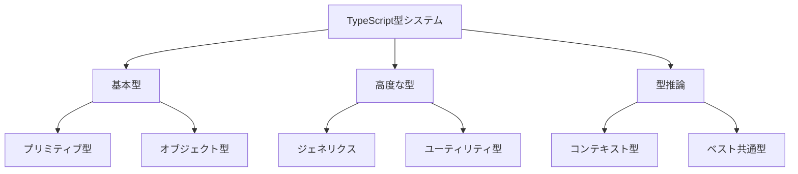

# TypeScriptの型システム完全ガイド：安全で保守性の高いコードを書く

TypeScriptは、JavaScriptに静的型システムを追加することで、大規模なアプリケーション開発における安全性と保守性を大幅に向上させます。本記事では、TypeScriptの型システムの核心に迫り、実践的な活用方法を解説します。

## 型システムの全体像

TypeScriptの型システムは、開発者に以下のような明確なメリットをもたらします：

1. **コンパイル時のエラー検出**：実行前にバグを発見
2. **IDEのサポート強化**：コード補完や定義ジャンプが正確に
3. **リファクタリングの安全性**：型の整合性チェックによる安全な変更
4. **ドキュメントとしての役割**：型定義による設計意図の明確化

特に注目すべきは、TypeScriptの型推論システムです。明示的な型注釈がなくても、コンテキストから適切な型を推論してくれる賢さは、開発効率を大きく向上させます。

## 実践的な型の活用

最近のTypeScriptでは、[Template Literal Types](https://www.typescriptlang.org/docs/handbook/2/template-literal-types.html)や[Conditional Types](https://www.typescriptlang.org/docs/handbook/2/conditional-types.html)といった強力な機能が追加され、より精密な型定義が可能になっています。これらを活用することで、ビジネスロジックの正確な表現とバグの防止を両立できます。

型システムの理解を深めることは、単なる文法の習得以上の価値があります。それは、ソフトウェア設計の本質的な改善につながる重要な一歩なのです。
