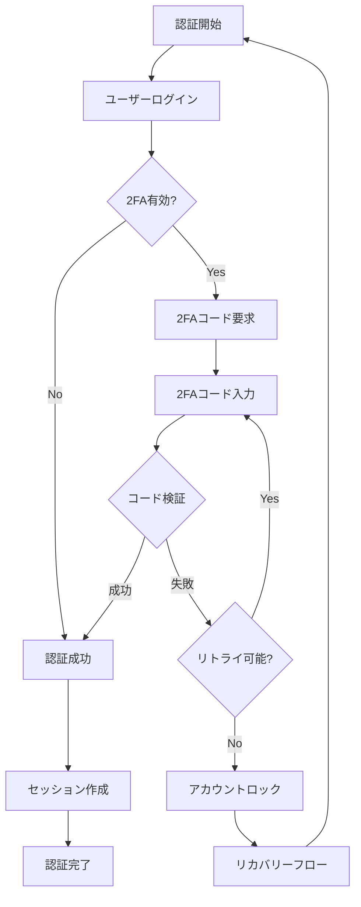
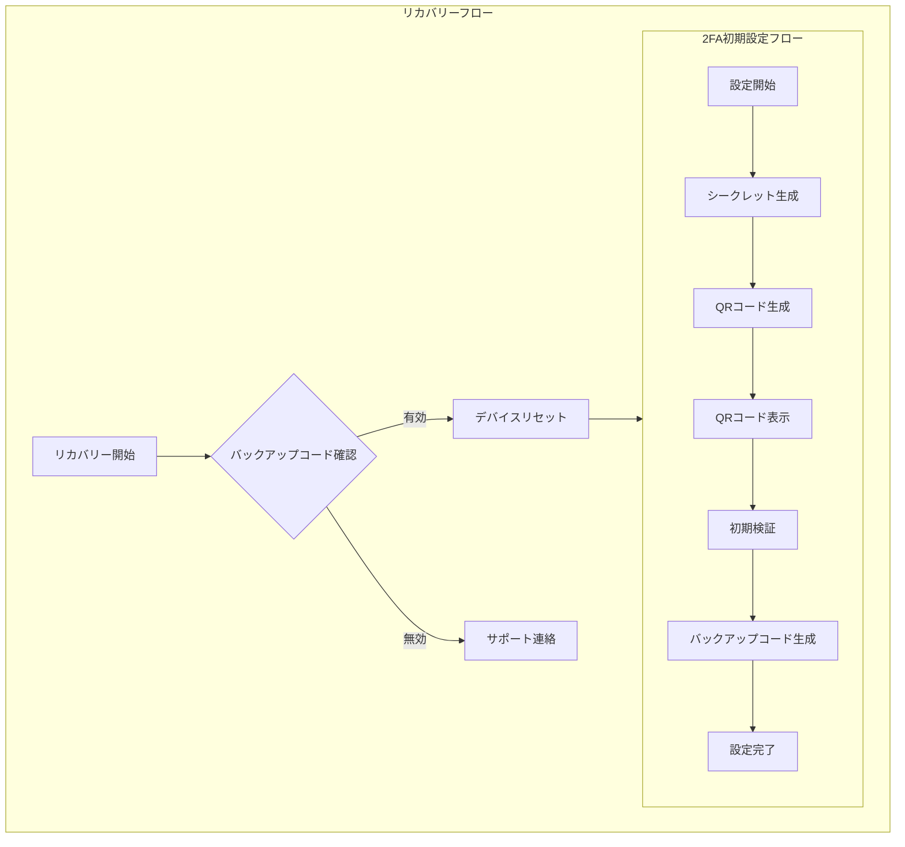

# 2段階認証フローの可視化：MermaidとTypeScriptで理解する認証プロセス

2段階認証（2FA）は複雑なフローを持つセキュリティ機能です。本記事では、Mermaidを使用してフローを可視化し、対応するTypeScriptコードと併せて解説することで、認証プロセスの理解を深めます。





## メイン認証フロー

上記のフローチャートは、2FAの主要な認証プロセスを表しています。各ステップの実装例を見ていきましょう。

### 1. 認証コントローラー

```ts
interface AuthController {
  login(email: string, password: string): Promise<AuthResult>
  verify2FA(userId: string, token: string): Promise<AuthResult>
  setupTwoFactor(userId: string): Promise<TwoFactorSetup>
}

class AuthControllerImpl implements AuthController {
  constructor(
    private readonly authService: AuthService,
    private readonly twoFactorService: TwoFactorService,
    private readonly sessionService: SessionService,
  ) {}

  async login(email: string, password: string): Promise<AuthResult> {
    const user = await this.authService.validateCredentials(email, password)

    if (user.twoFactorEnabled) {
      return {
        requiresTwoFactor: true,
        tempToken: await this.sessionService.createTempToken(user.id),
      }
    }

    return {
      session: await this.sessionService.createSession(user.id),
      user: { id: user.id, email: user.email },
    }
  }

  async verify2FA(userId: string, token: string): Promise<AuthResult> {
    const isValid = await this.twoFactorService.verify(userId, token)

    if (!isValid) {
      throw new AuthenticationError('INVALID_2FA', '無効な2FAコードです')
    }

    return {
      session: await this.sessionService.createSession(userId),
      user: await this.authService.getUserById(userId),
    }
  }
}
```

### 2. リトライ制御とロックアウト

```ts
class RetryManager {
  private readonly maxAttempts = 3
  private attempts = new Map<string, number>()

  async checkRetry(userId: string): Promise<boolean> {
    const attempts = this.attempts.get(userId) || 0

    if (attempts >= this.maxAttempts) {
      await this.lockAccount(userId)
      return false
    }

    this.attempts.set(userId, attempts + 1)
    return true
  }

  private async lockAccount(userId: string): Promise<void> {
    await prisma.user.update({
      where: { id: userId },
      data: { lockedUntil: new Date(Date.now() + 30 * 60 * 1000) }, // 30分ロック
    })
  }
}
```

## 2FA初期設定フロー

2つ目のフローチャートは、2FAの初期設定プロセスを表しています。

### 1. 設定ハンドラー

```ts
interface TwoFactorSetup {
  secret: string
  qrCode: string
  backupCodes: string[]
}

class TwoFactorSetupHandler {
  async initializeSetup(userId: string): Promise<TwoFactorSetup> {
    // シークレットとQRコードの生成
    const secret = speakeasy.generateSecret({
      name: `MyApp:${userId}`,
      length: 20,
    })

    const qrCode = await QRCode.toDataURL(secret.otpauth_url!)
    const backupCodes = this.generateBackupCodes()

    // 一時保存
    await this.storeTempSetup(userId, {
      secret: secret.base32,
      backupCodes,
    })

    return {
      secret: secret.base32,
      qrCode,
      backupCodes,
    }
  }

  async validateAndComplete(userId: string, token: string): Promise<boolean> {
    const setup = await this.getTempSetup(userId)

    const isValid = speakeasy.totp.verify({
      secret: setup.secret,
      encoding: 'base32',
      token,
      window: 1,
    })

    if (isValid) {
      await this.completeTwoFactorSetup(userId, setup)
      return true
    }

    return false
  }

  private generateBackupCodes(): string[] {
    return Array.from({ length: 8 }, () => crypto.randomBytes(4).toString('hex').toUpperCase())
  }
}
```

### 2. リカバリーフロー

```ts
interface RecoveryService {
  validateBackupCode(userId: string, code: string): Promise<boolean>
  resetTwoFactor(userId: string): Promise<void>
  initiateSupport(userId: string): Promise<string>
}

class RecoveryServiceImpl implements RecoveryService {
  async validateBackupCode(userId: string, code: string): Promise<boolean> {
    const user = await prisma.user.findUnique({
      where: { id: userId },
      select: { backupCodes: true },
    })

    if (!user?.backupCodes) return false

    const codes = JSON.parse(user.backupCodes) as string[]
    const index = codes.indexOf(code)

    if (index === -1) return false

    // 使用済みコードの削除
    codes.splice(index, 1)
    await prisma.user.update({
      where: { id: userId },
      data: { backupCodes: JSON.stringify(codes) },
    })

    return true
  }

  async resetTwoFactor(userId: string): Promise<void> {
    await prisma.user.update({
      where: { id: userId },
      data: {
        twoFactorSecret: null,
        twoFactorEnabled: false,
        backupCodes: null,
      },
    })
  }
}
```

## セキュリティ考慮事項

1. **一時トークンの管理**
   - 2FA検証待ちの状態を安全に管理
   - 適切な有効期限の設定

2. **バックアップコードの保護**
   - 安全なハッシュ化
   - 使用後の即時無効化

3. **ブルートフォース対策**
   - レート制限の実装
   - 連続失敗時のロックアウト

## まとめ

フローチャートと実装コードを組み合わせることで、2FA認証の全体像がより明確になります。特に重要なポイントは：

- 各プロセスの明確な責任分担
- エラーハンドリングの重要性
- リカバリーフローの提供

これらの要素を適切に実装することで、セキュアで使いやすい2FA認証システムを構築できます。
