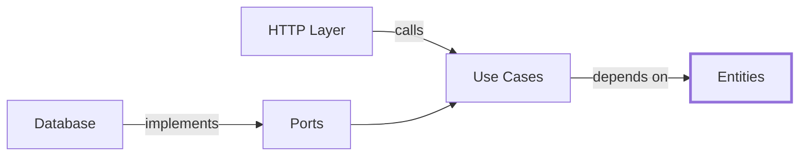

# NestJSでClean ArchitectureなTodo REST APIを構築する

Clean Architectureは複雑なアプリケーションの変更容易性を保つ設計原則である。この記事では、Robert C. Martinの原典に厳密準拠し、NestJS × Prismaで Todo REST APIを実装する。依存方向の制御、各層の責務分離、バリデーション戦略を実践的に解説する。

## Clean Architectureの核心原則

Clean Architectureの目的は**変更容易性**である。以下の原則により実現される：

- **依存性逆転**: 内側の層は外側を知らない
- **単一責務**: 各層は明確な責務を持つ
- **境界の分離**: I/Oは外縁に隔離する
- **抽象への依存**: 具体ではなく抽象に依存する

## 層構造と依存方向



依存の流れは常に**内向き**である。Entitiesが最も安定し、外側ほど変更頻度が高い。

## プロジェクト構造

```
src/
├── entities/              # Enterprise Business Rules
│   ├── todo/
│   │   ├── todo.entity.ts
│   │   ├── title.vo.ts
│   │   └── status.vo.ts
│   └── shared/
│       └── value-object.base.ts
├── use-cases/             # Application Business Rules
│   ├── todo/
│   │   ├── create-todo/
│   │   │   ├── create-todo.interactor.ts
│   │   │   ├── create-todo.request.ts
│   │   │   └── create-todo.response.ts
│   │   └── ports/
│   │       └── todo-repository.port.ts
│   └── shared/
│       └── result.ts
├── interface-adapters/    # Interface Adapters
│   ├── http/
│   │   ├── controllers/
│   │   ├── dto/
│   │   └── presenters/
│   └── gateways/
│       └── prisma/
└── frameworks/            # Frameworks & Drivers
    └── nest/
        ├── app.module.ts
        └── main.ts
```

## Entities層の実装

### Value Object基底クラス

```ts
// src/entities/shared/value-object.base.ts
export abstract class ValueObject<T> {
  protected constructor(public readonly props: T) {}

  equals(vo?: ValueObject<T>): boolean {
    if (!vo) return false
    return JSON.stringify(this.props) === JSON.stringify(vo.props)
  }
}
```

### Todoタイトルの値オブジェクト

```ts
// src/entities/todo/title.vo.ts
import { ValueObject } from '../shared/value-object.base'

export class TodoTitle extends ValueObject<{ value: string }> {
  private constructor(value: string) {
    super({ value })
  }

  static create(raw: string) {
    const trimmed = raw.trim()
    if (trimmed.length === 0) {
      return { ok: false as const, error: 'EMPTY_TITLE' as const }
    }
    if (trimmed.length > 100) {
      return { ok: false as const, error: 'TITLE_TOO_LONG' as const }
    }
    return { ok: true as const, value: new TodoTitle(trimmed) }
  }

  get value() {
    return this.props.value
  }
}
```

### Todoエンティティ

```ts
// src/entities/todo/todo.entity.ts
import { TodoTitle } from './title.vo'
import { TodoStatus } from './status.vo'

export class Todo {
  private constructor(
    private readonly _id: string,
    private _title: TodoTitle,
    private _status: TodoStatus,
    private readonly _createdAt: Date,
  ) {}

  static create(params: { id: string; title: TodoTitle; createdAt: Date }) {
    return new Todo(params.id, params.title, TodoStatus.PENDING, params.createdAt)
  }

  complete(): void {
    this._status = TodoStatus.COMPLETED
  }

  updateTitle(title: TodoTitle): void {
    this._title = title
  }

  get id() {
    return this._id
  }
  get title() {
    return this._title
  }
  get status() {
    return this._status
  }
  get createdAt() {
    return this._createdAt
  }
}
```

## Use Cases層の実装

### リポジトリポート

```ts
// src/use-cases/todo/ports/todo-repository.port.ts
export type TodoRecord = {
  id: string
  title: string
  status: string
  createdAt: Date
}

export interface TodoRepositoryPort {
  findById(id: string): Promise<TodoRecord | null>
  findAll(): Promise<TodoRecord[]>
  create(todo: TodoRecord): Promise<void>
  update(id: string, todo: Partial<TodoRecord>): Promise<void>
  delete(id: string): Promise<void>
}
```

### Todo作成インタラクター

```ts
// src/use-cases/todo/create-todo/create-todo.interactor.ts
import { CreateTodoInputPort } from './create-todo.input-port'
import { CreateTodoOutputPort } from './create-todo.output-port'
import { CreateTodoRequest } from './create-todo.request'
import { CreateTodoResponse } from './create-todo.response'
import { TodoRepositoryPort } from '../ports/todo-repository.port'
import { IdGeneratorPort } from '../ports/id-generator.port'
import { ClockPort } from '../ports/clock.port'
import { TodoTitle } from '../../../entities/todo/title.vo'
import { Todo } from '../../../entities/todo/todo.entity'

export class CreateTodoInteractor implements CreateTodoInputPort {
  constructor(
    private readonly todoRepo: TodoRepositoryPort,
    private readonly idGen: IdGeneratorPort,
    private readonly clock: ClockPort,
    private readonly presenter: CreateTodoOutputPort,
  ) {}

  async execute(req: CreateTodoRequest): Promise<void> {
    const titleResult = TodoTitle.create(req.title)
    if (!titleResult.ok) {
      return this.presenter.presentFailure(titleResult.error)
    }

    const id = this.idGen.newId()
    const now = this.clock.now()

    const todo = Todo.create({
      id,
      title: titleResult.value,
      createdAt: now,
    })

    await this.todoRepo.create({
      id: todo.id,
      title: todo.title.value,
      status: todo.status.value,
      createdAt: todo.createdAt,
    })

    return this.presenter.presentSuccess(
      new CreateTodoResponse(todo.id, todo.title.value, todo.status.value),
    )
  }
}
```

## Interface Adapters層の実装

### HTTPコントローラー（完全なCRUD）

```ts
// src/interface-adapters/http/controllers/todo.controller.ts
import {
  Body,
  Controller,
  Get,
  Post,
  Param,
  Put,
  Delete,
  UnprocessableEntityException,
  NotFoundException,
} from '@nestjs/common'
import { ApiTags, ApiOperation, ApiResponse } from '@nestjs/swagger'
import { CreateTodoRequestDto } from '../dto/request/create-todo.request'
import { UpdateTodoRequestDto } from '../dto/request/update-todo.request'
import { TodoResponseDto } from '../dto/response/todo.response'
import { CreateTodoInteractor } from '../../../use-cases/todo/create-todo/create-todo.interactor'
import { GetTodoInteractor } from '../../../use-cases/todo/get-todo/get-todo.interactor'
import { UpdateTodoInteractor } from '../../../use-cases/todo/update-todo/update-todo.interactor'
import { DeleteTodoInteractor } from '../../../use-cases/todo/delete-todo/delete-todo.interactor'
import { ListTodosInteractor } from '../../../use-cases/todo/list-todos/list-todos.interactor'
import { HttpTodoPresenter } from '../presenters/todo.presenter'

@ApiTags('Todos')
@Controller('todos')
export class TodoController {
  constructor(
    private readonly createTodoInteractor: CreateTodoInteractor,
    private readonly getTodoInteractor: GetTodoInteractor,
    private readonly updateTodoInteractor: UpdateTodoInteractor,
    private readonly deleteTodoInteractor: DeleteTodoInteractor,
    private readonly listTodosInteractor: ListTodosInteractor,
  ) {}

  @Post()
  @ApiOperation({ summary: 'Todo作成' })
  @ApiResponse({ status: 201, description: 'Todo作成成功', type: TodoResponseDto })
  @ApiResponse({ status: 422, description: 'バリデーションエラー' })
  async create(@Body() dto: CreateTodoRequestDto): Promise<TodoResponseDto> {
    let result: any
    const presenter = new HttpTodoPresenter((response) => {
      result = response
    })

    await this.createTodoInteractor.execute({
      title: dto.title,
      presenter,
    })

    if (result?.error) {
      throw new UnprocessableEntityException(result.error)
    }

    return result
  }

  @Get()
  @ApiOperation({ summary: 'Todo一覧取得' })
  @ApiResponse({ status: 200, description: 'Todo一覧取得成功', type: [TodoResponseDto] })
  async findAll(): Promise<TodoResponseDto[]> {
    let result: any
    const presenter = new HttpTodoPresenter((response) => {
      result = response
    })

    await this.listTodosInteractor.execute({ presenter })

    return result
  }

  @Get(':id')
  @ApiOperation({ summary: 'Todo詳細取得' })
  @ApiResponse({ status: 200, description: 'Todo取得成功', type: TodoResponseDto })
  @ApiResponse({ status: 404, description: 'Todoが見つかりません' })
  async findOne(@Param('id') id: string): Promise<TodoResponseDto> {
    let result: any
    const presenter = new HttpTodoPresenter((response) => {
      result = response
    })

    await this.getTodoInteractor.execute({ id, presenter })

    if (result?.error === 'NOT_FOUND') {
      throw new NotFoundException('Todo not found')
    }

    return result
  }

  @Put(':id')
  @ApiOperation({ summary: 'Todo更新' })
  @ApiResponse({ status: 200, description: 'Todo更新成功', type: TodoResponseDto })
  @ApiResponse({ status: 404, description: 'Todoが見つかりません' })
  @ApiResponse({ status: 422, description: 'バリデーションエラー' })
  async update(
    @Param('id') id: string,
    @Body() dto: UpdateTodoRequestDto,
  ): Promise<TodoResponseDto> {
    let result: any
    const presenter = new HttpTodoPresenter((response) => {
      result = response
    })

    await this.updateTodoInteractor.execute({
      id,
      title: dto.title,
      status: dto.status,
      presenter,
    })

    if (result?.error === 'NOT_FOUND') {
      throw new NotFoundException('Todo not found')
    }
    if (result?.error) {
      throw new UnprocessableEntityException(result.error)
    }

    return result
  }

  @Delete(':id')
  @ApiOperation({ summary: 'Todo削除' })
  @ApiResponse({ status: 204, description: 'Todo削除成功' })
  @ApiResponse({ status: 404, description: 'Todoが見つかりません' })
  async remove(@Param('id') id: string): Promise<void> {
    let result: any
    const presenter = new HttpTodoPresenter((response) => {
      result = response
    })

    await this.deleteTodoInteractor.execute({ id, presenter })

    if (result?.error === 'NOT_FOUND') {
      throw new NotFoundException('Todo not found')
    }
  }
}
```

### DTOとバリデーション

```ts
// src/interface-adapters/http/dto/request/create-todo.request.ts
import { ApiProperty } from '@nestjs/swagger'
import { IsNotEmpty, IsString, MaxLength } from 'class-validator'

export class CreateTodoRequestDto {
  @ApiProperty({
    example: 'TypeScriptの勉強',
    description: 'Todoのタイトル（1-100文字）',
  })
  @IsString()
  @IsNotEmpty()
  @MaxLength(100)
  title!: string
}
```

```ts
// src/interface-adapters/http/dto/request/update-todo.request.ts
import { ApiProperty } from '@nestjs/swagger'
import { IsNotEmpty, IsString, MaxLength, IsEnum, IsOptional } from 'class-validator'

export enum TodoStatusDto {
  PENDING = 'PENDING',
  COMPLETED = 'COMPLETED',
}

export class UpdateTodoRequestDto {
  @ApiProperty({
    example: 'TypeScriptの勉強（更新版）',
    description: 'Todoのタイトル（1-100文字）',
    required: false,
  })
  @IsOptional()
  @IsString()
  @IsNotEmpty()
  @MaxLength(100)
  title?: string

  @ApiProperty({
    example: 'COMPLETED',
    description: 'Todoのステータス',
    enum: TodoStatusDto,
    required: false,
  })
  @IsOptional()
  @IsEnum(TodoStatusDto)
  status?: TodoStatusDto
}
```

```ts
// src/interface-adapters/http/dto/response/todo.response.ts
import { ApiProperty } from '@nestjs/swagger'
import { Expose } from 'class-transformer'

export class TodoResponseDto {
  @ApiProperty({ example: 'uuid-v4-string' })
  @Expose()
  id!: string

  @ApiProperty({ example: 'TypeScriptの勉強' })
  @Expose()
  title!: string

  @ApiProperty({ example: 'PENDING', enum: ['PENDING', 'COMPLETED'] })
  @Expose()
  status!: string

  @ApiProperty({ example: '2025-08-24T10:00:00.000Z' })
  @Expose()
  createdAt!: string
}
```

### Prismaリポジトリ実装

```ts
// src/interface-adapters/gateways/prisma/todo.prisma-repository.ts
import { Injectable } from '@nestjs/common'
import { PrismaService } from './prisma.service'
import { TodoRepositoryPort, TodoRecord } from '../../../use-cases/todo/ports/todo-repository.port'

@Injectable()
export class TodoPrismaRepository implements TodoRepositoryPort {
  constructor(private readonly prisma: PrismaService) {}

  async findById(id: string): Promise<TodoRecord | null> {
    const todo = await this.prisma.todo.findUnique({ where: { id } })
    return todo ? this.toDomain(todo) : null
  }

  async findAll(): Promise<TodoRecord[]> {
    const todos = await this.prisma.todo.findMany({
      orderBy: { createdAt: 'desc' },
    })
    return todos.map(this.toDomain)
  }

  async create(todo: TodoRecord): Promise<void> {
    await this.prisma.todo.create({ data: todo })
  }

  async update(id: string, todo: Partial<TodoRecord>): Promise<void> {
    await this.prisma.todo.update({ where: { id }, data: todo })
  }

  async delete(id: string): Promise<void> {
    await this.prisma.todo.delete({ where: { id } })
  }

  private toDomain(prismaModel: any): TodoRecord {
    return {
      id: prismaModel.id,
      title: prismaModel.title,
      status: prismaModel.status,
      createdAt: prismaModel.createdAt,
    }
  }
}
```

## バリデーション戦略

Clean Architectureにおけるバリデーションは**多層防御**で実装する：

### 1. HTTPレイヤー（class-validator）

```ts
// 形式的バリデーション（型、長さ、必須チェック）
@IsString()
@IsNotEmpty()
@MaxLength(100)
title!: string
```

### 2. ドメインレイヤー（Value Object）

```ts
// ビジネスルールバリデーション
static create(raw: string) {
  const trimmed = raw.trim()
  if (trimmed.length === 0) {
    return { ok: false, error: 'EMPTY_TITLE' }
  }
  // ドメイン固有の制約
  if (trimmed.includes('禁止語')) {
    return { ok: false, error: 'FORBIDDEN_WORD' }
  }
  return { ok: true, value: new TodoTitle(trimmed) }
}
```

## Swagger設定とAPI仕様の自動生成

### Swagger設定

```ts
// src/frameworks/nest/main.ts
import { NestFactory } from '@nestjs/core'
import { ValidationPipe, ClassSerializerInterceptor } from '@nestjs/common'
import { SwaggerModule, DocumentBuilder } from '@nestjs/swagger'
import { AppModule } from './app.module'

async function bootstrap() {
  const app = await NestFactory.create(AppModule)

  // グローバルパイプの設定
  app.useGlobalPipes(
    new ValidationPipe({
      whitelist: true,
      forbidNonWhitelisted: true,
      transform: true,
    }),
  )

  // シリアライザーの設定
  app.useGlobalInterceptors(new ClassSerializerInterceptor(app.get(Reflector)))

  // Swagger設定
  const config = new DocumentBuilder()
    .setTitle('Todo API')
    .setDescription('Clean ArchitectureによるTodo REST API')
    .setVersion('1.0')
    .addTag('Todos', 'Todo管理のためのエンドポイント')
    .build()

  const document = SwaggerModule.createDocument(app, config)
  SwaggerModule.setup('api/docs', app, document, {
    swaggerOptions: {
      persistAuthorization: true,
      displayRequestDuration: true,
    },
  })

  await app.listen(3000)
  console.log('Application is running on: http://localhost:3000')
  console.log('Swagger UI: http://localhost:3000/api/docs')
}
bootstrap()
```

### 生成されるAPI仕様

Swaggerにより以下のAPI仕様が自動生成される：

```yaml
# 自動生成されるOpenAPI仕様（抜粋）
paths:
  /todos:
    get:
      tags: [Todos]
      summary: Todo一覧取得
      responses:
        '200':
          description: Todo一覧取得成功
          content:
            application/json:
              schema:
                type: array
                items:
                  $ref: '#/components/schemas/TodoResponseDto'
    post:
      tags: [Todos]
      summary: Todo作成
      requestBody:
        required: true
        content:
          application/json:
            schema:
              $ref: '#/components/schemas/CreateTodoRequestDto'
      responses:
        '201':
          description: Todo作成成功
        '422':
          description: バリデーションエラー
  /todos/{id}:
    get:
      tags: [Todos]
      summary: Todo詳細取得
      parameters:
        - name: id
          in: path
          required: true
          schema:
            type: string
      responses:
        '200':
          description: Todo取得成功
        '404':
          description: Todoが見つかりません
```

## CRUD操作の完全実装

### Create（作成）操作

```ts
// src/use-cases/todo/create-todo/create-todo.interactor.ts
export class CreateTodoInteractor implements CreateTodoInputPort {
  constructor(
    private readonly todoRepo: TodoRepositoryPort,
    private readonly idGen: IdGeneratorPort,
    private readonly clock: ClockPort,
  ) {}

  async execute(request: CreateTodoRequest): Promise<CreateTodoResponse> {
    // 1. バリデーション（Value Object）
    const titleResult = TodoTitle.create(request.title)
    if (!titleResult.ok) {
      throw new DomainError(titleResult.error)
    }

    // 2. エンティティ作成
    const todo = Todo.create({
      id: this.idGen.newId(),
      title: titleResult.value,
      createdAt: this.clock.now(),
    })

    // 3. 永続化
    await this.todoRepo.create({
      id: todo.id,
      title: todo.title.value,
      status: todo.status.value,
      createdAt: todo.createdAt,
    })

    return new CreateTodoResponse(
      todo.id,
      todo.title.value,
      todo.status.value,
      todo.createdAt.toISOString(),
    )
  }
}
```

### Read（読取）操作

```ts
// src/use-cases/todo/get-todo/get-todo.interactor.ts
export class GetTodoInteractor implements GetTodoInputPort {
  constructor(private readonly todoRepo: TodoRepositoryPort) {}

  async execute(request: GetTodoRequest): Promise<GetTodoResponse> {
    const todoRecord = await this.todoRepo.findById(request.id)

    if (!todoRecord) {
      throw new NotFoundError('Todo not found')
    }

    return new GetTodoResponse(
      todoRecord.id,
      todoRecord.title,
      todoRecord.status,
      todoRecord.createdAt.toISOString(),
    )
  }
}

// src/use-cases/todo/list-todos/list-todos.interactor.ts
export class ListTodosInteractor implements ListTodosInputPort {
  constructor(private readonly todoRepo: TodoRepositoryPort) {}

  async execute(): Promise<ListTodosResponse> {
    const todoRecords = await this.todoRepo.findAll()

    const todos = todoRecords.map((record) => ({
      id: record.id,
      title: record.title,
      status: record.status,
      createdAt: record.createdAt.toISOString(),
    }))

    return new ListTodosResponse(todos)
  }
}
```

### Update（更新）操作

```ts
// src/use-cases/todo/update-todo/update-todo.interactor.ts
export class UpdateTodoInteractor implements UpdateTodoInputPort {
  constructor(private readonly todoRepo: TodoRepositoryPort) {}

  async execute(request: UpdateTodoRequest): Promise<UpdateTodoResponse> {
    // 1. 既存Todoの取得
    const existingRecord = await this.todoRepo.findById(request.id)
    if (!existingRecord) {
      throw new NotFoundError('Todo not found')
    }

    // 2. エンティティの復元
    const titleResult = TodoTitle.create(existingRecord.title)
    if (!titleResult.ok) {
      throw new DomainError('Invalid existing title')
    }

    const todo = Todo.restore({
      id: existingRecord.id,
      title: titleResult.value,
      status: TodoStatus.fromString(existingRecord.status),
      createdAt: existingRecord.createdAt,
    })

    // 3. 更新処理
    if (request.title) {
      const newTitleResult = TodoTitle.create(request.title)
      if (!newTitleResult.ok) {
        throw new DomainError(newTitleResult.error)
      }
      todo.updateTitle(newTitleResult.value)
    }

    if (request.status === 'COMPLETED') {
      todo.complete()
    }

    // 4. 永続化
    await this.todoRepo.update(todo.id, {
      title: todo.title.value,
      status: todo.status.value,
    })

    return new UpdateTodoResponse(
      todo.id,
      todo.title.value,
      todo.status.value,
      todo.createdAt.toISOString(),
    )
  }
}
```

### Delete（削除）操作

```ts
// src/use-cases/todo/delete-todo/delete-todo.interactor.ts
export class DeleteTodoInteractor implements DeleteTodoInputPort {
  constructor(private readonly todoRepo: TodoRepositoryPort) {}

  async execute(request: DeleteTodoRequest): Promise<void> {
    const existingRecord = await this.todoRepo.findById(request.id)
    if (!existingRecord) {
      throw new NotFoundError('Todo not found')
    }

    await this.todoRepo.delete(request.id)
  }
}
```

## Frameworks層の設定

### AppModule

```ts
// src/frameworks/nest/app.module.ts
import { Module } from '@nestjs/common'
import { TodoController } from '../../interface-adapters/http/controllers/todo.controller'
import { PrismaService } from '../../interface-adapters/gateways/prisma/prisma.service'
import { TodoPrismaRepository } from '../../interface-adapters/gateways/prisma/todo.prisma-repository'
import { CreateTodoInteractor } from '../../use-cases/todo/create-todo/create-todo.interactor'
import { GetTodoInteractor } from '../../use-cases/todo/get-todo/get-todo.interactor'
import { UpdateTodoInteractor } from '../../use-cases/todo/update-todo/update-todo.interactor'
import { DeleteTodoInteractor } from '../../use-cases/todo/delete-todo/delete-todo.interactor'
import { ListTodosInteractor } from '../../use-cases/todo/list-todos/list-todos.interactor'
import { UuidGenerator } from '../../interface-adapters/gateways/uuid-generator'
import { SystemClock } from '../../interface-adapters/gateways/system-clock'

@Module({
  controllers: [TodoController],
  providers: [
    PrismaService,
    {
      provide: 'TodoRepositoryPort',
      useClass: TodoPrismaRepository,
    },
    {
      provide: 'IdGeneratorPort',
      useClass: UuidGenerator,
    },
    {
      provide: 'ClockPort',
      useClass: SystemClock,
    },
    CreateTodoInteractor,
    GetTodoInteractor,
    UpdateTodoInteractor,
    DeleteTodoInteractor,
    ListTodosInteractor,
  ],
})
export class AppModule {}
```

## テスト戦略

### 1. Entitiesのテスト

```ts
// test/unit/entities/todo.entity.spec.ts
describe('Todo Entity', () => {
  it('should create todo with valid title', () => {
    const title = TodoTitle.create('有効なタイトル')
    expect(title.ok).toBe(true)

    if (title.ok) {
      const todo = Todo.create({
        id: 'test-id',
        title: title.value,
        createdAt: new Date(),
      })

      expect(todo.title.value).toBe('有効なタイトル')
      expect(todo.status.value).toBe('PENDING')
    }
  })
})
```

### 2. Use Casesのテスト

```ts
// test/unit/use-cases/create-todo.interactor.spec.ts
describe('CreateTodoInteractor', () => {
  it('should create todo successfully', async () => {
    const mockRepo = createMock<TodoRepositoryPort>()
    const mockIdGen = createMock<IdGeneratorPort>()
    const mockClock = createMock<ClockPort>()
    const mockPresenter = createMock<CreateTodoOutputPort>()

    const interactor = new CreateTodoInteractor(mockRepo, mockIdGen, mockClock, mockPresenter)

    await interactor.execute(new CreateTodoRequest('テストタイトル'))

    expect(mockRepo.create).toHaveBeenCalled()
    expect(mockPresenter.presentSuccess).toHaveBeenCalled()
  })
})
```

## 実装のメリット

この実装により以下が実現される：

- **変更容易性**: フレームワーク変更時もビジネスロジックは無影響
- **テスタビリティ**: 各層を独立してテスト可能
- **保守性**: 責務が明確で理解しやすい
- **拡張性**: 新機能追加時の影響範囲が限定的

## API使用例

### Swagger UIでの操作

`http://localhost:3000/api/docs` にアクセスすると、以下の操作が可能：

1. **Todo作成**: `POST /todos` でタイトルを指定してTodoを作成
2. **Todo一覧**: `GET /todos` で全Todoを取得
3. **Todo詳細**: `GET /todos/{id}` で特定のTodoを取得
4. **Todo更新**: `PUT /todos/{id}` でタイトルやステータスを更新
5. **Todo削除**: `DELETE /todos/{id}` でTodoを削除

### cURLでの操作例

```bash
# Todo作成
curl -X POST http://localhost:3000/todos \
  -H "Content-Type: application/json" \
  -d '{"title": "TypeScriptの勉強"}'

# Todo一覧取得
curl -X GET http://localhost:3000/todos

# Todo更新（完了状態に変更）
curl -X PUT http://localhost:3000/todos/{id} \
  -H "Content-Type: application/json" \
  -d '{"status": "COMPLETED"}'

# Todo削除
curl -X DELETE http://localhost:3000/todos/{id}
```

## 実装のメリット

この実装により以下が実現される：

### 1. 変更容易性

- **フレームワーク変更**: NestJS → Express への移行時もビジネスロジックは無影響
- **データベース変更**: Prisma → TypeORM への移行も Interface Adapters層のみの変更
- **外部API連携**: 新しい外部サービス連携もポート追加で対応

### 2. テスタビリティ

- **単体テスト**: 各層を独立してテスト可能
- **統合テスト**: ポートをモックして境界をテスト
- **E2Eテスト**: HTTPレイヤーから全体をテスト

### 3. 保守性

- **責務の明確化**: 各層の役割が明確で理解しやすい
- **影響範囲の限定**: 変更時の影響範囲が予測可能
- **コードの再利用**: ドメインロジックは他のプロジェクトでも再利用可能

### 4. 拡張性

- **新機能追加**: 新しいユースケースの追加が容易
- **複雑化への対応**: ビジネスルールが複雑になっても構造を維持
- **チーム開発**: 層ごとに並行開発が可能

## まとめ

- Clean Architectureは**依存方向の制御**が核心である
- **各層の責務分離**により変更の影響を局所化する
- **バリデーションは多層防御**で実装する
- **Swagger統合**により開発効率とドキュメント品質を向上
- **完全なCRUD実装**でRESTful APIの標準パターンを習得
- **テスト戦略**は層ごとに適切な粒度で行う

NestJSの強力なDIコンテナとPrismaの型安全性、Swaggerの自動ドキュメント生成を活用することで、Clean Architectureの原則を実践的に適用できる。この設計により、長期的な保守性と拡張性を両立し、チーム開発に適したTodo APIが構築される。
