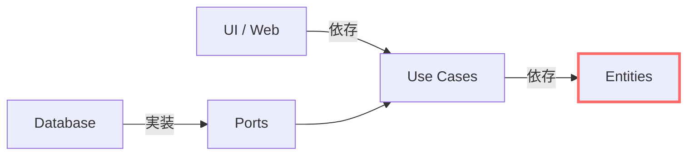
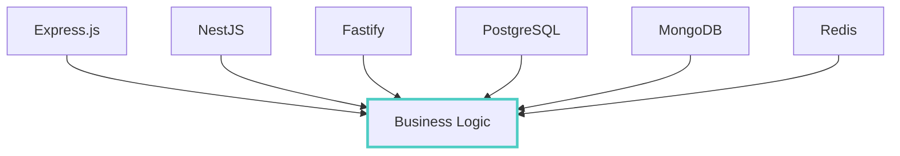
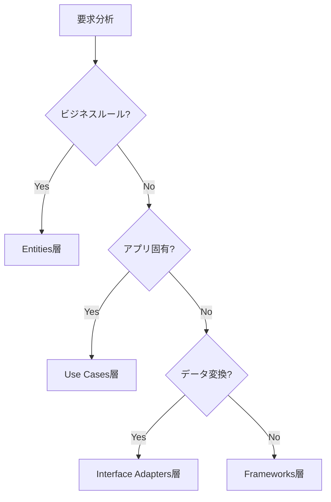

# Clean Architecture達人に学ぶソフトウェアの構造と設計：設計思想とディレクトリ構成を読書前に理解する

Robert C. Martinの『Clean Architecture 達人に学ぶソフトウェアの構造と設計』は、ソフトウェア設計における重要な原則を体系化した名著である。本記事では、読書前に理解しておくべき設計思想、ディレクトリ構成、フレームワーク前提について、ネット上の高評価記事を参考に解説する。

## 書籍の核心となる設計思想

### 方針と詳細の分離

Clean Architectureの中心的な設計思想は、ソフトウェアを「方針（抽象）」と「詳細（具象）」に明確に分離することである。

- **方針**: ビジネスルール、ユースケース、エンティティなどの本質的な価値
- **詳細**: データベース、UI、フレームワーク、外部APIなどの技術的実装

この分離により、ビジネス価値の高い方針部分が技術的な詳細に依存せず、変更に強いシステムを構築できる。

### SOLID原則との関係

本書の設計思想は、SOLID原則を基盤としている：

- **単一責務原則（SRP）**: 各層は単一の責務を持つ
- **開放閉鎖原則（OCP）**: 拡張に開いて、修正に閉じている
- **リスコフ置換原則（LSP）**: 抽象と実装が正しく置換可能
- **インターフェース分離原則（ISP）**: 必要最小限のインターフェースを提供
- **依存性逆転原則（DIP）**: 抽象に依存し、具象に依存しない

### 依存方向の制御

最も重要な原則は、依存の方向を**内向き**に制御することである。外側の層は内側の層に依存するが、内側の層は外側を知らない。



## 4層アーキテクチャのディレクトリ構成

Clean Architectureでは、システムを以下の4つの層に分割する：

### 1. Entities（エンティティ層）

```
src/
├── entities/
│   ├── user/
│   │   ├── user.entity.ts
│   │   ├── email.vo.ts
│   │   └── user-rules.ts
│   └── shared/
│       ├── entity.base.ts
│       └── value-object.base.ts
```

- **責務**: 企業全体のビジネスルールを表現
- **特徴**: 最も安定した層で、他のどの層にも依存しない
- **内容**: エンティティ、値オブジェクト、ドメインサービス

### 2. Use Cases（ユースケース層）

```
src/
├── use-cases/
│   ├── user/
│   │   ├── register-user/
│   │   │   ├── register-user.interactor.ts
│   │   │   ├── register-user.request.ts
│   │   │   └── register-user.response.ts
│   │   └── ports/
│   │       ├── user-repository.port.ts
│   │       └── notification.port.ts
│   └── shared/
│       └── result.ts
```

- **責務**: アプリケーション固有のビジネスルールを実装
- **特徴**: Entities層のみに依存
- **内容**: インタラクタ、入出力境界、ポート定義

### 3. Interface Adapters（インターフェースアダプタ層）

```
src/
├── interface-adapters/
│   ├── http/
│   │   ├── controllers/
│   │   ├── dto/
│   │   └── presenters/
│   ├── gateways/
│   │   ├── database/
│   │   └── external-api/
│   └── cli/
│       └── commands/
```

- **責務**: データ形式の変換と外部システムとの接続
- **特徴**: Use Cases層とFrameworks層の間の変換を担当
- **内容**: コントローラ、プレゼンタ、ゲートウェイ、リポジトリ実装

### 4. Frameworks & Drivers（フレームワーク・ドライバ層）

```
src/
├── frameworks/
│   ├── web/
│   │   ├── express/
│   │   └── fastify/
│   ├── database/
│   │   ├── prisma/
│   │   └── typeorm/
│   └── config/
│       ├── app.config.ts
│       └── database.config.ts
```

- **責務**: 具体的な技術実装とシステム設定
- **特徴**: 最も外側の層で、最も変更頻度が高い
- **内容**: フレームワーク、データベース、外部ライブラリ

## フレームワーク非依存の設計思想

### 書籍の基本前提

『Clean Architecture』は**特定のフレームワークに依存しない**設計を推奨している。これは以下の理由による：

#### 1. フレームワークは「詳細」である

- フレームワークは技術的な実装手段に過ぎない
- ビジネス価値を生み出すのは方針（ビジネスルール）である
- 詳細に方針を依存させると、変更時の影響が大きくなる

#### 2. 技術選択の柔軟性



フレームワーク非依存により、以下が実現される：

- **技術選択の自由度**: 要件に応じて最適な技術を選択可能
- **移行コストの削減**: フレームワーク変更時の影響範囲を限定
- **テスト容易性**: 外部依存をモックして単体テストが可能

#### 3. 長期的な保守性

- フレームワークのライフサイクルに依存しない
- セキュリティアップデートやEOL対応が容易
- 技術的負債の蓄積を防ぐ

### 実装における注意点

フレームワーク非依存を実現するための重要なポイント：

- **ポート・アダプタパターン**: 抽象インターフェース（ポート）と具体実装（アダプタ）を分離
- **依存性注入**: 実装の選択を実行時まで遅延
- **境界の明確化**: 各層の責務と依存関係を厳密に定義

## ネット上の高評価記事と要点

### 1. 設計思想を深く理解する記事

#### Next Tech Chronicle

- **要点**: SOLID原則とClean Architectureの関係を詳細解説
- **特徴**: 理論と実践のバランスが良く、初学者にも理解しやすい
- **推奨理由**: 書籍の理論的背景を補完する内容

#### msawady's engineering-note

- **要点**: アーキテクチャの目的とシステムの切り離しについて具体的に説明
- **特徴**: 実務経験に基づく実践的な視点
- **推奨理由**: 理論を現実のプロジェクトに適用する際の指針を提供

### 2. 実装パターンを学ぶ記事

#### Qiita - BlueEventHorizon

- **要点**: 具体的なコード例とディレクトリ構成を提示
- **特徴**: TypeScript/Node.jsでの実装例が豊富
- **推奨理由**: 理論を実際のコードに落とし込む方法を学べる

#### tech.anycloud.co.jp

- **要点**: レイヤー分割の具体的な実装方法を解説
- **特徴**: テスト戦略についても詳しく説明
- **推奨理由**: 実装時の具体的な判断基準を提供

### 3. 読書ガイドとしての記事

#### Qiita - kterui9019

- **要点**: 各章の要点と読書時の注意点をまとめ
- **特徴**: 読書効率を高める構造化された要約
- **推奨理由**: 書籍を読む前の予習と読後の復習に最適

#### 技術書の道しるべ

- **要点**: 独立性と保守性の高いアーキテクチャ構築方法を詳細レビュー
- **特徴**: 批判的な視点も含む客観的な評価
- **推奨理由**: 書籍の内容を多角的に理解できる

## 読書前に理解するメリットと活用方法

### 読書効率の向上

#### 1. 概念の事前理解

- **4層構造**: Entities → Use Cases → Interface Adapters → Frameworks & Drivers
- **依存方向**: 常に内向き（外側から内側への一方向）
- **SOLID原則**: 各原則がClean Architectureでどう活用されるか

#### 2. 実践的な読み方

- **理論と実装の対応**: 各章で説明される理論を具体的なディレクトリ構成と対応付け
- **アンチパターンの理解**: なぜその設計が問題なのかを構造的に理解
- **適用範囲の判断**: どの規模・種類のプロジェクトに適用すべきか

### 実務への応用準備

#### 1. 設計判断基準の習得



#### 2. リファクタリング戦略

- **段階的移行**: 既存システムから段階的にClean Architectureへ移行
- **境界の識別**: 現在のコードベースでの層境界を特定
- **依存関係の整理**: 循環依存や不適切な依存を発見・修正

#### 3. チーム開発での活用

- **共通言語**: チーム内でアーキテクチャ用語を統一
- **レビュー基準**: コードレビューで依存方向や責務分離を確認
- **設計文書**: アーキテクチャ決定記録（ADR）の作成指針

### 継続学習のポイント

#### 1. 実装パターンの蓄積

- **言語固有の実装**: TypeScript、Java、C#などでの具体的実装パターン
- **フレームワーク統合**: Spring Boot、NestJS、ASP.NET Coreとの組み合わせ
- **テスト戦略**: 各層に適したテスト手法の習得

#### 2. 関連技術の学習

- **DDD（ドメイン駆動設計）**: Entities層の設計をより深く理解
- **CQRS**: 読み書き分離パターンとの組み合わせ
- **イベント駆動アーキテクチャ**: 非同期処理との統合

## まとめ

『Clean Architecture 達人に学ぶソフトウェアの構造と設計』の理解を深めるための要点を整理した：

### 核心的な設計思想

- **方針と詳細の分離**: ビジネスルールを技術実装から独立させる
- **依存方向の制御**: 内向きの依存により安定性を確保
- **SOLID原則の実践**: 各原則を統合したアーキテクチャ設計

### 4層構造の理解

- **Entities**: 企業レベルのビジネスルール
- **Use Cases**: アプリケーション固有のビジネスルール
- **Interface Adapters**: データ変換と外部システム接続
- **Frameworks & Drivers**: 具体的な技術実装

### フレームワーク非依存の価値

- **技術選択の自由度**: 要件に応じた最適な技術選択
- **長期的な保守性**: 技術変化への対応力
- **テスト容易性**: 外部依存からの独立

これらの基礎知識を持って書籍を読むことで、理論と実践の両面からClean Architectureを深く理解し、実務に活用できるようになる。
