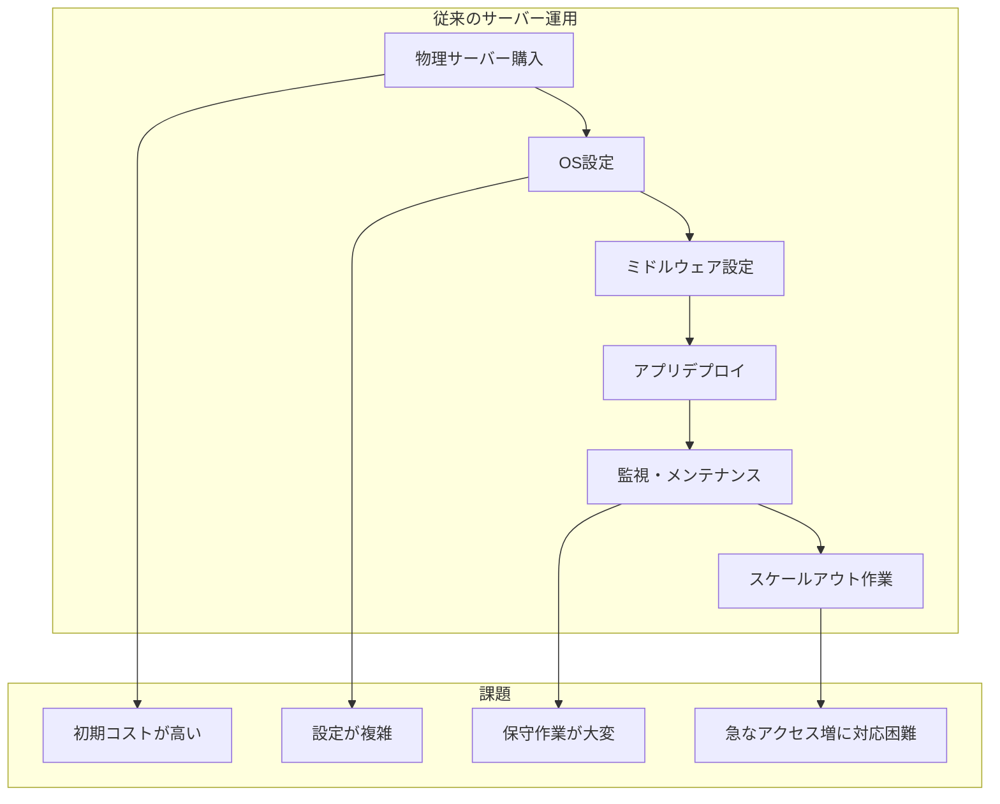
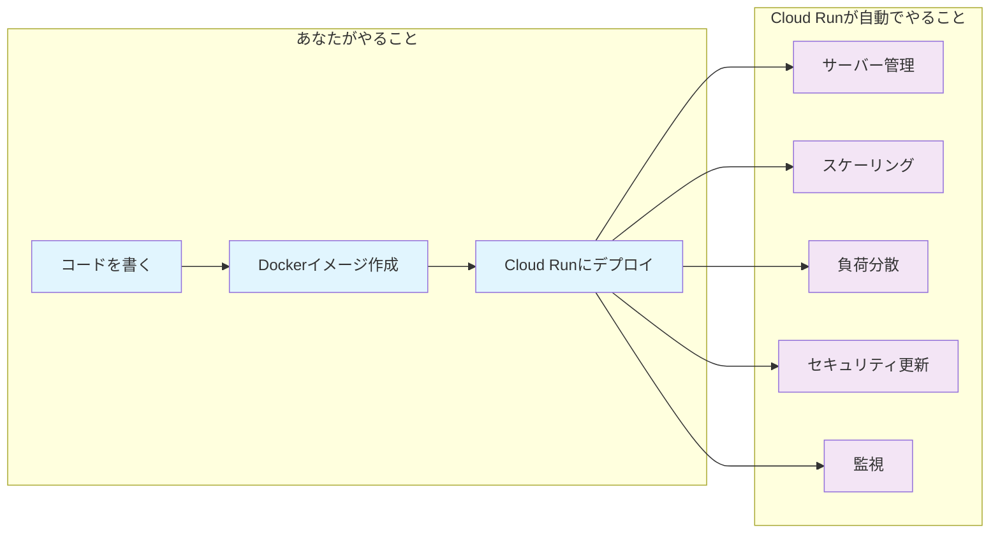
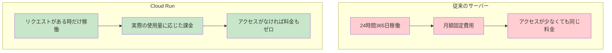
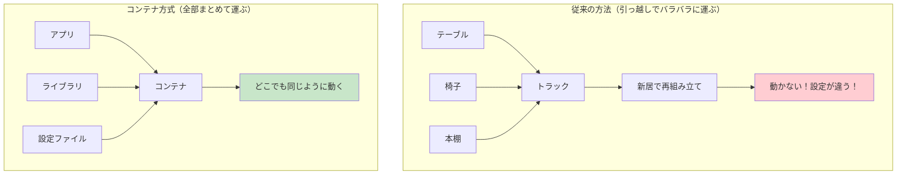
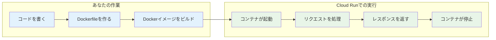
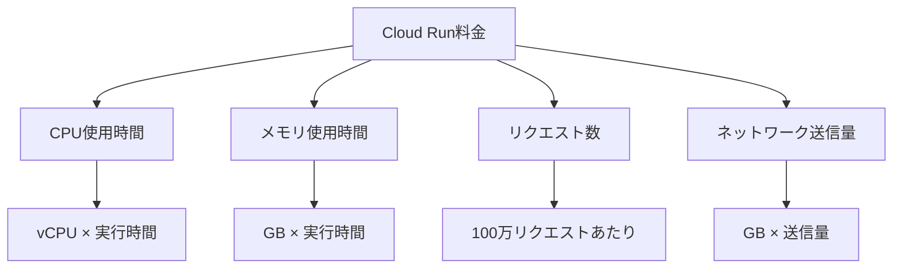

# Cloud Run完全入門：初心者でもわかるサーバーレスアプリ開発の始め方

「サーバーレス」「コンテナ」「Cloud Run」という言葉を聞いたことはあるけど、実際に何ができるのかよくわからない。そんな初心者の方に向けて、Google Cloud Runの基本概念から実際のアプリケーションデプロイまでを、図解付きでわかりやすく解説する。

## Cloud Runって何？なぜ注目されているの？

### 従来のサーバー運用の課題

まず、従来のWebアプリケーション運用がどのような課題を抱えていたかを見てみよう。



**主な課題**：

- **初期コスト**: サーバー購入、設定に時間とお金がかかる
- **運用負荷**: OS更新、セキュリティパッチ、監視などの作業が必要
- **スケーラビリティ**: アクセスが急増した時の対応が困難
- **無駄なコスト**: アクセスが少ない時も常にサーバーが稼働

### Cloud Runが解決すること

Cloud Runは、これらの課題を一気に解決するサービスだ。



### Cloud Runの3つの大きなメリット

#### 1. **サーバーレス = サーバー管理不要**

- OS更新、セキュリティパッチ、監視などは全てGoogleが担当
- あなたはアプリケーションのコードだけに集中できる

#### 2. **従量課金 = 使った分だけ支払い**



#### 3. **自動スケーリング = アクセス増減に自動対応**

- 急にアクセスが増えても自動で処理能力を拡張
- アクセスが減れば自動で縮小してコスト削減

## Dockerコンテナって何？なぜCloud Runで必要なの？

「コンテナ」という言葉を聞いたことはあるけど、実際に何なのかピンとこない方も多いだろう。身近な例で説明してみよう。

### 引っ越しの例で理解するコンテナ



**従来の問題**：

- 開発環境では動くのに、本番環境では動かない
- 「私の環境では動くんですけど...」問題
- 依存関係やライブラリのバージョン違いでトラブル

**コンテナの解決策**：

- アプリケーションと必要な環境を全部まとめて「箱」に詰める
- どこで実行しても同じように動く
- 環境の違いによるトラブルを根本的に解決

### Cloud Runとコンテナの関係



Cloud Runは、あなたが作ったコンテナを以下のように管理する：

1. **リクエストが来た時だけコンテナを起動**
2. **処理が終わったらコンテナを停止**
3. **アクセスが多い時は複数のコンテナを並行実行**
4. **アクセスがない時はコンテナを完全に停止（料金もゼロ）**

## 実際にやってみよう！シンプルなWebアプリをCloud Runにデプロイ

ここからは、実際に手を動かしながらCloud Runを体験してみよう。まずは最もシンプルなWebアプリから始める。

### 準備：必要なツールをインストール

#### 1. Google Cloud CLIのインストール

```bash
# macOSの場合
brew install google-cloud-sdk

# Windowsの場合は公式サイトからインストーラーをダウンロード
# https://cloud.google.com/sdk/docs/install
```

#### 2. Dockerのインストール

```bash
# macOSの場合
brew install docker

# または Docker Desktop をインストール
# https://www.docker.com/products/docker-desktop
```

#### 3. Google Cloudプロジェクトの設定

```bash
# Google Cloudにログイン
gcloud auth login

# プロジェクトを作成（PROJECT_IDは任意の名前）
gcloud projects create my-cloudrun-project

# プロジェクトを選択
gcloud config set project my-cloudrun-project

# Cloud Run APIを有効化
gcloud services enable run.googleapis.com
gcloud services enable artifactregistry.googleapis.com
```

### Step 1: 超シンプルなNode.jsアプリを作る

まずは「Hello, Cloud Run!」を表示するだけのシンプルなWebアプリを作ろう。

#### プロジェクトディレクトリを作成

```bash
mkdir my-first-cloudrun-app
cd my-first-cloudrun-app
```

#### package.jsonを作成

```json
{
  "name": "my-first-cloudrun-app",
  "version": "1.0.0",
  "description": "My first Cloud Run application",
  "main": "server.js",
  "scripts": {
    "start": "node server.js"
  },
  "dependencies": {
    "express": "^4.18.2"
  }
}
```

#### server.jsを作成

```javascript
const express = require('express')
const app = express()

// Cloud Runは環境変数PORTでポート番号を指定する
const port = process.env.PORT || 8080

// ルートパスでシンプルなメッセージを返す
app.get('/', (req, res) => {
  res.json({
    message: 'Hello, Cloud Run! 🚀',
    timestamp: new Date().toISOString(),
    version: '1.0.0',
  })
})

// ヘルスチェック用エンドポイント（Cloud Runが正常性を確認するため）
app.get('/healthz', (req, res) => {
  res.status(200).send('OK')
})

// 優雅なシャットダウン（Cloud Runがコンテナを停止する時に必要）
process.on('SIGTERM', () => {
  console.log('SIGTERM received, shutting down gracefully')
  process.exit(0)
})

app.listen(port, () => {
  console.log(`Server running on port ${port}`)
})
```

### Step 2: Dockerfileを作成

アプリケーションをコンテナ化するためのDockerfileを作成する。

```dockerfile
# Node.js 18の軽量版をベースイメージとして使用
FROM node:18-slim

# 作業ディレクトリを設定
WORKDIR /app

# package.jsonとpackage-lock.json（あれば）をコピー
COPY package*.json ./

# 依存関係をインストール
RUN npm ci --only=production

# アプリケーションのソースコードをコピー
COPY . .

# 非rootユーザーを作成してセキュリティを向上
RUN useradd -m -u 10001 -s /usr/sbin/nologin appuser
USER appuser

# ポート8080を公開
EXPOSE 8080

# アプリケーションを起動
CMD ["npm", "start"]
```

### Step 3: .dockerignoreを作成

不要なファイルをコンテナに含めないようにする。

```
node_modules
npm-debug.log
.git
.gitignore
README.md
.env
.nyc_output
coverage
.cache
```

### Step 4: ローカルでテスト

まずはローカルでアプリが正常に動作するか確認しよう。

```bash
# 依存関係をインストール
npm install

# アプリを起動
npm start
```

ブラウザで `http://localhost:8080` にアクセスして、JSONレスポンスが返ってくることを確認する。

### Step 5: Dockerイメージをビルドしてテスト

```bash
# Dockerイメージをビルド
docker build -t my-first-cloudrun-app .

# ローカルでコンテナを実行してテスト
docker run -p 8080:8080 my-first-cloudrun-app
```

再度 `http://localhost:8080` にアクセスして動作確認する。

### Step 6: Google Cloud Artifact Registryにイメージをプッシュ

Cloud Runで使用するため、DockerイメージをGoogle Cloudに保存する必要がある。

```bash
# Artifact Registryのリポジトリを作成
gcloud artifacts repositories create my-repo \
    --repository-format=docker \
    --location=asia-northeast1 \
    --description="My first Cloud Run repository"

# Docker認証を設定
gcloud auth configure-docker asia-northeast1-docker.pkg.dev

# イメージにタグを付ける
docker tag my-first-cloudrun-app \
    asia-northeast1-docker.pkg.dev/my-cloudrun-project/my-repo/my-first-cloudrun-app:latest

# イメージをプッシュ
docker push asia-northeast1-docker.pkg.dev/my-cloudrun-project/my-repo/my-first-cloudrun-app:latest
```

### Step 7: Cloud Runにデプロイ

ついに、Cloud Runにアプリケーションをデプロイする！

```bash
gcloud run deploy my-first-app \
    --image asia-northeast1-docker.pkg.dev/my-cloudrun-project/my-repo/my-first-cloudrun-app:latest \
    --region asia-northeast1 \
    --platform managed \
    --allow-unauthenticated \
    --memory 512Mi \
    --cpu 1 \
    --min-instances 0 \
    --max-instances 10
```

**各オプションの説明**：

- `--allow-unauthenticated`: 誰でもアクセス可能にする
- `--memory 512Mi`: メモリを512MBに設定
- `--cpu 1`: CPU を1コアに設定
- `--min-instances 0`: アクセスがない時はインスタンス数を0にしてコスト削減
- `--max-instances 10`: 最大10個まで並行実行可能

デプロイが完了すると、URLが表示される。そのURLにアクセスして、あなたのアプリがCloud Run上で動いていることを確認しよう！

## より実践的な例：データベース連携アプリ

シンプルなアプリができたので、今度はデータベースと連携するより実践的なアプリを作ってみよう。

### PostgreSQLを使った簡単なTodoアプリ

#### package.jsonを更新

```json
{
  "name": "todo-cloudrun-app",
  "version": "1.0.0",
  "scripts": {
    "start": "node server.js"
  },
  "dependencies": {
    "express": "^4.18.2",
    "pg": "^8.11.0",
    "cors": "^2.8.5"
  }
}
```

#### server.jsを更新

```javascript
const express = require('express')
const { Pool } = require('pg')
const cors = require('cors')

const app = express()
const port = process.env.PORT || 8080

// ミドルウェア
app.use(express.json())
app.use(cors())

// データベース接続（Cloud SQL使用）
const pool = new Pool({
  connectionString: process.env.DATABASE_URL,
  ssl: process.env.NODE_ENV === 'production' ? { rejectUnauthorized: false } : false,
})

// データベーステーブル初期化
async function initDatabase() {
  try {
    await pool.query(`
      CREATE TABLE IF NOT EXISTS todos (
        id SERIAL PRIMARY KEY,
        title VARCHAR(255) NOT NULL,
        completed BOOLEAN DEFAULT FALSE,
        created_at TIMESTAMP DEFAULT CURRENT_TIMESTAMP
      )
    `)
    console.log('Database initialized')
  } catch (error) {
    console.error('Database initialization error:', error)
  }
}

// アプリ起動時にデータベース初期化
initDatabase()

// API エンドポイント
app.get('/', (req, res) => {
  res.json({ message: 'Todo API is running on Cloud Run!' })
})

// 全てのTodoを取得
app.get('/todos', async (req, res) => {
  try {
    const result = await pool.query('SELECT * FROM todos ORDER BY created_at DESC')
    res.json(result.rows)
  } catch (error) {
    console.error('Error fetching todos:', error)
    res.status(500).json({ error: 'Failed to fetch todos' })
  }
})

// 新しいTodoを作成
app.post('/todos', async (req, res) => {
  try {
    const { title } = req.body
    const result = await pool.query('INSERT INTO todos (title) VALUES ($1) RETURNING *', [title])
    res.status(201).json(result.rows[0])
  } catch (error) {
    console.error('Error creating todo:', error)
    res.status(500).json({ error: 'Failed to create todo' })
  }
})

// Todoの完了状態を更新
app.put('/todos/:id', async (req, res) => {
  try {
    const { id } = req.params
    const { completed } = req.body
    const result = await pool.query('UPDATE todos SET completed = $1 WHERE id = $2 RETURNING *', [
      completed,
      id,
    ])
    res.json(result.rows[0])
  } catch (error) {
    console.error('Error updating todo:', error)
    res.status(500).json({ error: 'Failed to update todo' })
  }
})

// Todoを削除
app.delete('/todos/:id', async (req, res) => {
  try {
    const { id } = req.params
    await pool.query('DELETE FROM todos WHERE id = $1', [id])
    res.status(204).send()
  } catch (error) {
    console.error('Error deleting todo:', error)
    res.status(500).json({ error: 'Failed to delete todo' })
  }
})

// ヘルスチェック
app.get('/healthz', (req, res) => {
  res.status(200).send('OK')
})

// 優雅なシャットダウン
process.on('SIGTERM', async () => {
  console.log('SIGTERM received, closing database connections...')
  await pool.end()
  process.exit(0)
})

app.listen(port, () => {
  console.log(`Todo API server running on port ${port}`)
})
```

### Cloud SQLの設定

```bash
# Cloud SQL APIを有効化
gcloud services enable sqladmin.googleapis.com

# PostgreSQLインスタンスを作成
gcloud sql instances create todo-db \
    --database-version=POSTGRES_14 \
    --tier=db-f1-micro \
    --region=asia-northeast1

# データベースを作成
gcloud sql databases create todoapp --instance=todo-db

# ユーザーを作成
gcloud sql users create todouser \
    --instance=todo-db \
    --password=your-secure-password
```

### 環境変数を使ったデプロイ

```bash
# 環境変数付きでデプロイ
gcloud run deploy todo-api \
    --image asia-northeast1-docker.pkg.dev/my-cloudrun-project/my-repo/todo-app:latest \
    --region asia-northeast1 \
    --set-env-vars DATABASE_URL="postgresql://todouser:your-secure-password@/todoapp?host=/cloudsql/my-cloudrun-project:asia-northeast1:todo-db" \
    --add-cloudsql-instances my-cloudrun-project:asia-northeast1:todo-db \
    --allow-unauthenticated
```

## よくある問題と解決方法

### 1. 「コンテナが起動しない」

**症状**: デプロイは成功するが、アプリにアクセスできない

**原因と解決方法**:

```javascript
// ❌ 間違い：固定ポートを使用
app.listen(3000)

// ✅ 正しい：環境変数PORTを使用
const port = process.env.PORT || 8080
app.listen(port)
```

### 2. 「メモリ不足エラー」

**症状**: アプリが途中で止まる、502エラーが発生

**解決方法**:

```bash
# メモリを増やしてデプロイ
gcloud run deploy my-app \
    --memory 1Gi \
    --image my-image
```

### 3. 「コールドスタートが遅い」

**症状**: しばらくアクセスがないと、最初のリクエストが遅い

**解決方法**:

```bash
# 最小インスタンス数を1に設定
gcloud run deploy my-app \
    --min-instances 1 \
    --image my-image
```

### 4. 「データベース接続エラー」

**症状**: データベースに接続できない

**解決方法**:

```bash
# Cloud SQLインスタンスを追加
gcloud run deploy my-app \
    --add-cloudsql-instances PROJECT_ID:REGION:INSTANCE_NAME \
    --image my-image
```

## Cloud Runのコスト管理

### 料金の仕組み

Cloud Runの料金は以下の要素で決まる：



### コスト削減のコツ

#### 1. 最小インスタンス数を0に設定

```bash
gcloud run deploy my-app --min-instances 0
```

#### 2. 適切なリソース設定

```bash
# 軽量なアプリの場合
gcloud run deploy my-app \
    --memory 256Mi \
    --cpu 0.5

# 重いアプリの場合
gcloud run deploy my-app \
    --memory 2Gi \
    --cpu 2
```

#### 3. タイムアウト設定でコスト制御

```bash
gcloud run deploy my-app --timeout 60s
```

### 実際のコスト例

**小規模なWebアプリの場合**：

- 月間10万リクエスト
- 平均レスポンス時間: 200ms
- メモリ: 256MB
- **月額料金: 約$1-3**

**中規模なAPIの場合**：

- 月間100万リクエスト
- 平均レスポンス時間: 500ms
- メモリ: 512MB
- **月額料金: 約$10-30**

## まとめ：Cloud Runで始める現代的なアプリ開発

この記事では、Cloud Runの基本概念から実際のアプリケーションデプロイまでを学んだ。

### Cloud Runの主なメリット（再確認）

- **サーバー管理不要**: インフラの心配をせずにコード開発に集中
- **従量課金**: 使った分だけの支払いで無駄なコストを削減
- **自動スケーリング**: アクセス増減に自動で対応
- **高可用性**: Googleのインフラを活用した安定性
- **簡単デプロイ**: 数分でアプリを世界に公開

### 次に学ぶべきこと

1. **CI/CDパイプライン**: GitHub ActionsやCloud Buildとの連携
2. **セキュリティ**: 認証・認可、Secret Managerの活用
3. **監視・ログ**: Cloud Monitoring、Cloud Loggingの設定
4. **パフォーマンス最適化**: コンテナサイズの削減、起動時間の短縮
5. **マイクロサービス**: 複数のCloud Runサービス間の連携

### 実践への第一歩

今すぐできること：

1. **Google Cloudアカウントを作成**（無料枠あり）
2. **シンプルなWebアプリを作成**してCloud Runにデプロイ
3. **既存のアプリをコンテナ化**してCloud Runに移行
4. **チームでCloud Runを試用**して開発効率の向上を体験

Cloud Runは、現代的なアプリケーション開発において強力な選択肢だ。サーバー管理の複雑さから解放され、スケーラブルで費用対効果の高いアプリケーションを素早く構築できる。

まずは小さなアプリから始めて、Cloud Runの便利さを体験してみよう。きっと、従来のサーバー管理がいかに大変だったかを実感するはずだ。
