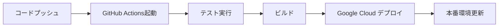

# Google Cloud と GitHub Actions の組み合わせ方：初心者向け完全ガイド

Google Cloud と GitHub Actions を組み合わせることで、コードの自動テスト、ビルド、デプロイを実現できます。この記事では、初心者でも理解できるよう、基本的な設定から実践的なデプロイまで詳しく解説します。

## なぜ Google Cloud と GitHub Actions を組み合わせるのか

### 主な利点

- **自動化**: コードのプッシュ時に自動でテスト・デプロイが実行される
- **一貫性**: 毎回同じ環境でビルド・デプロイが行われる
- **効率性**: 手動でのデプロイ作業が不要になる
- **品質向上**: 自動テストによりバグの早期発見が可能
- **コスト効率**: 必要な時だけリソースを使用

### 典型的なワークフロー



## 前提条件と準備

### 必要なもの

1. **Google Cloud アカウント**
2. **GitHub アカウント**
3. **Google Cloud プロジェクト**
4. **GitHub リポジトリ**

### Google Cloud プロジェクトの作成

1. [Google Cloud Console](https://console.cloud.google.com/) にアクセス
2. 新しいプロジェクトを作成
3. 必要なAPIを有効化：
   - Cloud Build API
   - Cloud Run API
   - Container Registry API

## 認証設定

### 1. サービスアカウントの作成

Google Cloud Console で以下の手順を実行：

1. **IAM & Admin** → **サービスアカウント**
2. **サービスアカウントを作成**
3. 必要な権限を付与：
   - Cloud Run Admin
   - Cloud Build Editor
   - Storage Admin

### 2. サービスアカウントキーの生成

```bash
# gcloud CLI を使用する場合
gcloud iam service-accounts keys create key.json \
  --iam-account=your-service-account@your-project.iam.gserviceaccount.com
```

### 3. GitHub Secrets の設定

GitHub リポジトリの **Settings** → **Secrets and variables** → **Actions** で以下を設定：

- `GCP_PROJECT_ID`: Google Cloud プロジェクトID
- `GCP_SA_KEY`: サービスアカウントキーのJSON（Base64エンコード）

## 基本的な GitHub Actions ワークフロー

### 1. 最小構成のワークフロー

```yaml
# .github/workflows/deploy.yml
name: Deploy to Google Cloud

on:
  push:
    branches: [main]
  pull_request:
    branches: [main]

jobs:
  deploy:
    runs-on: ubuntu-latest

    steps:
      - name: Checkout code
        uses: actions/checkout@v4

      - name: Setup Google Cloud CLI
        uses: google-github-actions/setup-gcloud@v2
        with:
          service_account_key: ${{ secrets.GCP_SA_KEY }}
          project_id: ${{ secrets.GCP_PROJECT_ID }}

      - name: Authenticate to Google Cloud
        run: gcloud auth configure-docker

      - name: Build and push Docker image
        run: |
          docker build -t gcr.io/${{ secrets.GCP_PROJECT_ID }}/my-app:${{ github.sha }} .
          docker push gcr.io/${{ secrets.GCP_PROJECT_ID }}/my-app:${{ github.sha }}

      - name: Deploy to Cloud Run
        run: |
          gcloud run deploy my-app \
            --image gcr.io/${{ secrets.GCP_PROJECT_ID }}/my-app:${{ github.sha }} \
            --platform managed \
            --region asia-northeast1 \
            --allow-unauthenticated
```

### 2. Node.js アプリケーションの例

```yaml
# .github/workflows/nodejs-deploy.yml
name: Node.js CI/CD

on:
  push:
    branches: [main]
  pull_request:
    branches: [main]

jobs:
  test:
    runs-on: ubuntu-latest

    steps:
      - name: Checkout code
        uses: actions/checkout@v4

      - name: Setup Node.js
        uses: actions/setup-node@v4
        with:
          node-version: '18'
          cache: 'npm'

      - name: Install dependencies
        run: npm ci

      - name: Run tests
        run: npm test

      - name: Run linting
        run: npm run lint

  deploy:
    needs: test
    runs-on: ubuntu-latest
    if: github.ref == 'refs/heads/main'

    steps:
      - name: Checkout code
        uses: actions/checkout@v4

      - name: Setup Google Cloud CLI
        uses: google-github-actions/setup-gcloud@v2
        with:
          service_account_key: ${{ secrets.GCP_SA_KEY }}
          project_id: ${{ secrets.GCP_PROJECT_ID }}

      - name: Build and push Docker image
        run: |
          docker build -t gcr.io/${{ secrets.GCP_PROJECT_ID }}/nodejs-app:${{ github.sha }} .
          docker push gcr.io/${{ secrets.GCP_PROJECT_ID }}/nodejs-app:${{ github.sha }}

      - name: Deploy to Cloud Run
        run: |
          gcloud run deploy nodejs-app \
            --image gcr.io/${{ secrets.GCP_PROJECT_ID }}/nodejs-app:${{ github.sha }} \
            --platform managed \
            --region asia-northeast1 \
            --allow-unauthenticated \
            --set-env-vars NODE_ENV=production
```

## Dockerfile の作成

### Node.js アプリケーション用

```dockerfile
# Dockerfile
FROM node:18-alpine

WORKDIR /app

# 依存関係をコピーしてインストール
COPY package*.json ./
RUN npm ci --only=production

# アプリケーションコードをコピー
COPY . .

# ポートを公開
EXPOSE 8080

# アプリケーションを起動
CMD ["npm", "start"]
```

### Python アプリケーション用

```dockerfile
# Dockerfile
FROM python:3.11-slim

WORKDIR /app

# 依存関係をインストール
COPY requirements.txt .
RUN pip install --no-cache-dir -r requirements.txt

# アプリケーションコードをコピー
COPY . .

# ポートを公開
EXPOSE 8080

# アプリケーションを起動
CMD ["python", "app.py"]
```

## 環境変数の管理

### 1. GitHub Secrets での管理

機密情報は GitHub Secrets で管理：

```yaml
- name: Deploy with environment variables
  run: |
    gcloud run deploy my-app \
      --image gcr.io/${{ secrets.GCP_PROJECT_ID }}/my-app:${{ github.sha }} \
      --set-env-vars \
        DATABASE_URL=${{ secrets.DATABASE_URL }},\
        API_KEY=${{ secrets.API_KEY }},\
        NODE_ENV=production
```

### 2. Google Cloud Secret Manager の活用

```yaml
- name: Deploy with Secret Manager
  run: |
    gcloud run deploy my-app \
      --image gcr.io/${{ secrets.GCP_PROJECT_ID }}/my-app:${{ github.sha }} \
      --set-secrets \
        DATABASE_URL=database-url:latest,\
        API_KEY=api-key:latest
```

## 高度な設定

### 1. マルチステージデプロイ

```yaml
# .github/workflows/multi-stage-deploy.yml
name: Multi-stage Deploy

on:
  push:
    branches: [main, staging]

jobs:
  deploy:
    runs-on: ubuntu-latest

    steps:
      - name: Checkout code
        uses: actions/checkout@v4

      - name: Setup Google Cloud CLI
        uses: google-github-actions/setup-gcloud@v2
        with:
          service_account_key: ${{ secrets.GCP_SA_KEY }}
          project_id: ${{ secrets.GCP_PROJECT_ID }}

      - name: Determine environment
        id: env
        run: |
          if [[ "${{ github.ref }}" == "refs/heads/main" ]]; then
            echo "environment=production" >> $GITHUB_OUTPUT
            echo "service_name=my-app-prod" >> $GITHUB_OUTPUT
          else
            echo "environment=staging" >> $GITHUB_OUTPUT
            echo "service_name=my-app-staging" >> $GITHUB_OUTPUT
          fi

      - name: Build and push Docker image
        run: |
          docker build -t gcr.io/${{ secrets.GCP_PROJECT_ID }}/${{ steps.env.outputs.service_name }}:${{ github.sha }} .
          docker push gcr.io/${{ secrets.GCP_PROJECT_ID }}/${{ steps.env.outputs.service_name }}:${{ github.sha }}

      - name: Deploy to Cloud Run
        run: |
          gcloud run deploy ${{ steps.env.outputs.service_name }} \
            --image gcr.io/${{ secrets.GCP_PROJECT_ID }}/${{ steps.env.outputs.service_name }}:${{ github.sha }} \
            --platform managed \
            --region asia-northeast1 \
            --allow-unauthenticated \
            --set-env-vars ENVIRONMENT=${{ steps.env.outputs.environment }}
```

### 2. ロールバック機能

```yaml
- name: Rollback on failure
  if: failure()
  run: |
    # 前のバージョンにロールバック
    gcloud run services update-traffic my-app \
      --to-revisions=my-app-00001-abc=100 \
      --region=asia-northeast1
```

### 3. 通知設定

```yaml
- name: Notify deployment success
  if: success()
  uses: 8398a7/action-slack@v3
  with:
    status: success
    text: 'Deployment to ${{ steps.env.outputs.environment }} successful!'
  env:
    SLACK_WEBHOOK_URL: ${{ secrets.SLACK_WEBHOOK_URL }}
```

## セキュリティのベストプラクティス

### 1. 最小権限の原則

```yaml
# 必要最小限の権限のみ付与
- name: Deploy with minimal permissions
  run: |
    gcloud run deploy my-app \
      --image gcr.io/${{ secrets.GCP_PROJECT_ID }}/my-app:${{ github.sha }} \
      --no-allow-unauthenticated  # 認証が必要
```

### 2. 脆弱性スキャン

```yaml
- name: Run security scan
  uses: aquasecurity/trivy-action@master
  with:
    image-ref: gcr.io/${{ secrets.GCP_PROJECT_ID }}/my-app:${{ github.sha }}
    format: 'sarif'
    output: 'trivy-results.sarif'
```

### 3. シークレットのローテーション

```yaml
- name: Rotate secrets
  run: |
    # 定期的にシークレットをローテーション
    gcloud secrets versions add my-secret --data-file=new-secret.txt
```

## トラブルシューティング

### よくある問題と解決方法

#### 1. 認証エラー

```bash
# サービスアカウントキーの確認
gcloud auth list

# 権限の確認
gcloud projects get-iam-policy $PROJECT_ID
```

#### 2. ビルドエラー

```yaml
- name: Debug build
  run: |
    # ビルドログを詳細表示
    docker build --no-cache -t gcr.io/${{ secrets.GCP_PROJECT_ID }}/my-app:${{ github.sha }} .
```

#### 3. デプロイエラー

```yaml
- name: Check deployment status
  run: |
    gcloud run services describe my-app --region=asia-northeast1
```

## 監視とログ

### 1. ログの確認

```yaml
- name: View logs
  run: |
    gcloud logs read "resource.type=cloud_run_revision" --limit=50
```

### 2. メトリクスの監視

```yaml
- name: Check metrics
  run: |
    gcloud monitoring metrics list --filter="resource.type=cloud_run_revision"
```

## まとめ

Google Cloud と GitHub Actions を組み合わせることで、以下のような効果が得られます：

### 主な利点

1. **自動化**: コードの変更が自動的に本番環境に反映
2. **一貫性**: 毎回同じ環境でビルド・デプロイ
3. **効率性**: 手動作業の削減
4. **品質向上**: 自動テストによるバグの早期発見
5. **スケーラビリティ**: クラウドの柔軟なリソース活用

### 実践のポイント

- **段階的な導入**: まずは簡単なアプリケーションから始める
- **セキュリティ**: 最小権限の原則とシークレット管理
- **監視**: ログとメトリクスによる運用状況の把握
- **テスト**: 自動テストによる品質保証
- **ドキュメント**: 設定と手順の文書化

この組み合わせにより、開発からデプロイまでの一連の流れを効率化し、より安定したアプリケーションの運用が可能になります。まずは小さなプロジェクトから始めて、徐々に複雑なワークフローに発展させていくことをお勧めします。
