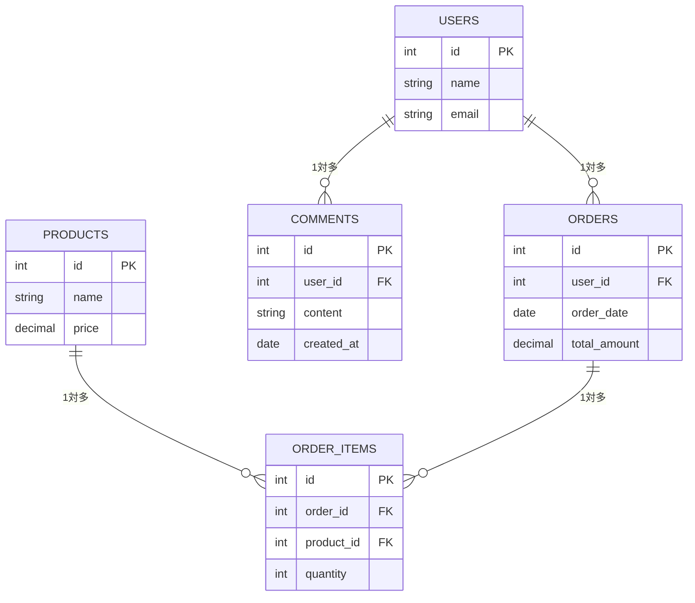

# 外部キー制約入門完全ガイド：データベースの整合性を保つ重要な仕組みを初心者向けに解説

外部キー制約は、リレーショナルデータベースにおいて、テーブル間の関係性を定義し、データの整合性を保つための重要な仕組みです。この記事では、初心者にも分かりやすく、外部キー制約の基本概念、実装方法、実際の例、メリット・デメリット、運用時の注意点まで実際のSQLコードと共に詳しく解説します。

## 外部キー制約とは

外部キー制約（Foreign Key Constraint）は、あるテーブルの列が、別のテーブルの主キーまたは一意キーを参照する際に設定する制約です。これにより、データベース内のテーブル間の関係性が保たれ、データの整合性が確保されます。

### 基本的な概念



## 外部キー制約の基本構文

### テーブル作成時の外部キー制約

```sql
-- ユーザーテーブル
CREATE TABLE users (
    id INT PRIMARY KEY AUTO_INCREMENT,
    name VARCHAR(100) NOT NULL,
    email VARCHAR(255) UNIQUE NOT NULL,
    created_at TIMESTAMP DEFAULT CURRENT_TIMESTAMP
);

-- 注文テーブル（外部キー制約付き）
CREATE TABLE orders (
    id INT PRIMARY KEY AUTO_INCREMENT,
    user_id INT NOT NULL,
    order_date DATE NOT NULL,
    total_amount DECIMAL(10, 2) NOT NULL,
    FOREIGN KEY (user_id) REFERENCES users(id)
);

-- 商品テーブル
CREATE TABLE products (
    id INT PRIMARY KEY AUTO_INCREMENT,
    name VARCHAR(200) NOT NULL,
    price DECIMAL(10, 2) NOT NULL,
    stock_quantity INT DEFAULT 0
);

-- 注文アイテムテーブル（複数の外部キー制約）
CREATE TABLE order_items (
    id INT PRIMARY KEY AUTO_INCREMENT,
    order_id INT NOT NULL,
    product_id INT NOT NULL,
    quantity INT NOT NULL,
    unit_price DECIMAL(10, 2) NOT NULL,
    FOREIGN KEY (order_id) REFERENCES orders(id),
    FOREIGN KEY (product_id) REFERENCES products(id)
);
```

### 既存テーブルに外部キー制約を追加

```sql
-- 既存のテーブルに外部キー制約を追加
ALTER TABLE orders
ADD CONSTRAINT fk_orders_user_id
FOREIGN KEY (user_id) REFERENCES users(id);

-- 複数の外部キー制約を追加
ALTER TABLE order_items
ADD CONSTRAINT fk_order_items_order_id
FOREIGN KEY (order_id) REFERENCES orders(id);

ALTER TABLE order_items
ADD CONSTRAINT fk_order_items_product_id
FOREIGN KEY (product_id) REFERENCES products(id);
```

## 外部キー制約の動作例

### データの挿入

```sql
-- ユーザーデータの挿入
INSERT INTO users (name, email) VALUES
('田中太郎', 'tanaka@example.com'),
('佐藤花子', 'sato@example.com'),
('鈴木一郎', 'suzuki@example.com');

-- 注文データの挿入（有効なuser_id）
INSERT INTO orders (user_id, order_date, total_amount) VALUES
(1, '2024-01-15', 1500.00),
(2, '2024-01-16', 2300.00);

-- 商品データの挿入
INSERT INTO products (name, price, stock_quantity) VALUES
('ノートパソコン', 80000.00, 10),
('マウス', 2500.00, 50),
('キーボード', 3500.00, 30);

-- 注文アイテムの挿入
INSERT INTO order_items (order_id, product_id, quantity, unit_price) VALUES
(1, 1, 1, 80000.00),
(1, 2, 2, 2500.00),
(2, 3, 1, 3500.00);
```

### 外部キー制約違反の例

```sql
-- 存在しないuser_idで注文を作成しようとする（エラー）
INSERT INTO orders (user_id, order_date, total_amount) VALUES
(999, '2024-01-17', 1000.00);
-- エラー: Cannot add or update a child row: a foreign key constraint fails

-- 存在しないorder_idで注文アイテムを作成しようとする（エラー）
INSERT INTO order_items (order_id, product_id, quantity, unit_price) VALUES
(999, 1, 1, 80000.00);
-- エラー: Cannot add or update a child row: a foreign key constraint fails
```

## 外部キー制約の種類とオプション

### CASCADE（カスケード）

```sql
-- ユーザーが削除された場合、関連する注文も自動削除
CREATE TABLE orders (
    id INT PRIMARY KEY AUTO_INCREMENT,
    user_id INT NOT NULL,
    order_date DATE NOT NULL,
    total_amount DECIMAL(10, 2) NOT NULL,
    FOREIGN KEY (user_id) REFERENCES users(id) ON DELETE CASCADE
);

-- テストデータ
INSERT INTO users (name, email) VALUES ('テストユーザー', 'test@example.com');
INSERT INTO orders (user_id, order_date, total_amount) VALUES (1, '2024-01-15', 1000.00);

-- ユーザーを削除すると、関連する注文も自動削除される
DELETE FROM users WHERE id = 1;
-- ordersテーブルの該当レコードも自動的に削除される
```

### SET NULL

```sql
-- ユーザーが削除された場合、関連する注文のuser_idをNULLに設定
CREATE TABLE orders (
    id INT PRIMARY KEY AUTO_INCREMENT,
    user_id INT,
    order_date DATE NOT NULL,
    total_amount DECIMAL(10, 2) NOT NULL,
    FOREIGN KEY (user_id) REFERENCES users(id) ON DELETE SET NULL
);

-- テストデータ
INSERT INTO users (name, email) VALUES ('テストユーザー', 'test@example.com');
INSERT INTO orders (user_id, order_date, total_amount) VALUES (1, '2024-01-15', 1000.00);

-- ユーザーを削除すると、関連する注文のuser_idがNULLになる
DELETE FROM users WHERE id = 1;
-- ordersテーブルの該当レコードのuser_idがNULLになる
```

### RESTRICT（制限）

```sql
-- 関連する注文があるユーザーは削除できない
CREATE TABLE orders (
    id INT PRIMARY KEY AUTO_INCREMENT,
    user_id INT NOT NULL,
    order_date DATE NOT NULL,
    total_amount DECIMAL(10, 2) NOT NULL,
    FOREIGN KEY (user_id) REFERENCES users(id) ON DELETE RESTRICT
);

-- テストデータ
INSERT INTO users (name, email) VALUES ('テストユーザー', 'test@example.com');
INSERT INTO orders (user_id, order_date, total_amount) VALUES (1, '2024-01-15', 1000.00);

-- 関連する注文があるユーザーを削除しようとする（エラー）
DELETE FROM users WHERE id = 1;
-- エラー: Cannot delete or update a parent row: a foreign key constraint fails
```

### NO ACTION

```sql
-- 外部キー制約をチェックするが、即座にはエラーを出さない
CREATE TABLE orders (
    id INT PRIMARY KEY AUTO_INCREMENT,
    user_id INT NOT NULL,
    order_date DATE NOT NULL,
    total_amount DECIMAL(10, 2) NOT NULL,
    FOREIGN KEY (user_id) REFERENCES users(id) ON DELETE NO ACTION
);
```

## 実践的な例：ブログシステム

### テーブル設計

```sql
-- ユーザーテーブル
CREATE TABLE users (
    id INT PRIMARY KEY AUTO_INCREMENT,
    username VARCHAR(50) UNIQUE NOT NULL,
    email VARCHAR(255) UNIQUE NOT NULL,
    password_hash VARCHAR(255) NOT NULL,
    created_at TIMESTAMP DEFAULT CURRENT_TIMESTAMP,
    updated_at TIMESTAMP DEFAULT CURRENT_TIMESTAMP ON UPDATE CURRENT_TIMESTAMP
);

-- カテゴリテーブル
CREATE TABLE categories (
    id INT PRIMARY KEY AUTO_INCREMENT,
    name VARCHAR(100) NOT NULL,
    description TEXT,
    created_at TIMESTAMP DEFAULT CURRENT_TIMESTAMP
);

-- 記事テーブル
CREATE TABLE posts (
    id INT PRIMARY KEY AUTO_INCREMENT,
    title VARCHAR(255) NOT NULL,
    content TEXT NOT NULL,
    author_id INT NOT NULL,
    category_id INT,
    status ENUM('draft', 'published', 'archived') DEFAULT 'draft',
    published_at TIMESTAMP NULL,
    created_at TIMESTAMP DEFAULT CURRENT_TIMESTAMP,
    updated_at TIMESTAMP DEFAULT CURRENT_TIMESTAMP ON UPDATE CURRENT_TIMESTAMP,
    FOREIGN KEY (author_id) REFERENCES users(id) ON DELETE CASCADE,
    FOREIGN KEY (category_id) REFERENCES categories(id) ON DELETE SET NULL
);

-- コメントテーブル
CREATE TABLE comments (
    id INT PRIMARY KEY AUTO_INCREMENT,
    post_id INT NOT NULL,
    author_id INT NOT NULL,
    content TEXT NOT NULL,
    parent_id INT NULL,
    created_at TIMESTAMP DEFAULT CURRENT_TIMESTAMP,
    updated_at TIMESTAMP DEFAULT CURRENT_TIMESTAMP ON UPDATE CURRENT_TIMESTAMP,
    FOREIGN KEY (post_id) REFERENCES posts(id) ON DELETE CASCADE,
    FOREIGN KEY (author_id) REFERENCES users(id) ON DELETE CASCADE,
    FOREIGN KEY (parent_id) REFERENCES comments(id) ON DELETE CASCADE
);

-- タグテーブル
CREATE TABLE tags (
    id INT PRIMARY KEY AUTO_INCREMENT,
    name VARCHAR(50) UNIQUE NOT NULL,
    created_at TIMESTAMP DEFAULT CURRENT_TIMESTAMP
);

-- 記事とタグの関連テーブル（多対多関係）
CREATE TABLE post_tags (
    post_id INT NOT NULL,
    tag_id INT NOT NULL,
    created_at TIMESTAMP DEFAULT CURRENT_TIMESTAMP,
    PRIMARY KEY (post_id, tag_id),
    FOREIGN KEY (post_id) REFERENCES posts(id) ON DELETE CASCADE,
    FOREIGN KEY (tag_id) REFERENCES tags(id) ON DELETE CASCADE
);
```

### サンプルデータの挿入

```sql
-- ユーザーデータ
INSERT INTO users (username, email, password_hash) VALUES
('admin', 'admin@example.com', '$2b$10$example_hash'),
('writer1', 'writer1@example.com', '$2b$10$example_hash'),
('reader1', 'reader1@example.com', '$2b$10$example_hash');

-- カテゴリデータ
INSERT INTO categories (name, description) VALUES
('技術', 'プログラミングや技術に関する記事'),
('ライフスタイル', '日常生活や趣味に関する記事'),
('ニュース', '最新のニュースや時事問題');

-- タグデータ
INSERT INTO tags (name) VALUES
('JavaScript'), ('Python'), ('React'), ('Node.js'),
('料理'), ('旅行'), ('読書'), ('映画');

-- 記事データ
INSERT INTO posts (title, content, author_id, category_id, status, published_at) VALUES
('JavaScript入門', 'JavaScriptの基本的な使い方について...', 1, 1, 'published', '2024-01-15 10:00:00'),
('React Hooks完全ガイド', 'React Hooksの使い方を詳しく解説...', 2, 1, 'published', '2024-01-16 14:30:00'),
('美味しいパスタの作り方', '簡単に作れる美味しいパスタのレシピ...', 2, 2, 'published', '2024-01-17 09:15:00');

-- 記事とタグの関連
INSERT INTO post_tags (post_id, tag_id) VALUES
(1, 1), (1, 3),  -- JavaScript入門: JavaScript, React
(2, 1), (2, 3),  -- React Hooks完全ガイド: JavaScript, React
(3, 5);          -- 美味しいパスタの作り方: 料理

-- コメントデータ
INSERT INTO comments (post_id, author_id, content, parent_id) VALUES
(1, 3, 'とても分かりやすい記事でした！', NULL),
(1, 2, 'ありがとうございます！', 1),
(2, 3, 'Hooksの使い方がよく分かりました', NULL);
```

## 外部キー制約の確認と管理

### 外部キー制約の確認

```sql
-- テーブルの外部キー制約を確認
SELECT
    TABLE_NAME,
    COLUMN_NAME,
    CONSTRAINT_NAME,
    REFERENCED_TABLE_NAME,
    REFERENCED_COLUMN_NAME
FROM INFORMATION_SCHEMA.KEY_COLUMN_USAGE
WHERE REFERENCED_TABLE_SCHEMA = 'your_database_name'
AND REFERENCED_TABLE_NAME IS NOT NULL;

-- 特定のテーブルの外部キー制約を確認
SHOW CREATE TABLE posts;

-- 外部キー制約の詳細情報
SELECT
    CONSTRAINT_NAME,
    TABLE_NAME,
    COLUMN_NAME,
    REFERENCED_TABLE_NAME,
    REFERENCED_COLUMN_NAME,
    UPDATE_RULE,
    DELETE_RULE
FROM INFORMATION_SCHEMA.REFERENTIAL_CONSTRAINTS rc
JOIN INFORMATION_SCHEMA.KEY_COLUMN_USAGE kcu
ON rc.CONSTRAINT_NAME = kcu.CONSTRAINT_NAME
WHERE rc.CONSTRAINT_SCHEMA = 'your_database_name';
```

### 外部キー制約の削除

```sql
-- 外部キー制約を削除
ALTER TABLE orders DROP FOREIGN KEY fk_orders_user_id;

-- 複数の外部キー制約を削除
ALTER TABLE order_items
DROP FOREIGN KEY fk_order_items_order_id,
DROP FOREIGN KEY fk_order_items_product_id;
```

### 外部キー制約の一時的な無効化

```sql
-- 外部キー制約チェックを無効化（MySQL）
SET FOREIGN_KEY_CHECKS = 0;

-- データの一括操作
DELETE FROM users WHERE id = 1;
INSERT INTO users (id, name, email) VALUES (1, '新しいユーザー', 'new@example.com');

-- 外部キー制約チェックを有効化
SET FOREIGN_KEY_CHECKS = 1;
```

## 外部キー制約のメリット・デメリット

### メリット

1. **データ整合性の保証**
   - 存在しないデータへの参照を防ぐ
   - データの不整合を自動的に防止

2. **データベース設計の明確化**
   - テーブル間の関係性が明確になる
   - ドキュメントとしての役割

3. **自動的な制約チェック**
   - アプリケーションレベルでの制約チェックが不要
   - データベースレベルでの保証

### デメリット

1. **パフォーマンスへの影響**
   - 挿入・更新・削除時の制約チェック
   - インデックスの追加によるストレージ使用量増加

2. **複雑性の増加**
   - データの削除順序の考慮が必要
   - デッドロックの可能性

3. **運用の制約**
   - データの一括操作が困難
   - バックアップ・リストア時の制約

## パフォーマンス最適化

### インデックスの追加

```sql
-- 外部キー列にインデックスを追加（通常は自動で作成される）
CREATE INDEX idx_orders_user_id ON orders(user_id);
CREATE INDEX idx_order_items_order_id ON order_items(order_id);
CREATE INDEX idx_order_items_product_id ON order_items(product_id);

-- 複合インデックスの作成
CREATE INDEX idx_posts_author_status ON posts(author_id, status);
CREATE INDEX idx_comments_post_created ON comments(post_id, created_at);
```

### クエリの最適化

```sql
-- 効率的なJOINクエリ
SELECT
    p.title,
    p.content,
    u.username as author_name,
    c.name as category_name
FROM posts p
INNER JOIN users u ON p.author_id = u.id
LEFT JOIN categories c ON p.category_id = c.id
WHERE p.status = 'published'
ORDER BY p.published_at DESC;

-- 外部キー制約を活用したEXISTSクエリ
SELECT u.*
FROM users u
WHERE EXISTS (
    SELECT 1 FROM posts p
    WHERE p.author_id = u.id
    AND p.status = 'published'
);
```

## 運用時の注意点

### データの削除順序

```sql
-- 正しい削除順序（子テーブルから親テーブルへ）
-- 1. コメントを削除
DELETE FROM comments WHERE post_id = 1;

-- 2. 記事とタグの関連を削除
DELETE FROM post_tags WHERE post_id = 1;

-- 3. 記事を削除
DELETE FROM posts WHERE id = 1;

-- 4. ユーザーを削除（CASCADE設定により自動削除される場合もある）
DELETE FROM users WHERE id = 1;
```

### バックアップとリストア

```sql
-- 外部キー制約を一時的に無効化してバックアップ
SET FOREIGN_KEY_CHECKS = 0;

-- データのエクスポート
mysqldump --single-transaction --routines --triggers your_database > backup.sql

-- リストア時も外部キー制約を無効化
SET FOREIGN_KEY_CHECKS = 0;
SOURCE backup.sql;
SET FOREIGN_KEY_CHECKS = 1;
```

### エラーハンドリング

```sql
-- 外部キー制約違反のエラーをキャッチ
DELIMITER //
CREATE PROCEDURE SafeDeleteUser(IN user_id INT)
BEGIN
    DECLARE EXIT HANDLER FOR 1451
    BEGIN
        SELECT 'Cannot delete user: related records exist' as error_message;
    END;

    DELETE FROM users WHERE id = user_id;
    SELECT 'User deleted successfully' as success_message;
END //
DELIMITER ;

-- プロシージャの実行
CALL SafeDeleteUser(1);
```

## まとめ

外部キー制約は、リレーショナルデータベースにおいてデータの整合性を保つための重要な仕組みです。適切に使用することで、データの品質を向上させ、アプリケーションの信頼性を高めることができます。

### 外部キー制約を使用する際のポイント

- **適切な参照動作の選択**: CASCADE、SET NULL、RESTRICT、NO ACTION
- **パフォーマンスの考慮**: インデックスの追加とクエリの最適化
- **運用時の注意**: 削除順序とバックアップ・リストア手順
- **エラーハンドリング**: 制約違反時の適切な処理

### 学習のポイント

- **基本的な構文**から始める
- **実際のプロジェクト**で使用して経験を積む
- **パフォーマンステスト**を行って最適化を学ぶ
- **運用時の課題**を理解して対策を考える

外部キー制約を適切に理解し、使用することで、より堅牢で保守性の高いデータベース設計が可能になります。まずは基本的な使い方から始めて、徐々に高度な機能を学習していきましょう。
