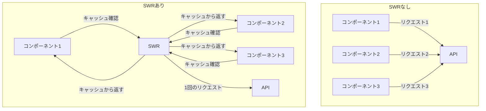

# SWR完全入門：Reactデータ取得を劇的に改善する実践ガイド

[SWR](https://swr.vercel.app/ja)は、Reactアプリケーションのデータ取得を劇的に改善するライブラリです。`stale-while-revalidate`戦略を採用し、キャッシュ、自動再検証、エラーハンドリングなどの機能を提供します。この記事では、SWRを使った場合と使わない場合の比較を通じて、実践的なコード例と共にSWRの強力な機能を詳しく解説します。

## SWRとは

SWR（stale-while-revalidate）は、HTTP RFC 5861で提唱されたキャッシュ無効化戦略です。SWRは以下の動作を行います：

1. **キャッシュからデータを返す**（stale）
2. **フェッチリクエストを送る**（revalidate）
3. **最新のデータを取得する**

この戦略により、ユーザーは即座にキャッシュされたデータを見ることができ、その間に最新のデータがバックグラウンドで取得されます。

## SWRを使わない場合の実装

### 基本的なデータ取得

```typescript
// SWRを使わない場合の実装
import { useState, useEffect } from 'react';

interface User {
  id: string;
  name: string;
  email: string;
}

function UserProfile({ userId }: { userId: string }) {
  const [user, setUser] = useState<User | null>(null);
  const [isLoading, setIsLoading] = useState(true);
  const [error, setError] = useState<Error | null>(null);

  useEffect(() => {
    let cancelled = false;

    const fetchUser = async () => {
      setIsLoading(true);
      setError(null);

      try {
        const response = await fetch(`/api/users/${userId}`);
        if (!response.ok) {
          throw new Error('Failed to fetch user');
        }
        const data = await response.json();

        if (!cancelled) {
          setUser(data);
          setIsLoading(false);
        }
      } catch (err) {
        if (!cancelled) {
          setError(err as Error);
          setIsLoading(false);
        }
      }
    };

    fetchUser();

    return () => {
      cancelled = true;
    };
  }, [userId]);

  if (isLoading) return <div>Loading...</div>;
  if (error) return <div>Error: {error.message}</div>;
  if (!user) return null;

  return (
    <div>
      <h1>{user.name}</h1>
      <p>{user.email}</p>
    </div>
  );
}
```

### 複数のコンポーネントで同じデータを取得する場合

```typescript
// 同じデータを複数のコンポーネントで取得
function UserHeader({ userId }: { userId: string }) {
  const [user, setUser] = useState<User | null>(null);
  const [isLoading, setIsLoading] = useState(true);

  useEffect(() => {
    fetch(`/api/users/${userId}`)
      .then(res => res.json())
      .then(data => {
        setUser(data);
        setIsLoading(false);
      });
  }, [userId]);

  if (isLoading) return <div>Loading...</div>;
  return <h1>{user?.name}</h1>;
}

function UserDetails({ userId }: { userId: string }) {
  const [user, setUser] = useState<User | null>(null);
  const [isLoading, setIsLoading] = useState(true);

  useEffect(() => {
    fetch(`/api/users/${userId}`)
      .then(res => res.json())
      .then(data => {
        setUser(data);
        setIsLoading(false);
      });
  }, [userId]);

  if (isLoading) return <div>Loading...</div>;
  return <div>{user?.email}</div>;
}

// 同じAPIを2回呼び出してしまう！
```

### 自動再検証がない場合

```typescript
// 手動で再取得する必要がある
function UserList() {
  const [users, setUsers] = useState<User[]>([]);
  const [isLoading, setIsLoading] = useState(true);

  const fetchUsers = async () => {
    setIsLoading(true);
    const response = await fetch('/api/users');
    const data = await response.json();
    setUsers(data);
    setIsLoading(false);
  };

  useEffect(() => {
    fetchUsers();
  }, []);

  // 手動でリフレッシュボタンを追加する必要がある
  return (
    <div>
      <button onClick={fetchUsers}>Refresh</button>
      {isLoading ? (
        <div>Loading...</div>
      ) : (
        <ul>
          {users.map(user => (
            <li key={user.id}>{user.name}</li>
          ))}
        </ul>
      )}
    </div>
  );
}
```

## SWRを使った場合の実装

### 基本的なデータ取得

```typescript
// SWRを使った場合の実装
import useSWR from 'swr';

const fetcher = (url: string) => fetch(url).then(res => res.json());

function UserProfile({ userId }: { userId: string }) {
  const { data: user, error, isLoading } = useSWR<User>(
    `/api/users/${userId}`,
    fetcher
  );

  if (error) return <div>Error: {error.message}</div>;
  if (isLoading) return <div>Loading...</div>;

  return (
    <div>
      <h1>{user.name}</h1>
      <p>{user.email}</p>
    </div>
  );
}
```

### 複数のコンポーネントで同じデータを取得する場合

```typescript
// SWRは自動的にリクエストを重複排除
function UserHeader({ userId }: { userId: string }) {
  const { data: user } = useSWR<User>(`/api/users/${userId}`, fetcher);
  if (!user) return <div>Loading...</div>;
  return <h1>{user.name}</h1>;
}

function UserDetails({ userId }: { userId: string }) {
  const { data: user } = useSWR<User>(`/api/users/${userId}`, fetcher);
  if (!user) return <div>Loading...</div>;
  return <div>{user.email}</div>;
}

// 同じキーを使うと、自動的に1回のリクエストだけが実行される！
```

### 自動再検証

```typescript
// SWRは自動的に再検証を行う
function UserList() {
  const { data: users, error, isLoading } = useSWR<User[]>(
    '/api/users',
    fetcher,
    {
      revalidateOnFocus: true,      // ウィンドウフォーカス時に再検証
      revalidateOnReconnect: true,  // ネットワーク再接続時に再検証
      refreshInterval: 5000         // 5秒ごとに自動再検証
    }
  );

  if (error) return <div>Error: {error.message}</div>;
  if (isLoading) return <div>Loading...</div>;

  return (
    <ul>
      {users.map(user => (
        <li key={user.id}>{user.name}</li>
      ))}
    </ul>
  );
}
```

## 詳細な比較

### コード量の比較

**SWRを使わない場合（約50行）**:

```typescript
function UserProfile({ userId }: { userId: string }) {
  const [user, setUser] = useState<User | null>(null)
  const [isLoading, setIsLoading] = useState(true)
  const [error, setError] = useState<Error | null>(null)

  useEffect(() => {
    let cancelled = false

    const fetchUser = async () => {
      setIsLoading(true)
      setError(null)
      try {
        const response = await fetch(`/api/users/${userId}`)
        if (!response.ok) throw new Error('Failed to fetch')
        const data = await response.json()
        if (!cancelled) {
          setUser(data)
          setIsLoading(false)
        }
      } catch (err) {
        if (!cancelled) {
          setError(err as Error)
          setIsLoading(false)
        }
      }
    }

    fetchUser()
    return () => {
      cancelled = true
    }
  }, [userId])

  // レンダリングロジック...
}
```

**SWRを使った場合（約15行）**:

```typescript
function UserProfile({ userId }: { userId: string }) {
  const { data: user, error, isLoading } = useSWR<User>(`/api/users/${userId}`, fetcher)

  // レンダリングロジック...
}
```

### パフォーマンスの比較

以下はSWRを使った場合と使わない場合の処理フローの比較です。



## SWRの主要機能

### 1. キャッシュとリクエストの重複排除

```typescript
// 同じキーを使用すると、自動的に重複排除される
function App() {
  return (
    <div>
      <UserProfile userId="1" />  {/* リクエスト1回目 */}
      <UserProfile userId="1" />  {/* キャッシュから取得 */}
      <UserProfile userId="1" />  {/* キャッシュから取得 */}
    </div>
  );
}
```

### 2. 自動再検証

```typescript
const { data, mutate } = useSWR('/api/users', fetcher, {
  revalidateOnFocus: true, // フォーカス時に再検証
  revalidateOnReconnect: true, // 再接続時に再検証
  refreshInterval: 5000, // 5秒ごとに再検証
  dedupingInterval: 2000, // 2秒以内の重複リクエストを無視
})
```

### 3. 楽観的UI更新

```typescript
function UserProfile({ userId }: { userId: string }) {
  const { data: user, mutate } = useSWR<User>(
    `/api/users/${userId}`,
    fetcher
  );

  const updateUser = async (newName: string) => {
    // 楽観的更新：UIを即座に更新
    mutate({ ...user, name: newName }, false);

    // バックグラウンドでAPIを更新
    await fetch(`/api/users/${userId}`, {
      method: 'PATCH',
      body: JSON.stringify({ name: newName })
    });

    // 再検証
    mutate();
  };

  return (
    <div>
      <h1>{user?.name}</h1>
      <button onClick={() => updateUser('New Name')}>
        Update Name
      </button>
    </div>
  );
}
```

### 4. エラーハンドリング

```typescript
function UserProfile({ userId }: { userId: string }) {
  const { data: user, error, isLoading } = useSWR<User>(
    `/api/users/${userId}`,
    fetcher,
    {
      onErrorRetry: (error, key, config, revalidate, { retryCount }) => {
        // 404エラーはリトライしない
        if (error.status === 404) return;

        // 最大5回までリトライ
        if (retryCount >= 5) return;

        // 指数バックオフでリトライ
        setTimeout(() => revalidate({ retryCount }), 5000 * 2 ** retryCount);
      }
    }
  );

  if (error) {
    return <div>Error: {error.message}</div>;
  }

  if (isLoading) return <div>Loading...</div>;

  return <div>{user.name}</div>;
}
```

### 5. 条件付きフェッチ

```typescript
function UserProfile({ userId }: { userId: string }) {
  // userIdが存在する場合のみフェッチ
  const { data: user } = useSWR<User>(
    userId ? `/api/users/${userId}` : null,
    fetcher
  );

  if (!userId) return <div>No user selected</div>;
  if (!user) return <div>Loading...</div>;

  return <div>{user.name}</div>;
}
```

## 実践的な使用例

### ページネーション

```typescript
function UserList() {
  const [page, setPage] = useState(1);
  const { data: users, error, isLoading } = useSWR<User[]>(
    `/api/users?page=${page}`,
    fetcher
  );

  if (error) return <div>Error: {error.message}</div>;
  if (isLoading) return <div>Loading...</div>;

  return (
    <div>
      <ul>
        {users.map(user => (
          <li key={user.id}>{user.name}</li>
        ))}
      </ul>
      <button onClick={() => setPage(page - 1)} disabled={page === 1}>
        Previous
      </button>
      <button onClick={() => setPage(page + 1)}>Next</button>
    </div>
  );
}
```

### 無限スクロール

```typescript
import useSWRInfinite from 'swr/infinite';

function InfiniteUserList() {
  const {
    data,
    error,
    isLoading,
    size,
    setSize,
    isValidating
  } = useSWRInfinite<User[]>(
    (index) => `/api/users?page=${index + 1}`,
    fetcher
  );

  const users = data ? data.flat() : [];
  const isLoadingMore = isLoading || (size > 0 && data && typeof data[size - 1] === 'undefined');
  const isEmpty = data?.[0]?.length === 0;
  const isReachingEnd = isEmpty || (data && data[data.length - 1]?.length < 10);

  if (error) return <div>Error: {error.message}</div>;

  return (
    <div>
      <ul>
        {users.map(user => (
          <li key={user.id}>{user.name}</li>
        ))}
      </ul>
      <button
        onClick={() => setSize(size + 1)}
        disabled={isLoadingMore || isReachingEnd}
      >
        {isLoadingMore ? 'Loading...' : isReachingEnd ? 'No more' : 'Load more'}
      </button>
    </div>
  );
}
```

### ミューテーション（データの更新）

```typescript
import useSWR from 'swr';

function UserProfile({ userId }: { userId: string }) {
  const { data: user, mutate } = useSWR<User>(
    `/api/users/${userId}`,
    fetcher
  );

  const updateUser = async (updates: Partial<User>) => {
    // 楽観的更新
    const optimisticData = { ...user, ...updates };
    mutate(optimisticData, false);

    try {
      const response = await fetch(`/api/users/${userId}`, {
        method: 'PATCH',
        headers: { 'Content-Type': 'application/json' },
        body: JSON.stringify(updates)
      });

      const updatedUser = await response.json();
      mutate(updatedUser);
    } catch (error) {
      // エラー時は元のデータに戻す
      mutate(user);
      throw error;
    }
  };

  if (!user) return <div>Loading...</div>;

  return (
    <div>
      <h1>{user.name}</h1>
      <button onClick={() => updateUser({ name: 'New Name' })}>
        Update Name
      </button>
    </div>
  );
}
```

### グローバル設定

```typescript
// _app.tsx または provider コンポーネント
import { SWRConfig } from 'swr';

function MyApp({ Component, pageProps }: AppProps) {
  return (
    <SWRConfig
      value={{
        fetcher: (url: string) => fetch(url).then(res => res.json()),
        revalidateOnFocus: true,
        revalidateOnReconnect: true,
        refreshInterval: 0,
        dedupingInterval: 2000,
        onError: (error, key) => {
          console.error('SWR Error:', error, key);
        }
      }}
    >
      <Component {...pageProps} />
    </SWRConfig>
  );
}
```

## Next.jsとの統合

### SSR（Server-Side Rendering）

```typescript
import useSWR from 'swr';
import { GetServerSideProps } from 'next';

export default function UserPage({ fallbackData }: { fallbackData: User }) {
  const { data: user } = useSWR('/api/user', fetcher, {
    fallbackData
  });

  return <div>{user.name}</div>;
}

export const getServerSideProps: GetServerSideProps = async () => {
  const user = await fetchUser();

  return {
    props: {
      fallbackData: user
    }
  };
}
```

### SSG（Static Site Generation）

```typescript
import useSWR from 'swr';
import { GetStaticProps } from 'next';

export default function UserPage({ fallbackData }: { fallbackData: User }) {
  const { data: user } = useSWR('/api/user', fetcher, {
    fallbackData
  });

  return <div>{user.name}</div>;
}

export const getStaticProps: GetStaticProps = async () => {
  const user = await fetchUser();

  return {
    props: {
      fallbackData: user
    },
    revalidate: 60 // ISR: 60秒ごとに再生成
  };
}
```

## 比較まとめ

### SWRを使わない場合の課題

- **コード量が多い**: 状態管理、エラーハンドリング、ローディング状態の管理が必要
- **リクエストの重複**: 同じデータを複数のコンポーネントで取得すると重複リクエストが発生
- **手動での再取得**: データの更新時に手動で再取得する必要がある
- **キャッシュ管理が困難**: キャッシュの実装と管理が複雑
- **エラー処理の複雑さ**: リトライ、エラーハンドリングを自前で実装する必要がある

### SWRを使った場合の利点

- **コード量の削減**: 1行のフックでデータ取得を実現
- **自動的な重複排除**: 同じキーのリクエストは自動的に統合される
- **自動再検証**: フォーカス、再接続、インターバルでの自動更新
- **組み込みキャッシュ**: 自動的なキャッシュ管理
- **強力なエラーハンドリング**: リトライ、エラー処理が簡単
- **TypeScript対応**: 完全な型安全性
- **パフォーマンス向上**: キャッシュによる高速なデータ表示

## まとめ

SWRを使うことで、Reactアプリケーションのデータ取得を劇的に改善できます。

### 主要な特徴

- **コード量の削減**: 状態管理のコードを大幅に削減
- **自動的な最適化**: キャッシュ、重複排除、自動再検証
- **優れたユーザー体験**: 即座にキャッシュからデータを表示し、バックグラウンドで更新
- **型安全性**: TypeScriptとの完全な統合

### 実装のポイント

- **適切なキーの使用**: 一意のキーでキャッシュを管理
- **条件付きフェッチ**: 必要な場合のみデータを取得
- **楽観的更新**: UIの応答性を向上
- **エラーハンドリング**: 適切なエラー処理とリトライ戦略

### 実践的な用途

- **ダッシュボード**: リアルタイムなデータ表示
- **ソーシャルメディア**: フィードの自動更新
- **Eコマース**: 商品リストの動的更新
- **管理画面**: データの一覧表示と更新

[SWR公式サイト](https://swr.vercel.app/ja)を参考に、より効率的で使いやすいReactアプリケーションを構築しましょう。SWRを活用することで、データ取得の複雑さを大幅に減らし、ユーザーエクスペリエンスを向上させることができます。
