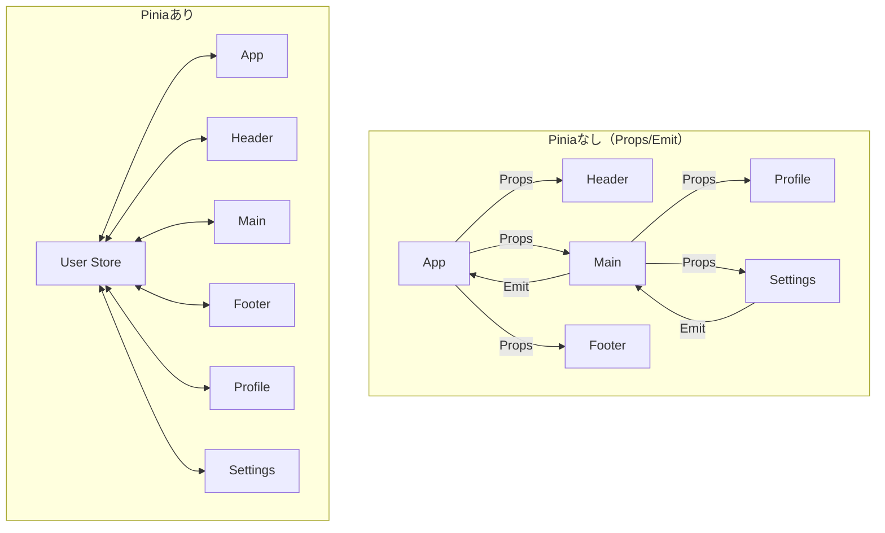

# Piniaを使うとVue.jsアプリの状態管理が何倍も楽になる理由

Vue.jsでアプリを作っていると、複数のコンポーネント間でデータを共有したくなる場面が必ず出てきます。ユーザー情報、カートの中身、通知の一覧など、アプリ全体で使いたいデータをどう管理するかは初心者が最初にぶつかる壁の一つです。

この記事では、Vue.jsの公式状態管理ライブラリである**Pinia**を使った場合と使わない場合で何が違うのかを、実際のコード例を交えて解説します。

## Piniaとは何か

[Pinia](https://pinia.vuejs.org/)は、Vue.jsのための直感的で型安全な状態管理ライブラリです。Vue 3の公式推奨ライブラリとして採用されており、Vuexの後継として設計されています。

特徴は以下の通りです：

- **型安全**: TypeScriptとの相性が抜群で、自動補完が効く
- **直感的なAPI**: コンポーネントのようにストアを書ける
- **軽量**: わずか1.5KB程度
- **開発者ツール対応**: Vue DevToolsで状態の変化を追跡できる
- **モジュラー設計**: 必要なストアだけを読み込める

## Piniaを使わない場合の課題

まず、Piniaを使わずに状態を共有する方法を見てみましょう。

### パターン1: Props と Emit の連鎖

親コンポーネントから子、孫へとデータを渡していく方法です。

```vue
<!-- App.vue -->
<template>
  <Header :user="user" @logout="handleLogout" />
  <Main :user="user" />
  <Footer :user="user" />
</template>

<script setup lang="ts">
import { ref } from 'vue'

const user = ref({ name: '太郎', email: 'taro@example.com' })

const handleLogout = () => {
  user.value = null
}
</script>
```

```vue
<!-- Main.vue -->
<template>
  <Profile :user="user" />
  <Settings :user="user" @update="handleUpdate" />
</template>

<script setup lang="ts">
defineProps<{ user: User | null }>()
defineEmits<{ update: [user: User] }>()
</script>
```

**問題点**：

- コンポーネントの階層が深くなると、中継だけのPropsが増える（Props Drilling）
- データの流れが複雑になり、どこで何が変更されるか追いにくい
- リファクタリング時に多数のファイルを修正する必要がある

### パターン2: Provide / Inject

Vue 3のComposition APIで導入された依存性注入の仕組みです。

```vue
<!-- App.vue -->
<template>
  <RouterView />
</template>

<script setup lang="ts">
import { provide, ref } from 'vue'

const user = ref({ name: '太郎', email: 'taro@example.com' })

const logout = () => {
  user.value = null
}

provide('user', user)
provide('logout', logout)
</script>
```

```vue
<!-- Profile.vue -->
<template>
  <div>{{ user?.name }}</div>
  <button @click="logout">ログアウト</button>
</template>

<script setup lang="ts">
import { inject } from 'vue'

const user = inject<Ref<User | null>>('user')
const logout = inject<() => void>('logout')
</script>
```

**問題点**：

- 型安全性が弱い（文字列キーで注入するため、タイポに気づきにくい）
- どこで状態が変更されるか追跡しにくい
- 開発者ツールでの可視化が難しい
- 複数の状態を管理すると、provideとinjectの組が増えて煩雑になる

## Piniaを使う場合

同じユーザー管理をPiniaで実装してみましょう。

```typescript
// stores/user.ts
import { defineStore } from 'pinia'
import { ref, computed } from 'vue'

export const useUserStore = defineStore('user', () => {
  const user = ref<User | null>({
    name: '太郎',
    email: 'taro@example.com',
  })

  const isLoggedIn = computed(() => user.value !== null)

  const logout = () => {
    user.value = null
  }

  const updateEmail = (newEmail: string) => {
    if (user.value) {
      user.value.email = newEmail
    }
  }

  return { user, isLoggedIn, logout, updateEmail }
})
```

```vue
<!-- Profile.vue -->
<template>
  <div v-if="userStore.isLoggedIn">
    <p>名前: {{ userStore.user?.name }}</p>
    <p>メール: {{ userStore.user?.email }}</p>
    <button @click="userStore.logout">ログアウト</button>
  </div>
</template>

<script setup lang="ts">
import { useUserStore } from '@/stores/user'

const userStore = useUserStore()
</script>
```

```vue
<!-- Settings.vue -->
<template>
  <input v-model="email" @change="userStore.updateEmail(email)" />
</template>

<script setup lang="ts">
import { ref } from 'vue'
import { useUserStore } from '@/stores/user'

const userStore = useUserStore()
const email = ref(userStore.user?.email ?? '')
</script>
```

**メリット**：

- どのコンポーネントからも直接ストアにアクセスできる
- TypeScriptの自動補完が完璧に効く（タイポを防げる）
- 状態の変更ロジックがストアに集約され、見通しが良い
- Vue DevToolsで状態の履歴を追跡できる

## 実際の違いを図で理解する

以下は、データの流れを示した図です。



Piniaを使わない場合はデータが親から子へ一方向に流れ、変更イベントは子から親へ逆流します。一方、Piniaを使う場合は全コンポーネントがストアと直接やり取りするため、シンプルで直感的です。

## どちらを選ぶべきか

### Piniaを使わなくても良いケース

- 親子関係が1〜2階層程度の小規模アプリ
- 共有する状態が1〜2個程度
- 学習目的でVueの基本を理解したい段階

### Piniaを使うべきケース

- 3階層以上のコンポーネント構造
- 複数のページ間でデータを共有したい
- ユーザー認証、カート、通知など、アプリ全体で使う状態がある
- TypeScriptで型安全に開発したい
- チームで開発しており、状態管理のルールを統一したい

## Piniaの導入方法

Piniaは非常に簡単に導入できます。

```bash
npm install pinia
```

```typescript
// main.ts
import { createApp } from 'vue'
import { createPinia } from 'pinia'
import App from './App.vue'

const app = createApp(App)
const pinia = createPinia()

app.use(pinia)
app.mount('#app')
```

これだけで、アプリ全体でストアを使えるようになります。

## まとめ

Piniaを使わない場合、Props/EmitやProvide/Injectで状態を共有できますが、アプリが成長するにつれて複雑さが増していきます。一方、Piniaを使えば以下の恩恵を受けられます：

- **直感的**: どのコンポーネントからも同じようにストアを呼び出せる
- **型安全**: TypeScriptの補完が効き、バグを未然に防げる
- **保守性**: 状態変更のロジックが一箇所に集約される
- **デバッグ**: Vue DevToolsで状態の変化を時系列で追跡できる
- **軽量**: わずか1.5KBなので、パフォーマンスへの影響は最小限

Vue.jsで本格的なアプリを作るなら、Piniaの導入を強くお勧めします。最初は学習コストを感じるかもしれませんが、すぐにその便利さに気づくはずです。
