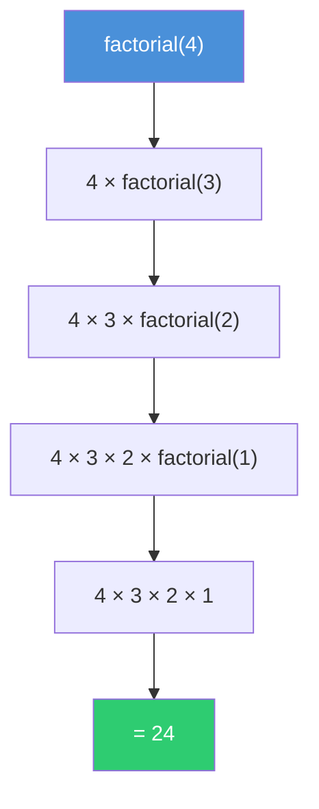
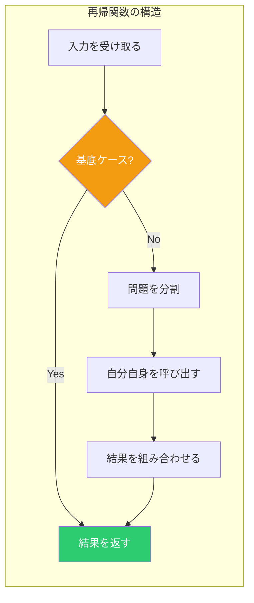
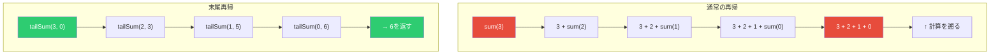
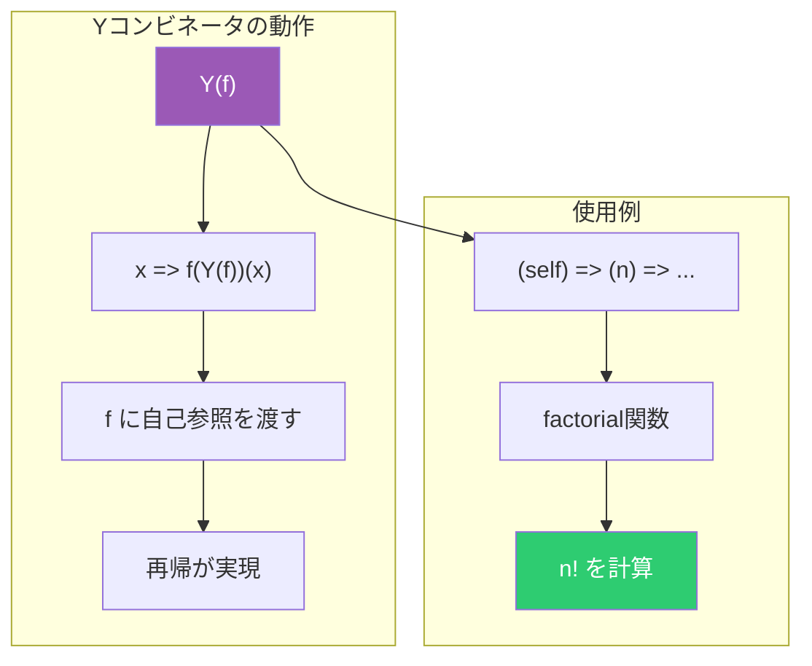
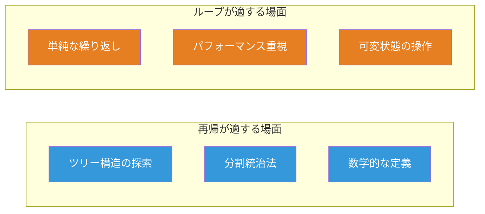

# TypeScriptの自己参照関数：再帰と型安全の両立

自己参照関数とは、関数が自分自身を呼び出す「再帰関数」のことである。TypeScriptでは、再帰関数を型安全に実装するためのいくつかのテクニックがある。本記事では、基本的な再帰から高度なパターンまでを図解付きで解説する。

## 自己参照関数とは

自己参照関数（再帰関数）は、問題を同じ構造のより小さな部分問題に分解して解くときに使う。典型的な例として階乗計算がある。

```ts
const factorial = (n: number): number => {
  if (n <= 1) return 1
  return n * factorial(n - 1)
}

console.log(factorial(5)) // 120
```

この関数は `factorial` 自身を呼び出している。これが「自己参照」である。

以下の図は、`factorial(4)` の呼び出しがどのように展開されるかを示す。



## 再帰の2つの要素

すべての再帰関数には、2つの要素が必要である。

1. **基底ケース（Base Case）**：再帰を終了する条件
2. **再帰ケース（Recursive Case）**：自分自身を呼び出す部分

```ts
const sumArray = (arr: readonly number[]): number => {
  // 基底ケース：配列が空なら0を返す
  if (arr.length === 0) return 0

  // 再帰ケース：先頭要素 + 残りの合計
  const [head, ...tail] = arr
  return head + sumArray(tail)
}

console.log(sumArray([1, 2, 3, 4, 5])) // 15
```

以下は再帰の構造を示す図である。



## TypeScriptでの型付け

### 関数型の再帰的定義

TypeScriptでは、関数の型を再帰的に定義できる。ただし、型エイリアスで直接自己参照するには工夫が必要である。

```ts
// 再帰的なデータ構造の型定義
type TreeNode<T> = {
  readonly value: T
  readonly children: readonly TreeNode<T>[]
}

// ツリーの深さを計算する再帰関数
const treeDepth = <T>(node: TreeNode<T>): number => {
  if (node.children.length === 0) return 1
  const childDepths = node.children.map(treeDepth)
  return 1 + Math.max(...childDepths)
}

const tree: TreeNode<string> = {
  value: 'root',
  children: [
    { value: 'a', children: [] },
    { value: 'b', children: [{ value: 'c', children: [] }] },
  ],
}

console.log(treeDepth(tree)) // 3
```

### ジェネリクスと再帰

ジェネリック関数で再帰を使う場合、型推論が正しく行われることを確認する。

```ts
// 配列を平坦化する再帰関数
type NestedArray<T> = T | readonly NestedArray<T>[]

const flatten = <T>(arr: readonly NestedArray<T>[]): T[] => {
  const result: T[] = []

  for (const item of arr) {
    if (Array.isArray(item)) {
      result.push(...flatten(item as readonly NestedArray<T>[]))
    } else {
      result.push(item as T)
    }
  }

  return result
}

const nested = [1, [2, [3, 4]], [5]]
console.log(flatten(nested)) // [1, 2, 3, 4, 5]
```

## 末尾再帰と最適化

### スタックオーバーフローの問題

通常の再帰は、呼び出しごとにコールスタックを消費する。大きな入力ではスタックオーバーフローが発生する。

```ts
// 危険：大きなnでスタックオーバーフロー
const badSum = (n: number): number => {
  if (n <= 0) return 0
  return n + badSum(n - 1)
}

// badSum(100000) // RangeError: Maximum call stack size exceeded
```

### 末尾再帰への変換

末尾再帰とは、再帰呼び出しが関数の最後の操作である形式である。アキュムレータパターンで変換できる。

```ts
// 末尾再帰版
const tailSum = (n: number, acc: number = 0): number => {
  if (n <= 0) return acc
  return tailSum(n - 1, acc + n)
}
```

以下は通常の再帰と末尾再帰の違いを示す図である。



### トランポリン最適化

JavaScriptエンジンは末尾再帰最適化（TCO）を保証しない。トランポリンを使えば、ループに変換できる。

```ts
type Thunk<T> = T | (() => Thunk<T>)

const trampoline = <T>(fn: Thunk<T>): T => {
  let result = fn
  while (typeof result === 'function') {
    result = (result as () => Thunk<T>)()
  }
  return result
}

const trampolineSum = (n: number, acc: number = 0): Thunk<number> => {
  if (n <= 0) return acc
  return () => trampolineSum(n - 1, acc + n)
}

console.log(trampoline(trampolineSum(100000))) // 5000050000
```

## Yコンビネータ：匿名再帰

通常、再帰関数には名前が必要である。しかし、Yコンビネータを使えば、匿名関数でも再帰を実現できる。

```ts
// Yコンビネータ（Zコンビネータ：正格評価版）
const Y = <T, R>(f: (g: (x: T) => R) => (x: T) => R): ((x: T) => R) => {
  return (x: T) => f(Y(f))(x)
}

// 匿名再帰で階乗を定義
const factorialY = Y<number, number>((self) => (n) => (n <= 1 ? 1 : n * self(n - 1)))

console.log(factorialY(5)) // 120
```

以下はYコンビネータの動作を示す図である。



## 実践的なユースケース

### JSONの深い探索

ネストしたJSONデータを再帰的に探索する例である。

```ts
type JsonValue =
  | string
  | number
  | boolean
  | null
  | readonly JsonValue[]
  | { readonly [key: string]: JsonValue }

const findAllStrings = (json: JsonValue): string[] => {
  if (typeof json === 'string') return [json]
  if (json === null || typeof json !== 'object') return []

  if (Array.isArray(json)) {
    return json.flatMap(findAllStrings)
  }

  return Object.values(json).flatMap(findAllStrings)
}

const data: JsonValue = {
  name: 'Alice',
  age: 30,
  contacts: ['bob@example.com', 'carol@example.com'],
  meta: { id: 'abc123' },
}

console.log(findAllStrings(data))
// ['Alice', 'bob@example.com', 'carol@example.com', 'abc123']
```

### ファイルシステムのような構造

```ts
type FileSystemEntry =
  | { readonly type: 'file'; readonly name: string; readonly size: number }
  | {
      readonly type: 'directory'
      readonly name: string
      readonly children: readonly FileSystemEntry[]
    }

const totalSize = (entry: FileSystemEntry): number => {
  if (entry.type === 'file') return entry.size
  return entry.children.reduce((sum, child) => sum + totalSize(child), 0)
}

const fs: FileSystemEntry = {
  type: 'directory',
  name: 'root',
  children: [
    { type: 'file', name: 'a.txt', size: 100 },
    { type: 'directory', name: 'sub', children: [{ type: 'file', name: 'b.txt', size: 200 }] },
  ],
}

console.log(totalSize(fs)) // 300
```

## 再帰 vs イテレーション

再帰とループには、それぞれ適した場面がある。



| 観点           | 再帰                   | ループ           |
| -------------- | ---------------------- | ---------------- |
| 可読性         | ツリー構造で高い       | 単純な処理で高い |
| パフォーマンス | スタック消費           | メモリ効率的     |
| デバッグ       | スタックトレースが深い | 追跡しやすい     |
| 関数型適性     | 高い                   | 低い             |

## まとめ

TypeScriptで自己参照関数を扱う際のポイントを整理する。

- **基底ケースと再帰ケース**の2要素を必ず定義する
- **型推論**が正しく行われることを確認する
- **スタックオーバーフロー**に注意し、必要ならトランポリンを使う
- **末尾再帰**への変換でアキュムレータパターンを活用する
- **再帰的なデータ構造**（ツリー、JSON等）には再帰が自然に適合する

再帰は関数型プログラミングの基礎であり、適切に使えばコードの可読性と表現力が向上する。ただし、パフォーマンスが重要な場面ではループへの変換も検討すべきである。
