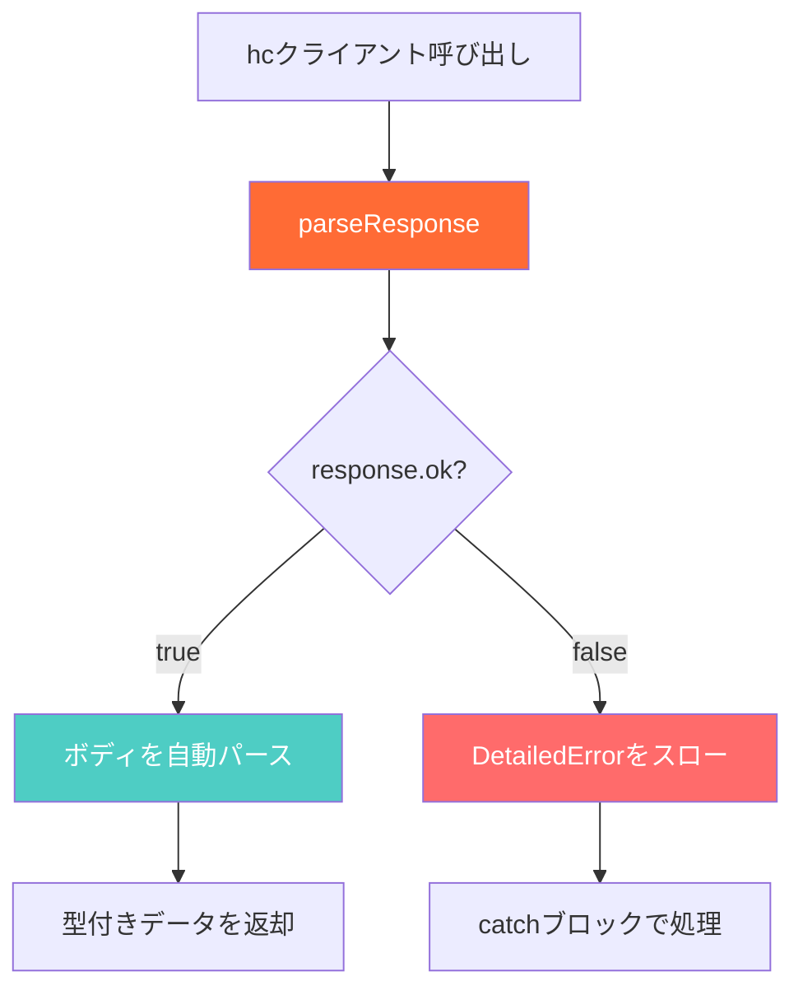
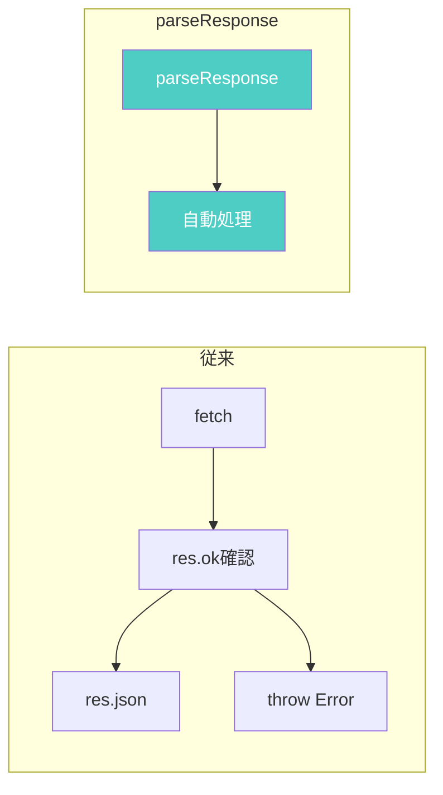

# Hono RPC parseResponseとSWRでシンプルなデータフェッチ

[Hono RPC](https://hono.dev/docs/guides/rpc)の`parseResponse`ヘルパーと[SWR](https://swr.vercel.app/ja)を組み合わせることで、型安全かつシンプルなデータフェッチが実現できる。本記事では、その具体的な実装パターンを解説する。

## parseResponseとは

`parseResponse`は Hono v4.7.0 で追加されたヘルパー関数である。`hc`クライアントのレスポンスを自動的にパースし、型安全に結果を取得できる。

主な特徴は以下のとおり。

- **自動パース**: Content-Type に基づいてレスポンスボディを自動パース
- **エラー自動スロー**: `response.ok`が`false`の場合、自動で`DetailedError`をスロー
- **型推論**: レスポンスの型が自動で推論される

以下は処理の流れを示す図である。



## サーバー側の実装

まずサーバー側でステータスコードを明示的に指定する。これにより、クライアント側で型推論が正しく機能する。

```ts
import { Hono } from 'hono'
import { zValidator } from '@hono/zod-validator'
import { z } from 'zod'

const app = new Hono()
  .get('/users/:id', zValidator('param', z.object({ id: z.string() })), async (c) => {
    const { id } = c.req.valid('param')
    const user = await findUser(id)

    if (!user) {
      return c.json({ error: 'User not found' }, 404)
    }

    return c.json({ user }, 200)
  })
  .get('/users', async (c) => {
    const users = await listUsers()
    return c.json({ users }, 200)
  })

export type AppType = typeof app
export default app
```

ステータスコード`200`や`404`を明示的に指定することで、クライアント側の型推論が正確になる。

## parseResponseの基本的な使い方

`parseResponse`の基本的な使い方を確認する。

```ts
import { hc, parseResponse, DetailedError } from 'hono/client'
import type { AppType } from './server'

const client = hc<AppType>('http://localhost:8787')

// 成功時：自動で { user: User } がパースされる
const result = await parseResponse(
  client.users[':id'].$get({
    param: { id: '123' },
  }),
).catch((e: DetailedError) => {
  console.error('Error:', e.status, e.message)
  return null
})
```

`parseResponse`はレスポンスが`ok`でない場合に自動でエラーをスローするため、`try-catch`または`.catch()`で処理する。

## SWRとの組み合わせ

SWRと`parseResponse`を組み合わせた実装パターンを紹介する。

### シンプルなカスタムフック

```ts
import useSWR from 'swr'
import { hc, parseResponse } from 'hono/client'
import type { AppType } from './server'

const client = hc<AppType>('http://localhost:8787')

export const useUser = (id: string) => {
  return useSWR(['user', id], () => parseResponse(client.users[':id'].$get({ param: { id } })))
}

export const useUsers = () => {
  return useSWR('users', () => parseResponse(client.users.$get()))
}
```

この実装の利点を以下に示す。

- **型が自動推論される**: `data`の型が`{ user: User }`と推論される
- **エラーは`error`に格納**: SWRがエラーをキャッチして`error`に格納
- **シンプル**: fetcher が1行で記述できる

### コンポーネントでの使用

```tsx
const UserProfile = ({ id }: { id: string }) => {
  const { data, error, isLoading } = useUser(id)

  if (isLoading) return <div>Loading...</div>
  if (error) return <div>Error: {error.message}</div>

  return (
    <div>
      <h1>{data?.user.name}</h1>
      <p>{data?.user.email}</p>
    </div>
  )
}
```

SWRの標準的なパターンで使用できる。`data`の型は`{ user: User } | undefined`と正しく推論される。

## 従来のパターンとの比較

`parseResponse`を使わない従来のパターンと比較する。

### 従来のパターン

```ts
const fetcher = async () => {
  const res = await client.users.$get()
  if (!res.ok) {
    throw new Error('Failed to fetch')
  }
  return await res.json()
}

const { data, error } = useSWR('users', fetcher)
```

### parseResponseパターン

```ts
const { data, error } = useSWR('users', () => parseResponse(client.users.$get()))
```

以下のフローチャートは両パターンの違いを示す。



`parseResponse`を使うことで、ボイラープレートが削減される。

## DetailedErrorの活用

`parseResponse`がスローする`DetailedError`には詳細な情報が含まれる。

```ts
import { DetailedError } from 'hono/client'

export const useUser = (id: string) => {
  return useSWR(['user', id], async () => {
    try {
      return await parseResponse(client.users[':id'].$get({ param: { id } }))
    } catch (e) {
      if (e instanceof DetailedError) {
        // ステータスコードに応じた処理
        if (e.status === 404) {
          console.log('User not found')
        }
      }
      throw e
    }
  })
}
```

`DetailedError`には以下のプロパティがある。

| プロパティ   | 型        | 説明                 |
| ------------ | --------- | -------------------- |
| `status`     | `number`  | HTTPステータスコード |
| `statusText` | `string`  | ステータステキスト   |
| `message`    | `string`  | エラーメッセージ     |
| `body`       | `unknown` | レスポンスボディ     |

## 複数のエンドポイントを持つ場合

複数のエンドポイントを型安全に扱う例を示す。

```ts
import useSWR from 'swr'
import { hc, parseResponse } from 'hono/client'
import type { AppType } from './server'

const client = hc<AppType>('http://localhost:8787')

// ユーザー一覧
export const useUsers = () => {
  return useSWR('users', () => parseResponse(client.users.$get()))
}

// ユーザー詳細
export const useUser = (id: string | null) => {
  return useSWR(
    id ? ['user', id] : null, // idがnullの場合はフェッチしない
    () => parseResponse(client.users[':id'].$get({ param: { id: id! } })),
  )
}

// 検索
export const useUserSearch = (query: string) => {
  return useSWR(query ? ['user-search', query] : null, () =>
    parseResponse(client.users.$get({ query: { search: query } })),
  )
}
```

SWRのキーに`null`を渡すことで、条件付きフェッチが実現できる。

## Mutation との組み合わせ

SWRの`mutate`と組み合わせてデータ更新を行う例を示す。

```ts
import useSWR, { useSWRConfig } from 'swr'
import { hc, parseResponse } from 'hono/client'
import type { AppType } from './server'

const client = hc<AppType>('http://localhost:8787')

export const useCreateUser = () => {
  const { mutate } = useSWRConfig()

  const createUser = async (data: { name: string; email: string }) => {
    const result = await parseResponse(client.users.$post({ json: data }))
    // キャッシュを再検証
    await mutate('users')
    return result
  }

  return { createUser }
}
```

## 実践的な構成例

実際のプロジェクトで使える構成例を示す。

```
src/
├── api/
│   ├── client.ts      # hcクライアントの初期化
│   └── hooks/
│       ├── useUsers.ts
│       └── usePosts.ts
├── components/
│   └── UserList.tsx
└── pages/
    └── index.tsx
```

### api/client.ts

```ts
import { hc } from 'hono/client'
import type { AppType } from '@server/index'

export const client = hc<AppType>(import.meta.env.VITE_API_URL ?? 'http://localhost:8787')
```

### api/hooks/useUsers.ts

```ts
import useSWR from 'swr'
import { parseResponse } from 'hono/client'
import { client } from '../client'

export const useUsers = () => {
  return useSWR('users', () => parseResponse(client.users.$get()))
}
```

この構成により、API呼び出しが一元化され、メンテナンス性が向上する。

## まとめ

- `parseResponse`は Hono v4.7.0 で追加されたヘルパー
- レスポンスの自動パースとエラースローを行う
- SWRと組み合わせることで、シンプルかつ型安全なデータフェッチが実現
- `DetailedError`でステータスコードに応じたエラーハンドリングが可能
- fetcher が1行で記述でき、ボイラープレートが大幅に削減される

`parseResponse`と SWR の組み合わせは、Hono RPC を使ったフロントエンド開発において非常に有効なパターンである。
