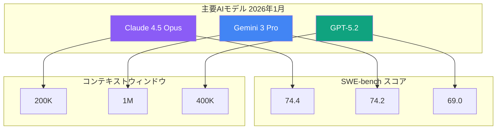
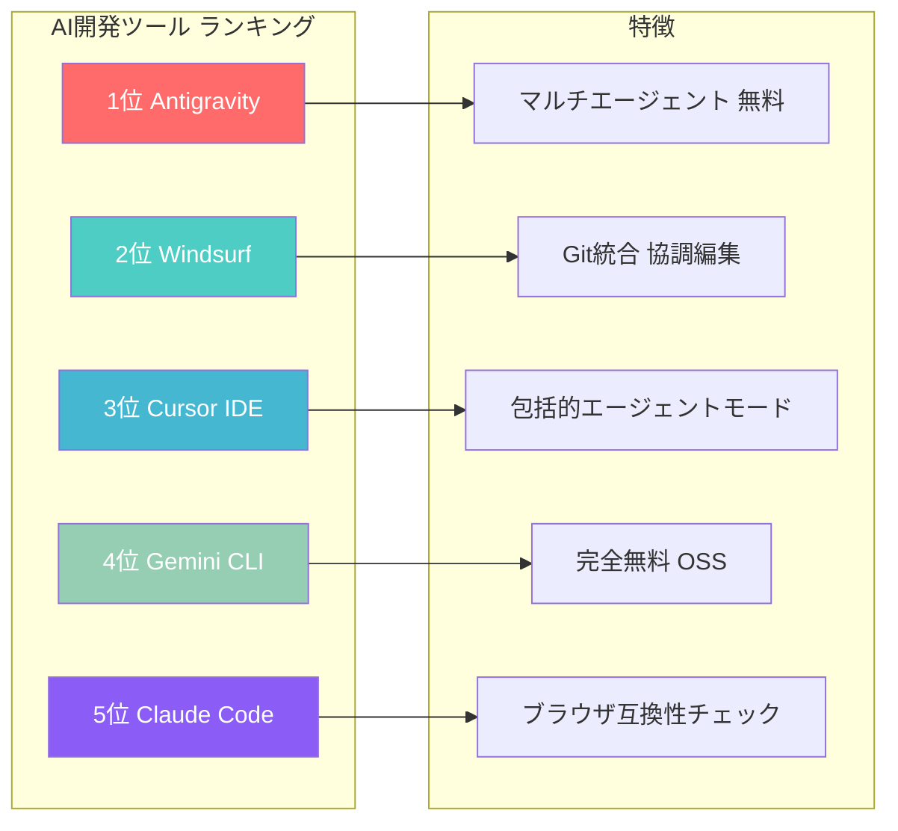
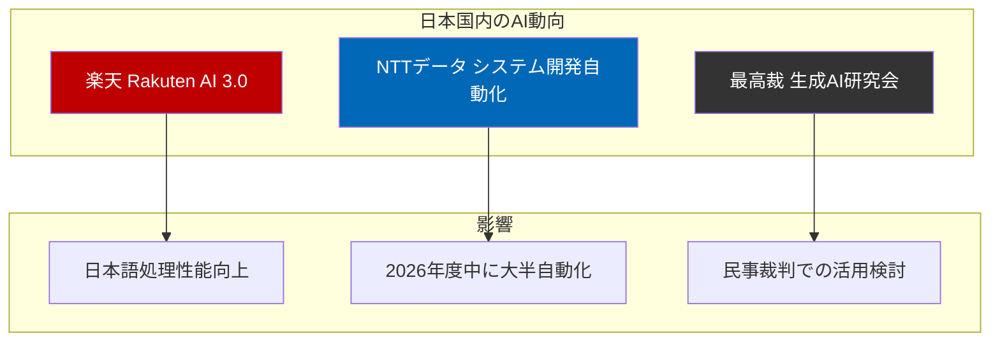

# 2026年1月 AIツール・モデル最新動向まとめ

2026年に入り、AI業界は新たな競争フェーズに突入している。Claude 4.5 Opus、GPT-5.2、Gemini 3 Proといった主要モデルが相次いでリリースされ、ベンチマークスコアで熾烈な争いを繰り広げている。本記事では、2026年1月時点での最新動向を包括的にまとめる。

## 主要AIモデルの比較

2026年1月時点での主要モデルの性能比較を以下に示す。



### Claude 4.5 Opus

2025年11月にリリースされたClaude 4.5 Opusは、SWE-benchで**74.4%**を達成し、現時点で最高性能を記録している。主な特徴は以下の通り。

- **最低ハルシネーション率**: 主要3モデルの中で最も事実誤認が少ない
- **複雑な指示への対応**: 大規模ドキュメント処理やコードレビューに最適
- **価格**: \$15/\$75（入力/出力）で最も高価だが、前バージョンより67%値下げ

### Gemini 3 Pro

Googleの最新モデルは、SWE-benchで74.2%と僅差で2位。マルチモーダル性能では他を圧倒している。

- **1Mコンテキストウィンドウ**: 業界最大
- **フルビデオ処理**: 他モデルにない独自機能
- **24言語音声入力対応**: グローバル展開に強み
- **価格**: \$1.25/\$10で優れたコストパフォーマンス

### GPT-5.2

OpenAIの最新モデルは、コーディング特化版「GPT-5.2 Codex」も同時展開している。

- **400Kコンテキスト・128K出力**: 最大の出力トークン数
- **コーディング正確性95%**: Geminiの90%を上回る
- **エンタープライズ向け**: 大規模ワークフローに最適化

## AI開発ツールのトレンド

開発者向けAIツールの競争も激化している。2026年1月時点でのランキングを見てみよう。



### Antigravity（新登場・1位）

プレビュー期間中は完全無料という大胆な戦略で市場を席巻。業界初のマルチエージェント統制機能と、Chrome統合によるブラウザ自動化が特徴である。

### Claude Code

AnthropicのCLIツールであるClaude Codeは、ターミナルに常駐してコードベース全体を理解し、自然言語でのタスク実行を可能にする。

```typescript
// Claude Codeの主要機能
interface ClaudeCodeFeatures {
  // コードベース全体の理解
  codebaseAwareness: boolean
  // マルチファイル編集
  multiFileEditing: boolean
  // Git操作の自動化
  gitWorkflow: {
    readIssues: boolean
    writeCode: boolean
    runTests: boolean
    submitPR: boolean
  }
  // IDE統合
  ideIntegration: 'VSCode' | 'Cursor' | 'Windsurf' | 'JetBrains'
  // MCP（Model Context Protocol）サポート
  mcpSupport: {
    figma: boolean
    jira: boolean
    github: boolean
    slack: boolean
  }
}
```

2026年の主要アップデートには以下が含まれる。

- **Claude Skills**: 再利用可能なプロンプトテンプレートとワークフロー
- **Haiku 4.5対応**: 計画にSonnet、実行にHaikuを使用するSonnetPlanモード
- **名前付きセッション**: `/rename`と`/resume`によるセッション管理
- **LSP機能**: 定義ジャンプと参照検索のサポート

## 市場シェアの変化

AIチャットボット市場では、大きな構造変化が起きている。

| サービス | シェア |
| -------- | ------ |
| ChatGPT  | 68%    |
| Gemini   | 18.2%  |
| Claude   | 8%     |
| その他   | 5.8%   |

Similarwebのデータによると、ChatGPTのシェアは1年前の87.2%から**68%**に低下。一方、Geminiは5.4%から**18.2%**へと急成長している。ChatGPTとGeminiの2強で86.2%を占める「デュオポリー」構造が形成されつつある。

Claudeは開発者やライターの間で「速度より精度」を重視するニッチな市場を確立している。

## 日本国内の動向

国内でも生成AI関連の動きが活発化している。



### 主なニュース

- **楽天**: GENIACプロジェクトの一環として「Rakuten AI 3.0」を発表。日本語処理性能の大幅向上が特徴
- **NTTデータ**: 2026年度中にITシステム開発の大半を生成AIで自動化する方針を発表
- **最高裁**: 生成AIの民事裁判での活用を検討する研究会を2026年1月に設置

### 課題

- Grokを用いた実在人物の画像不正加工事例が国内でも確認
- 音声生成サービス「にじボイス」が声優類似問題で2026年2月にサービス終了を発表

## 2026年の展望

2026年のAI業界は、以下の4つの軸で動くと予測されている。

1. **エージェントの実運用**: 単なるチャットボットから、実際のタスクを自律的に実行するエージェントへ
2. **学習データと著作権**: 法的整理が進み、ルールが明確化
3. **推論コストと電力制約**: 効率化と環境負荷のバランスが課題に
4. **企業ITへの組み込み**: 話題先行ではない実際の価値創出が問われる

## まとめ

2026年1月時点で、AIモデルの性能競争はClaude 4.5 OpusとGemini 3 Proの僅差のトップ争いとなっている。用途に応じた使い分けが重要で、コーディングならClaude、マルチモーダルならGemini、大規模推論ならGPT-5.2という棲み分けが進んでいる。

開発ツールでは、Antigravityの無料戦略が市場を揺さぶる一方、Claude CodeやCursor IDEなど既存ツールも着実に機能強化を続けている。

日本国内でも、楽天やNTTデータなど大手企業の取り組みが加速しており、2026年は「話題」から「実用」へとフェーズが移行する年になりそうである。

## 参考

- [LLM Updates (January 2026) – GPT, Claude, Gemini Changelog](https://llm-stats.com/llm-updates)
- [AI dev tool power rankings & comparison [Jan. 2026] - LogRocket Blog](https://blog.logrocket.com/ai-dev-tool-power-rankings/)
- [Claude Code overview - Claude Code Docs](https://code.claude.com/docs/en/overview)
- [ChatGPT ads, Claude Code, Gemini: How the AI race entered a new phase - Axios](https://www.axios.com/2026/01/17/chatgpt-ads-claude-gemini-ai-race)
- [AI Chatbot Market Share 2026 - Similarweb Analysis](https://vertu.com/lifestyle/ai-chatbot-market-share-2026-chatgpt-drops-to-68-as-google-gemini-surges-to-18-2/)
- [【2026年最新】初心者でもわかる！AIツール大全！- AIのある暮らし公式note](https://note.com/ainoarukurashi/n/n720d69b37560)
- [2025年10大AIニュースと2026年の展望 - IT navi](https://note.com/it_navi/n/n5c48911872df)
