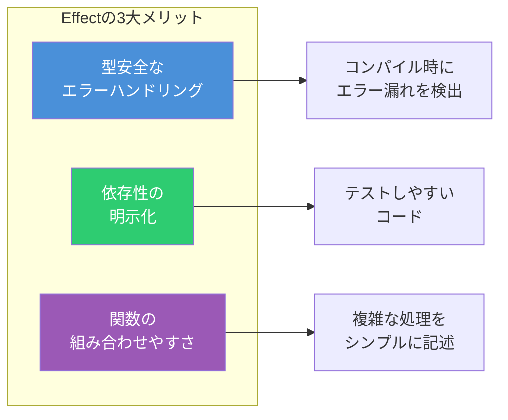
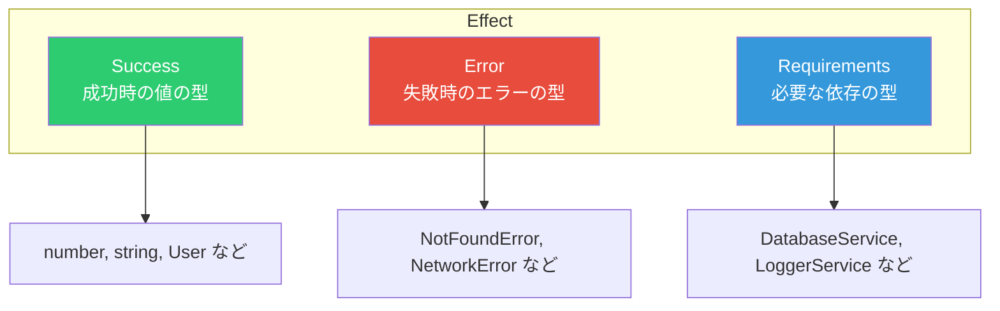
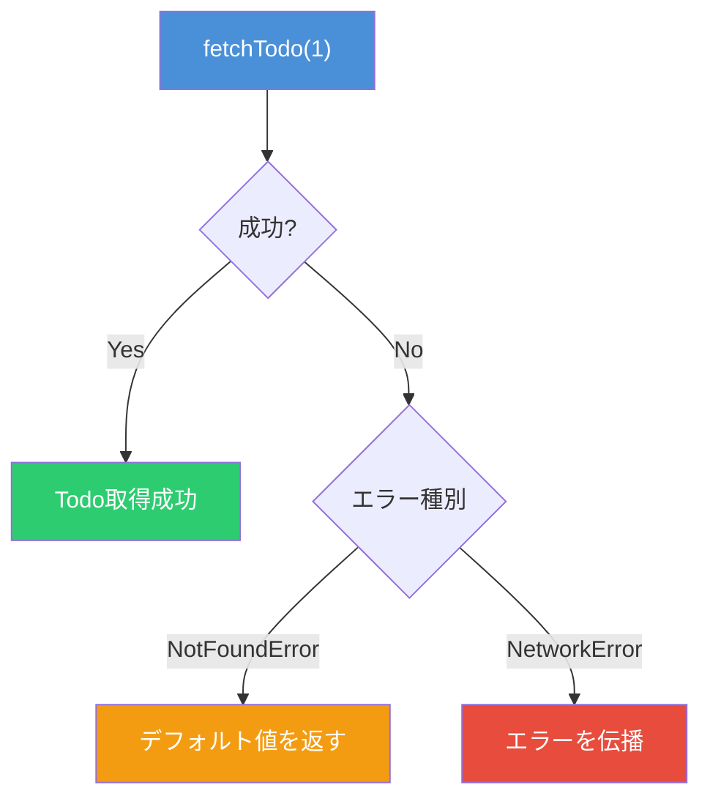
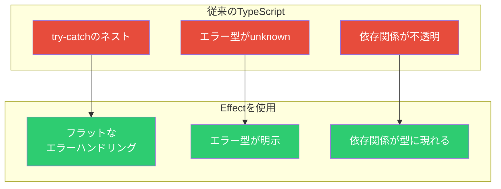

# Effect入門 - TypeScriptで型安全なエラーハンドリングを実現する

TypeScriptでアプリケーションを開発していると、エラーハンドリングや非同期処理の管理が複雑になりがちである。`try-catch`のネストが深くなったり、エラーの型が`unknown`になって何が起きるかわからなかったりする経験は、多くの開発者が持っているだろう。

[Effect](https://effect.website/)は、こうした問題を解決するTypeScriptライブラリである。「The best way to build robust apps in TypeScript」というスローガンの通り、堅牢で予測可能なコードを書くための仕組みを提供している。

## Effectを使うと何が良いのか

Effectの主なメリットは以下の3点である。



### 1. 型安全なエラーハンドリング

従来のTypeScriptでは、`catch`ブロックで受け取るエラーは`unknown`型になる。どんなエラーが発生するか、型システムでは追跡できない。

```typescript
// 従来の方法：エラーの型がわからない
async function fetchUser(id: string) {
  try {
    const response = await fetch(`/api/users/${id}`)
    if (!response.ok) {
      throw new Error('Not found')
    }
    return await response.json()
  } catch (error) {
    // errorはunknown型。何が来るかわからない
    console.error(error)
    throw error
  }
}
```

Effectでは、発生しうるエラーが型として明示される。

### 2. 依存性の明示化

外部サービスやデータベースへの依存が型に現れるため、コードを読むだけで「この関数は何に依存しているか」がわかる。テスト時にモックを注入するのも容易になる。

### 3. 関数の組み合わせやすさ

小さな関数を`pipe`で組み合わせて、複雑な処理を構築できる。各ステップが独立しているため、テストやデバッグがしやすい。

## Effect型の基本構造

Effectの中心となるのは`Effect`型である。3つの型パラメータを持つ。

```typescript
Effect<Success, Error, Requirements>
```



| パラメータ   | 説明                   | 例                                     |
| ------------ | ---------------------- | -------------------------------------- |
| Success      | 成功時に返される値の型 | `User`, `string`, `void`               |
| Error        | 発生しうるエラーの型   | `NotFoundError`, `NetworkError`        |
| Requirements | 実行に必要な依存の型   | `DatabaseService`, `never`（依存なし） |

この型シグネチャを見るだけで、「この処理は何を返すか」「どんなエラーが起きるか」「何に依存しているか」がすべてわかる。これが「予測可能なコード」の正体である。

## はじめてのEffect

### インストール

```bash
npm install effect
```

### 基本的な使い方

Effectは「遅延評価」される。つまり、Effectを作成しただけでは処理は実行されない。明示的に実行関数を呼ぶまで、処理の「設計図」として存在する。

```typescript
import { Effect } from 'effect'

// Effectを作成（まだ実行されない）
const program = Effect.succeed(42)

// 実行する
const result = Effect.runSync(program)
console.log(result) // 42
```

### 非同期処理をEffectに変換

`Effect.tryPromise`を使うと、Promiseを返す関数をEffectに変換できる。

```typescript
import { Effect } from 'effect'

type Todo = {
  userId: number
  id: number
  title: string
  completed: boolean
}

// 非同期処理をEffectに変換
const fetchTodo = (id: number): Effect.Effect<Todo, Error> =>
  Effect.tryPromise({
    try: async () => {
      const response = await fetch(`https://jsonplaceholder.typicode.com/todos/${id}`)
      if (!response.ok) {
        throw new Error(`HTTP ${response.status}`)
      }
      return (await response.json()) as Todo
    },
    catch: (reason) => new Error(`Fetch failed: ${reason}`),
  })

// 実行
const main = async () => {
  const todo = await Effect.runPromise(fetchTodo(1))
  console.log(todo.title)
}

main()
```

## 型付きエラーハンドリング

Effectの真価が発揮されるのは、エラーハンドリングである。エラーごとに型を定義し、すべてのエラーケースを網羅的に処理できる。

```typescript
import { Effect, pipe } from 'effect'

// エラー型を定義
class NotFoundError {
  readonly _tag = 'NotFoundError' as const
  constructor(readonly id: number) {}
}

class NetworkError {
  readonly _tag = 'NetworkError' as const
  constructor(readonly message: string) {}
}

type Todo = {
  id: number
  title: string
  completed: boolean
}

// 発生しうるエラーが型に現れる
const fetchTodo = (id: number): Effect.Effect<Todo, NotFoundError | NetworkError> =>
  Effect.tryPromise({
    try: async () => {
      const response = await fetch(`/api/todos/${id}`)
      if (response.status === 404) {
        throw new NotFoundError(id)
      }
      if (!response.ok) {
        throw new NetworkError(`HTTP ${response.status}`)
      }
      return (await response.json()) as Todo
    },
    catch: (error) => {
      if (error instanceof NotFoundError) return error
      return new NetworkError(String(error))
    },
  })

// catchTagsで各エラーを処理
const program = pipe(
  fetchTodo(1),
  Effect.catchTags({
    NotFoundError: ({ id }) => Effect.succeed({ id, title: 'Default', completed: false }),
    NetworkError: ({ message }) => Effect.fail(new Error(`Network issue: ${message}`)),
  }),
)
```



`_tag`プロパティによるタグ付きユニオンを使うことで、TypeScriptのコンパイラが「すべてのエラーケースを処理したか」をチェックしてくれる。エラーの処理漏れがあればコンパイルエラーになる。

## pipeによる関数合成

`pipe`を使うと、複数の処理を連結してデータを流すように記述できる。

```typescript
import { Effect, pipe } from 'effect'

const program = pipe(
  // 1. Todoを取得
  fetchTodo(1),
  // 2. タイトルを抽出
  Effect.map((todo) => todo.title),
  // 3. 大文字に変換
  Effect.map((title) => title.toUpperCase()),
  // 4. ログ出力
  Effect.tap((title) => Effect.sync(() => console.log(title))),
)
```

各ステップが独立した関数になっているため、テストや再利用がしやすい。

## 依存性注入（Context）

Effectでは、外部サービスへの依存を`Context`として明示できる。これにより、テスト時にモックを注入するのが容易になる。

```typescript
import { Effect, Context, Layer } from 'effect'

// サービスの型を定義
type UserService = {
  getUser: (id: string) => Effect.Effect<User, NotFoundError>
}

// Contextタグを作成
const UserService = Context.GenericTag<UserService>('UserService')

// サービスを使う関数
const getUserName = (id: string): Effect.Effect<string, NotFoundError, UserService> =>
  pipe(
    UserService,
    Effect.flatMap((service) => service.getUser(id)),
    Effect.map((user) => user.name),
  )

// 実際の実装
const UserServiceLive = Layer.succeed(UserService, {
  getUser: (id) =>
    Effect.tryPromise({
      try: () => fetch(`/api/users/${id}`).then((r) => r.json()),
      catch: () => new NotFoundError(id),
    }),
})

// テスト用のモック実装
const UserServiceMock = Layer.succeed(UserService, {
  getUser: (id) => Effect.succeed({ id, name: 'Test User', email: 'test@example.com' }),
})

// 実行時に依存を注入
const program = pipe(
  getUserName('user-123'),
  Effect.provide(UserServiceLive), // または UserServiceMock
)
```

`getUserName`関数のシグネチャを見ると、第3型パラメータに`UserService`があることから、「この関数はUserServiceに依存している」ことが一目でわかる。

## Effectを導入するメリットまとめ



| 観点           | 従来のTypeScript   | Effect                |
| -------------- | ------------------ | --------------------- |
| エラーの型     | `unknown`          | 明示的な型            |
| 処理漏れの検出 | 実行時             | コンパイル時          |
| 依存関係       | コード内部に隠れる | 型シグネチャに現れる  |
| テスタビリティ | モック注入が複雑   | Layerで簡単に差し替え |

## 学習リソース

Effectは機能が豊富なため、学習曲線はやや急である。しかし、TypeScriptを学んだときと同様に、基本を押さえれば段階的に使いこなせるようになる。

まずは以下の順序で学ぶことをおすすめする。

1. Effect型の基本（Success, Error, Requirements）
2. `Effect.tryPromise`による非同期処理の変換
3. `pipe`と`Effect.map`/`Effect.flatMap`
4. `catchTags`によるエラーハンドリング
5. `Context`と`Layer`による依存性注入

## まとめ

Effectは「シグネチャを見るだけで、その処理が何を返し、どんなエラーが起き、何に依存しているかがわかる」という予測可能なコードを実現するライブラリである。

従来の`try-catch`では実行時まで見えなかったエラーを、コンパイル時に検出できる。依存関係も型システムで管理できるため、テストしやすく保守性の高いコードが書ける。

すべてのプロジェクトに必要というわけではないが、エラーハンドリングが複雑になりがちな中〜大規模アプリケーションでは、導入を検討する価値がある。

## 参考

- [Effect - 公式サイト](https://effect.website/)
- [Effect Documentation - Getting Started](https://effect.website/docs/getting-started/introduction)
- [Effectを使って予測可能なコードを書こう - Zenn](https://zenn.dev/hololab/articles/e6f8828faac5ca)
- [エラーや非同期処理をより安全に扱うためのTypeScriptライブラリ Effect-TS - azukiazusa.dev](https://azukiazusa.dev/blog/typescript-library-for-safer-error-handling-and-async-operations-effect-ts/)
- [effect-ts かなり使えそう - Zenn](https://zenn.dev/shuent/articles/7d3ab3e1a204b3)
- [Effect GitHub Repository](https://github.com/Effect-TS/effect)
