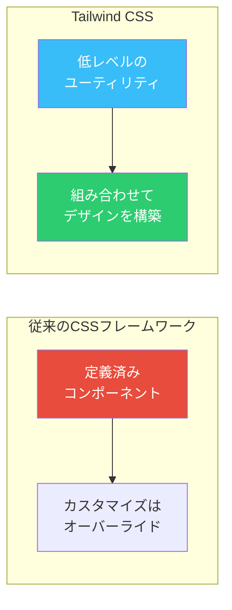
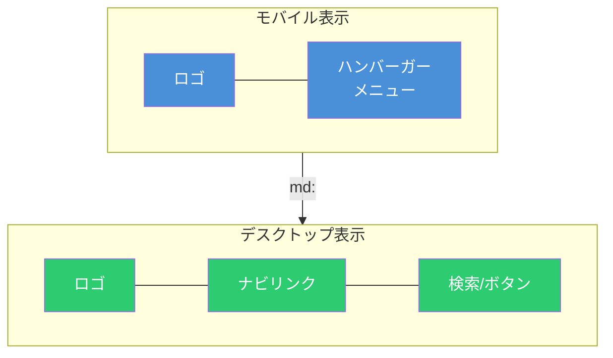
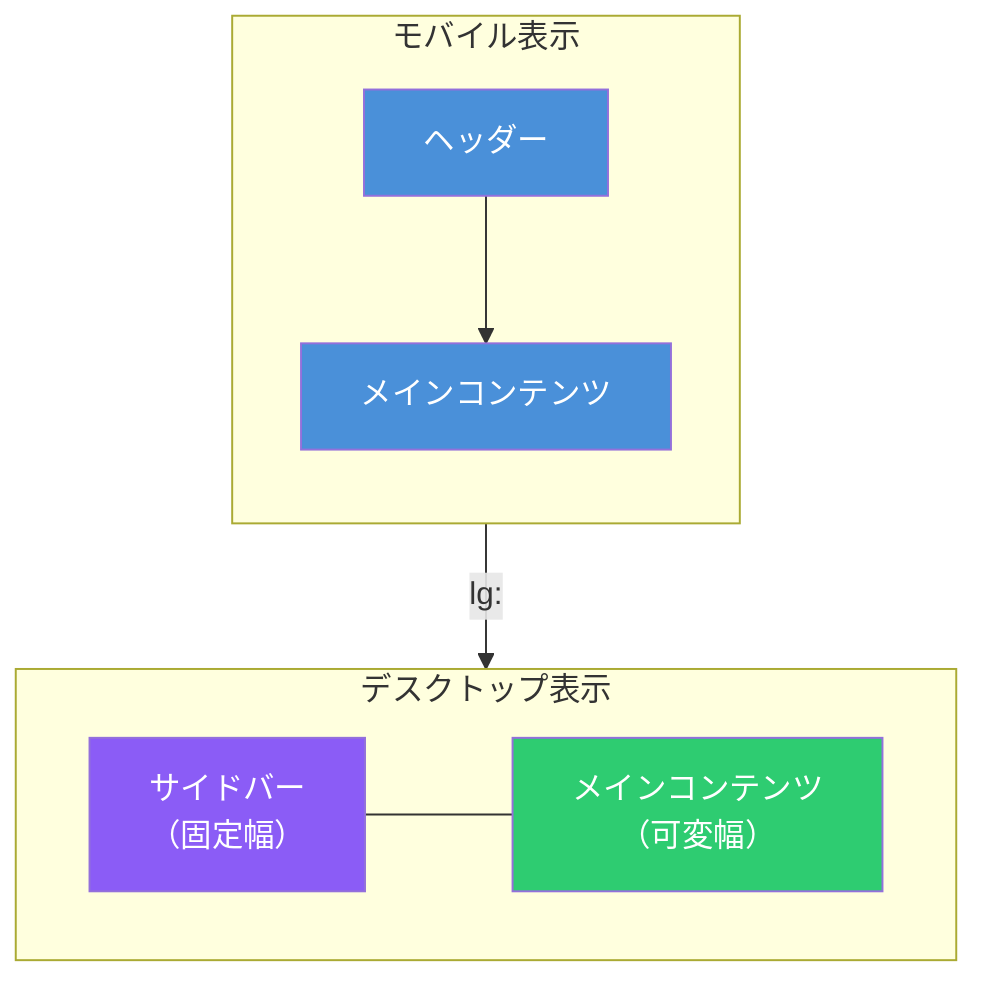

# Tailwind CSSで実装するレスポンシブレイアウト - ヘッダーとサイドバーの実践ガイド

[Tailwind CSS](https://tailwindcss.com/)は、ユーティリティファーストのCSSフレームワークである。HTMLに直接クラスを記述することで、カスタムCSSを書くことなくデザインを構築できる。本記事では、Tailwind CSSを使ったレスポンシブなヘッダーとサイドバーの実装パターンを解説する。

## Tailwind CSSの基本概念

Tailwind CSSは従来のコンポーネントベースのCSSフレームワーク（Bootstrap等）とは異なるアプローチを取る。



主な特徴は以下の通り。

| 特徴                         | 説明                                                           |
| ---------------------------- | -------------------------------------------------------------- |
| **ユーティリティファースト** | `p-4`、`text-center`など単一目的のクラスを組み合わせる         |
| **モバイルファースト**       | デフォルトがモバイル向け、`md:`や`lg:`で大画面用スタイルを追加 |
| **カスタマイズ性**           | `tailwind.config.js`でテーマを自由に拡張可能                   |
| **パフォーマンス**           | 使用されていないCSSを自動削除（PurgeCSS内蔵）                  |

## レスポンシブデザインの基本

Tailwind CSSはモバイルファーストアプローチを採用している。プレフィックスなしのクラスはすべての画面サイズに適用され、ブレークポイントプレフィックスを付けると特定の画面幅以上で適用される。

### デフォルトブレークポイント

| プレフィックス | 最小幅 | 用途                   |
| -------------- | ------ | ---------------------- |
| (なし)         | 0px    | モバイル（デフォルト） |
| `sm:`          | 640px  | 大きめのスマートフォン |
| `md:`          | 768px  | タブレット             |
| `lg:`          | 1024px | 小型デスクトップ       |
| `xl:`          | 1280px | デスクトップ           |
| `2xl:`         | 1536px | 大型モニター           |

### 基本的な使い方

```html
<!-- モバイル: 1列、タブレット以上: 3列のグリッド -->
<div class="grid grid-cols-1 md:grid-cols-3 gap-4">
  <div>Item 1</div>
  <div>Item 2</div>
  <div>Item 3</div>
</div>
```

重要なポイントとして、`sm:`は「小さい画面」ではなく「640px以上」を意味する。モバイル向けスタイルはプレフィックスなしで記述する。

```html
<!-- 正しいアプローチ -->
<div class="text-center md:text-left">
  <!-- モバイル: 中央揃え、タブレット以上: 左揃え -->
</div>

<!-- 間違いやすいパターン -->
<div class="sm:text-center">
  <!-- これは640px以上で中央揃え。モバイルでは適用されない -->
</div>
```

## レスポンシブヘッダーの実装

多くのWebサイトで見られる、モバイルでハンバーガーメニュー、デスクトップでナビゲーションリンクを表示するパターンを実装する。



### HTMLとTailwindクラス

```html
<header class="bg-white shadow-md">
  <div class="max-w-7xl mx-auto px-4 sm:px-6 lg:px-8">
    <div class="flex justify-between items-center h-16">
      <!-- ロゴ -->
      <div class="flex-shrink-0">
        <a href="/" class="text-xl font-bold text-gray-900"> Logo </a>
      </div>

      <!-- デスクトップナビゲーション（モバイルでは非表示） -->
      <nav class="hidden md:flex md:items-center md:space-x-8">
        <a href="#" class="text-gray-600 hover:text-gray-900">Home</a>
        <a href="#" class="text-gray-600 hover:text-gray-900">About</a>
        <a href="#" class="text-gray-600 hover:text-gray-900">Services</a>
        <a href="#" class="text-gray-600 hover:text-gray-900">Contact</a>
      </nav>

      <!-- デスクトップ: CTAボタン -->
      <div class="hidden md:block">
        <button class="bg-blue-600 text-white px-4 py-2 rounded-md hover:bg-blue-700">
          Sign Up
        </button>
      </div>

      <!-- モバイル: ハンバーガーボタン -->
      <button class="md:hidden p-2 rounded-md text-gray-600 hover:bg-gray-100">
        <svg class="h-6 w-6" fill="none" viewBox="0 0 24 24" stroke="currentColor">
          <path
            stroke-linecap="round"
            stroke-linejoin="round"
            stroke-width="2"
            d="M4 6h16M4 12h16M4 18h16"
          />
        </svg>
      </button>
    </div>
  </div>

  <!-- モバイルメニュー（JavaScript制御で開閉） -->
  <div class="md:hidden">
    <nav class="px-2 pt-2 pb-3 space-y-1">
      <a href="#" class="block px-3 py-2 rounded-md text-gray-600 hover:bg-gray-100">Home</a>
      <a href="#" class="block px-3 py-2 rounded-md text-gray-600 hover:bg-gray-100">About</a>
      <a href="#" class="block px-3 py-2 rounded-md text-gray-600 hover:bg-gray-100">Services</a>
      <a href="#" class="block px-3 py-2 rounded-md text-gray-600 hover:bg-gray-100">Contact</a>
    </nav>
  </div>
</header>
```

### 主要クラスの解説

| クラス                              | 役割                                  |
| ----------------------------------- | ------------------------------------- |
| `hidden md:flex`                    | モバイルで非表示、768px以上でFlex表示 |
| `md:hidden`                         | 768px以上で非表示（モバイルのみ表示） |
| `max-w-7xl mx-auto`                 | 最大幅を制限し中央配置                |
| `flex justify-between items-center` | Flexで左右に配置、垂直中央揃え        |
| `space-x-8`                         | 子要素間に水平方向の余白を追加        |

## サイドバーレイアウトの実装

管理画面やダッシュボードでよく使われる、サイドバー＋メインコンテンツのレイアウトを実装する。



### Flexboxを使ったサイドバーレイアウト

```html
<div class="min-h-screen bg-gray-100">
  <!-- サイドバー -->
  <aside
    class="fixed inset-y-0 left-0 z-50 w-64 bg-gray-800 transform -translate-x-full lg:translate-x-0 lg:static lg:inset-0 transition-transform duration-300"
  >
    <!-- サイドバーヘッダー -->
    <div class="flex items-center justify-center h-16 bg-gray-900">
      <span class="text-white text-xl font-bold">Dashboard</span>
    </div>

    <!-- ナビゲーション -->
    <nav class="mt-4">
      <a
        href="#"
        class="flex items-center px-6 py-3 text-gray-300 hover:bg-gray-700 hover:text-white"
      >
        <svg class="h-5 w-5 mr-3" fill="none" viewBox="0 0 24 24" stroke="currentColor">
          <path
            stroke-linecap="round"
            stroke-linejoin="round"
            stroke-width="2"
            d="M3 12l2-2m0 0l7-7 7 7M5 10v10a1 1 0 001 1h3m10-11l2 2m-2-2v10a1 1 0 01-1 1h-3m-6 0a1 1 0 001-1v-4a1 1 0 011-1h2a1 1 0 011 1v4a1 1 0 001 1m-6 0h6"
          />
        </svg>
        Home
      </a>
      <a
        href="#"
        class="flex items-center px-6 py-3 text-gray-300 hover:bg-gray-700 hover:text-white"
      >
        <svg class="h-5 w-5 mr-3" fill="none" viewBox="0 0 24 24" stroke="currentColor">
          <path
            stroke-linecap="round"
            stroke-linejoin="round"
            stroke-width="2"
            d="M16 7a4 4 0 11-8 0 4 4 0 018 0zM12 14a7 7 0 00-7 7h14a7 7 0 00-7-7z"
          />
        </svg>
        Users
      </a>
      <a
        href="#"
        class="flex items-center px-6 py-3 text-gray-300 hover:bg-gray-700 hover:text-white"
      >
        <svg class="h-5 w-5 mr-3" fill="none" viewBox="0 0 24 24" stroke="currentColor">
          <path
            stroke-linecap="round"
            stroke-linejoin="round"
            stroke-width="2"
            d="M10.325 4.317c.426-1.756 2.924-1.756 3.35 0a1.724 1.724 0 002.573 1.066c1.543-.94 3.31.826 2.37 2.37a1.724 1.724 0 001.065 2.572c1.756.426 1.756 2.924 0 3.35a1.724 1.724 0 00-1.066 2.573c.94 1.543-.826 3.31-2.37 2.37a1.724 1.724 0 00-2.572 1.065c-.426 1.756-2.924 1.756-3.35 0a1.724 1.724 0 00-2.573-1.066c-1.543.94-3.31-.826-2.37-2.37a1.724 1.724 0 00-1.065-2.572c-1.756-.426-1.756-2.924 0-3.35a1.724 1.724 0 001.066-2.573c-.94-1.543.826-3.31 2.37-2.37.996.608 2.296.07 2.572-1.065z"
          />
          <path
            stroke-linecap="round"
            stroke-linejoin="round"
            stroke-width="2"
            d="M15 12a3 3 0 11-6 0 3 3 0 016 0z"
          />
        </svg>
        Settings
      </a>
    </nav>
  </aside>

  <!-- メインコンテンツ -->
  <div class="lg:ml-64">
    <!-- トップバー（モバイル用） -->
    <header class="lg:hidden bg-white shadow-sm">
      <div class="flex items-center justify-between h-16 px-4">
        <button class="p-2 rounded-md text-gray-600 hover:bg-gray-100">
          <svg class="h-6 w-6" fill="none" viewBox="0 0 24 24" stroke="currentColor">
            <path
              stroke-linecap="round"
              stroke-linejoin="round"
              stroke-width="2"
              d="M4 6h16M4 12h16M4 18h16"
            />
          </svg>
        </button>
        <span class="text-lg font-semibold">Dashboard</span>
        <div class="w-10"></div>
      </div>
    </header>

    <!-- コンテンツエリア -->
    <main class="p-6">
      <h1 class="text-2xl font-bold text-gray-900 mb-6">Dashboard</h1>
      <div class="grid grid-cols-1 md:grid-cols-2 lg:grid-cols-3 gap-6">
        <!-- カード -->
        <div class="bg-white rounded-lg shadow p-6">
          <h3 class="text-lg font-semibold text-gray-900">Total Users</h3>
          <p class="text-3xl font-bold text-blue-600 mt-2">1,234</p>
        </div>
        <div class="bg-white rounded-lg shadow p-6">
          <h3 class="text-lg font-semibold text-gray-900">Revenue</h3>
          <p class="text-3xl font-bold text-green-600 mt-2">$45,678</p>
        </div>
        <div class="bg-white rounded-lg shadow p-6">
          <h3 class="text-lg font-semibold text-gray-900">Orders</h3>
          <p class="text-3xl font-bold text-purple-600 mt-2">567</p>
        </div>
      </div>
    </main>
  </div>
</div>
```

### サイドバーのレスポンシブ制御

| クラス                   | 説明                                       |
| ------------------------ | ------------------------------------------ |
| `fixed inset-y-0 left-0` | モバイルで画面左端に固定配置               |
| `-translate-x-full`      | 画面外に隠す（モバイルのデフォルト）       |
| `lg:translate-x-0`       | 大画面で表示位置に移動                     |
| `lg:static`              | 大画面では通常のフローに戻す               |
| `lg:ml-64`               | メインコンテンツにサイドバー幅分のマージン |

## Gridを使ったレイアウト

CSS Gridを使うと、より複雑なレイアウトも簡潔に記述できる。

### レスポンシブグリッドの基本

```html
<!-- 1列 → 2列 → 4列のレスポンシブグリッド -->
<div class="grid grid-cols-1 sm:grid-cols-2 lg:grid-cols-4 gap-4">
  <div class="bg-white p-4 rounded shadow">Item 1</div>
  <div class="bg-white p-4 rounded shadow">Item 2</div>
  <div class="bg-white p-4 rounded shadow">Item 3</div>
  <div class="bg-white p-4 rounded shadow">Item 4</div>
</div>
```

### 12カラムグリッドレイアウト

```html
<div class="grid grid-cols-12 gap-4">
  <!-- サイドバー: 3カラム（モバイルでフル幅） -->
  <aside class="col-span-12 lg:col-span-3 bg-gray-100 p-4 rounded">Sidebar</aside>
  <!-- メインコンテンツ: 9カラム（モバイルでフル幅） -->
  <main class="col-span-12 lg:col-span-9 bg-white p-4 rounded shadow">Main Content</main>
</div>
```

## Container Queries

Tailwind CSS v3.2以降では、ビューポートではなく**親要素のサイズ**に基づいてスタイルを適用するContainer Queriesがサポートされている。

```html
<!-- 親コンテナを定義 -->
<div class="@container">
  <!-- コンテナサイズに応じてレイアウト変更 -->
  <div class="flex flex-col @md:flex-row gap-4">
    
    <div>
      <h3 class="text-lg font-bold">Title</h3>
      <p class="text-gray-600">Description...</p>
    </div>
  </div>
</div>
```

Container Queriesはコンポーネントの再利用性を高める。親コンテナのサイズに応じてスタイルが変わるため、同じコンポーネントをサイドバーとメインコンテンツの両方で使用できる。

## ベストプラクティス

### 1. モバイルファーストで設計する

```html
<!-- 推奨: モバイルから設計 -->
<div class="p-4 md:p-6 lg:p-8">
  <!-- 避ける: デスクトップから設計 -->
  <div class="p-8 sm:p-6 md:p-4"></div>
</div>
```

### 2. ブレークポイント範囲の活用

特定の画面幅の範囲のみにスタイルを適用したい場合は、`max-*`バリアントを使用する。

```html
<!-- mdからlgの間だけフレックス配置 -->
<div class="md:max-lg:flex">
  <!-- ... -->
</div>
```

### 3. カスタムブレークポイントの定義

プロジェクト固有のブレークポイントが必要な場合は、`tailwind.config.js`で定義する。

```js
// tailwind.config.js
module.exports = {
  theme: {
    screens: {
      xs: '475px',
      sm: '640px',
      md: '768px',
      lg: '1024px',
      xl: '1280px',
      '2xl': '1536px',
      '3xl': '1920px',
    },
  },
}
```

### 4. 任意の値の使用

ワンオフのブレークポイントが必要な場合は、角括弧記法を使用する。

```html
<div class="min-[320px]:text-center max-[600px]:bg-sky-300">
  <!-- 320px以上で中央揃え、600px未満で背景色 -->
</div>
```

## まとめ

Tailwind CSSのレスポンシブデザイン機能を活用することで、複雑なメディアクエリを書くことなく、直感的でメンテナンス性の高いUIを構築できる。

主なポイントは以下の通り。

- **モバイルファースト**: プレフィックスなしがモバイル、`md:`や`lg:`で大画面用スタイルを追加
- **Flexbox**: `flex`、`justify-between`、`items-center`でヘッダーやナビゲーションを構築
- **Grid**: `grid-cols-*`でカード配置や12カラムレイアウトを実現
- **表示切替**: `hidden md:block`と`md:hidden`でレスポンシブな表示制御
- **Container Queries**: 再利用可能なコンポーネント設計に有効

ユーティリティクラスの組み合わせでほとんどのレイアウトパターンが実現できるため、まずは公式ドキュメントのユーティリティリファレンスを確認しながら実装を進めることを推奨する。

## 参考

- [Tailwind CSS - 公式ドキュメント](https://tailwindcss.com/docs)
- [Responsive Design - Tailwind CSS](https://tailwindcss.com/docs/responsive-design)
- [Flex - Tailwind CSS](https://tailwindcss.com/docs/flex)
- [Grid Template Columns - Tailwind CSS](https://tailwindcss.com/docs/grid-template-columns)
- [Container Queries - Tailwind CSS](https://tailwindcss.com/docs/container-queries)
- [Tailwind CSS Cheat Sheet](https://nerdcave.com/tailwind-cheat-sheet)
