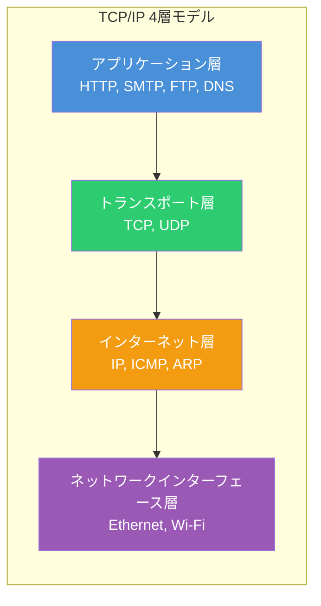
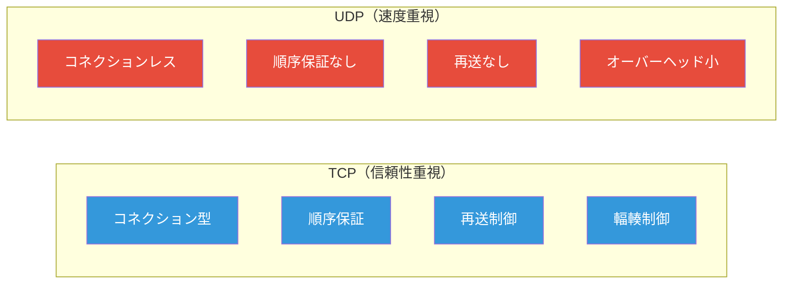
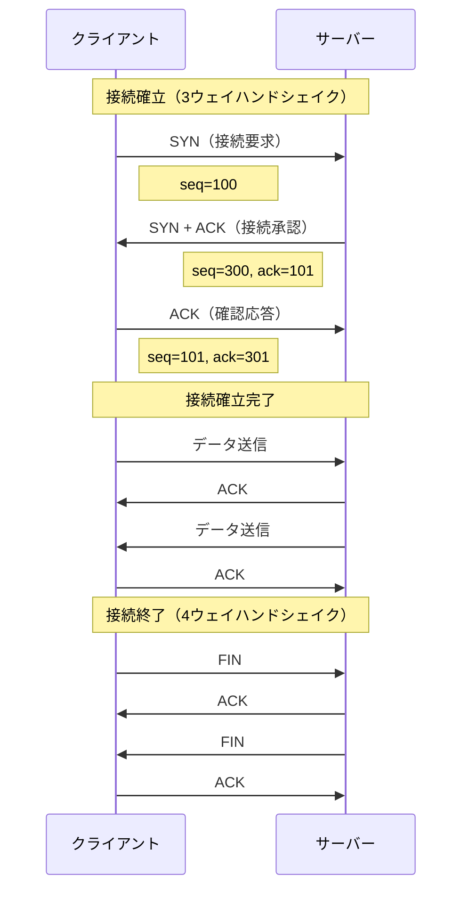
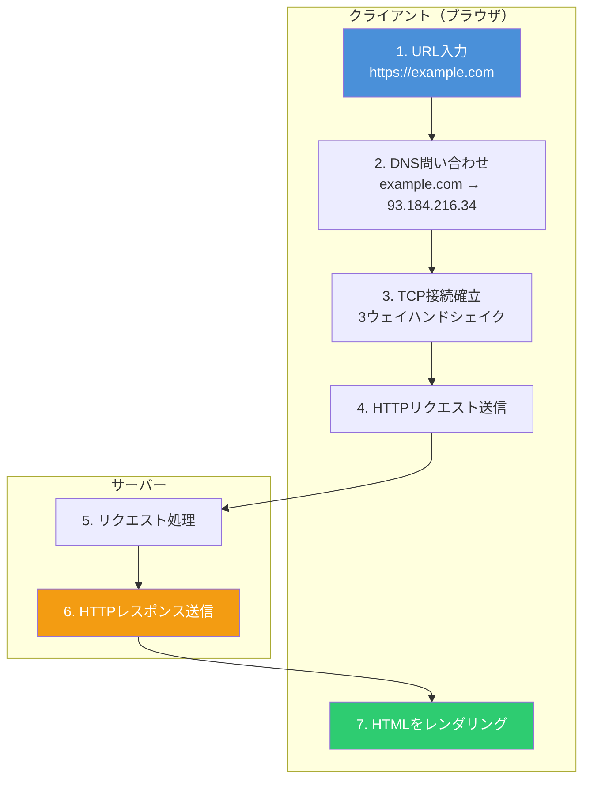

# TCP/IP入門 - インターネット通信の基礎を理解する

TCP/IP（Transmission Control Protocol / Internet Protocol）は、インターネット通信の基盤となるプロトコル群である。Webブラウジング、メール送信、動画ストリーミングなど、あらゆるインターネット通信はTCP/IPを使用している。本記事では、TCP/IPの基本概念を初心者にもわかりやすく解説する。

## TCP/IPとは

TCP/IPは、コンピュータ同士がネットワーク上でデータをやり取りするための「通信規約（プロトコル）」の集まりである。1970年代にアメリカ国防総省のARPANET向けに開発され、現在のインターネットの標準プロトコルとなった。

「TCP/IP」という名前は、主要な2つのプロトコルを組み合わせたものである。

| プロトコル | 役割                                             |
| ---------- | ------------------------------------------------ |
| **TCP**    | データを確実に届けるための仕組み（信頼性の確保） |
| **IP**     | データを宛先に届けるための仕組み（経路制御）     |

## TCP/IP 4層モデル

TCP/IPは4つの層（レイヤー）で構成されている。各層が特定の役割を担い、上位層から下位層へとデータを渡していく。



### 各層の役割

#### 1. アプリケーション層

ユーザーが直接利用するアプリケーションのためのプロトコルを提供する層である。

| プロトコル | ポート番号 | 用途                   |
| ---------- | ---------- | ---------------------- |
| HTTP/HTTPS | 80/443     | Webページの閲覧        |
| SMTP       | 25         | メール送信             |
| DNS        | 53         | ドメイン名の解決       |
| FTP        | 20/21      | ファイル転送           |
| SSH        | 22         | セキュアなリモート接続 |

#### 2. トランスポート層

エンドツーエンドの通信を管理する層である。TCPとUDPの2つのプロトコルがある。

#### 3. インターネット層

IPアドレスを使ってデータを宛先まで届ける層である。ルーターがこの層で動作し、最適な経路を選択する。

#### 4. ネットワークインターフェース層

物理的なネットワーク機器（LANケーブル、Wi-Fi）を使ってデータを送受信する層である。MACアドレスを使用する。

## TCPとUDPの違い

トランスポート層には、TCPとUDPという2つのプロトコルがある。用途に応じて使い分ける。



| 特徴   | TCP                              | UDP                          |
| ------ | -------------------------------- | ---------------------------- |
| 接続   | コネクション型（事前に接続確立） | コネクションレス（接続不要） |
| 信頼性 | 高い（到達確認、再送あり）       | 低い（送りっぱなし）         |
| 順序   | 保証される                       | 保証されない                 |
| 速度   | 遅い（オーバーヘッドあり）       | 速い（軽量）                 |
| 用途   | Web、メール、ファイル転送        | 動画配信、ゲーム、DNS        |

## 3ウェイハンドシェイク

TCPでは、データ送信前に「3ウェイハンドシェイク」と呼ばれる接続確立手順を行う。これにより、双方が通信可能な状態であることを確認する。



### 3ウェイハンドシェイクの流れ

1. **SYN**: クライアントが「接続したい」とサーバーに要求
2. **SYN+ACK**: サーバーが「OK、こちらも接続したい」と応答
3. **ACK**: クライアントが「了解」と確認

この3回のやり取りにより、双方向の通信経路が確立される。

## IPアドレスとポート番号

ネットワーク上で通信相手を特定するために、**IPアドレス**と**ポート番号**を使用する。

### IPアドレス

IPアドレスは、ネットワーク上の機器を識別する「住所」のようなものである。

```
IPv4: 192.168.1.100（32ビット、約43億通り）
IPv6: 2001:0db8:85a3:0000:0000:8a2e:0370:7334（128ビット）
```

### ポート番号

ポート番号は、同じIPアドレスを持つ機器内で、どのアプリケーションに通信するかを指定する「部屋番号」である。

```
192.168.1.100:80   → Webサーバー（HTTP）
192.168.1.100:443  → Webサーバー（HTTPS）
192.168.1.100:22   → SSHサーバー
```

ポート番号は0〜65535の範囲で、以下のように分類される。

| 範囲         | 名称               | 用途                            |
| ------------ | ------------------ | ------------------------------- |
| 0〜1023      | ウェルノウンポート | 標準的なサービス（HTTP, SSH等） |
| 1024〜49151  | 登録済みポート     | 特定のアプリケーション          |
| 49152〜65535 | 動的ポート         | 一時的な通信用                  |

## 実際の通信の流れ

Webページにアクセスする際の通信の流れを追ってみよう。



## Node.jsでのTCPサーバー例

実際にTCPサーバーとクライアントを作成して、通信を体験してみよう。

### TCPサーバー

```typescript
import { createServer } from 'net'

const server = createServer((socket) => {
  console.log('クライアントが接続しました')

  socket.on('data', (data) => {
    console.log(`受信: ${data.toString()}`)
    socket.write(`サーバーからの応答: ${data.toString().toUpperCase()}`)
  })

  socket.on('close', () => {
    console.log('クライアントが切断しました')
  })
})

server.listen(3000, () => {
  console.log('TCPサーバーがポート3000で起動しました')
})
```

### TCPクライアント

```typescript
import { createConnection } from 'net'

const client = createConnection({ port: 3000 }, () => {
  console.log('サーバーに接続しました')
  client.write('hello tcp')
})

client.on('data', (data) => {
  console.log(`受信: ${data.toString()}`)
  client.end()
})

client.on('close', () => {
  console.log('接続を終了しました')
})
```

### 実行結果

```bash
# サーバー側
$ node server.js
TCPサーバーがポート3000で起動しました
クライアントが接続しました
受信: hello tcp
クライアントが切断しました

# クライアント側
$ node client.js
サーバーに接続しました
受信: サーバーからの応答: HELLO TCP
接続を終了しました
```

## ネットワークコマンドで確認

TCP/IPの動作は、コマンドラインツールで確認できる。

```bash
# IPアドレスの確認
$ ip addr  # Linux
$ ipconfig # Windows

# ネットワーク接続の確認
$ ping example.com

# 経路の確認
$ traceroute example.com  # Linux/Mac
$ tracert example.com     # Windows

# TCP接続状態の確認
$ netstat -an | grep ESTABLISHED

# DNS問い合わせ
$ nslookup example.com
$ dig example.com
```

## まとめ

TCP/IPはインターネット通信の基盤となるプロトコル群であり、以下のポイントを押さえておくことが重要である。

- **4層モデル**: アプリケーション層、トランスポート層、インターネット層、ネットワークインターフェース層
- **TCP**: 信頼性重視（Web、メール向け）、3ウェイハンドシェイクで接続確立
- **UDP**: 速度重視（動画配信、ゲーム向け）、コネクションレス
- **IPアドレス**: ネットワーク上の機器を識別する住所
- **ポート番号**: 機器内のアプリケーションを識別する部屋番号

TCP/IPの理解は、Webアプリケーション開発、ネットワーク設計、トラブルシューティングなど、あらゆる場面で役立つ基礎知識である。

## 参考

- [RFC 793 - Transmission Control Protocol](https://datatracker.ietf.org/doc/html/rfc793)
- [RFC 791 - Internet Protocol](https://datatracker.ietf.org/doc/html/rfc791)
- [TCP/IP | MDN Web Docs](https://developer.mozilla.org/ja/docs/Glossary/TCP)
- [インターネットのしくみ - 総務省](https://www.soumu.go.jp/main_sosiki/joho_tsusin/security/basic/service/01.html)
