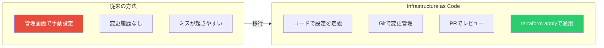
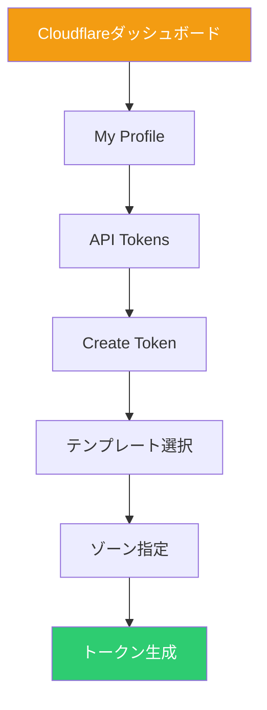
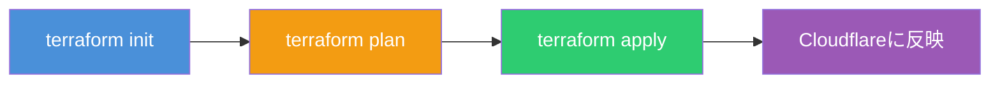

# TerraformでCloudflareを管理する - Infrastructure as Codeの実践

Terraformは、HashiCorpが開発したInfrastructure as Code（IaC）ツールである。Cloudflareと組み合わせることで、DNSレコード、ゾーン設定、ページルールなどをコードで管理できる。本記事では、最小限の構成でTerraformとCloudflareを使い始める方法を解説する。

## なぜTerraformでCloudflareを管理するのか

従来のWeb管理画面での設定には、以下の課題がある。

- **変更履歴が追えない**: 誰がいつ何を変更したかわからない
- **再現性がない**: 同じ設定を別環境に適用するのが手間
- **レビューができない**: 設定変更前にチームでレビューできない

Terraformを使うことで、これらの課題を解決できる。



## 前提条件

本記事を進めるには、以下が必要である。

- Terraformがインストールされていること
- Cloudflareアカウントがあること
- 管理対象のドメインがCloudflareに登録されていること

### Terraformのインストール

```bash
# macOS (Homebrew)
brew install terraform

# Ubuntu/Debian
sudo apt-get update && sudo apt-get install -y gnupg software-properties-common
wget -O- https://apt.releases.hashicorp.com/gpg | gpg --dearmor | sudo tee /usr/share/keyrings/hashicorp-archive-keyring.gpg
echo "deb [signed-by=/usr/share/keyrings/hashicorp-archive-keyring.gpg] https://apt.releases.hashicorp.com $(lsb_release -cs) main" | sudo tee /etc/apt/sources.list.d/hashicorp.list
sudo apt update && sudo apt install terraform

# バージョン確認
terraform version
```

## Cloudflare APIトークンの作成

Cloudflareの管理画面からAPIトークンを作成する。

1. [Cloudflareダッシュボード](https://dash.cloudflare.com/)にログイン
2. 右上のプロフィールアイコン → 「My Profile」
3. 左メニューの「API Tokens」
4. 「Create Token」をクリック
5. 「Edit zone DNS」テンプレートを選択
6. 必要なゾーンを指定してトークンを生成



生成されたトークンは環境変数に設定する。

```bash
export CLOUDFLARE_API_TOKEN="your-api-token-here"
```

## 最小構成のTerraform設定

### ディレクトリ構成

```
cloudflare-terraform/
├── main.tf        # メインの設定ファイル
├── variables.tf   # 変数定義
└── terraform.tfvars # 変数の値（gitignore推奨）
```

### main.tf

```hcl
terraform {
  required_providers {
    cloudflare = {
      source  = "cloudflare/cloudflare"
      version = "~> 4.0"
    }
  }
  required_version = ">= 1.0"
}

provider "cloudflare" {
  # 環境変数 CLOUDFLARE_API_TOKEN を自動で参照
}

# DNSレコードの作成
resource "cloudflare_record" "www" {
  zone_id = var.zone_id
  name    = "www"
  content = var.server_ip
  type    = "A"
  proxied = true
  ttl     = 1 # proxied=true の場合は自動設定
}
```

### variables.tf

```hcl
variable "zone_id" {
  description = "Cloudflare Zone ID"
  type        = string
}

variable "server_ip" {
  description = "Origin server IP address"
  type        = string
}

variable "domain" {
  description = "Domain name"
  type        = string
}
```

### terraform.tfvars

```hcl
zone_id   = "your-zone-id-here"
server_ip = "203.0.113.10"
domain    = "example.com"
```

## Terraformの実行

### 初期化

```bash
terraform init
```

このコマンドで、Cloudflareプロバイダがダウンロードされる。

### 実行計画の確認

```bash
terraform plan
```

出力例：

```
Terraform will perform the following actions:

  # cloudflare_record.www will be created
  + resource "cloudflare_record" "www" {
      + content = "203.0.113.10"
      + name    = "www"
      + proxied = true
      + ttl     = 1
      + type    = "A"
      + zone_id = "your-zone-id"
    }

Plan: 1 to add, 0 to change, 0 to destroy.
```

### 適用

```bash
terraform apply
```

確認プロンプトで `yes` と入力すると、実際にCloudflareにDNSレコードが作成される。



## 複数のDNSレコードを管理する

実際のプロジェクトでは、複数のDNSレコードを管理することが多い。`for_each`を使うと効率的に管理できる。

```hcl
locals {
  dns_records = {
    www = {
      type    = "A"
      content = "203.0.113.10"
      proxied = true
    }
    api = {
      type    = "A"
      content = "203.0.113.20"
      proxied = true
    }
    mail = {
      type    = "MX"
      content = "mail.example.com"
      proxied = false
      priority = 10
    }
  }
}

resource "cloudflare_record" "records" {
  for_each = local.dns_records

  zone_id  = var.zone_id
  name     = each.key
  type     = each.value.type
  content  = each.value.content
  proxied  = each.value.proxied
  ttl      = each.value.proxied ? 1 : 3600
  priority = lookup(each.value, "priority", null)
}
```

## ゾーン設定の管理

DNSレコードだけでなく、ゾーン全体の設定もTerraformで管理できる。

```hcl
# SSL/TLS設定
resource "cloudflare_zone_settings_override" "settings" {
  zone_id = var.zone_id

  settings {
    ssl                      = "strict"
    always_use_https         = "on"
    min_tls_version          = "1.2"
    automatic_https_rewrites = "on"
    security_header {
      enabled            = true
      include_subdomains = true
      max_age            = 31536000
      preload            = true
    }
  }
}
```

## 状態管理のベストプラクティス

Terraformの状態ファイル（`terraform.tfstate`）には、機密情報が含まれる可能性がある。本番環境では、リモートバックエンドを使用することを推奨する。

```hcl
terraform {
  backend "s3" {
    bucket = "my-terraform-state"
    key    = "cloudflare/terraform.tfstate"
    region = "ap-northeast-1"
  }
}
```

また、以下のファイルは必ず`.gitignore`に追加する。

```gitignore
# Terraform
*.tfstate
*.tfstate.*
.terraform/
terraform.tfvars
*.auto.tfvars
```

## まとめ

TerraformとCloudflareを組み合わせることで、インフラ設定をコードとして管理できる。最小限の構成から始め、徐々に管理対象を増やしていくことをおすすめする。

| 項目         | 内容                                |
| ------------ | ----------------------------------- |
| プロバイダ   | `cloudflare/cloudflare`             |
| 認証         | 環境変数 `CLOUDFLARE_API_TOKEN`     |
| 基本リソース | `cloudflare_record`（DNSレコード）  |
| 設定管理     | `cloudflare_zone_settings_override` |

Infrastructure as Codeの導入により、設定変更の追跡、レビュープロセス、再現性のある環境構築が実現できる。

## 参考

- [Terraform公式ドキュメント](https://developer.hashicorp.com/terraform)
- [Cloudflare Terraform Provider](https://registry.terraform.io/providers/cloudflare/cloudflare/latest/docs)
- [Cloudflare Terraform Tutorial](https://developers.cloudflare.com/terraform/tutorial/)
- [Getting started with Terraform and Cloudflare](https://blog.cloudflare.com/getting-started-with-terraform-and-cloudflare-part-1/)
