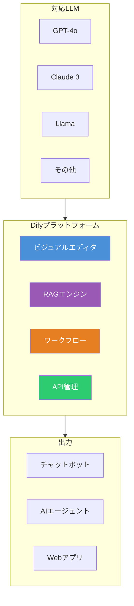
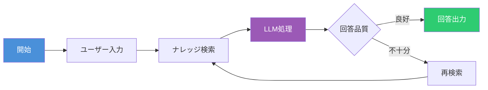
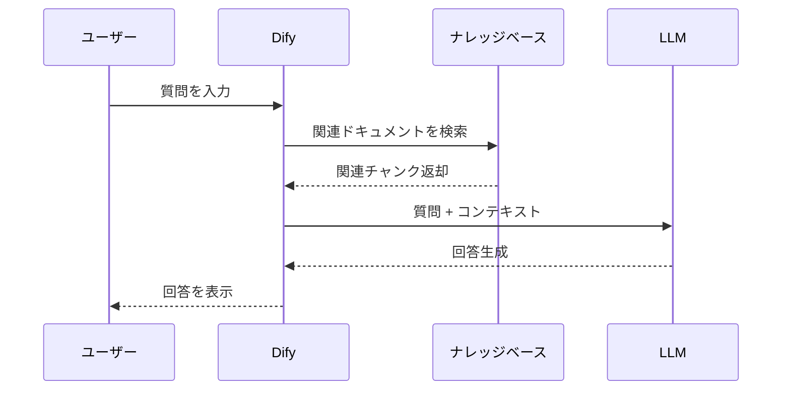
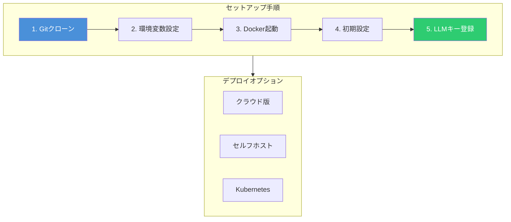

# Dify入門 - ノーコードでAIアプリを開発できるプラットフォーム

Dify（ディファイ）は、プログラミングの知識がなくてもAIアプリケーションを開発できるオープンソースのプラットフォームである。ChatGPT、Claude、Llamaなどの大規模言語モデル（LLM）を活用したアプリを、ドラッグ＆ドロップの直感的な操作で構築できる。

## Difyとは何か

Difyは「Do It For You」の略で、LLMOps（Large Language Model Operations）プラットフォームとして設計されている。2023年にLangGenius社によってリリースされ、GitHubで11万以上のスターを獲得している人気プロジェクトである。



## 主要な機能

### 1. ビジュアルワークフロー構築

Difyの最大の特徴は、コードを書かずにAIワークフローを構築できる点である。キャンバス上にノードを配置し、線でつなぐだけで複雑な処理フローを作成できる。

主なノードタイプ：

| ノード           | 説明                 |
| ---------------- | -------------------- |
| **LLM**          | 言語モデルを呼び出す |
| **Knowledge**    | RAGで知識を検索      |
| **Code**         | Pythonコードを実行   |
| **HTTP Request** | 外部APIを呼び出す    |
| **Condition**    | 条件分岐を行う       |
| **Variable**     | 変数を操作する       |



### 2. RAG（検索拡張生成）

RAG（Retrieval-Augmented Generation）は、外部の知識ベースから関連情報を検索し、LLMの回答精度を向上させる技術である。Difyでは、PDFやテキストファイルをアップロードするだけでRAGを構築できる。



RAGの設定項目：

- **チャンクサイズ**: ドキュメントを分割する単位（500〜1000トークン推奨）
- **Top-K**: 検索結果の上位何件を使用するか
- **スコア閾値**: 関連度の下限値
- **リランキング**: 検索結果の並び替え

### 3. 複数LLMへの対応

DifyはマルチLLMに対応しており、用途に応じて最適なモデルを選択できる。

| モデル       | 特徴                   | 用途                 |
| ------------ | ---------------------- | -------------------- |
| **GPT-4o**   | 高精度、マルチモーダル | 複雑な推論、画像理解 |
| **Claude 3** | 長文コンテキスト       | 大量文書の処理       |
| **Llama 3**  | オープンソース         | オンプレミス運用     |
| **Gemini**   | Google製               | Google連携           |

### 4. エージェント機能

2025年のアップデートで追加されたエージェントノードにより、AIが自律的にタスクを実行できるようになった。ツールを組み合わせて複雑な作業を自動化できる。

## Difyでできること

### チャットボット開発

社内FAQやカスタマーサポート向けのチャットボットを数時間で構築できる。自社のマニュアルやドキュメントを読み込ませることで、専門知識を持ったボットを作成可能。

### 業務自動化ワークフロー

- 議事録の自動作成と要約
- メールの下書き生成
- レポートの自動作成
- 多言語翻訳

### データ分析アプリ

CSVやデータベースと連携し、自然言語でデータ分析を行うアプリケーションを構築できる。

## セットアップ方法

Difyには2つの利用方法がある。

### クラウド版

公式サイト（https://dify.ai）でアカウントを作成するだけで、すぐに利用開始できる。無料プランでは月200メッセージまで利用可能。

### セルフホスト版

Dockerを使って自社サーバーに構築する場合：

```bash
# リポジトリをクローン
git clone https://github.com/langgenius/dify.git

# Dockerディレクトリに移動
cd dify/docker

# 環境変数ファイルをコピー
cp .env.example .env

# Docker Composeで起動
docker compose up -d
```

起動後、`http://localhost/install`にアクセスして初期設定を行う。



## 導入事例

### リンクアンドモチベーション社

従来1.5ヶ月かかっていた開発が1週間に短縮。4ヶ月で約100種類のAIツールを開発し、年間9,000時間の業務削減を達成した。

### 東京都

GovTech東京が中心となり、37の区市町村で生成AI活用支援にDifyを採用している。

## まとめ

Difyは、AIアプリケーション開発の敷居を大幅に下げるプラットフォームである。主な特徴をまとめると：

- **ノーコード**: プログラミング不要でAIアプリを構築
- **RAG対応**: 自社データを活用した高精度な回答
- **マルチLLM**: 用途に応じたモデル選択
- **オープンソース**: セルフホストで無料利用可能
- **日本語対応**: 管理画面が日本語化済み

AIを活用した業務改善を検討している企業や個人にとって、Difyは有力な選択肢となる。まずはクラウド版の無料プランで試してみることをおすすめする。

## 参考

- [Dify公式サイト](https://dify.ai/jp)
- [Dify公式ドキュメント](https://docs.dify.ai/)
- [GitHub - langgenius/dify](https://github.com/langgenius/dify)
- [【2025年最新版】Difyとは？ - ノーコード総合研究所](https://nocoderi.co.jp/2025/04/02/what_is_dify/)
- [Difyでできることとは？特徴と使い方・活用例 - ZEAL DATA TIMES](https://www.zdh.co.jp/bi-online/dify/)
