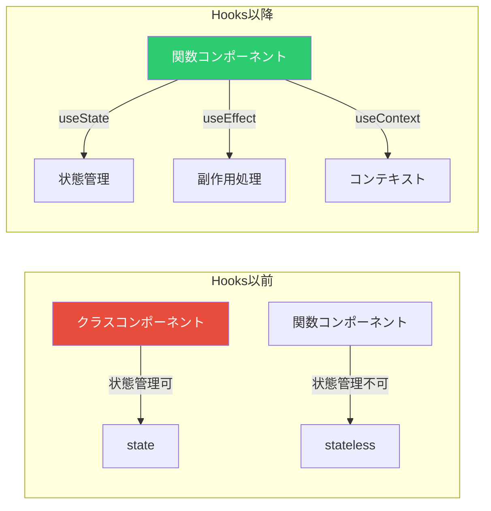
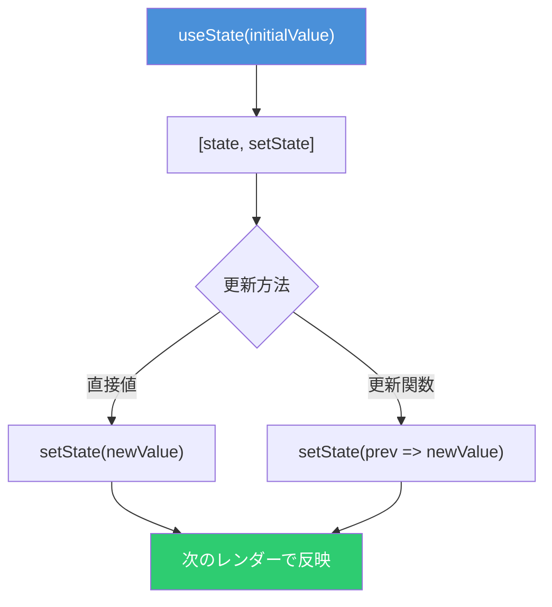
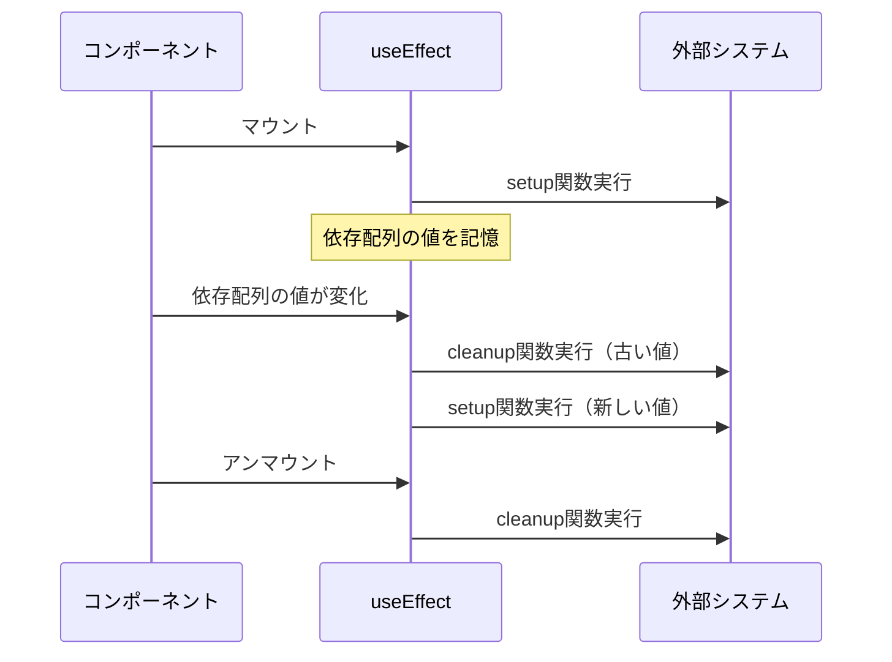
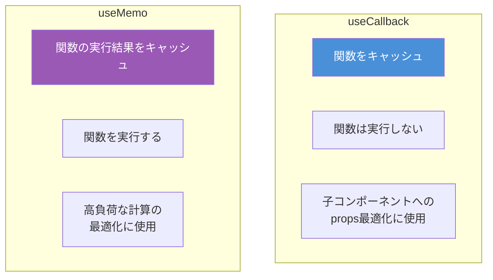
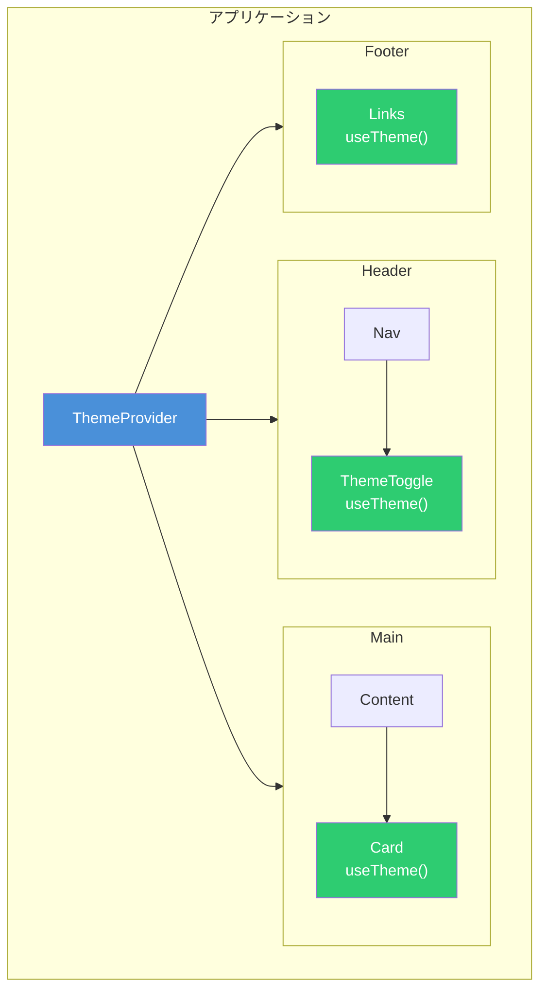

# React Hooks入門 - 関数コンポーネントで状態管理を実現する

React Hooksは、React 16.8で導入された機能で、クラスコンポーネントを書かずに状態管理や副作用処理を行えるようにする。関数コンポーネントにReactの機能を「フック」することから、この名前が付けられた。

## Hooksとは何か

Hooksが登場する前、Reactで状態を持つコンポーネントを作るにはクラスコンポーネントを使う必要があった。Hooksにより、関数コンポーネントでも同等の機能を実現できるようになり、コードがシンプルで再利用しやすくなった。



## Hooksの分類

React v19では、以下のカテゴリにHooksが分類されている。

| カテゴリ        | 主なHooks                   | 用途                   |
| --------------- | --------------------------- | ---------------------- |
| **State**       | useState, useReducer        | 状態の管理             |
| **Context**     | useContext                  | コンテキストの読み取り |
| **Ref**         | useRef, useImperativeHandle | DOM参照・値の保持      |
| **Effect**      | useEffect, useLayoutEffect  | 副作用処理             |
| **Performance** | useMemo, useCallback        | パフォーマンス最適化   |

## useState - 状態管理の基本

`useState`は最も基本的なHookで、コンポーネントに状態変数を追加する。

### 基本的な使い方

```typescript
import { useState } from 'react'

function Counter() {
  const [count, setCount] = useState(0)

  return (
    <div>
      <p>カウント: {count}</p>
      <button onClick={() => setCount(count + 1)}>
        増加
      </button>
    </div>
  )
}
```

### 前の状態に基づく更新

複数の更新が連続する場合、更新関数を使用する。

```typescript
function Counter() {
  const [count, setCount] = useState(0)

  const handleClick = () => {
    // 更新関数を使用（推奨）
    setCount(prev => prev + 1)
    setCount(prev => prev + 1)
    // countは2増加する
  }

  return <button onClick={handleClick}>{count}</button>
}
```

### オブジェクト・配列の更新

状態は不変（イミュータブル）として扱う必要がある。直接変更せず、新しいオブジェクトを作成する。

```typescript
interface User {
  name: string
  age: number
}

function Profile() {
  const [user, setUser] = useState<User>({ name: '太郎', age: 25 })

  const updateAge = () => {
    // スプレッド構文で新しいオブジェクトを作成
    setUser(prev => ({ ...prev, age: prev.age + 1 }))
  }

  return (
    <div>
      <p>{user.name} ({user.age}歳)</p>
      <button onClick={updateAge}>誕生日</button>
    </div>
  )
}
```



## useEffect - 副作用処理

`useEffect`は、コンポーネントを外部システム（API、タイマー、イベントリスナーなど）と同期させるために使用する。

### 基本的な使い方

```typescript
import { useState, useEffect } from 'react'

function UserProfile({ userId }: { userId: string }) {
  const [user, setUser] = useState<User | null>(null)

  useEffect(() => {
    // 副作用: APIからデータを取得
    fetch(`/api/users/${userId}`)
      .then(res => res.json())
      .then(data => setUser(data))
  }, [userId]) // userIdが変わったときに再実行

  if (!user) return <p>読み込み中...</p>
  return <p>{user.name}</p>
}
```

### クリーンアップ関数

イベントリスナーやタイマーなど、コンポーネントがアンマウントされたときに解除が必要な処理にはクリーンアップ関数を使用する。

```typescript
function Timer() {
  const [count, setCount] = useState(0)

  useEffect(() => {
    const id = setInterval(() => {
      setCount(prev => prev + 1)
    }, 1000)

    // クリーンアップ関数
    return () => {
      clearInterval(id)
    }
  }, []) // 空配列: マウント時のみ実行

  return <p>経過時間: {count}秒</p>
}
```

### 依存配列のパターン

```typescript
// パターン1: マウント時のみ実行
useEffect(() => {
  console.log('マウント時に1回だけ実行')
}, [])

// パターン2: 特定の値が変わったとき
useEffect(() => {
  console.log('countが変わったときに実行')
}, [count])

// パターン3: 毎回実行（非推奨）
useEffect(() => {
  console.log('毎レンダー後に実行')
})
```



## useCallback - 関数のメモ化

`useCallback`は、関数の定義をキャッシュし、不要な再生成を防ぐ。子コンポーネントに渡すコールバック関数の最適化に使用する。

```typescript
import { useState, useCallback, memo } from 'react'

// メモ化された子コンポーネント
const Button = memo(({ onClick, label }: { onClick: () => void; label: string }) => {
  console.log(`${label}ボタンがレンダリング`)
  return <button onClick={onClick}>{label}</button>
})

function Parent() {
  const [count, setCount] = useState(0)
  const [text, setText] = useState('')

  // useCallbackでメモ化
  const increment = useCallback(() => {
    setCount(prev => prev + 1)
  }, [])

  return (
    <div>
      <p>カウント: {count}</p>
      <input value={text} onChange={e => setText(e.target.value)} />
      {/* textが変わってもButtonは再レンダリングされない */}
      <Button onClick={increment} label="増加" />
    </div>
  )
}
```

## useMemo - 値のメモ化

`useMemo`は、計算結果をキャッシュし、高負荷な処理の再計算を防ぐ。

```typescript
import { useState, useMemo } from 'react'

function ExpensiveList({ items, filter }: { items: Item[]; filter: string }) {
  // フィルタリング結果をメモ化
  const filteredItems = useMemo(() => {
    console.log('フィルタリング実行')
    return items.filter(item =>
      item.name.toLowerCase().includes(filter.toLowerCase())
    )
  }, [items, filter]) // items または filter が変わったときだけ再計算

  return (
    <ul>
      {filteredItems.map(item => (
        <li key={item.id}>{item.name}</li>
      ))}
    </ul>
  )
}
```

### useCallbackとuseMemoの違い



| 比較項目       | useCallback             | useMemo                   |
| -------------- | ----------------------- | ------------------------- |
| キャッシュ対象 | 関数そのもの            | 関数の実行結果            |
| 関数の実行     | しない                  | する                      |
| 主な用途       | propsとして渡す関数     | 重い計算処理              |
| 等価な書き方   | `useCallback(fn, deps)` | `useMemo(() => fn, deps)` |

## useContext - コンテキストの利用

`useContext`は、コンポーネントツリーを通じてデータを渡す。propsのバケツリレーを避けられる。

### コンテキストの作成と使用

```typescript
import { createContext, useContext, useState, ReactNode } from 'react'

// 1. コンテキストの作成
interface ThemeContextType {
  theme: 'light' | 'dark'
  toggleTheme: () => void
}

const ThemeContext = createContext<ThemeContextType | null>(null)

// 2. プロバイダーコンポーネント
function ThemeProvider({ children }: { children: ReactNode }) {
  const [theme, setTheme] = useState<'light' | 'dark'>('light')

  const toggleTheme = () => {
    setTheme(prev => (prev === 'light' ? 'dark' : 'light'))
  }

  return (
    <ThemeContext value={{ theme, toggleTheme }}>
      {children}
    </ThemeContext>
  )
}

// 3. カスタムフックで使いやすく
function useTheme() {
  const context = useContext(ThemeContext)
  if (!context) {
    throw new Error('useTheme must be used within ThemeProvider')
  }
  return context
}

// 4. 使用するコンポーネント
function ThemedButton() {
  const { theme, toggleTheme } = useTheme()

  return (
    <button
      onClick={toggleTheme}
      style={{
        background: theme === 'dark' ? '#333' : '#fff',
        color: theme === 'dark' ? '#fff' : '#333',
      }}
    >
      現在: {theme}モード
    </button>
  )
}
```



## Hooksのルール

Hooksを使用する際は、以下のルールを守る必要がある。

### 1. トップレベルでのみ呼び出す

条件分岐やループの中でHooksを呼び出してはいけない。

```typescript
// NG: 条件分岐の中
function Component({ isLoggedIn }: { isLoggedIn: boolean }) {
  if (isLoggedIn) {
    const [user, setUser] = useState(null) // エラー
  }
}

// OK: トップレベルで呼び出し
function Component({ isLoggedIn }: { isLoggedIn: boolean }) {
  const [user, setUser] = useState(null)

  if (!isLoggedIn) {
    return <p>ログインしてください</p>
  }

  return <p>{user?.name}</p>
}
```

### 2. React関数内でのみ呼び出す

Hooksは関数コンポーネントまたはカスタムHook内でのみ使用できる。

```typescript
// NG: 通常の関数内
function helper() {
  const [state, setState] = useState(0) // エラー
}

// OK: カスタムHook内
function useCounter(initial: number) {
  const [count, setCount] = useState(initial)
  const increment = useCallback(() => setCount((prev) => prev + 1), [])
  return { count, increment }
}
```

## カスタムHookの作成

複数のコンポーネントで共通のロジックを再利用する場合、カスタムHookを作成する。

```typescript
// ローカルストレージと同期するカスタムHook
function useLocalStorage<T>(key: string, initialValue: T) {
  const [value, setValue] = useState<T>(() => {
    const stored = localStorage.getItem(key)
    return stored ? JSON.parse(stored) : initialValue
  })

  useEffect(() => {
    localStorage.setItem(key, JSON.stringify(value))
  }, [key, value])

  return [value, setValue] as const
}

// 使用例
function Settings() {
  const [theme, setTheme] = useLocalStorage('theme', 'light')

  return (
    <select value={theme} onChange={e => setTheme(e.target.value)}>
      <option value="light">ライト</option>
      <option value="dark">ダーク</option>
    </select>
  )
}
```

## まとめ

React Hooksは、関数コンポーネントに状態管理と副作用処理を追加する強力な機能である。

| Hook            | 用途                                            |
| --------------- | ----------------------------------------------- |
| **useState**    | 状態変数の管理                                  |
| **useEffect**   | 副作用処理（API呼び出し、イベントリスナーなど） |
| **useCallback** | 関数のメモ化（子コンポーネントへの最適化）      |
| **useMemo**     | 計算結果のメモ化（パフォーマンス最適化）        |
| **useContext**  | コンテキストの読み取り（グローバルな状態共有）  |

Hooksを適切に使いこなすことで、シンプルで保守しやすいReactアプリケーションを構築できる。

## 参考

- [React公式ドキュメント - フック](https://ja.react.dev/reference/react/hooks)
- [React公式ドキュメント - useState](https://ja.react.dev/reference/react/useState)
- [React公式ドキュメント - useEffect](https://ja.react.dev/reference/react/useEffect)
- [React公式ドキュメント - useCallback](https://ja.react.dev/reference/react/useCallback)
- [React公式ドキュメント - useMemo](https://ja.react.dev/reference/react/useMemo)
- [React公式ドキュメント - useContext](https://ja.react.dev/reference/react/useContext)
