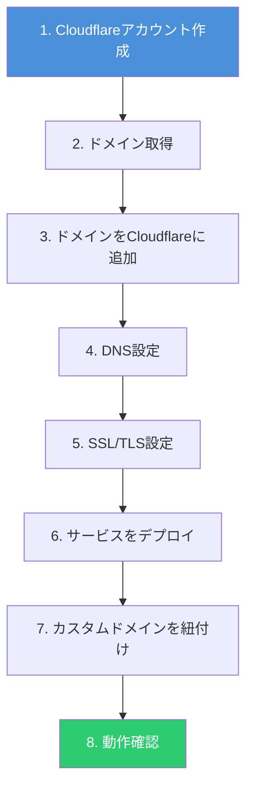
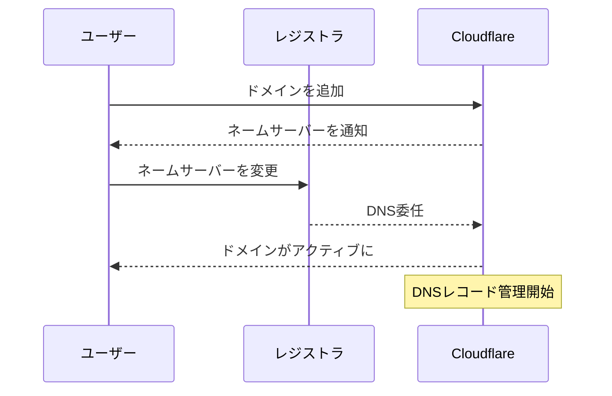

# Cloudflareで独自ドメインを設定しWebサービスを公開する

Webサービスを公開する際、独自ドメインの設定は信頼性やブランディングの観点から欠かせない。Cloudflareはドメイン登録からDNS管理、SSL/TLS、CDN、DDoS対策までを一元的に提供するプラットフォームである。本記事では、Cloudflareを使って独自ドメインを取得し、Webサービスとして公開するまでの手順を1から解説する。

## 全体の流れ

まず、ドメイン取得から公開までの全体像を把握する。



## 1. Cloudflareアカウントの作成

[Cloudflareのサインアップページ](https://dash.cloudflare.com/sign-up)からアカウントを作成する。メールアドレスとパスワードを入力するだけで完了する。

## 2. ドメインの取得

ドメインの取得方法は主に2つある。

### Cloudflare Registrarで取得する場合

Cloudflare Registrarは、ドメインを**原価（レジストリ価格）** で提供しており、マークアップや追加料金が一切かからない。

1. Cloudflareダッシュボードにログイン
2. 左メニューの **Domain Registration** → **Register Domain** を選択
3. 取得したいドメイン名を検索
4. 利用可能なTLD（`.com`、`.dev`、`.io`など）と価格を確認
5. 契約期間（1〜10年）を選択
6. 登録者情報と支払い情報を入力
7. 購入を完了

Cloudflare Registrarで取得したドメインは、自動的にCloudflareのDNSを使用するため、ネームサーバーの変更が不要である。

### 他のレジストラで取得済みのドメインを使う場合

お名前.com、Google Domains、Route 53などで取得済みのドメインも利用できる。この場合、ネームサーバーの変更が必要になる（後述）。

## 3. ドメインをCloudflareに追加する

他のレジストラで取得したドメインをCloudflareで管理する手順を説明する。

### 3.1 DNSSECを無効化

既存のレジストラでDNSSECが有効になっている場合、先に無効化する。ネームサーバー変更時に接続エラーが発生する原因になる。

### 3.2 Cloudflareにドメインを登録

1. ダッシュボードで **Websites** → **Add a site** を選択
2. ドメイン名（例: `example.com`）を入力
3. プランを選択（Freeプランでも十分な機能がある）
4. Cloudflareが既存のDNSレコードを自動スキャン
5. スキャン結果を確認し、必要に応じてレコードを修正

### 3.3 ネームサーバーを変更

Cloudflareが割り当てたネームサーバーが表示される。

```
例:
  ada.ns.cloudflare.com
  brian.ns.cloudflare.com
```

このネームサーバーを、ドメインを購入したレジストラの管理画面で設定する。



ネームサーバーの反映には最大24時間かかる場合がある。反映後、Cloudflareダッシュボードでステータスが「Active」に変わる。

### 3.4 DNSSECを再有効化

ネームサーバーの変更が完了したら、Cloudflareダッシュボード上でDNSSECを有効化する。**DNS** → **DNSSEC** から1クリックで設定できる。

## 4. DNS設定

ドメインがCloudflareで管理されたら、DNSレコードを設定する。

### 主要なDNSレコード

| レコード  | 用途                           | 例                                 |
| --------- | ------------------------------ | ---------------------------------- |
| **A**     | ドメインをIPv4アドレスに紐付け | `example.com` → `192.0.2.1`        |
| **AAAA**  | ドメインをIPv6アドレスに紐付け | `example.com` → `2001:db8::1`      |
| **CNAME** | ドメインを別のドメインに紐付け | `www.example.com` → `example.com`  |
| **MX**    | メールサーバーの指定           | `example.com` → `mail.example.com` |
| **TXT**   | テキスト情報（SPF、DKIMなど）  | 各種認証情報                       |

### Cloudflare Proxyの設定

各レコードには **Proxy status** を設定できる。

- **Proxied（オレンジ雲）**: トラフィックがCloudflareのCDN・WAFを経由する。DDoS対策やキャッシュが有効になる
- **DNS only（グレー雲）**: DNSの名前解決のみ行い、トラフィックは直接オリジンサーバーに向かう

Webサービスには **Proxied** を推奨する。

## 5. SSL/TLS設定

CloudflareではSSL/TLS暗号化を無料で提供している。

### 暗号化モードの選択

ダッシュボードの **SSL/TLS** → **Overview** から設定する。

| モード            | 説明                                                  | 推奨度   |
| ----------------- | ----------------------------------------------------- | -------- |
| **Off**           | 暗号化なし                                            | 非推奨   |
| **Flexible**      | ブラウザ〜Cloudflare間のみHTTPS                       | 非推奨   |
| **Full**          | Cloudflare〜オリジン間もHTTPS（自己署名証明書可）     | 条件付き |
| **Full (Strict)** | Cloudflare〜オリジン間もHTTPS（信頼された証明書必須） | **推奨** |


### Full (Strict) の設定手順

1. **SSL/TLS** → **Overview** で **Full (Strict)** を選択
2. **SSL/TLS** → **Origin Server** で **Origin Certificate** を作成
3. 発行された証明書と秘密鍵をオリジンサーバーに設置
4. HTTPSでの接続を確認

Cloudflare PagesやWorkersを利用する場合、SSL/TLS証明書はCloudflareが自動管理するため、オリジン証明書の設定は不要である。

## 6. Cloudflare Pagesでサービスを公開する

静的サイトやJAMStackアプリケーションには、Cloudflare Pagesが適している。

### 6.1 プロジェクトのデプロイ

```bash
# Wrangler CLIをインストール
npm install -g wrangler

# Cloudflareにログイン
wrangler login

# プロジェクトをデプロイ
wrangler pages deploy ./dist --project-name=my-site
```

GitHubリポジトリと連携する場合は、ダッシュボードの **Workers & Pages** → **Create** → **Pages** → **Connect to Git** から設定できる。

### 6.2 カスタムドメインの設定

1. **Workers & Pages** → プロジェクトを選択 → **Custom domains**
2. **Set up a domain** をクリック
3. 使用するドメインを入力（例: `example.com`）
4. Cloudflareが自動的にCNAMEレコードを作成

サブドメインの場合（例: `blog.example.com`）も同様の手順で設定できる。

### 6.3 pages.devからのリダイレクト

デフォルトの `*.pages.dev` ドメインから独自ドメインにリダイレクトする場合、`_redirects` ファイルを使用する。

```
# _redirectsファイル
https://<PROJECT_NAME>.pages.dev/* https://example.com/:splat 301
```

## 7. Cloudflare Workersでサービスを公開する

APIサーバーやサーバーサイドの処理には、Cloudflare Workersが適している。

### 7.1 Workerの作成とデプロイ

```typescript
// src/index.ts
export default {
  async fetch(request: Request): Promise<Response> {
    const url = new URL(request.url)

    if (url.pathname === '/api/health') {
      return Response.json({ status: 'ok' })
    }

    return new Response('Hello from Cloudflare Workers!', {
      headers: { 'content-type': 'text/plain' },
    })
  },
}
```

```bash
# デプロイ
wrangler deploy
```

### 7.2 カスタムドメインの設定

#### ダッシュボードから設定

1. **Workers & Pages** → Workerを選択 → **Settings**
2. **Domains & Routes** → **Add** → **Custom Domain**
3. ドメインを入力して **Add Custom Domain** をクリック

#### wrangler.tomlで設定

```toml
name = "my-worker"
main = "src/index.ts"
compatibility_date = "2026-02-06"

[[routes]]
pattern = "api.example.com"
custom_domain = true
```

Cloudflareが自動的にDNSレコードを作成し、SSL/TLS証明書も発行する。

## 8. 動作確認

デプロイとカスタムドメインの設定が完了したら、以下の項目を確認する。

```bash
# DNSの確認
dig example.com +short

# HTTPSアクセスの確認
curl -I https://example.com

# SSL証明書の確認
curl -vI https://example.com 2>&1 | grep 'subject:'
```

確認項目のチェックリスト:

| 確認項目                          | 確認方法                                       |
| --------------------------------- | ---------------------------------------------- |
| DNSレコードが正しく設定されている | `dig`コマンドまたはダッシュボードで確認        |
| HTTPSでアクセスできる             | ブラウザまたは`curl`で確認                     |
| SSL証明書が有効である             | ブラウザの鍵アイコンで確認                     |
| HTTPからHTTPSにリダイレクトされる | `curl -I http://example.com` で301を確認       |
| Cloudflare Proxyが有効である      | レスポンスヘッダに`cf-ray`が含まれることを確認 |

## セキュリティ設定（推奨）

独自ドメインでの公開後、以下のセキュリティ設定を有効にすることを推奨する。

| 設定項目                | 場所                        | 説明                                    |
| ----------------------- | --------------------------- | --------------------------------------- |
| **Always Use HTTPS**    | SSL/TLS → Edge Certificates | HTTPアクセスを自動でHTTPSにリダイレクト |
| **HSTS**                | SSL/TLS → Edge Certificates | ブラウザにHTTPS接続を強制               |
| **Minimum TLS Version** | SSL/TLS → Edge Certificates | TLS 1.2以上を推奨                       |
| **WAF**                 | Security → WAF              | Webアプリケーションファイアウォール     |
| **Bot Fight Mode**      | Security → Bots             | 悪意あるボットのブロック                |

## まとめ

Cloudflareを使った独自ドメインの設定からWebサービス公開までの流れを整理する。

1. **アカウント作成**: Cloudflareに無料登録
2. **ドメイン取得**: Cloudflare Registrar（原価提供）または既存レジストラ
3. **ドメイン追加**: ネームサーバーをCloudflareに向ける
4. **DNS設定**: 必要なレコードを設定、Proxyを有効化
5. **SSL/TLS**: Full (Strict) モードで暗号化
6. **デプロイ**: Cloudflare PagesまたはWorkersにデプロイ
7. **カスタムドメイン**: ダッシュボードまたはwrangler.tomlで紐付け
8. **動作確認**: DNS、HTTPS、証明書を確認

Cloudflareは無料プランでも十分な機能を提供しており、個人プロジェクトから本格的なWebサービスまで幅広く活用できる。

## 参考

- [Cloudflare公式ドキュメント - ドメインの追加](https://developers.cloudflare.com/fundamentals/manage-domains/add-site/)
- [Cloudflare公式ドキュメント - Pagesカスタムドメイン](https://developers.cloudflare.com/pages/configuration/custom-domains/)
- [Cloudflare公式ドキュメント - Workersカスタムドメイン](https://developers.cloudflare.com/workers/configuration/routing/custom-domains/)
- [Cloudflare公式ドキュメント - SSL/TLS暗号化モード](https://developers.cloudflare.com/ssl/origin-configuration/ssl-modes/)
- [Cloudflare公式ドキュメント - ネームサーバー設定](https://developers.cloudflare.com/dns/zone-setups/full-setup/setup/)
- [Zenn - はじめてのPages カスタムドメインをセットアップする方法](https://zenn.dev/kameoncloud/articles/9154d4dd27fe15)
