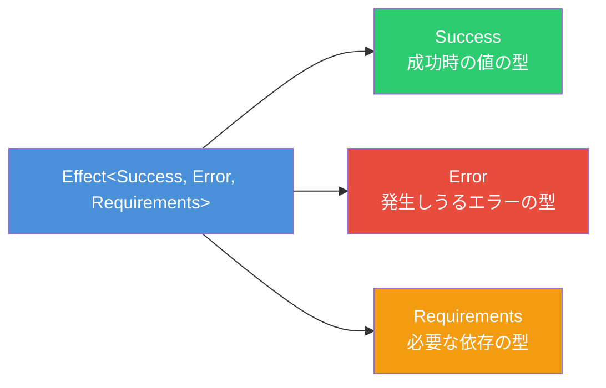
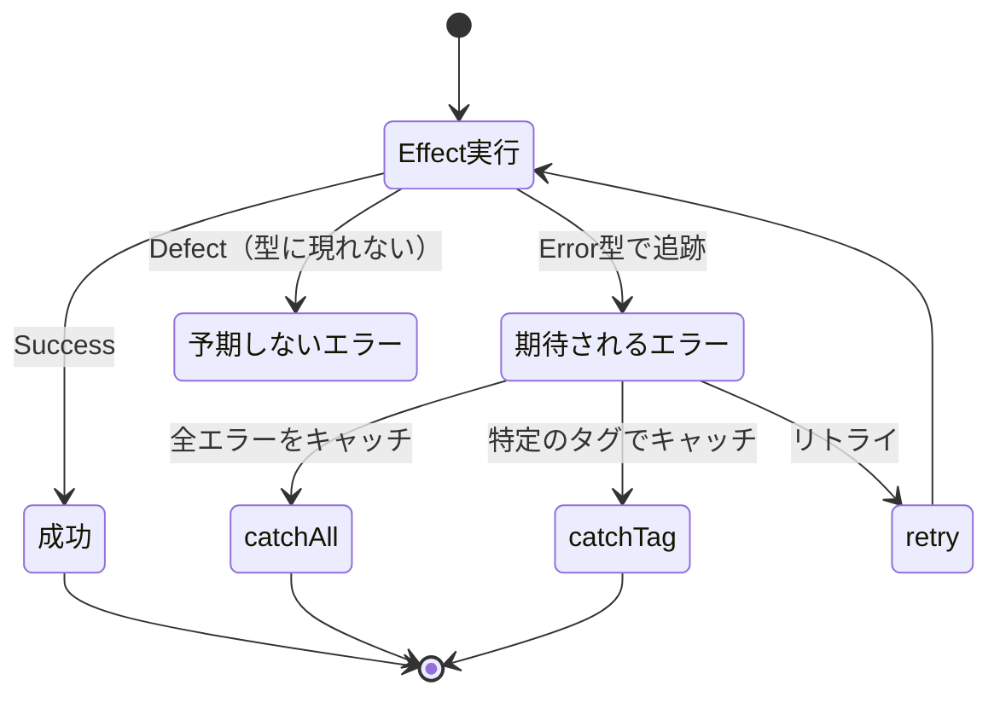
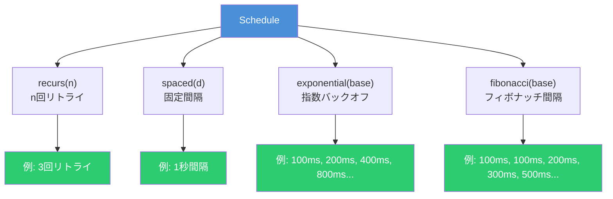

# Effect入門 - TypeScriptで型安全なエラーハンドリングとリトライを実現する

TypeScriptで堅牢なアプリケーションを構築する際、エラーハンドリングやリトライ処理は避けて通れない課題である。`try/catch`では型レベルでエラーを追跡できず、リトライ処理も自前で実装すると複雑になりがちである。[Effect](https://effect.website/)はこれらの問題を型安全に解決するライブラリであり、「TypeScriptの不足している標準ライブラリ」とも称される。

## Effectとは

Effectは、エラーハンドリング・並行処理・リソース管理・リトライ・依存性注入などを統一的に提供するTypeScriptライブラリである。



Effectの中核となる`Effect<Success, Error, Requirements>`型は3つの型パラメータを持つ。

- **Success（A）**: 成功時に返される値の型
- **Error（E）**: 発生しうるエラーの型（型レベルで追跡される）
- **Requirements（R）**: 実行に必要な依存サービスの型

この設計により、どの関数がどのエラーを投げる可能性があるかを型システムで強制的に管理できる。

### インストール

```bash
# npm
npm install effect

# bun
bun add effect
```

TypeScript 5.4以上、`tsconfig.json`で`strict: true`が必要である。

## GitHub上のお手本リポジトリ

Effectを学習・導入する際に参考になるリポジトリを紹介する。

### 公式リポジトリ

| リポジトリ | 説明 |
|-----------|------|
| [Effect-TS/effect](https://github.com/Effect-TS/effect) | 本体のモノレポ。コアライブラリと全パッケージを含む（13k+ Stars） |
| [Effect-TS/examples](https://github.com/Effect-TS/examples) | 公式サンプル集。HTTPサーバー、CLI、テンプレートなど |

`Effect-TS/examples`には以下のテンプレートが含まれている。

- **http-server**: 認証・認可付きのHTTPサーバー実装
- **basic template**: ESM+CJSビルドパイプラインの基本構成
- **monorepo template**: マルチパッケージプロジェクト構成
- **CLI template**: `@effect/cli`を使ったコマンドラインアプリケーション

### コミュニティリポジトリ

| リポジトリ | Stars | 説明 |
|-----------|-------|------|
| [PaulJPhilp/EffectPatterns](https://github.com/PaulJPhilp/EffectPatterns) | 636 | 40以上のコアパターン、13のエラー管理パターン、21以上の並行処理パターンを網羅 |
| [sukovanej/effect-http](https://github.com/sukovanej/effect-http) | 285 | Swagger/OpenAPI対応の宣言的HTTPライブラリ |
| [antoine-coulon/effect-introduction](https://github.com/antoine-coulon/effect-introduction) | - | 素のTypeScriptからEffectへの移行ガイド |

特に**EffectPatterns**はエラーハンドリングやリトライのパターンが体系的にまとまっており、実践的な学習に最適である。

## エラーハンドリングの基本

Effectでは、エラーを**期待されるエラー（Expected Errors）**と**予期しないエラー（Defects）**に分類する。



### TaggedErrorの定義

`Data.TaggedError`を使ってエラー型を定義する。`_tag`フィールドが自動的に付与され、判別共用体として扱える。

```typescript
import { Data, Effect } from 'effect'

class HttpError extends Data.TaggedError('HttpError')<{
	status: number
	message: string
}> {}

class ValidationError extends Data.TaggedError('ValidationError')<{
	field: string
	reason: string
}> {}

class TimeoutError extends Data.TaggedError('TimeoutError')<{
	duration: number
}> {}
```

### エラーの自動追跡

複数のEffectを合成すると、エラーの型が自動的にユニオンとして追跡される。

```typescript
// fetchUser: Effect<User, HttpError>
const fetchUser = (id: string): Effect.Effect<User, HttpError> =>
	Effect.gen(function* () {
		const res = yield* httpGet(`/api/users/${id}`)
		if (res.status !== 200) {
			return yield* new HttpError({ status: res.status, message: 'Not found' })
		}
		return res.data as User
	})

// validateUser: Effect<User, ValidationError>
const validateUser = (user: User): Effect.Effect<User, ValidationError> =>
	Effect.gen(function* () {
		if (!user.email) {
			return yield* new ValidationError({
				field: 'email',
				reason: 'Email is required',
			})
		}
		return user
	})

// program: Effect<User, HttpError | ValidationError>
// エラー型が自動的にユニオンになる
const program = Effect.gen(function* () {
	const user = yield* fetchUser('123')
	const validUser = yield* validateUser(user)
	return validUser
})
```

`program`の型は`Effect<User, HttpError | ValidationError>`となり、発生しうるすべてのエラーがコンパイル時に把握できる。

### catchAll - すべてのエラーをキャッチ

```typescript
const handled = program.pipe(
	Effect.catchAll((error) =>
		Effect.succeed(`Recovered from ${error._tag}: ${error.message}`)
	)
)
// handled: Effect<string, never>（エラー型がneverになる）
```

### catchTag - 特定のエラーだけをキャッチ

```typescript
const partiallyHandled = program.pipe(
	Effect.catchTag('HttpError', (error) =>
		Effect.succeed(`HTTP error ${error.status}: ${error.message}`)
	)
)
// partiallyHandled: Effect<string | User, ValidationError>
// HttpErrorだけが除去され、ValidationErrorは残る
```

### catchTags - 複数のエラーを個別にキャッチ

```typescript
const fullyHandled = program.pipe(
	Effect.catchTags({
		HttpError: (error) =>
			Effect.succeed(`HTTP error: ${error.status}`),
		ValidationError: (error) =>
			Effect.succeed(`Validation error: ${error.field} - ${error.reason}`),
	})
)
// fullyHandled: Effect<string | User, never>
```

### フォールバックパターン

```typescript
// orElse: 失敗時に代替Effectを実行
const withFallback = fetchFromPrimaryApi.pipe(
	Effect.orElse(() => fetchFromFallbackApi)
)

// firstSuccessOf: 最初に成功したものを返す
const config = Effect.firstSuccessOf([
	fetchRemoteConfig('primary'),
	fetchRemoteConfig('secondary'),
	fetchRemoteConfig('tertiary'),
	Effect.succeed(defaultConfig),
])
```

## リトライ戦略

Effectの`Schedule`モジュールは、リトライのタイミングと回数を宣言的に定義できる仕組みである。

### 組み込みスケジュール



| スケジュール | 説明 | 間隔の例 |
|-------------|------|---------|
| `Schedule.recurs(n)` | n回リトライ | - |
| `Schedule.spaced(d)` | 固定間隔 | 1s, 1s, 1s, ... |
| `Schedule.exponential(base)` | 指数バックオフ | 100ms, 200ms, 400ms, 800ms, ... |
| `Schedule.fibonacci(base)` | フィボナッチ間隔 | 100ms, 100ms, 200ms, 300ms, 500ms, ... |
| `Schedule.forever` | 無限リトライ | - |

### 基本的なリトライ

```typescript
import { Effect, Schedule } from 'effect'

// 固定回数のリトライ
const withRetry = Effect.retry(fetchData, { times: 3 })

// 指数バックオフでリトライ
const withExponentialRetry = Effect.retry(
	fetchData,
	Schedule.exponential('100 millis')
)
```

### スケジュールの合成

Effectのスケジュールは合成可能であり、複雑なリトライ戦略を宣言的に組み立てられる。

```typescript
// 指数バックオフ + 最大5回 + ジッター
const retryPolicy = Schedule.exponential('200 millis').pipe(
	Schedule.jittered,                    // ランダムな揺らぎを追加
	Schedule.intersect(Schedule.recurs(5)) // 最大5回に制限
)

const program = Effect.retry(fetchData, retryPolicy)
```

#### intersect（両方の条件を満たす場合に続行）

```typescript
// 指数バックオフだが、最大5回まで
const limited = Schedule.intersect(
	Schedule.exponential('10 millis'),
	Schedule.recurs(5)
)
```

#### union（どちらかの条件を満たす場合に続行）

```typescript
// 指数バックオフまたは固定間隔の短い方を採用
const fast = Schedule.union(
	Schedule.exponential('100 millis'),
	Schedule.spaced('1 second')
)
```

#### andThen（順次実行）

```typescript
// 最初は即座に5回リトライ、その後1秒間隔に切り替え
const staged = Schedule.andThen(
	Schedule.recurs(5),
	Schedule.spaced('1 second')
)
```

### 条件付きリトライ

エラーの種類によってリトライするかどうかを制御できる。

```typescript
// 特定のエラーでのみリトライ
const selectiveRetry = Effect.retry(callApi, {
	while: (err) => err._tag === 'HttpError' && err.status >= 500,
})

// 致命的エラーではリトライを停止
const stopOnFatal = Effect.retry(callApi, {
	until: (err) => err._tag === 'FatalError',
})
```

### retryOrElse - リトライ失敗時のフォールバック

```typescript
const policy = Schedule.recurs(3).pipe(
	Schedule.addDelay(() => '500 millis')
)

const program = Effect.retryOrElse(
	fetchData,
	policy,
	// すべてのリトライが失敗した場合のフォールバック
	(error, _) =>
		Effect.succeed({ data: 'default', source: 'fallback' })
)
```

## 実践パターン: APIクライアント

ここまでの知識を組み合わせた実践的なAPIクライアントの実装例を示す。

```typescript
import { Data, Effect, Schedule } from 'effect'

// エラー型の定義
class NetworkError extends Data.TaggedError('NetworkError')<{
	cause: string
}> {}

class ApiError extends Data.TaggedError('ApiError')<{
	status: number
	body: string
}> {}

class RateLimitError extends Data.TaggedError('RateLimitError')<{
	retryAfter: number
}> {}

// APIリクエストの実行
const apiRequest = (url: string): Effect.Effect<unknown, NetworkError | ApiError | RateLimitError> =>
	Effect.gen(function* () {
		const response = yield* Effect.tryPromise({
			try: () => fetch(url),
			catch: (e) => new NetworkError({ cause: String(e) }),
		})

		if (response.status === 429) {
			const retryAfter = Number(response.headers.get('Retry-After') ?? '1000')
			return yield* new RateLimitError({ retryAfter })
		}

		if (!response.ok) {
			const body = yield* Effect.tryPromise({
				try: () => response.text(),
				catch: (e) => new NetworkError({ cause: String(e) }),
			})
			return yield* new ApiError({ status: response.status, body })
		}

		return yield* Effect.tryPromise({
			try: () => response.json(),
			catch: (e) => new NetworkError({ cause: String(e) }),
		})
	})

// リトライポリシーの定義
const retryPolicy = Schedule.exponential('200 millis').pipe(
	Schedule.jittered,
	Schedule.intersect(Schedule.recurs(5))
)

// 堅牢なAPIクライアント
const robustApiCall = (url: string) =>
	apiRequest(url).pipe(
		// NetworkErrorのみリトライ（ApiErrorはリトライしない）
		Effect.retry({
			schedule: retryPolicy,
			while: (err) => err._tag === 'NetworkError',
		}),
		// RateLimitErrorは指定秒数待ってリトライ
		Effect.catchTag('RateLimitError', (err) =>
			Effect.sleep(`${err.retryAfter} millis`).pipe(
				Effect.andThen(() => apiRequest(url))
			)
		),
		// タイムアウト設定
		Effect.timeout('10 seconds'),
	)

// 実行
const main = robustApiCall('https://api.example.com/data').pipe(
	Effect.catchTags({
		NetworkError: (err) =>
			Effect.succeed({ error: `Network failed: ${err.cause}` }),
		ApiError: (err) =>
			Effect.succeed({ error: `API error ${err.status}: ${err.body}` }),
		RateLimitError: (err) =>
			Effect.succeed({ error: `Rate limited: retry after ${err.retryAfter}ms` }),
	}),
	Effect.catchAllDefect((defect) =>
		Effect.succeed({ error: `Unexpected: ${defect}` })
	),
)

Effect.runPromise(main).then(console.log)
```

## まとめ

Effectは、TypeScriptの型システムを最大限に活用し、エラーハンドリングとリトライを型安全に記述できるライブラリである。

| 特徴 | 従来のTypeScript | Effect |
|------|-----------------|--------|
| エラーの型追跡 | `try/catch`では型情報なし | `Effect<A, E, R>`でコンパイル時に追跡 |
| リトライ | 自前実装が必要 | `Schedule`で宣言的に定義 |
| エラーの分類 | 手動で判定 | `TaggedError`+`catchTag`で型安全に分岐 |
| 合成可能性 | コールバック地獄になりやすい | パイプラインで自然に合成 |

公式の[Effect-TS/examples](https://github.com/Effect-TS/examples)やコミュニティの[EffectPatterns](https://github.com/PaulJPhilp/EffectPatterns)を参考に、段階的に導入していくことを推奨する。

## 参考

- [Effect公式ドキュメント](https://effect.website/docs/getting-started/introduction/)
- [Effect公式ドキュメント - Expected Errors](https://effect.website/docs/error-management/expected-errors/)
- [Effect公式ドキュメント - Retrying](https://effect.website/docs/error-management/retrying/)
- [Effect公式ドキュメント - Built-In Schedules](https://effect.website/docs/scheduling/built-in-schedules/)
- [GitHub - Effect-TS/effect](https://github.com/Effect-TS/effect)
- [GitHub - Effect-TS/examples](https://github.com/Effect-TS/examples)
- [GitHub - PaulJPhilp/EffectPatterns](https://github.com/PaulJPhilp/EffectPatterns)
