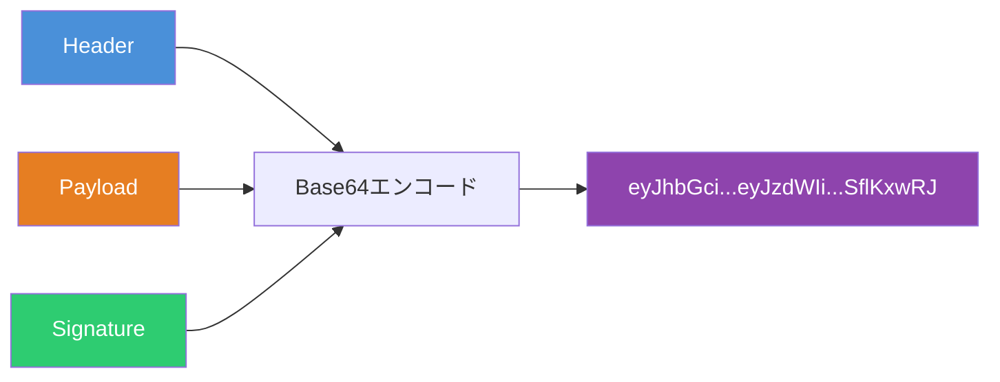
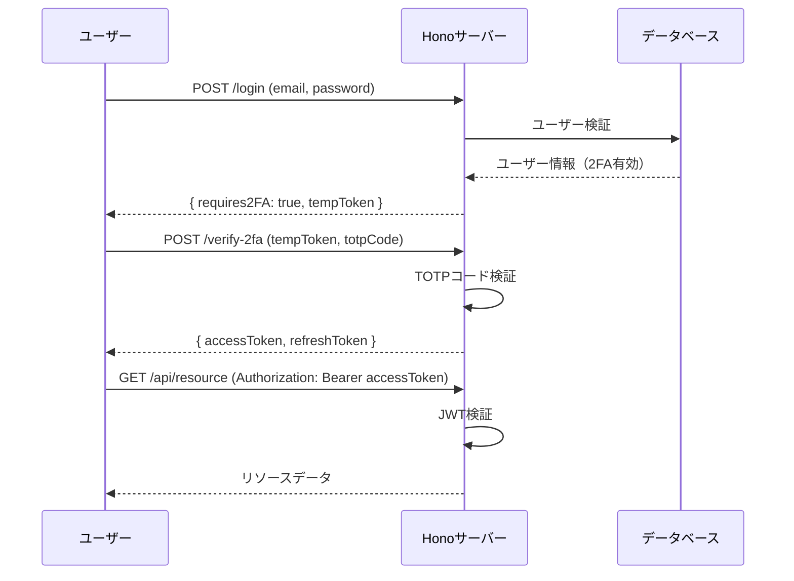
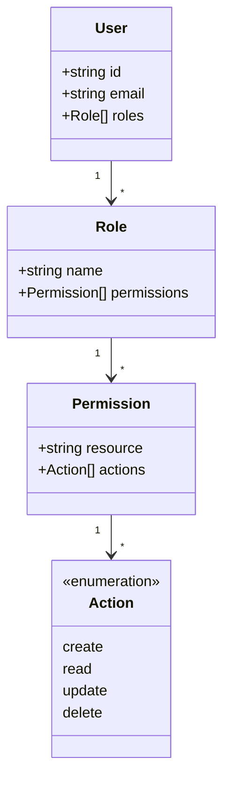
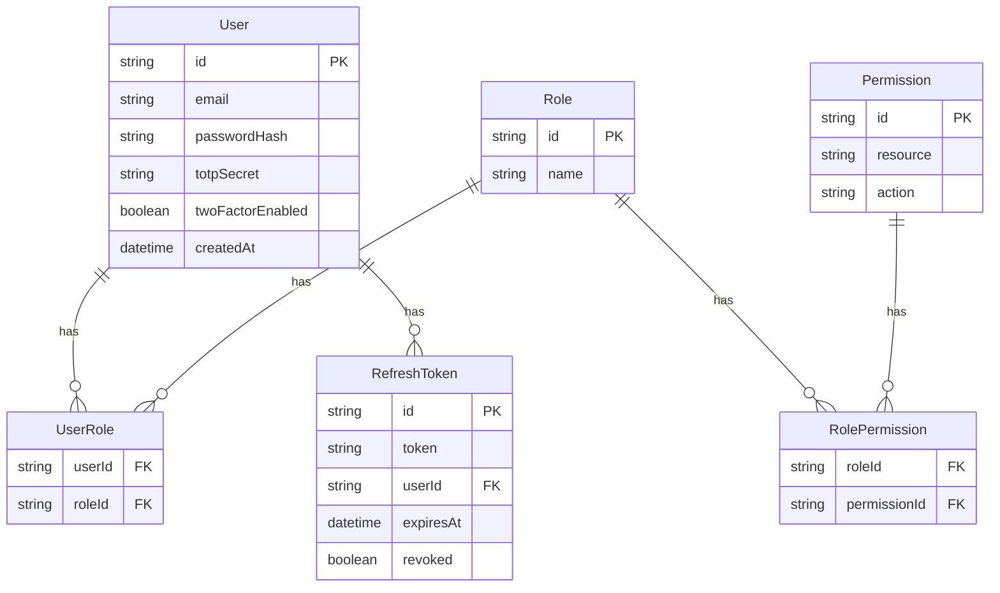

# HonoのJWT認証を極める - 基本から2段階認証・ロール管理・Prisma連携まで

JWT（JSON Web Token）はステートレスな認証を実現するための標準仕様であり、Web APIの認証手段として広く採用されている。[Hono](https://hono.dev/)は軽量かつ高速なWebフレームワークであり、JWT認証のためのミドルウェアとヘルパー関数を標準で提供している。本記事では、HonoのJWT機能を使い、基本的な認証から2段階認証、複雑なロール管理、Prismaと連携したDB管理まで段階的に解説する。

## JWTの基本構造

JWTは3つのパートで構成される。



| パート        | 内容                                      |
| ------------- | ----------------------------------------- |
| **Header**    | アルゴリズム（HS256等）とトークン種別     |
| **Payload**   | ユーザー情報やクレーム（sub, exp, iat等） |
| **Signature** | ヘッダーとペイロードを秘密鍵で署名した値  |

## Hono JWT Auth Middleware - 基本的な認証

HonoのJWT Auth Middlewareを使えば、数行で認証付きAPIを構築できる。

```typescript
import { Hono } from 'hono'
import { jwt } from 'hono/jwt'
import { sign } from 'hono/jwt'
import type { JwtVariables } from 'hono/jwt'

type Variables = JwtVariables

const app = new Hono<{ Variables: Variables }>()

// JWT Middlewareを認証が必要なルートに適用
app.use(
  '/api/*',
  jwt({
    secret: 'my-super-secret-key',
    alg: 'HS256',
  }),
)

// ログインエンドポイント（認証不要）
app.post('/login', async (c) => {
  const { email, password } = await c.req.json()

  // ユーザー認証処理（省略）
  const user = { id: 'user-001', email, role: 'admin' }

  const now = Math.floor(Date.now() / 1000)
  const token = await sign(
    {
      sub: user.id,
      email: user.email,
      role: user.role,
      iat: now,
      exp: now + 60 * 60, // 1時間有効
    },
    'my-super-secret-key',
    'HS256',
  )

  return c.json({ token })
})

// 認証済みユーザーのみアクセス可能
app.get('/api/profile', (c) => {
  const payload = c.get('jwtPayload')
  return c.json({
    id: payload.sub,
    email: payload.email,
    role: payload.role,
  })
})

export default app
```

## JWT Helper - sign / verify / decode

Hono JWT Helperは3つの関数を提供する。

```typescript
import { sign, verify, decode } from 'hono/jwt'

// sign: トークン生成
const token = await sign(
  { sub: 'user-001', exp: Math.floor(Date.now() / 1000) + 3600 },
  'secret',
  'HS256',
)

// verify: トークン検証（署名 + 有効期限）
const payload = await verify(token, 'secret', 'HS256')

// decode: 署名検証なしでペイロードを取得
const { header, payload: decoded } = decode(token)
```

`verify`は以下のクレームを自動検証する。

| クレーム | 説明                       |
| -------- | -------------------------- |
| `exp`    | 有効期限が過ぎていないか   |
| `nbf`    | 使用開始時刻に達しているか |
| `iat`    | 発行時刻が正しいか         |

検証失敗時は専用のエラー型がスローされる。

```typescript
import { jwt } from 'hono/jwt'

app.use('/api/*', async (c, next) => {
  try {
    const jwtMiddleware = jwt({ secret: c.env.JWT_SECRET, alg: 'HS256' })
    await jwtMiddleware(c, next)
  } catch (e) {
    if (e instanceof Error) {
      return c.json({ error: e.message }, 401)
    }
    throw e
  }
})
```

## 2段階認証（TOTP）との組み合わせ

JWT認証にTOTP（Time-based One-Time Password）を組み合わせた2段階認証のフローを示す。



```typescript
import { Hono } from 'hono'
import { sign, verify } from 'hono/jwt'

const app = new Hono()

// ステップ1: メールとパスワードで認証
app.post('/login', async (c) => {
  const { email, password } = await c.req.json()

  // パスワード検証（省略）
  const user = await authenticateUser(email, password)
  if (!user) {
    return c.json({ error: 'Invalid credentials' }, 401)
  }

  // 2FAが有効な場合、一時トークンを発行
  if (user.twoFactorEnabled) {
    const tempToken = await sign(
      {
        sub: user.id,
        type: 'temp',
        exp: Math.floor(Date.now() / 1000) + 300, // 5分有効
      },
      'temp-secret',
      'HS256',
    )
    return c.json({ requires2FA: true, tempToken })
  }

  // 2FA無効ならそのままアクセストークンを発行
  const accessToken = await generateAccessToken(user)
  return c.json({ accessToken })
})

// ステップ2: TOTPコード検証
app.post('/verify-2fa', async (c) => {
  const { tempToken, totpCode } = await c.req.json()

  // 一時トークンを検証
  const temp = await verify(tempToken, 'temp-secret', 'HS256')
  if (temp.type !== 'temp') {
    return c.json({ error: 'Invalid token type' }, 401)
  }

  // TOTPコードを検証
  const user = await findUserById(temp.sub as string)
  const isValid = verifyTOTP(user.totpSecret, totpCode)
  if (!isValid) {
    return c.json({ error: 'Invalid TOTP code' }, 401)
  }

  // アクセストークンとリフレッシュトークンを発行
  const now = Math.floor(Date.now() / 1000)
  const accessToken = await sign(
    {
      sub: user.id,
      role: user.role,
      twoFactorVerified: true,
      exp: now + 60 * 15, // 15分
    },
    'access-secret',
    'HS256',
  )
  const refreshToken = await sign(
    {
      sub: user.id,
      type: 'refresh',
      exp: now + 60 * 60 * 24 * 7, // 7日
    },
    'refresh-secret',
    'HS256',
  )

  return c.json({ accessToken, refreshToken })
})
```

## ロールベースアクセス制御（RBAC）

複雑な権限管理を行うために、ロールとパーミッションを組み合わせたRBACを実装する。



```typescript
// パーミッション定義
type Action = 'create' | 'read' | 'update' | 'delete'

type Permission = {
  resource: string
  actions: Action[]
}

type RoleConfig = {
  [role: string]: Permission[]
}

const ROLES: RoleConfig = {
  admin: [
    { resource: 'users', actions: ['create', 'read', 'update', 'delete'] },
    { resource: 'posts', actions: ['create', 'read', 'update', 'delete'] },
    { resource: 'settings', actions: ['read', 'update'] },
  ],
  editor: [
    { resource: 'posts', actions: ['create', 'read', 'update'] },
    { resource: 'users', actions: ['read'] },
  ],
  viewer: [
    { resource: 'posts', actions: ['read'] },
    { resource: 'users', actions: ['read'] },
  ],
}

// 権限チェックミドルウェア
function requirePermission(resource: string, action: Action) {
  return async (c: any, next: any) => {
    const payload = c.get('jwtPayload')
    const userRoles: string[] = Array.isArray(payload.roles) ? payload.roles : [payload.role]

    const hasPermission = userRoles.some((role) => {
      const permissions = ROLES[role]
      if (!permissions) return false
      return permissions.some((p) => p.resource === resource && p.actions.includes(action))
    })

    if (!hasPermission) {
      return c.json({ error: 'Forbidden' }, 403)
    }

    await next()
  }
}

// ルートへの適用
app.get('/api/users', requirePermission('users', 'read'), (c) => {
  return c.json({ users: [] })
})

app.post('/api/users', requirePermission('users', 'create'), async (c) => {
  const body = await c.req.json()
  return c.json({ user: body }, 201)
})

app.delete('/api/users/:id', requirePermission('users', 'delete'), (c) => {
  return c.json({ deleted: true })
})
```

## PrismaによるDB管理との連携

Prismaを使い、ユーザー・ロール・リフレッシュトークンをデータベースで管理する。



### Prisma Schema

```prisma
model User {
  id               String         @id @default(cuid())
  email            String         @unique
  passwordHash     String
  totpSecret       String?
  twoFactorEnabled Boolean        @default(false)
  createdAt        DateTime       @default(now())
  roles            UserRole[]
  refreshTokens    RefreshToken[]
}

model Role {
  id          String           @id @default(cuid())
  name        String           @unique
  users       UserRole[]
  permissions RolePermission[]
}

model Permission {
  id       String           @id @default(cuid())
  resource String
  action   String
  roles    RolePermission[]

  @@unique([resource, action])
}

model UserRole {
  userId String
  roleId String
  user   User   @relation(fields: [userId], references: [id])
  role   Role   @relation(fields: [roleId], references: [id])

  @@id([userId, roleId])
}

model RolePermission {
  roleId       String
  permissionId String
  role         Role       @relation(fields: [roleId], references: [id])
  permission   Permission @relation(fields: [permissionId], references: [id])

  @@id([roleId, permissionId])
}

model RefreshToken {
  id        String   @id @default(cuid())
  token     String   @unique
  userId    String
  user      User     @relation(fields: [userId], references: [id])
  expiresAt DateTime
  revoked   Boolean  @default(false)
  createdAt DateTime @default(now())
}
```

### Prisma連携した認証サービス

```typescript
import { PrismaClient } from '@prisma/client'
import { sign, verify } from 'hono/jwt'
import { Hono } from 'hono'
import { jwt } from 'hono/jwt'

const prisma = new PrismaClient()
const app = new Hono()

// ログイン処理（Prisma連携）
app.post('/login', async (c) => {
  const { email, password } = await c.req.json()

  const user = await prisma.user.findUnique({
    where: { email },
    include: {
      roles: {
        include: {
          role: {
            include: {
              permissions: {
                include: { permission: true },
              },
            },
          },
        },
      },
    },
  })

  if (!user || !(await verifyPassword(password, user.passwordHash))) {
    return c.json({ error: 'Invalid credentials' }, 401)
  }

  // ロール名を配列で取得
  const roles = user.roles.map((ur) => ur.role.name)

  const now = Math.floor(Date.now() / 1000)
  const accessToken = await sign(
    {
      sub: user.id,
      email: user.email,
      roles,
      exp: now + 60 * 15,
    },
    c.env.JWT_SECRET,
    'HS256',
  )

  // リフレッシュトークンをDBに保存
  const refreshTokenValue = crypto.randomUUID()
  await prisma.refreshToken.create({
    data: {
      token: refreshTokenValue,
      userId: user.id,
      expiresAt: new Date(Date.now() + 7 * 24 * 60 * 60 * 1000),
    },
  })

  return c.json({ accessToken, refreshToken: refreshTokenValue })
})

// リフレッシュトークンで新しいアクセストークンを取得
app.post('/refresh', async (c) => {
  const { refreshToken } = await c.req.json()

  const stored = await prisma.refreshToken.findUnique({
    where: { token: refreshToken },
    include: {
      user: {
        include: {
          roles: { include: { role: true } },
        },
      },
    },
  })

  if (!stored || stored.revoked || stored.expiresAt < new Date()) {
    return c.json({ error: 'Invalid refresh token' }, 401)
  }

  // 古いリフレッシュトークンを無効化（トークンローテーション）
  await prisma.refreshToken.update({
    where: { id: stored.id },
    data: { revoked: true },
  })

  const roles = stored.user.roles.map((ur) => ur.role.name)
  const now = Math.floor(Date.now() / 1000)

  const newAccessToken = await sign(
    {
      sub: stored.user.id,
      email: stored.user.email,
      roles,
      exp: now + 60 * 15,
    },
    c.env.JWT_SECRET,
    'HS256',
  )

  // 新しいリフレッシュトークンを発行
  const newRefreshToken = crypto.randomUUID()
  await prisma.refreshToken.create({
    data: {
      token: newRefreshToken,
      userId: stored.user.id,
      expiresAt: new Date(Date.now() + 7 * 24 * 60 * 60 * 1000),
    },
  })

  return c.json({ accessToken: newAccessToken, refreshToken: newRefreshToken })
})

// ログアウト（リフレッシュトークン無効化）
app.post('/logout', async (c) => {
  const { refreshToken } = await c.req.json()
  await prisma.refreshToken.updateMany({
    where: { token: refreshToken },
    data: { revoked: true },
  })
  return c.json({ message: 'Logged out' })
})
```

## Cookieベースの認証

ブラウザ向けにはCookieにJWTを格納する方式も有用である。HonoのJWT MiddlewareはCookieからの読み取りにも対応している。

```typescript
import { jwt } from 'hono/jwt'
import { setCookie } from 'hono/cookie'

// Cookieからトークンを読み取る設定
app.use(
  '/api/*',
  jwt({
    secret: 'my-secret',
    alg: 'HS256',
    cookie: 'access_token',
  }),
)

// ログイン時にCookieにセット
app.post('/login', async (c) => {
  const token = await sign(payload, 'my-secret', 'HS256')

  setCookie(c, 'access_token', token, {
    httpOnly: true,
    secure: true,
    sameSite: 'Strict',
    maxAge: 60 * 15,
    path: '/',
  })

  return c.json({ message: 'Logged in' })
})
```

## 参考

- [Hono - JWT Auth Middleware](https://hono.dev/docs/middleware/builtin/jwt)
- [Hono - JWT Helper](https://hono.dev/docs/helpers/jwt)
- [Prisma - 公式ドキュメント](https://www.prisma.io/docs)
- [RFC 7519 - JSON Web Token (JWT)](https://datatracker.ietf.org/doc/html/rfc7519)
