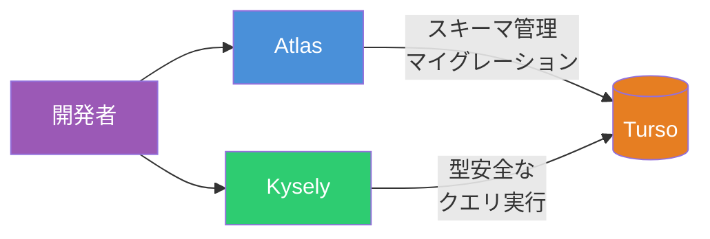
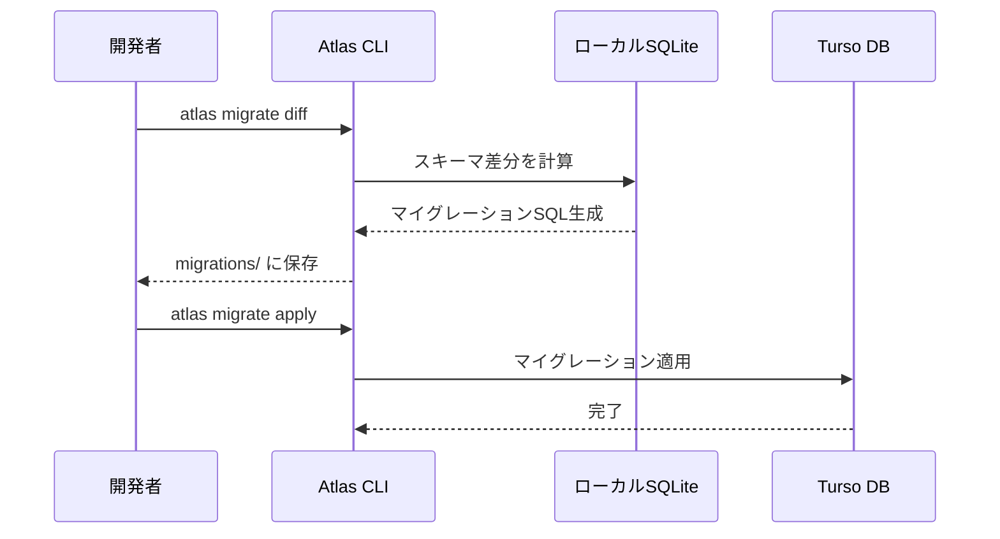
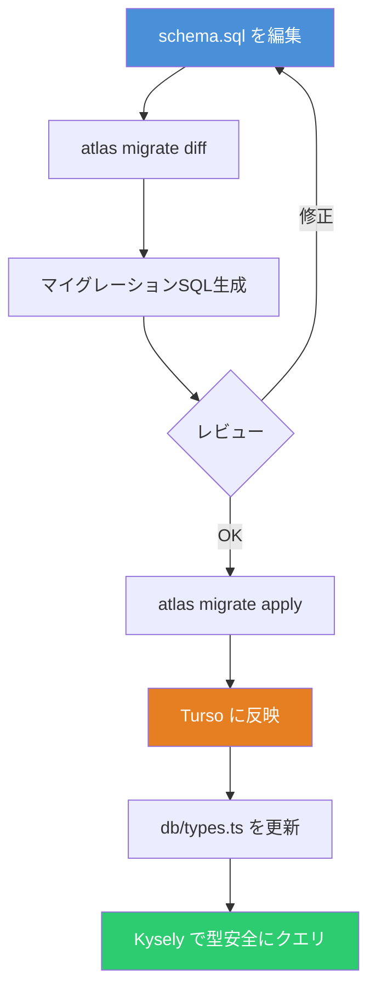

# Atlas + Turso + Kysely で実現する型安全なデータベース運用

データベースを扱うプロジェクトでは、**スキーマ管理**・**データベースサービス**・**クエリ構築**の3つが主要な関心事となる。本記事では、それぞれの役割を担う Atlas・Turso・Kysely を組み合わせた運用方法を解説する。

## 各ツールの役割



| ツール     | 役割                     | 特徴                                           |
| ---------- | ------------------------ | ---------------------------------------------- |
| **Atlas**  | スキーママイグレーション | HCL/SQL でスキーマを宣言的に管理               |
| **Turso**  | データベースサービス     | libSQL（SQLite フォーク）ベースのエッジDB      |
| **Kysely** | クエリビルダー           | TypeScript の型システムと統合した SQL ビルダー |

## セットアップ

### 1. Turso のセットアップ

Turso CLI をインストールし、データベースを作成する。

```bash
# Turso CLI インストール
curl -sSfL https://get.tur.so/install.sh | bash

# ログイン
turso auth login

# データベース作成
turso db create myapp

# 接続情報を取得
turso db show myapp --url
# => libsql://myapp-<username>.turso.io

# 認証トークンを生成
turso db tokens create myapp
```

### 2. Atlas のセットアップ

Atlas CLI をインストールし、設定ファイルを作成する。

```bash
# Atlas CLI インストール
curl -sSf https://atlasgo.sh | sh
```

プロジェクトルートに `atlas.hcl` を作成する。

```hcl
// atlas.hcl
variable "token" {
  type    = string
  default = getenv("TURSO_TOKEN")
}

env "turso" {
  url     = "libsql://myapp-<username>.turso.io?authToken=${var.token}"
  dev     = "sqlite://dev?mode=memory"
  exclude = ["_litestream*"]

  migration {
    dir = "file://migrations"
  }
}
```

`dev` にはマイグレーション計画用のローカル SQLite を指定する。`exclude` は Turso の内部レプリケーションテーブルを除外するための設定である。

### 3. Node.js パッケージのインストール

```bash
npm install kysely @libsql/kysely-libsql @libsql/client
```

## スキーマ定義とマイグレーション

### スキーマを SQL で定義する

`schema.sql` にデータベースの望ましい状態を記述する。

```sql
-- schema.sql
CREATE TABLE users (
  id INTEGER PRIMARY KEY AUTOINCREMENT,
  name TEXT NOT NULL,
  email TEXT NOT NULL UNIQUE,
  created_at TEXT NOT NULL DEFAULT (datetime('now'))
);

CREATE TABLE posts (
  id INTEGER PRIMARY KEY AUTOINCREMENT,
  title TEXT NOT NULL,
  body TEXT NOT NULL,
  author_id INTEGER NOT NULL,
  published INTEGER NOT NULL DEFAULT 0,
  created_at TEXT NOT NULL DEFAULT (datetime('now')),
  FOREIGN KEY (author_id) REFERENCES users(id)
);
```

### マイグレーションの実行



```bash
# 環境変数を設定
export TURSO_TOKEN=<your_token>

# マイグレーションファイルを生成
atlas migrate diff add_users_and_posts \
  --env turso \
  --to file://schema.sql

# 生成されたマイグレーションを確認
ls migrations/
# => 20260210120000_add_users_and_posts.sql

# Turso に適用
atlas migrate apply --env turso

# 現在のスキーマを確認
atlas schema inspect --env turso
```

Atlas は `schema.sql` の望ましい状態と Turso の現在の状態を比較し、差分のマイグレーション SQL を自動生成する。手書きで ALTER 文を管理する必要がない。

## Kysely で型安全にクエリを実行する

### データベース型定義

```typescript
// db/types.ts
import type { Generated, Insertable, Selectable, Updateable } from 'kysely'

interface UsersTable {
  id: Generated<number>
  name: string
  email: string
  created_at: Generated<string>
}

interface PostsTable {
  id: Generated<number>
  title: string
  body: string
  author_id: number
  published: Generated<number>
  created_at: Generated<string>
}

export interface Database {
  users: UsersTable
  posts: PostsTable
}

export type User = Selectable<UsersTable>
export type NewUser = Insertable<UsersTable>
export type UserUpdate = Updateable<UsersTable>
export type Post = Selectable<PostsTable>
export type NewPost = Insertable<PostsTable>
```

### Kysely インスタンスの作成

```typescript
// db/client.ts
import { Kysely } from 'kysely'
import { LibsqlDialect } from '@libsql/kysely-libsql'
import type { Database } from './types'

export const db = new Kysely<Database>({
  dialect: new LibsqlDialect({
    url: process.env.TURSO_URL!,
    authToken: process.env.TURSO_TOKEN!,
  }),
})
```

`LibsqlDialect` が Kysely と Turso を接続する。`libsql://` プロトコルで Turso のエッジデータベースに直接アクセスできる。

### CRUD 操作

```typescript
// ユーザー作成 - 型安全に INSERT
const user = await db
  .insertInto('users')
  .values({ name: 'Taro', email: 'taro@example.com' })
  .returningAll()
  .executeTakeFirstOrThrow()

// 投稿一覧取得 - JOIN + フィルタ
const publishedPosts = await db
  .selectFrom('posts')
  .innerJoin('users', 'users.id', 'posts.author_id')
  .select(['posts.id', 'posts.title', 'posts.created_at', 'users.name as author_name'])
  .where('posts.published', '=', 1)
  .orderBy('posts.created_at', 'desc')
  .execute()

// ユーザー更新 - 存在しないカラムを指定するとコンパイルエラー
await db.updateTable('users').set({ name: 'Jiro' }).where('id', '=', user.id).execute()

// 投稿削除
await db.deleteFrom('posts').where('author_id', '=', user.id).execute()
```

Kysely の型推論により、テーブル名・カラム名の誤りはコンパイル時に検出される。

## 開発ワークフロー全体像



1. `schema.sql` を編集してスキーマの望ましい状態を更新する
2. `atlas migrate diff` で差分マイグレーションを生成する
3. 生成された SQL をレビューし、問題なければ `atlas migrate apply` で Turso に適用する
4. `db/types.ts` をスキーマに合わせて更新する
5. Kysely が型チェックで不整合を検出してくれる

`kysely-codegen` を使えば、手順4の型定義を自動生成することも可能である。

## まとめ

Atlas・Turso・Kysely はそれぞれ独立したツールだが、組み合わせることで**スキーマ管理からクエリ実行まで一貫した型安全なパイプライン**を構築できる。

| 工程         | ツール | メリット                 |
| ------------ | ------ | ------------------------ |
| スキーマ定義 | Atlas  | 宣言的管理、差分自動生成 |
| データベース | Turso  | エッジ対応、SQLite 互換  |
| クエリ実行   | Kysely | コンパイル時型チェック   |

ORM を使わずに SQL を直接書きたいが型安全性は確保したい、というニーズに対して、この構成は有力な選択肢となる。

## 参考

- [Atlas - Getting Started](https://atlasgo.io/getting-started)
- [Atlas - Working with Turso](https://atlasgo.io/guides/sqlite/turso)
- [Turso - 公式ドキュメント](https://docs.turso.tech/)
- [Kysely - 公式サイト](https://kysely.dev/)
- [kysely-libsql - GitHub](https://github.com/libsql/kysely-libsql)
