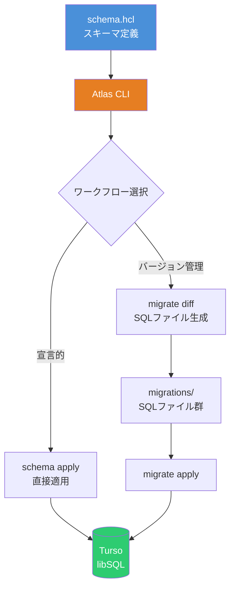
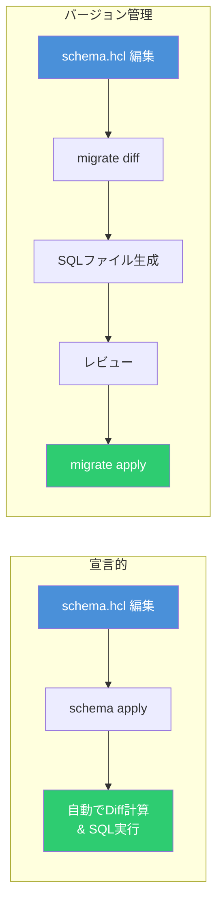
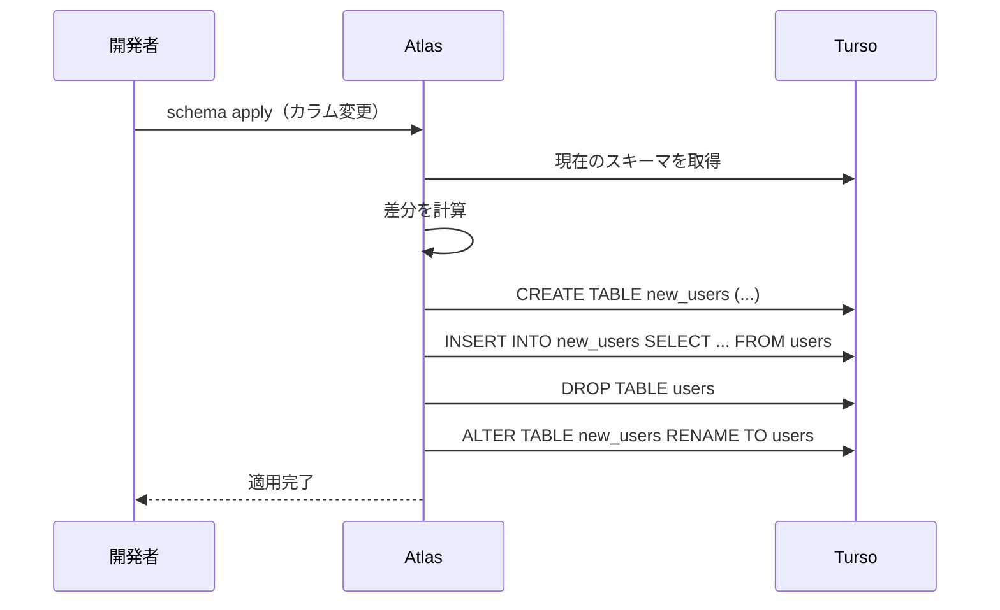
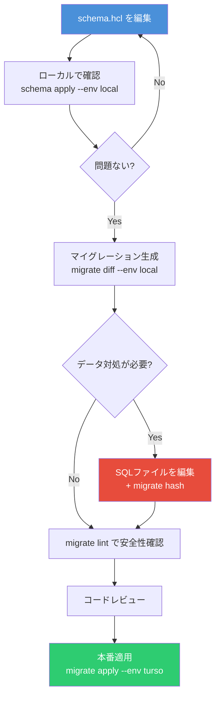

# Atlas + Turso で学ぶ HCL スキーマ管理とマイグレーション実践ガイド

データベーススキーマの管理は、アプリケーション開発において避けて通れない課題である。Atlas は Terraform に触発された宣言的スキーマ管理ツールであり、HCL でスキーマを定義して自動的にマイグレーションを計画・実行できる。本記事では、Atlas の HCL スキーマ定義から Turso への適用、スキーマ変更時のデータ対処まで、実運用に必要な知識を体系的に解説する。

## 全体アーキテクチャ



## HCL スキーマ定義の基本

Atlas では HCL（HashiCorp Configuration Language）を使ってデータベーススキーマを宣言的に定義する。SQLite / libSQL 向けのスキーマファイルは `.hcl` 拡張子で作成する。

### スキーマブロック

すべてのテーブルは `schema` ブロックに属する。SQLite では `main` スキーマを使用する。

```hcl
schema "main" {}
```

### テーブルとカラムの定義

```hcl
table "users" {
  schema = schema.main

  column "id" {
    null           = true
    type           = integer
    auto_increment = true
  }

  column "name" {
    null = false
    type = text
  }

  column "email" {
    null = false
    type = varchar(255)
  }

  column "role" {
    null    = false
    type    = text
    default = "user"
  }

  column "created_at" {
    null    = false
    type    = datetime
    default = sql("CURRENT_TIMESTAMP")
  }

  primary_key {
    columns = [column.id]
  }
}
```

### SQLite / libSQL で使用可能な型

| HCL型                     | SQLiteアフィニティ | 用途           |
| ------------------------- | ------------------ | -------------- |
| `integer`, `int`          | INTEGER            | 整数値         |
| `text`, `varchar(n)`      | TEXT               | 文字列         |
| `real`, `double`, `float` | REAL               | 浮動小数点数   |
| `blob`                    | BLOB               | バイナリデータ |
| `bool`                    | NUMERIC            | 真偽値         |
| `datetime`, `date`        | NUMERIC            | 日時           |
| `json`                    | TEXT               | JSONデータ     |
| `uuid`                    | TEXT               | UUID           |

### インデックス定義

```hcl
table "users" {
  schema = schema.main
  // ... カラム定義 ...

  // ユニークインデックス
  index "idx_users_email" {
    columns = [column.email]
    unique  = true
  }

  // 通常のインデックス
  index "idx_users_name" {
    columns = [column.name]
  }

  // 部分インデックス（WHERE句付き）
  index "idx_users_active" {
    columns = [column.role]
    where   = "role = 'admin'"
  }
}
```

### 外部キーとチェック制約

```hcl
table "posts" {
  schema = schema.main

  column "id" {
    null = true
    type = integer
  }

  column "user_id" {
    null = false
    type = integer
  }

  column "title" {
    null = false
    type = text
  }

  column "status" {
    null    = false
    type    = text
    default = "draft"
  }

  primary_key {
    columns = [column.id]
  }

  // 外部キー制約
  foreign_key "fk_posts_user" {
    columns     = [column.user_id]
    ref_columns = [table.users.column.id]
    on_delete   = CASCADE
    on_update   = NO_ACTION
  }

  // チェック制約
  check "valid_status" {
    expr = "status IN ('draft', 'published', 'archived')"
  }

  index "idx_posts_user_id" {
    columns = [column.user_id]
  }
}
```

### 中間テーブル（多対多）

```hcl
table "tags" {
  schema = schema.main

  column "id" {
    null = true
    type = integer
  }

  column "name" {
    null = false
    type = text
  }

  primary_key {
    columns = [column.id]
  }

  index "idx_tags_name" {
    columns = [column.name]
    unique  = true
  }
}

table "post_tags" {
  schema = schema.main

  column "post_id" {
    null = false
    type = integer
  }

  column "tag_id" {
    null = false
    type = integer
  }

  // 複合主キー
  primary_key {
    columns = [column.post_id, column.tag_id]
  }

  foreign_key "fk_post_tags_post" {
    columns     = [column.post_id]
    ref_columns = [table.posts.column.id]
    on_delete   = CASCADE
  }

  foreign_key "fk_post_tags_tag" {
    columns     = [column.tag_id]
    ref_columns = [table.tags.column.id]
    on_delete   = CASCADE
  }
}
```

## Turso との接続設定

### atlas.hcl プロジェクト設定

Atlas と Turso を連携するには、プロジェクト設定ファイル `atlas.hcl` を作成する。

```hcl
variable "token" {
  type    = string
  default = getenv("TURSO_TOKEN")
}

env "local" {
  src = "file://schema.hcl"
  url = "sqlite://dev.db"
  dev = "sqlite://file?mode=memory"

  migration {
    dir = "file://migrations"
  }
}

env "turso" {
  src     = "file://schema.hcl"
  url     = "libsql://<DB_NAME>-<USERNAME>.turso.io?authToken=${var.token}"
  dev     = "sqlite://file?mode=memory"
  exclude = ["_litestream*"]

  migration {
    dir = "file://migrations"
  }
}
```

`exclude = ["_litestream*"]` は重要なポイントである。Turso は内部的に `_litestream_seq` や `_litestream_lock` といったシステムテーブルを作成するため、これらを Atlas の管理対象から除外する必要がある。

### 接続の確認

```bash
# 環境変数を設定
export TURSO_TOKEN=$(turso db tokens create <db-name>)

# スキーマを確認
atlas schema inspect --env turso

# SQL形式で確認
atlas schema inspect --env turso --format '{{ sql . "  " }}'
```

## マイグレーションワークフロー

Atlas には **宣言的ワークフロー** と **バージョン管理ワークフロー** の2つのアプローチがある。



### 宣言的ワークフロー

スキーマの「あるべき姿」を定義し、Atlas が現在のデータベースとの差分を自動計算して適用する。

```bash
# ローカル開発環境に適用
atlas schema apply --env local

# Turso に適用
atlas schema apply --env turso

# ドライラン（変更内容の確認のみ）
atlas schema apply --env turso --dry-run

# 自動承認（CI/CD向け）
atlas schema apply --env turso --auto-approve
```

差分の確認だけを行う場合は `schema diff` を使用する。

```bash
atlas schema diff \
  --from "sqlite://dev.db" \
  --to "file://schema.hcl"
```

### バージョン管理ワークフロー

マイグレーション SQL ファイルをバージョン管理し、レビュー可能な形で管理する。本番環境にはこちらが推奨される。

```bash
# マイグレーションファイルを生成
atlas migrate diff create_users \
  --env local

# 生成されるファイル:
# migrations/
#   20260211120000_create_users.sql   <- SQL文
#   atlas.sum                          <- 整合性チェックサム
```

生成された SQL ファイルの例：

```sql
-- 20260211120000_create_users.sql
CREATE TABLE `users` (
  `id` integer NOT NULL PRIMARY KEY AUTOINCREMENT,
  `name` text NOT NULL,
  `email` varchar(255) NOT NULL,
  `role` text NOT NULL DEFAULT 'user',
  `created_at` datetime NOT NULL DEFAULT CURRENT_TIMESTAMP
);
CREATE UNIQUE INDEX `idx_users_email` ON `users` (`email`);
```

マイグレーションの適用：

```bash
# ローカルに適用
atlas migrate apply --env local

# Turso に適用
atlas migrate apply --env turso

# 安全性チェック（lint）
atlas migrate lint --env local --latest 1
```

### 推奨：ハイブリッドアプローチ

開発時は宣言的ワークフローで素早くイテレーションし、本番デプロイにはバージョン管理ワークフローを使う。

| フェーズ             | ワークフロー   | コマンド                          |
| -------------------- | -------------- | --------------------------------- |
| ローカル開発         | 宣言的         | `atlas schema apply --env local`  |
| マイグレーション生成 | バージョン管理 | `atlas migrate diff --env local`  |
| CI/CD lint           | バージョン管理 | `atlas migrate lint --env local`  |
| 本番デプロイ         | バージョン管理 | `atlas migrate apply --env turso` |

## スキーマ変更時のデータ対処

スキーマ変更において最も注意が必要なのが、既存データの取り扱いである。

### SQLite のカラム変更と Atlas の自動対応

SQLite は `ALTER COLUMN` をサポートしていない。Atlas はこの制限を理解しており、カラムの型変更やデフォルト値の変更時に、テーブル再作成パターンを自動生成する。



Atlas が自動生成する SQL の例：

```sql
-- カラムのデフォルト値を変更する場合
CREATE TABLE `new_users` (
  `id` integer NOT NULL PRIMARY KEY AUTOINCREMENT,
  `name` text NOT NULL,
  `greeting` text NOT NULL DEFAULT 'hello'
);
INSERT INTO `new_users` (`id`, `name`, `greeting`)
  SELECT `id`, `name`, IFNULL(`greeting`, 'hello') FROM `users`;
DROP TABLE `users`;
ALTER TABLE `new_users` RENAME TO `users`;
```

`IFNULL` を使って NULL 値を新しいデフォルト値で埋めている点が重要である。

### データバックフィル（既存データの更新）

新しいカラムを追加し、既存レコードにデータを埋める必要がある場合は、バージョン管理ワークフローでマイグレーションファイルを編集する。

**手順 1**: スキーマに新カラムを追加する。

```hcl
table "users" {
  schema = schema.main
  // ... 既存カラム ...

  column "latest_post_at" {
    null = true
    type = datetime
  }
}
```

**手順 2**: マイグレーションファイルを生成する。

```bash
atlas migrate diff add_latest_post_at --env local
```

**手順 3**: 生成された SQL ファイルにバックフィル処理を追記する。

```sql
-- 20260211130000_add_latest_post_at.sql

-- Atlas が自動生成
ALTER TABLE `users` ADD COLUMN `latest_post_at` datetime NULL;

-- 手動で追記：既存データのバックフィル
UPDATE `users` SET `latest_post_at` = (
  SELECT MAX(`created_at`) FROM `posts` WHERE `posts`.`user_id` = `users`.`id`
);
```

**手順 4**: 整合性チェックサムを再計算する。

```bash
atlas migrate hash
```

手動でマイグレーションファイルを編集した場合は、必ず `atlas migrate hash` を実行してチェックサムを更新する。これを忘れると `atlas migrate apply` がエラーになる。

### 宣言的データ管理（Atlas v1.1+）

Atlas v1.1 から導入された `data` ブロックを使うと、マスターデータやシードデータを宣言的に管理できる。

```hcl
table "roles" {
  schema = schema.main

  column "id" {
    null = true
    type = integer
  }

  column "name" {
    null = false
    type = text
  }

  column "description" {
    null = false
    type = text
  }

  primary_key {
    columns = [column.id]
  }
}

// マスターデータの宣言的管理
data {
  table = table.roles
  rows = [
    { id = 1, name = "admin",     description = "管理者" },
    { id = 2, name = "editor",    description = "編集者" },
    { id = 3, name = "viewer",    description = "閲覧者" },
  ]
}
```

`atlas.hcl` で同期モードを設定する：

```hcl
env "turso" {
  // ... 接続設定 ...

  data {
    mode    = UPSERT   // INSERT / UPSERT / SYNC から選択
    include = ["roles"]
  }
}
```

| モード   | 動作                                           |
| -------- | ---------------------------------------------- |
| `INSERT` | 新規行のみ追加、既存行は変更しない             |
| `UPSERT` | 新規行を追加、既存行は更新                     |
| `SYNC`   | 完全同期（追加・更新・削除で定義と一致させる） |

### マイグレーションのテスト

Atlas はマイグレーションのテスト機能も提供している。データの整合性を事前に検証できる。

```hcl
test "migrate" "backfill_latest_post" {
  migrate {
    to = "20260211120000"
  }

  exec {
    sql = "INSERT INTO users (id, name, email) VALUES (1, 'Alice', 'alice@example.com')"
  }

  exec {
    sql = "INSERT INTO posts (user_id, title, status, created_at) VALUES (1, 'Hello', 'published', '2026-02-01')"
  }

  migrate {
    to = "20260211130000"
  }

  exec {
    sql    = "SELECT latest_post_at FROM users WHERE id = 1"
    output = "2026-02-01"
  }
}
```

```bash
atlas migrate test --env local
```

## 実践的なプロジェクト構成

最終的なディレクトリ構成は以下のようになる。

```
project/
├── atlas.hcl          # Atlas プロジェクト設定
├── schema.hcl         # スキーマ定義（HCL）
├── migrations/        # バージョン管理マイグレーション
│   ├── 20260211120000_create_users.sql
│   ├── 20260211120001_create_posts.sql
│   ├── 20260211130000_add_latest_post_at.sql
│   └── atlas.sum      # 整合性チェックサム
├── dev.db             # ローカル開発用DB
└── src/               # アプリケーションコード
```

開発フローをまとめると次のようになる。



## まとめ

Atlas の HCL スキーマ管理は、Terraform と同様の宣言的アプローチでデータベーススキーマを管理できる強力な手法である。Turso との連携も `libsql://` プロトコルで簡単に接続でき、`_litestream*` テーブルの除外設定さえ行えば、ローカル SQLite と同じ感覚で運用できる。

スキーマ変更時のデータ対処については、Atlas がSQLite のテーブル再作成パターンを自動処理してくれる点が大きな利点である。カスタムのデータバックフィルが必要な場合は、バージョン管理ワークフローでマイグレーションファイルを手動編集し、`migrate hash` でチェックサムを更新する運用を徹底すれば、安全にスキーマ変更を進められる。

## 参考

- [Atlas 公式ドキュメント - HCL Schema](https://atlasgo.io/atlas-schema/hcl)
- [Atlas 公式ドキュメント - SQLite HCL Reference](https://atlasgo.io/hcl/sqlite)
- [Atlas ガイド - Working with Turso](https://atlasgo.io/guides/sqlite/turso)
- [Atlas 公式ドキュメント - Declarative vs Versioned](https://atlasgo.io/concepts/declarative-vs-versioned)
- [Atlas 公式ドキュメント - Testing Data Migrations](https://atlasgo.io/guides/testing/data-migrations)
- [Turso 公式ドキュメント](https://docs.turso.tech/)
- [Turso Blog - Database migrations made easy with Atlas](https://turso.tech/blog/database-migrations-made-easy-with-atlas-df2b259862db)
