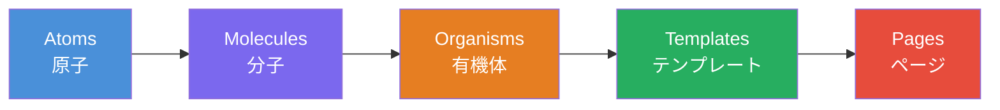
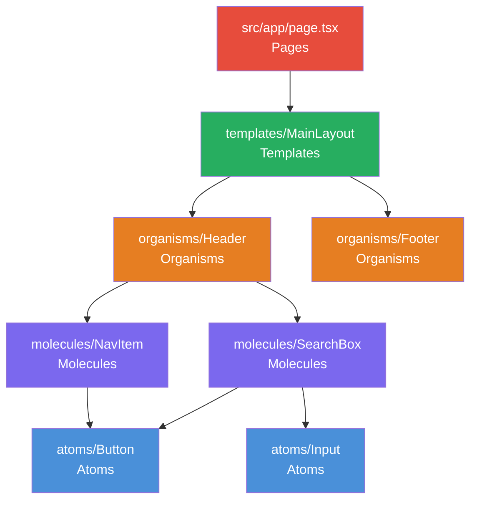
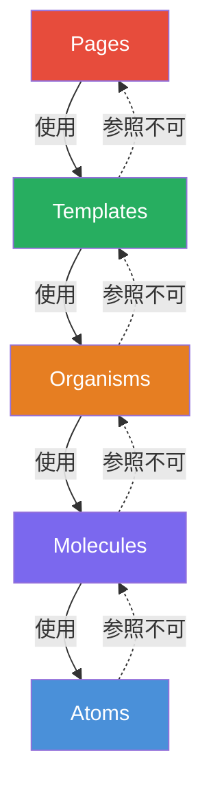
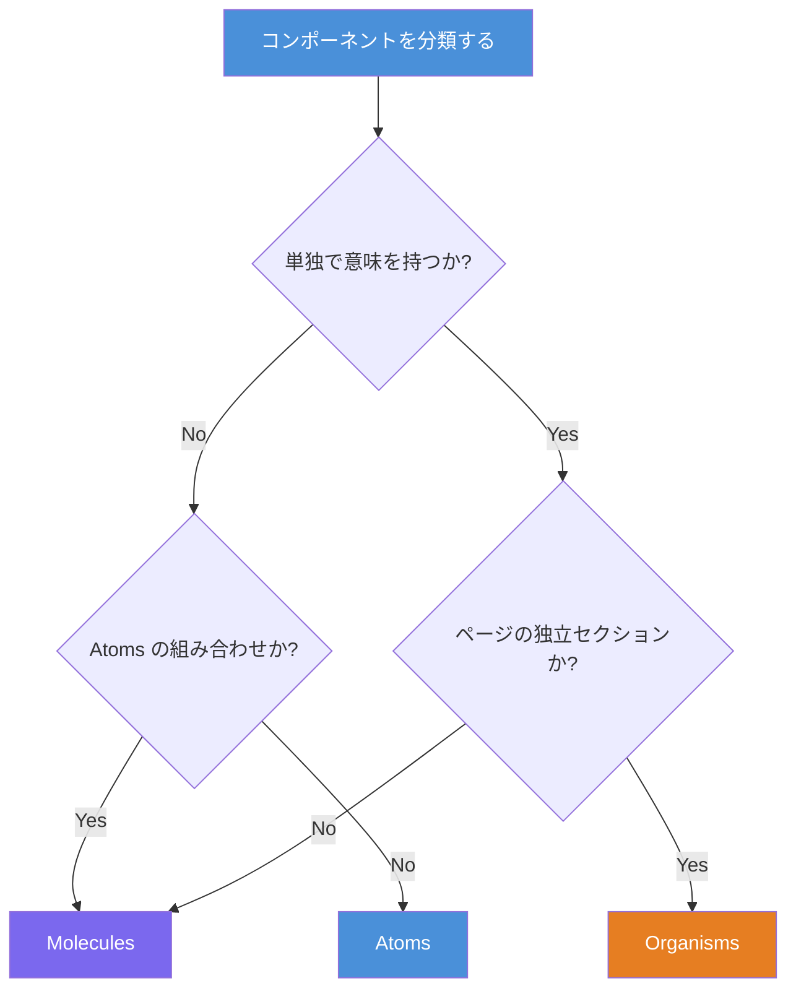

# Atomic Design × React × Next.js × Tailwind CSS 実践ガイド

UI コンポーネントの設計は、プロジェクトの規模が大きくなるほど複雑化する。Brad Frost が提唱した Atomic Design は、化学のメタファーを借りて UI を5つの階層に分割する設計手法である。本記事では、React・Next.js・Tailwind CSS を使った Atomic Design の実装パターンを、ディレクトリ構成から具体的なコード例まで体系的に解説する。

## Atomic Design の全体像

Atomic Design は、UI を以下の5つの階層で構成する。



| レイヤー      | 説明                                            | 例                               |
| ------------- | ----------------------------------------------- | -------------------------------- |
| **Atoms**     | これ以上分割できない最小の UI 要素              | ボタン、入力フィールド、ラベル   |
| **Molecules** | 複数の Atoms を組み合わせた機能単位             | 検索ボックス、フォームフィールド |
| **Organisms** | Molecules や Atoms を組み合わせた独立セクション | ヘッダー、ログインフォーム       |
| **Templates** | コンポーネントを配置したレイアウト構造          | メインレイアウト、ダッシュボード |
| **Pages**     | Templates に実データを注入した最終画面          | トップページ、記事詳細ページ     |

## ディレクトリ構成

Next.js（App Router）と Atomic Design を組み合わせた推奨ディレクトリ構成を示す。

```
src/
├── app/                          # Next.js App Router
│   ├── layout.tsx
│   ├── page.tsx
│   ├── blog/
│   │   ├── page.tsx
│   │   └── [slug]/
│   │       └── page.tsx
│   └── globals.css
├── components/
│   ├── atoms/                    # 最小 UI 要素
│   │   ├── Button/
│   │   │   ├── Button.tsx
│   │   │   └── index.ts
│   │   ├── Input/
│   │   │   ├── Input.tsx
│   │   │   └── index.ts
│   │   ├── Label/
│   │   │   ├── Label.tsx
│   │   │   └── index.ts
│   │   ├── Badge/
│   │   │   ├── Badge.tsx
│   │   │   └── index.ts
│   │   └── index.ts
│   ├── molecules/                # Atoms の組み合わせ
│   │   ├── SearchBox/
│   │   │   ├── SearchBox.tsx
│   │   │   └── index.ts
│   │   ├── FormField/
│   │   │   ├── FormField.tsx
│   │   │   └── index.ts
│   │   ├── NavItem/
│   │   │   ├── NavItem.tsx
│   │   │   └── index.ts
│   │   └── index.ts
│   ├── organisms/                # 独立した UI セクション
│   │   ├── Header/
│   │   │   ├── Header.tsx
│   │   │   └── index.ts
│   │   ├── Footer/
│   │   │   ├── Footer.tsx
│   │   │   └── index.ts
│   │   ├── LoginForm/
│   │   │   ├── LoginForm.tsx
│   │   │   └── index.ts
│   │   └── index.ts
│   └── templates/                # レイアウト構造
│       ├── MainLayout/
│       │   ├── MainLayout.tsx
│       │   └── index.ts
│       ├── DashboardLayout/
│       │   ├── DashboardLayout.tsx
│       │   └── index.ts
│       └── index.ts
└── types/
    └── index.ts
```



## Atoms の実装

Atoms は最小の UI 構成要素であり、単体では機能的な意味を持たない。Tailwind CSS のユーティリティクラスで直接スタイリングする。

### Button

```tsx
type ButtonVariant = 'primary' | 'secondary' | 'danger'

type ButtonProps = {
  children: React.ReactNode
  variant?: ButtonVariant
  disabled?: boolean
  type?: 'button' | 'submit' | 'reset'
  onClick?: () => void
}

const variantStyles: Record<ButtonVariant, string> = {
  primary: 'bg-blue-600 text-white hover:bg-blue-700',
  secondary: 'bg-gray-200 text-gray-800 hover:bg-gray-300',
  danger: 'bg-red-600 text-white hover:bg-red-700',
}

export function Button({
  children,
  variant = 'primary',
  disabled = false,
  type = 'button',
  onClick,
}: ButtonProps) {
  return (
    <button
      type={type}
      disabled={disabled}
      onClick={onClick}
      className={`rounded-lg px-4 py-2 font-semibold transition-colors
        disabled:cursor-not-allowed disabled:opacity-50
        ${variantStyles[variant]}`}
    >
      {children}
    </button>
  )
}
```

### Input

```tsx
type InputProps = {
  type?: 'text' | 'email' | 'password'
  placeholder?: string
  value: string
  onChange: (e: React.ChangeEvent<HTMLInputElement>) => void
}

export function Input({ type = 'text', placeholder, value, onChange }: InputProps) {
  return (
    <input
      type={type}
      placeholder={placeholder}
      value={value}
      onChange={onChange}
      className="rounded-lg border border-gray-300 px-3 py-2
        focus:outline-none focus:ring-2 focus:ring-blue-500"
    />
  )
}
```

### Label

```tsx
type LabelProps = {
  children: React.ReactNode
  htmlFor?: string
}

export function Label({ children, htmlFor }: LabelProps) {
  return (
    <label htmlFor={htmlFor} className="text-sm font-medium text-gray-700">
      {children}
    </label>
  )
}
```

### Badge

```tsx
type BadgeProps = {
  children: React.ReactNode
  color?: 'blue' | 'green' | 'red' | 'gray'
}

const colorStyles = {
  blue: 'bg-blue-100 text-blue-800',
  green: 'bg-green-100 text-green-800',
  red: 'bg-red-100 text-red-800',
  gray: 'bg-gray-100 text-gray-800',
}

export function Badge({ children, color = 'blue' }: BadgeProps) {
  return (
    <span className={`rounded-full px-2.5 py-0.5 text-xs font-medium ${colorStyles[color]}`}>
      {children}
    </span>
  )
}
```

## Molecules の実装

Molecules は複数の Atoms を組み合わせた、特定の機能を持つコンポーネントである。

### FormField

```tsx
import { Input } from '@/components/atoms/Input'
import { Label } from '@/components/atoms/Label'

type FormFieldProps = {
  label: string
  type?: 'text' | 'email' | 'password'
  value: string
  onChange: (e: React.ChangeEvent<HTMLInputElement>) => void
  error?: string
}

export function FormField({ label, type, value, onChange, error }: FormFieldProps) {
  return (
    <div className="flex flex-col gap-1">
      <Label>{label}</Label>
      <Input type={type} value={value} onChange={onChange} />
      {error && <span className="text-sm text-red-500">{error}</span>}
    </div>
  )
}
```

### SearchBox

```tsx
'use client'

import { useState } from 'react'
import { Input } from '@/components/atoms/Input'
import { Button } from '@/components/atoms/Button'

type SearchBoxProps = {
  onSearch: (query: string) => void
  placeholder?: string
}

export function SearchBox({ onSearch, placeholder = '検索...' }: SearchBoxProps) {
  const [query, setQuery] = useState('')

  const handleSubmit = (e: React.FormEvent) => {
    e.preventDefault()
    onSearch(query)
  }

  return (
    <form onSubmit={handleSubmit} className="flex gap-2">
      <Input placeholder={placeholder} value={query} onChange={(e) => setQuery(e.target.value)} />
      <Button type="submit">検索</Button>
    </form>
  )
}
```

### NavItem

```tsx
import Link from 'next/link'

type NavItemProps = {
  href: string
  label: string
  active?: boolean
}

export function NavItem({ href, label, active = false }: NavItemProps) {
  return (
    <Link
      href={href}
      className={`rounded-md px-3 py-2 text-sm font-medium transition-colors
        ${active ? 'bg-blue-600 text-white' : 'text-gray-700 hover:bg-gray-100'}`}
    >
      {label}
    </Link>
  )
}
```

## Organisms の実装

Organisms は Molecules や Atoms を組み合わせた、ページの独立セクションを形成するコンポーネントである。

### Header

```tsx
import { NavItem } from '@/components/molecules/NavItem'
import { SearchBox } from '@/components/molecules/SearchBox'

type HeaderProps = {
  currentPath: string
  onSearch: (query: string) => void
}

const navItems = [
  { href: '/', label: 'Home' },
  { href: '/blog', label: 'Blog' },
  { href: '/about', label: 'About' },
]

export function Header({ currentPath, onSearch }: HeaderProps) {
  return (
    <header className="border-b border-gray-200 bg-white">
      <div className="mx-auto flex max-w-7xl items-center justify-between px-4 py-3">
        <div className="flex items-center gap-8">
          <span className="text-xl font-bold text-gray-900">MyApp</span>
          <nav className="flex gap-1">
            {navItems.map((item) => (
              <NavItem
                key={item.href}
                href={item.href}
                label={item.label}
                active={currentPath === item.href}
              />
            ))}
          </nav>
        </div>
        <SearchBox onSearch={onSearch} />
      </div>
    </header>
  )
}
```

### LoginForm

```tsx
'use client'

import { useState } from 'react'
import { FormField } from '@/components/molecules/FormField'
import { Button } from '@/components/atoms/Button'

type LoginFormProps = {
  onSubmit: (email: string, password: string) => void
}

export function LoginForm({ onSubmit }: LoginFormProps) {
  const [email, setEmail] = useState('')
  const [password, setPassword] = useState('')

  const handleSubmit = (e: React.FormEvent) => {
    e.preventDefault()
    onSubmit(email, password)
  }

  return (
    <form onSubmit={handleSubmit} className="mx-auto max-w-md space-y-4">
      <h2 className="text-2xl font-bold text-gray-900">ログイン</h2>
      <FormField
        label="メールアドレス"
        type="email"
        value={email}
        onChange={(e) => setEmail(e.target.value)}
      />
      <FormField
        label="パスワード"
        type="password"
        value={password}
        onChange={(e) => setPassword(e.target.value)}
      />
      <Button type="submit" variant="primary">
        ログイン
      </Button>
    </form>
  )
}
```

## Templates の実装

Templates はコンポーネントをレイアウトに配置したページレベルの構造を定義する。実際のコンテンツではなく、レイアウトの骨格を提供する。

### MainLayout

```tsx
import { Header } from '@/components/organisms/Header'
import { Footer } from '@/components/organisms/Footer'

type MainLayoutProps = {
  children: React.ReactNode
  currentPath: string
}

export function MainLayout({ children, currentPath }: MainLayoutProps) {
  return (
    <div className="flex min-h-screen flex-col">
      <Header currentPath={currentPath} onSearch={(query) => console.log(query)} />
      <main className="mx-auto w-full max-w-7xl flex-1 px-4 py-8">{children}</main>
      <Footer />
    </div>
  )
}
```

## Pages の実装

Pages は Templates に実際のデータを注入した、ユーザーが操作する最終画面である。Next.js の App Router では `app/` ディレクトリ内の `page.tsx` がこれに該当する。

```tsx
// src/app/page.tsx
import { MainLayout } from '@/components/templates/MainLayout'
import { Badge } from '@/components/atoms/Badge'

export default function HomePage() {
  const posts = [
    { id: 1, title: 'Atomic Design 入門', tag: 'design', date: '2026-02-12' },
    { id: 2, title: 'Next.js 15 の新機能', tag: 'nextjs', date: '2026-02-11' },
  ]

  return (
    <MainLayout currentPath="/">
      <section className="space-y-6">
        <h1 className="text-3xl font-bold text-gray-900">最新の記事</h1>
        <div className="grid gap-4 md:grid-cols-2">
          {posts.map((post) => (
            <article
              key={post.id}
              className="rounded-lg border border-gray-200 p-6 hover:shadow-md"
            >
              <Badge>{post.tag}</Badge>
              <h2 className="mt-2 text-xl font-semibold">{post.title}</h2>
              <time className="text-sm text-gray-500">{post.date}</time>
            </article>
          ))}
        </div>
      </section>
    </MainLayout>
  )
}
```

## 各レイヤーの依存ルール

Atomic Design で最も重要なのは、各レイヤー間の依存方向を厳守することである。



| ルール                       | 説明                                                             |
| ---------------------------- | ---------------------------------------------------------------- |
| **上位から下位への参照のみ** | Organisms は Molecules と Atoms を使えるが、Templates は使えない |
| **同レイヤー間の参照は許容** | Organism が別の Organism を含むケースは許容する                  |
| **Atoms は自己完結**         | Atoms は他のコンポーネントに依存しない                           |
| **状態管理は上位で行う**     | Atoms / Molecules はなるべくステートレスに保つ                   |

## Barrel Export パターン

各レイヤーの `index.ts` で再エクスポートすることで、インポートパスを簡潔にする。

```ts
// components/atoms/index.ts
export { Button } from './Button'
export { Input } from './Input'
export { Label } from './Label'
export { Badge } from './Badge'
```

```ts
// 利用側
import { Button, Input, Label } from '@/components/atoms'
```

## メリットとデメリット

### メリット

- **一貫性の確保**: 共通パーツの運用でデザインが統一される
- **再利用性**: コンポーネントを複数のページで使い回せる
- **並行開発**: レイヤーごとに担当を分けて並行作業が可能
- **テスト容易性**: 小さな単位でテストを書けるため品質を保ちやすい
- **スケーラビリティ**: 大規模プロジェクトでも構造を維持できる

### デメリット

- **境界の曖昧さ**: Molecules と Organisms の線引きがチームで異なる場合がある
- **ファイル数の増加**: 小さなコンポーネントでも個別ファイルが必要
- **初期コスト**: 設計ルールの合意形成やセットアップに時間がかかる
- **過度な分割**: 小規模プロジェクトではオーバーエンジニアリングになりやすい

## 実践的な分類基準

Molecules と Organisms の境界で迷った場合の判断基準を示す。



| 判断基準                  | Molecules        | Organisms              |
| ------------------------- | ---------------- | ---------------------- |
| 独立して意味を持つか      | 部分的           | 完全に独立             |
| 他のページでも使うか      | 部品として再利用 | セクションとして再利用 |
| 内部に Molecules を含むか | 含まない         | 含む場合が多い         |
| ビジネスロジックを持つか  | 持たない         | 持つ場合がある         |

## 参考

- [Atomic Design by Brad Frost](https://atomicdesign.bradfrost.com/)
- [Tailwind CSS 公式ドキュメント](https://tailwindcss.com/docs)
- [Next.js 公式ドキュメント](https://nextjs.org/docs)
- [React 公式ドキュメント](https://ja.react.dev/)
- [Applying Atomic Design to your Next.js project - LogRocket](https://blog.logrocket.com/applying-atomic-design-next-js-project/)
