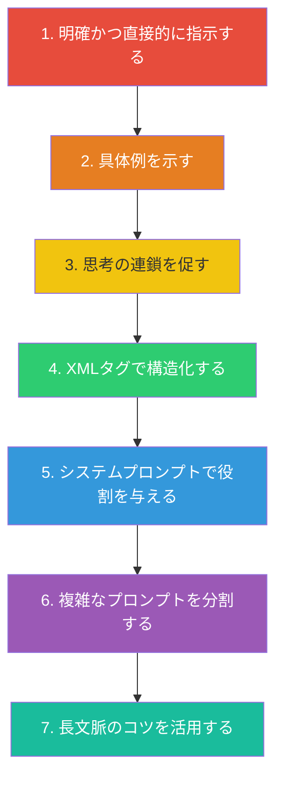
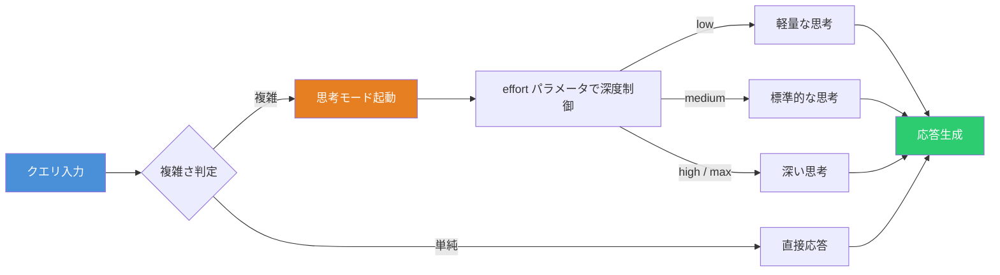
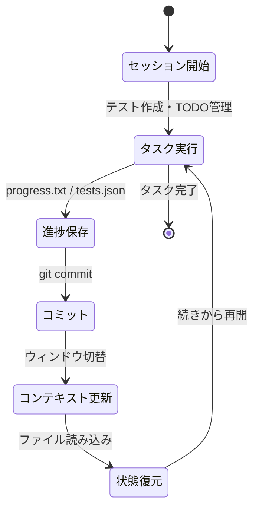

# Claude プロンプトエンジニアリング完全ガイド ― ベストプラクティスと実践テクニック

[Claude](https://claude.ai/) は Anthropic が開発する大規模言語モデルであり、最新の Claude Opus 4.6 は高精度な指示追従能力と長文脈推論を備えている。しかし、その能力を引き出すにはプロンプトの書き方が決定的に重要である。本記事では、公式ドキュメントとコミュニティの知見を統合し、Claude を使いこなすためのプロンプトエンジニアリング手法を体系的に解説する。

## プロンプトエンジニアリングの全体像

Anthropic の公式ドキュメントでは、プロンプトエンジニアリングのテクニックを「最も広く効果的なもの」から「特化したもの」へと順序立てて紹介している。



トラブルシューティング時はこの順番で試すのが推奨されている。以下、各テクニックを深掘りする。

## 1. 明確かつ直接的に指示する

Claude 4.x は指示を**文字通り**に解釈する。曖昧な指示を与えると、推測で補完するのではなく、文字通りの範囲でしか応答しない。「空気を読む」ことを期待してはならない。

### 悪い例と良い例

```text
❌ 悪い例:
分析ダッシュボードを作って

✅ 良い例:
分析ダッシュボードを作成してください。
関連する機能やインタラクションをできる限り多く含めてください。
基本機能にとどまらず、フル機能の実装を目指してください。
```

### 「なぜ」を伝える

指示の背景を説明すると、Claude はゴールを深く理解し、より的確な応答を返す。

```text
❌ 悪い例:
省略記号（…）を絶対に使わないで

✅ 良い例:
あなたの応答はテキスト読み上げエンジンで音声化されます。
読み上げエンジンは省略記号の発音方法を知らないため、
省略記号は絶対に使わないでください。
```

Claude は十分に賢いため、説明から意図を汎化して適用できる。

## 2. マルチショットプロンプティング（具体例の提示）

具体例を数個示すだけで、出力の精度・一貫性・品質が劇的に向上する。これは Claude のプロンプトエンジニアリングにおける最も強力なテクニックの一つである。

```xml
<examples>
  <example>
    <input>ユーザーが「注文をキャンセルしたい」と言った</input>
    <output>
      カテゴリ: 注文管理
      意図: キャンセル要求
      優先度: 高
      推奨アクション: 注文状況を確認し、キャンセル可否を判定
    </output>
  </example>
  <example>
    <input>ユーザーが「商品の色違いはありますか」と言った</input>
    <output>
      カテゴリ: 商品問い合わせ
      意図: バリエーション確認
      優先度: 中
      推奨アクション: 該当商品のカラーバリエーションを検索
    </output>
  </example>
</examples>

上記の例に従って、以下の入力を分類してください:
ユーザーが「届いた商品が壊れていた」と言った
```

## 3. 思考の連鎖（Chain of Thought）

複雑な推論を必要とするタスクでは、Claude に「考えるプロセス」を明示的に踏ませることで精度が向上する。

```text
以下の数学の問題を解いてください。
まず <thinking> タグ内でステップバイステップに考え、
最終回答を <answer> タグ内に記述してください。

問題: 3つの連続する偶数の和が78のとき、最小の偶数はいくつか？
```

### Extended Thinking と Adaptive Thinking

Claude Opus 4.6 では **Adaptive Thinking**（`thinking: {type: "adaptive"}`）が導入された。クエリの複雑さに応じて、思考の深さを動的に調整する仕組みである。



API での設定例を以下に示す。

```python
import anthropic

client = anthropic.Anthropic()

response = client.messages.create(
    model='claude-opus-4-6',
    max_tokens=64000,
    thinking={'type': 'adaptive'},
    output_config={'effort': 'high'},
    messages=[
        {'role': 'user', 'content': '複雑な推論タスク...'}
    ],
)
```

思考モードの発動頻度もプロンプトで制御可能である。

```text
# 思考を抑制したい場合
Extended Thinking はレイテンシを増加させるため、
回答品質が明確に向上する場合のみ使用してください。
マルチステップの推論が必要な問題に限定してください。
迷った場合は直接応答してください。
```

## 4. XMLタグによるプロンプト構造化

XMLタグは Claude のプロンプトエンジニアリングにおける秘密兵器である。複数のコンポーネント（文脈、指示、例、出力形式）を含むプロンプトで特に威力を発揮する。

### なぜ XML タグが効果的なのか

- **明確性**: プロンプトの各部分を明確に分離できる
- **正確性**: 指示と例や文脈を混同するミスが減る
- **柔軟性**: 部分的な修正・追加・削除が容易になる
- **解析性**: 出力に XML タグを使わせると後処理が簡単になる

### 4ブロックパターン

プロンプトを以下の4ブロックで構造化すると、Claude の理解精度が大幅に向上する。

```xml
<instructions>
あなたはセキュリティ監査の専門家です。
提供されたコードの脆弱性を分析してください。
</instructions>

<context>
このコードは公開APIのエンドポイントで使用されています。
認証済みユーザーのみがアクセスできます。
フレームワークはHonoを使用しています。
</context>

<task>
以下のコードのセキュリティ脆弱性を特定し、
修正案を提示してください。
</task>

<output_format>
各脆弱性について以下の形式で出力してください:
- 脆弱性名
- 深刻度（高/中/低）
- 該当箇所
- 修正コード
</output_format>
```

### ネストとタグの命名規則

タグはネストでき、名前は内容を反映させるのが望ましい。特定の「正解」タグ名はないが、一貫性が重要である。

```xml
<document>
  <metadata>
    <author>nakita628</author>
    <date>2026-02-16</date>
  </metadata>
  <content>
    分析対象のテキストをここに配置...
  </content>
</document>

<instructions>
上記 <document> タグ内のテキストを要約してください。
<metadata> の情報も参照してください。
</instructions>
```

## 5. システムプロンプトの設計

システムプロンプトは Claude の振る舞いの基盤を定義する。Claude 4.x ではシステムプロンプトへの感度が高くなっているため、過去のモデル向けに書かれた強い表現（`CRITICAL: You MUST...`）は過剰反応を招く可能性がある。

### システムプロンプトを「契約書」として書く

良いシステムプロンプトは、短い契約書のように明示的で、境界が明確で、検証可能であるべきである。

```text
あなたはTypeScriptのコードレビュアーです。

<behavior>
- コードの問題点を指摘する際は、必ず修正案も提示する
- パフォーマンスとセキュリティの観点を優先する
- 主観的な好みではなく、客観的な基準に基づいて判断する
</behavior>

<constraints>
- TypeScript/JavaScript以外のコードについては「対象外です」と回答する
- 100行を超えるコードは、最も重要な3つの問題に絞って指摘する
- 推測でコメントしない。不明な場合は質問する
</constraints>
```

### 自律性と安全性のバランス

エージェント的な使い方をする場合、Claude の行動範囲を明確にすることが重要である。

```text
アクションの可逆性と影響範囲を考慮してください。
ファイル編集やテスト実行のようなローカルで可逆な操作は
自律的に行って構いません。

以下の操作は実行前に確認してください:
- 破壊的操作: ファイル削除、ブランチ削除、テーブルDROP
- 不可逆操作: git push --force、git reset --hard
- 外部に影響する操作: PRへのコメント、メッセージ送信
```

## 6. 重箱の隅をつつくテクニック集

ここからは、公式ドキュメントには詳しく書かれていない実践的なテクニックを紹介する。

### 不確実性の許容

ハルシネーションを減らす最も効果的な方法の一つは、Claude に「わからない」と言う権限を明示的に与えることである。

```text
<uncertainty_policy>
確信が持てない情報については「不確実」と明記してください。
推測する場合は「推測:」というプレフィックスを付けてください。
事実の主張にはソースを引用してください。
知らないことは「わかりません」と率直に答えてください。
</uncertainty_policy>
```

### 出力フォーマットの精密制御

Claude 4.x はマークダウンをデフォルトで多用する傾向がある。散文形式が欲しい場合は明示的に指示する。

```text
<avoid_excessive_markdown>
レポートや分析など長文コンテンツを書く際は、
完全な文と段落で構成された、流れるような散文で書いてください。
箇条書きは、本当に離散的な項目を列挙する場合、
またはユーザーが明示的に要求した場合のみ使用してください。
**太字**や*イタリック*の使用を避けてください。
</avoid_excessive_markdown>
```

### 並列ツール呼び出しの最適化

エージェント利用時に複数のツール呼び出しを並列化する指示を与えると、処理速度が大幅に向上する。

```text
<parallel_tool_calls>
複数のツールを呼び出す意図があり、ツール間に依存関係がない場合、
独立したツール呼び出しをすべて並列で実行してください。
例: 3つのファイルを読む場合、3つのread呼び出しを同時に実行する。
ただし、前のツール呼び出しの結果に依存するパラメータがある場合は
逐次実行してください。
</parallel_tool_calls>
```

### コンテキストウィンドウの状態管理

長いタスクを複数のコンテキストウィンドウにまたがって実行する場合、構造化された状態管理が鍵となる。



```json
// tests.json の例
{
  "tests": [
    { "id": 1, "name": "auth_flow", "status": "passing" },
    { "id": 2, "name": "user_api", "status": "failing" },
    { "id": 3, "name": "payment", "status": "not_started" }
  ],
  "total": 200,
  "passing": 150,
  "failing": 25,
  "not_started": 25
}
```

### ハルシネーション抑制の強化

コーディングタスクでの幻覚を最小限に抑えるプロンプトパターンを以下に示す。

```text
<investigate_before_answering>
開いていないコードについて推測しないでください。
ユーザーが特定のファイルに言及した場合、
回答する前に必ずそのファイルを読んでください。
コードベースに関する質問には、
関連ファイルを調査してから回答してください。
確信がない限り、コードについて主張しないでください。
根拠のある、ハルシネーションのない回答を心がけてください。
</investigate_before_answering>
```

## 実践プロンプト集

最後に、すぐに使える実践的なプロンプトパターンを紹介する。

### コードレビュー

```text
<instructions>
以下のコードをレビューしてください。

観点:
1. バグや論理エラー
2. セキュリティ脆弱性（OWASP Top 10）
3. パフォーマンスのボトルネック
4. 可読性と保守性

<output_format>
各指摘について:
- 深刻度: 🔴高 / 🟡中 / 🟢低
- 箇所: ファイル名と行番号
- 問題: 何が問題か
- 修正案: 具体的なコード
</output_format>
</instructions>

<code>
レビュー対象のコードをここに貼り付け
</code>
```

### 技術調査

```text
<task>
以下のトピックについて構造的に調査してください。

トピック: [調査対象]

<approach>
1. 複数の情報源から情報を収集する
2. 競合する仮説を複数立てる
3. 各仮説の確信度を追跡する
4. 自身のアプローチを定期的に批判的に評価する
5. 仮説ツリーを更新しながら調査を進める
</approach>

<output>
- 調査結果のサマリー
- 確信度付きの結論
- 残る不確実性の一覧
- 推奨される次のステップ
</output>
</task>
```

### リファクタリング指示

```text
<context>
このファイルは認証モジュールの一部です。
Express.js のミドルウェアとして使用されています。
</context>

<task>
以下のコードをリファクタリングしてください。
</task>

<constraints>
- 外部インターフェース（関数シグネチャ）は変更しない
- 既存のテストがすべてパスすることを保証する
- 過度な抽象化を避け、最小限の変更に留める
- 仮想的な将来の要件のための設計はしない
</constraints>
```

## まとめ

Claude のプロンプトエンジニアリングで最も重要な原則は以下の3点に集約される。

1. **明示的に指示する** ― Claude は空気を読まない。期待する振る舞いを具体的に記述する
2. **構造化する** ― XMLタグと4ブロックパターンで、プロンプトの各要素を明確に分離する
3. **例を示す** ― 抽象的な説明よりも、具体的な入出力例が最も効果的である

Claude 4.x は指示を文字通りに忠実に実行する。これは制約ではなく、精密な制御が可能であるという強みである。適切なプロンプト設計により、Claude は極めて強力なツールとなる。

## 参考

- [Prompt engineering overview - Anthropic Docs](https://platform.claude.com/docs/en/build-with-claude/prompt-engineering/overview)
- [Prompting best practices（Claude 4.x）- Anthropic Docs](https://docs.anthropic.com/en/docs/build-with-claude/prompt-engineering/claude-4-best-practices)
- [Be clear and direct - Anthropic Docs](https://platform.claude.com/docs/en/build-with-claude/prompt-engineering/be-clear-and-direct)
- [Use XML tags - Anthropic Docs](https://platform.claude.com/docs/en/build-with-claude/prompt-engineering/use-xml-tags)
- [Anthropic Prompt Engineering Interactive Tutorial - GitHub](https://github.com/anthropics/prompt-eng-interactive-tutorial)
