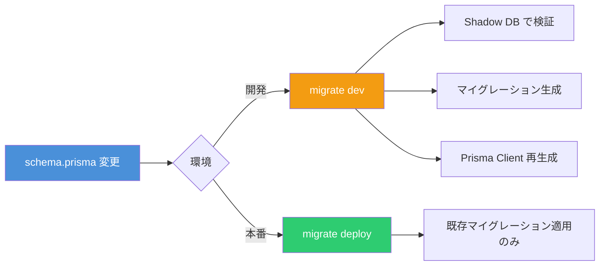
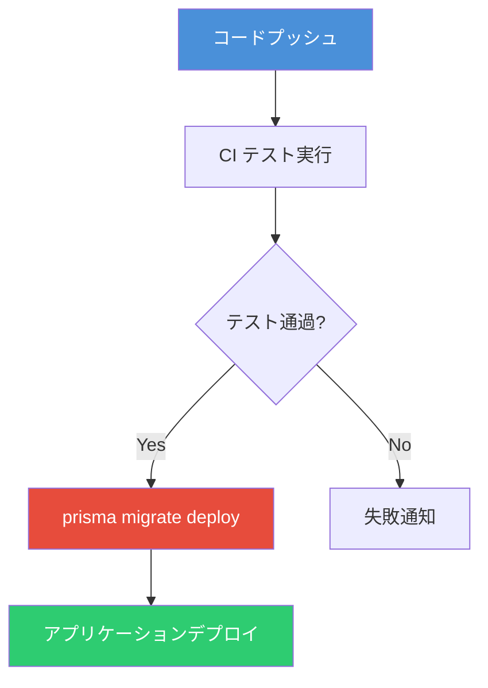
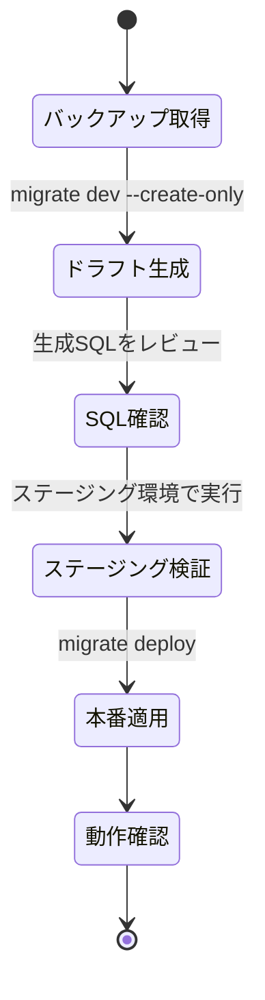
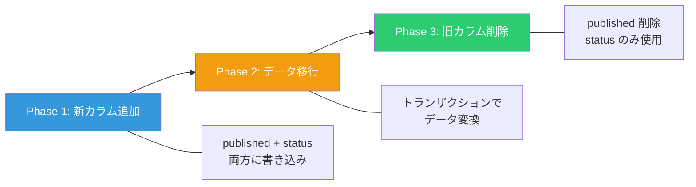

# Prisma 本番運用ガイド ― マイグレーション・DROP TABLE・ALTER TABLE の実践

[Prisma](https://www.prisma.io/) は TypeScript/JavaScript 向けの ORM であり、型安全なデータベースアクセスと宣言的スキーマ管理を提供する。開発環境では `prisma migrate dev` で手軽にスキーマを変更できるが、本番環境では慎重なマイグレーション戦略が不可欠である。本記事では、本番運用に焦点を当て、マイグレーションの基礎から DROP TABLE・ALTER TABLE 相当の操作まで実践的に解説する。

## 開発環境と本番環境の違い

Prisma Migrate は開発用と本番用で明確にコマンドを分けている（[公式: Development and Production](https://www.prisma.io/docs/orm/prisma-migrate/workflows/development-and-production)）。この区別を理解することが安全な運用の第一歩である。



| 項目                 | `migrate dev` | `migrate deploy`     |
| -------------------- | ------------- | -------------------- |
| 用途                 | 開発環境      | 本番・ステージング   |
| スキーマドリフト検出 | あり          | なし                 |
| マイグレーション生成 | あり          | なし（既存のみ適用） |
| Shadow Database      | 使用する      | 使用しない           |
| DB リセット          | 可能          | 不可                 |
| Prisma Client 生成   | 自動          | なし                 |

**重要**: `migrate dev` を本番環境で実行してはならない。本番では必ず `migrate deploy` を使用する（[公式: Deploying database changes with Prisma Migrate](https://www.prisma.io/docs/orm/prisma-client/deployment/deploy-database-changes-with-prisma-migrate)）。

### 主要 CLI コマンド一覧

本記事で使用する CLI コマンドの全体像を把握しておく。各コマンドの詳細は [公式: Prisma CLI Reference](https://www.prisma.io/docs/orm/reference/prisma-cli-reference) を参照。

| コマンド                                                                                           | 用途                                   | 主要オプション                                                     |
| -------------------------------------------------------------------------------------------------- | -------------------------------------- | ------------------------------------------------------------------ |
| [`migrate dev`](https://www.prisma.io/docs/orm/reference/prisma-cli-reference#migrate-dev)         | 開発環境でマイグレーション生成・適用   | `--name` マイグレーション名, `--create-only` 生成のみ（未適用）    |
| [`migrate deploy`](https://www.prisma.io/docs/orm/reference/prisma-cli-reference#migrate-deploy)   | 本番環境で保留中のマイグレーション適用 | なし（安全のためオプション最小）                                   |
| [`migrate resolve`](https://www.prisma.io/docs/orm/reference/prisma-cli-reference#migrate-resolve) | 失敗したマイグレーションの状態を修正   | `--applied` 適用済みマーク, `--rolled-back` ロールバック済みマーク |
| [`migrate diff`](https://www.prisma.io/docs/orm/reference/prisma-cli-reference#migrate-diff)       | 2つのスキーマソースの差分を出力        | `--from-*` / `--to-*` ソース指定, `--script` SQL出力               |
| [`db pull`](https://www.prisma.io/docs/orm/reference/prisma-cli-reference#db-pull)                 | 既存DBからスキーマを取り込む           | `--force` 手動変更を上書き                                         |
| [`db push`](https://www.prisma.io/docs/orm/reference/prisma-cli-reference#db-push)                 | マイグレーションなしでスキーマを反映   | `--accept-data-loss` データ損失警告を無視                          |

## セットアップと初回マイグレーション

### プロジェクト初期化

```bash
npm init -y
npm install prisma @prisma/client
npx prisma init
```

### スキーマ定義

```prisma
// prisma/schema.prisma
generator client {
  provider = "prisma-client-js"
}

datasource db {
  provider = "postgresql"
  url      = env("DATABASE_URL")
}

model User {
  id        Int      @id @default(autoincrement())
  email     String   @unique
  name      String?
  posts     Post[]
  createdAt DateTime @default(now())
  updatedAt DateTime @updatedAt
}

model Post {
  id        Int      @id @default(autoincrement())
  title     String
  content   String?
  published Boolean  @default(false)
  author    User     @relation(fields: [authorId], references: [id])
  authorId  Int
  createdAt DateTime @default(now())
  updatedAt DateTime @updatedAt
}
```

### 初回マイグレーション実行

初回マイグレーションの手順は[公式: Getting started with Prisma Migrate](https://www.prisma.io/docs/orm/prisma-migrate/getting-started) に詳しい。

```bash
npx prisma migrate dev --name init
```

このコマンドにより `prisma/migrations/20260217000000_init/migration.sql` が生成される。

```sql
-- CreateTable
CREATE TABLE "User" (
    "id" SERIAL NOT NULL,
    "email" TEXT NOT NULL,
    "name" TEXT,
    "createdAt" TIMESTAMP(3) NOT NULL DEFAULT CURRENT_TIMESTAMP,
    "updatedAt" TIMESTAMP(3) NOT NULL,

    CONSTRAINT "User_pkey" PRIMARY KEY ("id")
);

-- CreateTable
CREATE TABLE "Post" (
    "id" SERIAL NOT NULL,
    "title" TEXT NOT NULL,
    "content" TEXT,
    "published" BOOLEAN NOT NULL DEFAULT false,
    "authorId" INTEGER NOT NULL,
    "createdAt" TIMESTAMP(3) NOT NULL DEFAULT CURRENT_TIMESTAMP,
    "updatedAt" TIMESTAMP(3) NOT NULL,

    CONSTRAINT "Post_pkey" PRIMARY KEY ("id")
);

-- CreateIndex
CREATE UNIQUE INDEX "User_email_key" ON "User"("email");

-- AddForeignKey
ALTER TABLE "Post" ADD CONSTRAINT "Post_authorId_fkey"
    FOREIGN KEY ("authorId") REFERENCES "User"("id")
    ON DELETE RESTRICT ON UPDATE CASCADE;
```

## 本番デプロイのベストプラクティス

### CI/CD パイプラインへの組み込み

`migrate deploy` は CI/CD パイプラインの一部として自動実行するのが理想である（[公式: Deploying database changes](https://www.prisma.io/docs/orm/prisma-client/deployment/deploy-database-changes-with-prisma-migrate)）。Prisma 公式は「`migrate deploy` は自動化された CI/CD パイプラインの一部であるべきであり、本番データベースへのローカル実行は推奨しない」と明記している。



### GitHub Actions の例

```yaml
name: Deploy
on:
  push:
    branches: [main]

jobs:
  deploy:
    runs-on: ubuntu-latest
    steps:
      - uses: actions/checkout@v4

      - name: Setup Node.js
        uses: actions/setup-node@v4
        with:
          node-version: '20'

      - name: Install dependencies
        run: npm ci

      - name: Apply database migrations
        run: npx prisma migrate deploy
        env:
          DATABASE_URL: ${{ secrets.DATABASE_URL }}

      - name: Generate Prisma Client
        run: npx prisma generate

      - name: Deploy application
        run: npm run deploy
```

### Docker での運用

```dockerfile
FROM node:20-slim AS builder
WORKDIR /app
COPY package*.json ./
COPY prisma ./prisma/
RUN npm ci
RUN npx prisma generate

COPY . .
RUN npm run build

FROM node:20-slim
WORKDIR /app
COPY --from=builder /app/node_modules ./node_modules
COPY --from=builder /app/prisma ./prisma
COPY --from=builder /app/dist ./dist
COPY --from=builder /app/package*.json ./

# エントリポイントでマイグレーション実行後にアプリ起動
CMD ["sh", "-c", "npx prisma migrate deploy && node dist/main.js"]
```

### 接続プーリングとシングルトンパターン

Next.js などのフレームワークでは、開発時のホットリロードで `PrismaClient` のインスタンスが大量に生成される問題がある。公式はシングルトンパターンを推奨している（[公式: Best practice for instantiating Prisma Client](https://www.prisma.io/docs/orm/more/help-and-troubleshooting/help-articles/nextjs-prisma-client-dev-practices)）。

```typescript
import { PrismaClient } from '@prisma/client'

const prisma = new PrismaClient({
  log: ['error'],
  datasources: {
    db: {
      url: process.env.DATABASE_URL,
    },
  },
})

// シングルトンパターン（Next.js のホットリロード対策）
const globalForPrisma = globalThis as unknown as {
  prisma: PrismaClient | undefined
}

export const db = globalForPrisma.prisma ?? prisma

if (process.env.NODE_ENV !== 'production') {
  globalForPrisma.prisma = db
}
```

#### SPA（Express / Hono 等）ではシングルトンは必要か？

シングルトンパターンが必要になるのは **Next.js の開発時ホットリロード** が原因である。Next.js はコード変更時にモジュールを再評価するが、プロセス自体は再起動しない。そのため `new PrismaClient()` が呼ばれるたびにインスタンスが蓄積し、10 個を超えると Prisma が警告を発する（[GitHub: Remove need for singleton snippet for Next.js users #17566](https://github.com/prisma/prisma/issues/17566)）。

一方、Express や Hono など通常の Node.js サーバーで `ts-node-dev` や `nodemon` を使う場合、ホットリロード時にプロセスごと再起動されるため、メモリはクリアされ `PrismaClient` が蓄積することはない。

| 環境                     | シングルトン   | 理由                                                                            |
| ------------------------ | -------------- | ------------------------------------------------------------------------------- |
| Next.js（開発時）        | **必要**       | ホットリロードでモジュール再評価、プロセスは維持                                |
| Next.js（本番）          | 不要           | ホットリロードなし                                                              |
| Express / Hono + nodemon | 不要           | リロード時にプロセス再起動                                                      |
| Express / Hono（本番）   | 不要           | インスタンスは1つだけ生成                                                       |
| SPA フロントエンド       | **該当しない** | Prisma はサーバーサイドで動作するため、SPA のフロントエンドからは直接使用しない |

**注意**: SPA アーキテクチャであっても、Prisma はあくまでバックエンド（API サーバー）で動作する。フロントエンドの SPA から直接 Prisma を呼び出すことはない。シングルトンが必要かどうかは「バックエンドフレームワークのホットリロード方式」で決まる。

## ALTER TABLE ― カラム追加・変更・リネーム

### カラム追加

スキーマにフィールドを追加するだけで、Prisma が `ALTER TABLE ... ADD COLUMN` を生成する。

```prisma
model User {
  id        Int      @id @default(autoincrement())
  email     String   @unique
  name      String?
  bio       String?  // 新規追加
  posts     Post[]
  createdAt DateTime @default(now())
  updatedAt DateTime @updatedAt
}
```

```bash
npx prisma migrate dev --name add-user-bio
```

生成される SQL:

```sql
ALTER TABLE "User" ADD COLUMN "bio" TEXT;
```

### カラムリネーム（--create-only で安全に）

Prisma はフィールド名の変更を「旧カラム削除 + 新カラム追加」と解釈する（[公式: Customizing migrations](https://www.prisma.io/docs/orm/prisma-migrate/workflows/customizing-migrations)）。データを失わないためには `--create-only` でドラフトを作成し、SQL を手動で修正する必要がある。

```prisma
model User {
  id        Int      @id @default(autoincrement())
  email     String   @unique
  name      String?
  biography String?  // bio → biography にリネーム
  posts     Post[]
  createdAt DateTime @default(now())
  updatedAt DateTime @updatedAt
}
```

```bash
# ドラフト作成（適用はしない）
npx prisma migrate dev --name rename-bio-to-biography --create-only
```

生成された SQL（データが消える危険なバージョン）:

```sql
-- Prisma が自動生成するSQL（危険）
ALTER TABLE "User" DROP COLUMN "bio";
ALTER TABLE "User" ADD COLUMN "biography" TEXT;
```

これを手動で以下のように修正する:

```sql
-- 安全なリネーム
ALTER TABLE "User" RENAME COLUMN "bio" TO "biography";
```

修正後にマイグレーションを適用する:

```bash
npx prisma migrate dev
```

### カラムの型変更

```prisma
model Post {
  id        Int      @id @default(autoincrement())
  title     String   @db.VarChar(500)  // TEXT → VARCHAR(500)
  content   String?
  published Boolean  @default(false)
  author    User     @relation(fields: [authorId], references: [id])
  authorId  Int
  createdAt DateTime @default(now())
  updatedAt DateTime @updatedAt
}
```

```bash
npx prisma migrate dev --name change-title-type --create-only
```

生成される SQL:

```sql
ALTER TABLE "Post" ALTER COLUMN "title" SET DATA TYPE VARCHAR(500);
```

## DROP TABLE ― テーブル削除

### モデル削除によるテーブル削除

スキーマからモデルを削除すると、Prisma は `DROP TABLE` を生成する。

```prisma
// Post モデルを削除した場合の schema.prisma
generator client {
  provider = "prisma-client-js"
}

datasource db {
  provider = "postgresql"
  url      = env("DATABASE_URL")
}

model User {
  id        Int      @id @default(autoincrement())
  email     String   @unique
  name      String?
  createdAt DateTime @default(now())
  updatedAt DateTime @updatedAt
}
```

```bash
npx prisma migrate dev --name drop-post-table --create-only
```

生成される SQL:

```sql
-- DropForeignKey
ALTER TABLE "Post" DROP CONSTRAINT "Post_authorId_fkey";

-- DropTable
DROP TABLE "Post";
```

**本番環境では `--create-only` で確認してから適用すること**（[公式: Customizing migrations](https://www.prisma.io/docs/orm/prisma-migrate/workflows/customizing-migrations)）。データの完全消失を伴うため、バックアップの取得が必須である。

### 安全な DROP TABLE の手順



## Expand and Contract パターン ― 安全なスキーマ変更

本番環境でダウンタイムなしにスキーマを変更するための推奨パターンである（[公式: How to migrate data using the expand and contract pattern](https://www.prisma.io/docs/guides/data-migration)）。3つのフェーズに分けて段階的に変更を行う。

### 実践例: `published` (Boolean) → `status` (Enum) への移行

#### Phase 1: Expand（拡張）

新しいカラムを追加し、アプリケーションが両方のカラムに書き込むように修正する。

```prisma
enum PostStatus {
  DRAFT
  PUBLISHED
  ARCHIVED
}

model Post {
  id        Int         @id @default(autoincrement())
  title     String
  content   String?
  published Boolean     @default(false)  // 旧カラム（残す）
  status    PostStatus  @default(DRAFT)  // 新カラム（追加）
  author    User        @relation(fields: [authorId], references: [id])
  authorId  Int
  createdAt DateTime    @default(now())
  updatedAt DateTime    @updatedAt
}
```

```bash
npx prisma migrate dev --name add-status-column
```

アプリケーション側で両方に書き込む:

```typescript
await prisma.post.create({
  data: {
    title: 'New Post',
    content: 'Content here',
    published: true,
    status: 'PUBLISHED', // 新カラムにも書き込む
    authorId: 1,
  },
})
```

#### Phase 2: Migrate（データ移行）

既存データを新しいカラムに変換する。トランザクションで安全に実行する。

```typescript
import { PrismaClient, PostStatus } from '@prisma/client'

const prisma = new PrismaClient()

async function migrateData() {
  await prisma.$transaction(async (tx) => {
    // published: true → status: PUBLISHED
    await tx.post.updateMany({
      where: { published: true, status: 'DRAFT' },
      data: { status: PostStatus.PUBLISHED },
    })

    // published: false → status: DRAFT（デフォルトなので確認のみ）
    const count = await tx.post.count({
      where: { published: false, status: 'DRAFT' },
    })
    console.log(`${count} posts confirmed as DRAFT`)
  })
}

migrateData()
  .catch(console.error)
  .finally(() => prisma.$disconnect())
```

#### Phase 3: Contract（収縮）

アプリケーションの読み込み元を `status` に切り替えた後、旧カラムを削除する。

```prisma
enum PostStatus {
  DRAFT
  PUBLISHED
  ARCHIVED
}

model Post {
  id        Int         @id @default(autoincrement())
  title     String
  content   String?
  // published カラムを削除
  status    PostStatus  @default(DRAFT)
  author    User        @relation(fields: [authorId], references: [id])
  authorId  Int
  createdAt DateTime    @default(now())
  updatedAt DateTime    @updatedAt
}
```

```bash
npx prisma migrate dev --name remove-published-column
```

生成される SQL:

```sql
ALTER TABLE "Post" DROP COLUMN "published";
```



## 既存データベースへの導入（ベースライン）

すでにデータが存在する本番データベースに Prisma Migrate を導入するには、ベースライニングを行う（[公式: Baselining a database](https://www.prisma.io/docs/orm/prisma-migrate/getting-started#baselining-a-database)）。ベースライニングとは、既に適用済みのマイグレーションがあることを Prisma に伝え、既存テーブルを再作成しようとするエラーを回避する手法である。

```bash
# 1. 既存スキーマを取り込む
npx prisma db pull

# 2. ベースラインマイグレーションディレクトリを作成
mkdir -p prisma/migrations/0_init

# 3. 現在のスキーマからSQLを生成（適用はしない）
npx prisma migrate diff \
  --from-empty \
  --to-schema-datamodel prisma/schema.prisma \
  --script > prisma/migrations/0_init/migration.sql

# 4. このマイグレーションを「適用済み」としてマーク
npx prisma migrate resolve --applied 0_init
```

これにより、Prisma が初回マイグレーションで既存テーブルを `CREATE TABLE` しようとしてエラーになる問題を回避できる。

## 本番トラブルシューティング

### マイグレーション失敗時の対応

失敗したマイグレーションの対処方法は [公式: Production troubleshooting](https://www.prisma.io/docs/orm/prisma-migrate/workflows/patching-and-hotfixing) に詳しい。`migrate diff` でスキーマと履歴の差分を確認し、`migrate resolve` で状態を修正する。

```bash
# 現在のスキーマとマイグレーション履歴の差分を確認
npx prisma migrate diff \
  --from-migrations ./prisma/migrations \
  --to-schema-datamodel ./prisma/schema.prisma \
  --script

# 失敗したマイグレーションを手動でロールバック後、解決済みとしてマーク
npx prisma migrate resolve --rolled-back 20260217000000_failed_migration

# または手動で修正を適用後、適用済みとしてマーク
npx prisma migrate resolve --applied 20260217000000_failed_migration
```

### Advisory Lock のタイムアウト

`migrate deploy` 実行時、Prisma は 10 秒のアドバイザリロックを取得する（[公式: Development and Production](https://www.prisma.io/docs/orm/prisma-migrate/workflows/development-and-production)）。複数インスタンスから同時にマイグレーションを実行しても、ロックにより安全にシリアライズされる。ただし、ロック取得がタイムアウトした場合はリトライロジックを実装しておくとよい。

## まとめ

| 操作           | Prisma での方法                    | 注意点                          |
| -------------- | ---------------------------------- | ------------------------------- |
| テーブル作成   | モデルを追加して `migrate dev`     | 自動で `CREATE TABLE` 生成      |
| カラム追加     | フィールドを追加して `migrate dev` | `ALTER TABLE ADD COLUMN`        |
| カラムリネーム | `--create-only` で生成後 SQL 修正  | `RENAME COLUMN` に書き換え      |
| カラム型変更   | `--create-only` で確認推奨         | データ変換の互換性に注意        |
| テーブル削除   | モデルを削除して `migrate dev`     | `DROP TABLE` ― バックアップ必須 |
| 本番デプロイ   | `migrate deploy`                   | CI/CD で自動化                  |
| 安全な移行     | Expand and Contract パターン       | 3 フェーズで段階的に            |

Prisma は宣言的なスキーマ定義により多くの操作を自動化するが、本番環境ではマイグレーション SQL を `--create-only` で事前確認し、データを失わないよう慎重に運用することが重要である。

## 参考

- [Prisma Migrate - Development and Production](https://www.prisma.io/docs/orm/prisma-migrate/workflows/development-and-production)
- [Deploying database changes with Prisma Migrate](https://www.prisma.io/docs/orm/prisma-client/deployment/deploy-database-changes-with-prisma-migrate)
- [Customizing migrations | Prisma Documentation](https://www.prisma.io/docs/orm/prisma-migrate/workflows/customizing-migrations)
- [How to migrate data with Prisma ORM using the expand and contract pattern](https://www.prisma.io/docs/guides/data-migration)
- [Getting started with Prisma Migrate](https://www.prisma.io/docs/orm/prisma-migrate/getting-started)
- [Best practice for instantiating Prisma Client with Next.js](https://www.prisma.io/docs/orm/more/help-and-troubleshooting/help-articles/nextjs-prisma-client-dev-practices)
- [Production troubleshooting](https://www.prisma.io/docs/orm/prisma-migrate/workflows/patching-and-hotfixing)
- [Prisma CLI Reference](https://www.prisma.io/docs/orm/reference/prisma-cli-reference)
- [GitHub: Remove need for singleton snippet for Next.js users #17566](https://github.com/prisma/prisma/issues/17566)
