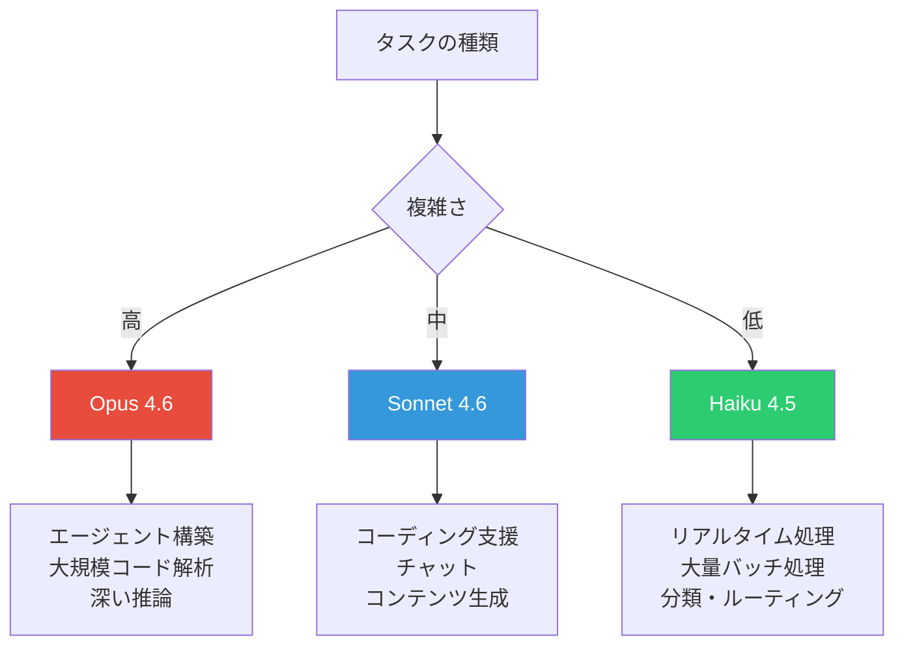
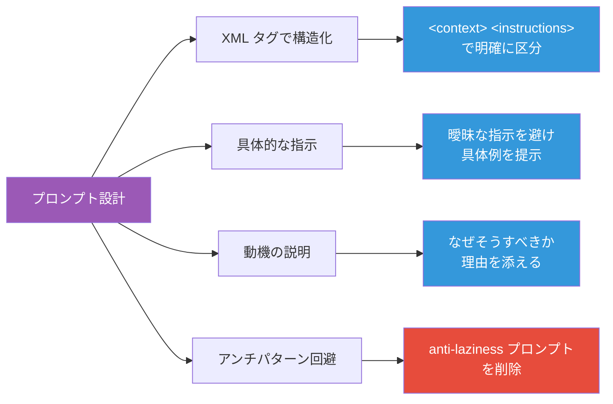
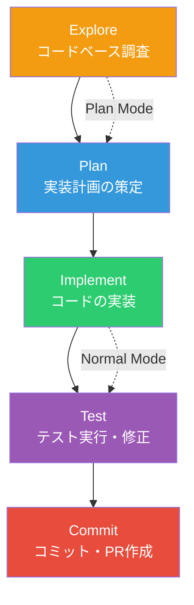

# Claude 活用ガイド ― API・Claude Code・MCP のベストプラクティス

[Claude](https://claude.ai/) は Anthropic が開発する AI アシスタントであり、コーディング支援、文章生成、データ分析など幅広いタスクに対応する。本記事では、開発者視点で Claude を最大限活用するためのベストプラクティスを体系的に解説する。

## モデルラインナップと選定基準

Claude は用途に応じて複数のモデルを提供している。タスクの複雑さ、レイテンシ要件、コストのバランスを考慮して適切なモデルを選定することが重要である。



| モデル | API ID | コンテキスト | 最大出力 | 特徴 |
|--------|--------|-------------|---------|------|
| **Opus 4.6** | `claude-opus-4-6` | 200K（1M β） | 128K | 最高性能、複雑なエージェント向け |
| **Sonnet 4.6** | `claude-sonnet-4-6` | 200K（1M β） | 64K | 速度と性能のバランス |
| **Haiku 4.5** | `claude-haiku-4-5-20251001` | 200K | 64K | 最速・最低コスト |

## Adaptive Thinking ― 動的な思考制御

Claude 4.6 系モデルでは Adaptive Thinking が導入され、タスクの難易度に応じて思考の深さを動的に調整する。従来の `budget_tokens` による手動制御に代わる推奨アプローチである。

```typescript
import Anthropic from '@anthropic-ai/sdk'

const client = new Anthropic()

// Adaptive Thinking（推奨）
const response = await client.messages.create({
  model: 'claude-opus-4-6',
  max_tokens: 64000,
  thinking: { type: 'adaptive' },
  output_config: { effort: 'high' },
  messages: [
    { role: 'user', content: 'このコードのバグを特定して修正してください。' }
  ],
})
```

effort レベルの使い分けは以下の通りである。

| effort | 動作 | ユースケース |
|--------|------|-------------|
| `max` | 常に最大限思考（Opus 4.6 のみ） | 数学的証明、複雑なアルゴリズム設計 |
| `high` | 常に深く思考（デフォルト） | コードレビュー、設計判断 |
| `medium` | 適度な思考、簡単なクエリはスキップ | 一般的なコーディング支援 |
| `low` | 思考を最小化 | チャット、単純な質問応答 |

## 構造化出力 ― 型安全なレスポンス

Claude API は JSON Schema に基づく構造化出力をサポートしており、レスポンスの型安全性を保証できる。Zod や Pydantic と組み合わせることで、パース不要の型付きレスポンスが得られる。

```typescript
import Anthropic from '@anthropic-ai/sdk'
import { zodOutputFormat } from '@anthropic-ai/sdk/helpers/zod'
import { z } from 'zod'

const CodeReviewSchema = z.object({
  severity: z.enum(['critical', 'warning', 'info']),
  file: z.string(),
  line: z.number(),
  message: z.string(),
  suggestion: z.string(),
})

const ReviewResultSchema = z.object({
  issues: z.array(CodeReviewSchema),
  summary: z.string(),
})

const client = new Anthropic()

const response = await client.messages.create({
  model: 'claude-sonnet-4-6',
  max_tokens: 4096,
  output_config: {
    format: zodOutputFormat(ReviewResultSchema),
  },
  messages: [
    {
      role: 'user',
      content: 'このコードをレビューしてください:\n```ts\nconst x: any = fetchData()\nconsole.log(x.name)\n```',
    },
  ],
})
```

ツール定義にも `strict: true` を指定することで、パラメータのスキーマ準拠が保証される。

```typescript
const tools = [
  {
    name: 'search_codebase',
    description: 'コードベースを検索する',
    strict: true,
    input_schema: {
      type: 'object' as const,
      properties: {
        query: { type: 'string', description: '検索クエリ' },
        file_pattern: { type: 'string', description: 'ファイルパターン（例: *.ts）' },
      },
      required: ['query'],
      additionalProperties: false,
    },
  },
]
```

## プロンプトエンジニアリング ― Claude 4.x 向けベストプラクティス

Claude 4.x 系モデルでは、プロンプトの書き方にいくつか重要な変更点がある。



### XML タグによる構造化

システムプロンプトを XML タグで区分することで、Claude が指示を正確に解釈できる。

```xml
<role>
あなたはシニアソフトウェアエンジニアである。
コードレビューでは具体的な改善案を提示すること。
</role>

<context>
プロジェクトは TypeScript + React で構築されている。
テストフレームワークは Vitest を使用している。
</context>

<instructions>
提出されたコードに対して以下の観点でレビューすること：
1. 型安全性
2. エラーハンドリング
3. テスタビリティ
</instructions>
```

### Claude 4.x での注意点

旧モデルから移行する際に注意すべきポイントがある。

| 旧モデルでの慣習 | Claude 4.x での推奨 |
|-----------------|-------------------|
| 「丁寧に考えてください」「怠けないでください」 | **削除する**（過剰思考の原因になる） |
| 「必ずツールを使用してください」 | 「適切な場合にツールを使用してください」に緩和 |
| 「think ツールで計画を立ててください」 | **削除する**（過剰な計画の原因になる） |
| prefill によるフォーマット制御 | 構造化出力またはシステムプロンプトで制御 |

### 動機の説明を添える

指示だけでなく「なぜそうすべきか」を説明することで、Claude はより適切に判断できる。

```text
# 効果が低い
省略記号（...）を使わないでください。

# 効果が高い
レスポンスはテキスト読み上げエンジンで音声化されるため、
省略記号（...）は使わないでください。読み上げエンジンが
正しく発音できないためである。
```

## Claude Code ― CLI による開発ワークフロー

[Claude Code](https://docs.anthropic.com/en/docs/claude-code/overview) は Anthropic 公式の CLI ツールであり、ターミナルから直接 Claude を活用できる。最も重要な制約として、**コンテキストウィンドウが埋まると性能が劣化する**ことを理解しておく必要がある。

### 基本ワークフロー：Explore → Plan → Implement → Commit



```bash
# 1. 調査（Plan Mode で安全にコード読み取り）
claude "src/auth を読んで、セッション管理の仕組みを説明してください"

# 2. 計画
claude "Google OAuth を追加したい。変更が必要なファイルを特定して計画を立ててください"

# 3. 実装（Normal Mode）
claude "計画に基づいて OAuth フローを実装してください。\
コールバックハンドラのテストも書いて、テストスイートを実行して修正してください"

# 4. コミット
claude "変更内容を説明するコミットメッセージで commit して PR を作成してください"
```

### CLAUDE.md の活用

プロジェクトルートに `CLAUDE.md` を配置することで、Claude Code にプロジェクト固有のルールを伝えられる。

**含めるべき内容：**
- Claude が推測できないビルド・テストコマンド
- プロジェクト固有のコードスタイルルール
- アーキテクチャ上の重要な決定事項
- 環境固有の注意点

**含めるべきでない内容：**
- コードから推測できる一般的な慣習
- 長大な API ドキュメント（リンクで代替）
- 頻繁に変更される情報

重要な原則として、**CLAUDE.md が長すぎると Claude は内容を無視しがちになる**。簡潔さを保つことが効果を最大化する鍵である。

### セッション管理のベストプラクティス

```bash
# コンテキストのリセット（無関係なタスク間で使用）
# /clear コマンド

# 最新セッションの再開
claude --continue

# 過去のセッション一覧から選択して再開
claude --resume

# ヘッドレスモード（CI/自動化用）
claude -p "すべての API エンドポイントを一覧化してください" --output-format json

# 並列実行（ファイル単位のマイグレーション等）
for file in $(cat files.txt); do
  claude -p "$file を React から Vue に移行してください" \
    --allowedTools "Edit,Bash(git commit *)"
done
```

## MCP ― Model Context Protocol によるツール連携

[MCP（Model Context Protocol）](https://modelcontextprotocol.io/) は Anthropic が提唱し、現在は Linux Foundation 傘下の Agentic AI Foundation が管理するオープン標準である。AI と外部データソース・ツールを接続する「USB-C ポート」のような役割を果たす。

MCP は 3 つのプリミティブで構成される。

| プリミティブ | 役割 | 例 |
|------------|------|-----|
| **Tools** | Claude が呼び出せる関数 | データベースクエリ、ファイル操作 |
| **Resources** | Claude が読み取れるデータソース | ファイル、API レスポンス |
| **Prompts** | 再利用可能なプロンプトテンプレート | コードレビュー手順 |

```bash
# Claude Code に MCP サーバーを接続
claude mcp add my-db-server -- npx @modelcontextprotocol/server-postgres \
  "postgresql://localhost:5432/mydb"

# Stdio トランスポートで接続
claude mcp add github-server -- npx @modelcontextprotocol/server-github
```

MCP を活用することで、Claude は Notion、Figma、GitHub、データベースなど 75 以上のサービスと直接連携できる。

## エージェントパターン ― 効果的なエージェント構築

Anthropic のリサーチ「[Building Effective Agents](https://www.anthropic.com/research/building-effective-agents)」では、5 つのコアワークフローパターンが提唱されている。

| パターン | 概要 | ユースケース |
|---------|------|-------------|
| **Prompt Chaining** | 逐次的にステップを実行、品質ゲート付き | ドキュメント生成 → レビュー → 修正 |
| **Routing** | 入力を分類し、専門プロセスに振り分け | サポートチケットの自動分類 |
| **Parallelization** | 独立サブタスクを同時実行 | 複数ファイルの並列レビュー |
| **Orchestrator-Workers** | 動的タスク分解・統合 | 大規模リファクタリング |
| **Evaluator-Optimizer** | フィードバックループによる反復改善 | コード生成 → テスト → 修正 |

重要な設計原則として、**フレームワークに頼りすぎず、シンプルな構成を優先する**ことが推奨されている。多くの場合、ワークフロー（LLM が決められたパスを辿る）で十分であり、エージェント（LLM が自律的にプロセスを制御する）が必要になるのは、柔軟性が不可欠な場面に限られる。

## API 活用のコツ

### プロンプトキャッシング

繰り返し使用するコンテキスト（システムプロンプト、ツール定義など）はキャッシュされ、**70〜80% のコスト削減**が可能である。キャッシュされたトークンは入力トークン/分（ITPM）のレート制限にカウントされないため、実効スループットも向上する。

### バッチ処理

リアルタイム性が不要なワークロードには Batch API を使用することで、**50% のコスト割引**が適用される。構造化出力とも併用可能である。

### コンテキストウィンドウの管理

エージェントハーネスでコンテキストを圧縮する場合、以下のような指示をシステムプロンプトに含めると効果的である。

```text
コンテキストウィンドウが上限に近づくと自動的に圧縮されるため、
中断した箇所から作業を継続できます。トークン予算の懸念で
タスクを早期終了しないでください。
```

## まとめ

Claude を効果的に活用するためのポイントを整理する。

1. **モデル選定**: タスクの複雑さに応じて Opus / Sonnet / Haiku を使い分ける
2. **Adaptive Thinking**: `budget_tokens` の手動制御から移行し、effort レベルで制御する
3. **構造化出力**: Zod / Pydantic と組み合わせて型安全なレスポンスを得る
4. **プロンプト設計**: XML タグで構造化し、anti-laziness プロンプトは削除する
5. **Claude Code**: Explore → Plan → Implement → Commit のワークフローを徹底する
6. **MCP**: 外部ツール連携の標準プロトコルとして積極的に活用する
7. **エージェント設計**: シンプルなワークフローを優先し、必要な場合のみエージェントを導入する

## 参考

- [Claude API Documentation - Models Overview](https://docs.anthropic.com/en/docs/about-claude/models)
- [Claude 4 Best Practices - Prompt Engineering](https://docs.anthropic.com/en/docs/build-with-claude/prompt-engineering/claude-4-best-practices)
- [Adaptive Thinking - Claude API Docs](https://docs.anthropic.com/en/docs/build-with-claude/adaptive-thinking)
- [Structured Outputs - Claude API Docs](https://docs.anthropic.com/en/docs/build-with-claude/structured-outputs)
- [Claude Code Best Practices](https://docs.anthropic.com/en/docs/claude-code/best-practices)
- [Building Effective Agents - Anthropic Research](https://www.anthropic.com/research/building-effective-agents)
- [Model Context Protocol](https://modelcontextprotocol.io/)
