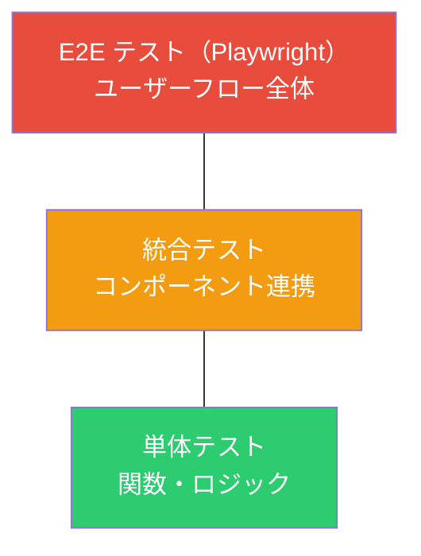
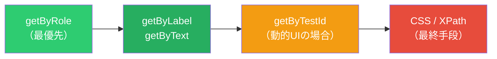
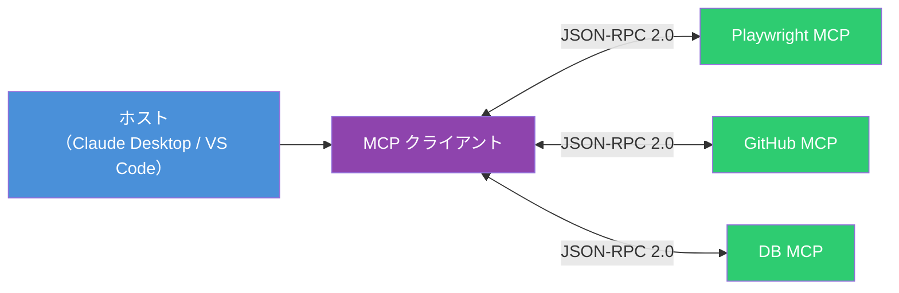
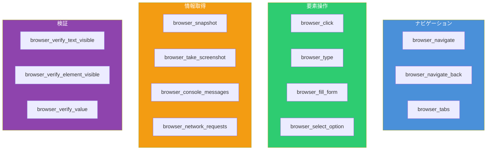
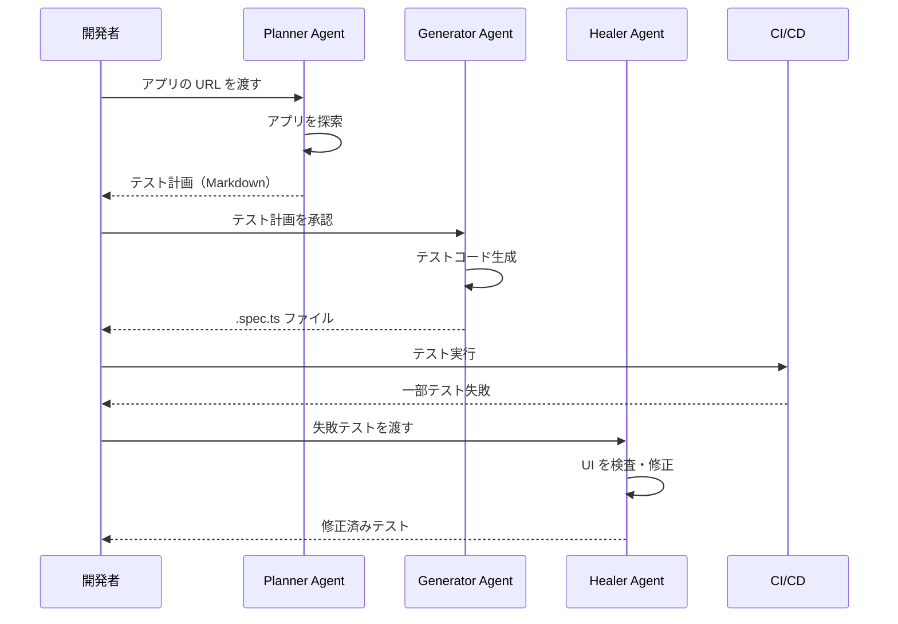

# Playwright × MCP 実践ガイド ― フロントエンドE2Eテストの効率化とAI駆動テスト

フロントエンド開発において「何をテストすべきか」は永遠の課題である。単体テストだけではユーザー体験の品質を担保できず、手動テストではスケールしない。Playwright はブラウザ自動化の決定版ツールとして定着し、さらに MCP（Model Context Protocol）との連携により AI がテストを生成・修復する時代が到来した。

本記事では、Playwright の実践的な使い方と MCP 連携による次世代テストワークフローを解説する。

## フロントエンドの「どこ」をテストするか

E2E テストでは**ユーザーから見える振る舞い**を検証し、実装の詳細には依存しない。以下のテストピラミッドに基づいてテスト対象を整理する。



### テストすべき箇所

| テスト対象                       | 具体例                                         | 優先度 |
| -------------------------------- | ---------------------------------------------- | ------ |
| **クリティカルユーザーフロー**   | ログイン、会員登録、決済、フォーム送信         | 最高   |
| **ナビゲーション・ルーティング** | ページ遷移、戻る/進む、ディープリンク          | 高     |
| **フォームバリデーション**       | 必須チェック、形式チェック、エラー表示         | 高     |
| **レスポンシブ表示**             | モバイル/タブレット/デスクトップでのレイアウト | 中     |
| **エラーハンドリング**           | 404 ページ、API エラー時の UI、タイムアウト    | 中     |
| **アクセシビリティ**             | WCAG 準拠、キーボード操作、スクリーンリーダー  | 中     |

### テストすべきでない箇所

- サードパーティライブラリの内部動作（モックで代替）
- CSS の細かいピクセル値（ビジュアルリグレッションで代替）
- バックエンドのビジネスロジック（API テストで代替）

## Playwright セットアップ

```bash
# プロジェクト初期化
npm init playwright@latest

# 既存プロジェクトへ追加
npm install -D @playwright/test
npx playwright install
```

### 設定ファイル

```typescript
// playwright.config.ts
import { defineConfig, devices } from '@playwright/test'

export default defineConfig({
  testDir: './e2e',
  fullyParallel: true,
  forbidOnly: !!process.env.CI,
  retries: process.env.CI ? 2 : 0,
  workers: process.env.CI ? 1 : undefined,
  reporter: 'html',
  use: {
    baseURL: 'http://localhost:3000',
    trace: 'on-first-retry',
    screenshot: 'only-on-failure',
  },
  projects: [
    {
      name: 'chromium',
      use: { ...devices['Desktop Chrome'] },
    },
    {
      name: 'firefox',
      use: { ...devices['Desktop Firefox'] },
    },
    {
      name: 'webkit',
      use: { ...devices['Desktop Safari'] },
    },
    {
      name: 'mobile-chrome',
      use: { ...devices['Pixel 5'] },
    },
    {
      name: 'mobile-safari',
      use: { ...devices['iPhone 13'] },
    },
  ],
  webServer: {
    command: 'npm run dev',
    url: 'http://localhost:3000',
    reuseExistingServer: !process.env.CI,
  },
})
```

## ロケーター戦略 ― 壊れにくいテストを書く

Playwright のテストが壊れやすくなる最大の原因は**ロケーター選択**にある。ユーザーが認識する属性を基準にすることで、UI リファクタリングに強いテストを実現する。



### 良いロケーターと悪いロケーター

```typescript
import { test, expect } from '@playwright/test'

test('ユーザーがログインできる', async ({ page }) => {
  await page.goto('/login')

  // 良い例: ユーザーが認識するラベルで特定
  await page.getByLabel('メールアドレス').fill('user@example.com')
  await page.getByLabel('パスワード').fill('securepassword')
  await page.getByRole('button', { name: 'ログイン' }).click()

  // 良い例: ユーザーに見えるテキストで検証
  await expect(page.getByText('ダッシュボード')).toBeVisible()
})

test('悪い例 - 実装依存のセレクタ', async ({ page }) => {
  // 避けるべき: クラス名やID に依存
  // await page.locator('.btn-primary').click()
  // await page.locator('#login-form input:nth-child(1)').fill('user@example.com')
  // await page.locator('div > form > button').click()
})
```

### チェーン・フィルターで精度を上げる

```typescript
test('商品をカートに追加できる', async ({ page }) => {
  await page.goto('/products')

  // リストアイテムをフィルターして特定の商品を選択
  const product = page.getByRole('listitem').filter({ hasText: 'TypeScript入門書' })

  await product.getByRole('button', { name: 'カートに追加' }).click()

  // カートのバッジに数量が表示される
  await expect(page.getByTestId('cart-badge')).toHaveText('1')
})
```

## テストパターン別実装例

### 1. フォーム送信とバリデーション

```typescript
test.describe('お問い合わせフォーム', () => {
  test.beforeEach(async ({ page }) => {
    await page.goto('/contact')
  })

  test('必須フィールドが空の場合にエラーが表示される', async ({ page }) => {
    await page.getByRole('button', { name: '送信' }).click()

    await expect(page.getByText('名前は必須である')).toBeVisible()
    await expect(page.getByText('メールアドレスは必須である')).toBeVisible()
  })

  test('正しい入力で送信が成功する', async ({ page }) => {
    await page.getByLabel('名前').fill('山田太郎')
    await page.getByLabel('メールアドレス').fill('yamada@example.com')
    await page.getByLabel('お問い合わせ内容').fill('テスト問い合わせ')

    await page.getByRole('button', { name: '送信' }).click()

    await expect(page.getByText('送信が完了した')).toBeVisible()
  })

  test('不正なメールアドレスでエラーが表示される', async ({ page }) => {
    await page.getByLabel('メールアドレス').fill('invalid-email')
    await page.getByRole('button', { name: '送信' }).click()

    await expect(page.getByText('有効なメールアドレスを入力')).toBeVisible()
  })
})
```

### 2. API モックによるネットワーク制御

外部 API に依存しないテストを実現する。

```typescript
test('API エラー時にエラーメッセージが表示される', async ({ page }) => {
  // API レスポンスをモック
  await page.route('**/api/users', (route) =>
    route.fulfill({
      status: 500,
      contentType: 'application/json',
      body: JSON.stringify({ error: 'Internal Server Error' }),
    }),
  )

  await page.goto('/users')

  await expect(page.getByText('データの取得に失敗した')).toBeVisible()
  await expect(page.getByRole('button', { name: '再試行' })).toBeVisible()
})

test('ローディング状態が正しく表示される', async ({ page }) => {
  // レスポンスを遅延させる
  await page.route('**/api/users', async (route) => {
    await new Promise((resolve) => setTimeout(resolve, 3000))
    await route.fulfill({
      status: 200,
      contentType: 'application/json',
      body: JSON.stringify([{ id: 1, name: 'User 1' }]),
    })
  })

  await page.goto('/users')

  // ローディングスピナーが表示される
  await expect(page.getByRole('progressbar')).toBeVisible()

  // データ表示後にスピナーが消える
  await expect(page.getByText('User 1')).toBeVisible()
  await expect(page.getByRole('progressbar')).not.toBeVisible()
})
```

### 3. ビジュアルリグレッションテスト

UI の見た目が意図せず変わっていないかを検出する。

```typescript
test('ランディングページのビジュアルが正しい', async ({ page }) => {
  await page.goto('/')

  // アニメーションを無効化して安定したスクリーンショットを取得
  await page.emulateMedia({ reducedMotion: 'reduce' })

  // ページ全体のスクリーンショット比較
  await expect(page).toHaveScreenshot('landing-page.png', {
    maxDiffPixels: 100,
  })
})

test('ダークモードの表示が正しい', async ({ page }) => {
  await page.emulateMedia({ colorScheme: 'dark' })
  await page.goto('/')

  await expect(page).toHaveScreenshot('landing-dark.png')
})
```

### 4. アクセシビリティテスト

```typescript
import AxeBuilder from '@axe-core/playwright'

test.describe('アクセシビリティ', () => {
  test('トップページが WCAG 2.1 AA に準拠している', async ({ page }) => {
    await page.goto('/')

    const results = await new AxeBuilder({ page })
      .withTags(['wcag2a', 'wcag2aa', 'wcag21a', 'wcag21aa'])
      .analyze()

    expect(results.violations).toEqual([])
  })

  test('フォームがキーボードのみで操作できる', async ({ page }) => {
    await page.goto('/contact')

    // Tab キーでフォーカス移動
    await page.keyboard.press('Tab')
    await expect(page.getByLabel('名前')).toBeFocused()

    await page.keyboard.press('Tab')
    await expect(page.getByLabel('メールアドレス')).toBeFocused()

    // Enter キーで送信
    await page.getByLabel('名前').fill('テスト')
    await page.getByLabel('メールアドレス').fill('test@example.com')
    await page.keyboard.press('Enter')
  })
})
```

## 認証状態の再利用

毎回ログインするテストは遅い。セットアッププロジェクトで認証状態を共有する。

```typescript
// playwright.config.ts
export default defineConfig({
  projects: [
    {
      name: 'setup',
      testMatch: /.*\.setup\.ts/,
    },
    {
      name: 'chromium',
      use: {
        ...devices['Desktop Chrome'],
        storageState: 'playwright/.auth/user.json',
      },
      dependencies: ['setup'],
    },
  ],
})
```

```typescript
// e2e/auth.setup.ts
import { test as setup, expect } from '@playwright/test'

const authFile = 'playwright/.auth/user.json'

setup('認証', async ({ page }) => {
  await page.goto('/login')
  await page.getByLabel('メールアドレス').fill('admin@example.com')
  await page.getByLabel('パスワード').fill('password')
  await page.getByRole('button', { name: 'ログイン' }).click()

  await expect(page.getByText('ダッシュボード')).toBeVisible()

  // 認証状態を保存
  await page.context().storageState({ path: authFile })
})
```

## MCP（Model Context Protocol）とは

MCP は Anthropic が 2024 年に発表したオープンスタンダードで、AI と外部ツールの接続を標準化するプロトコルである。Language Server Protocol（LSP）が開発ツールと言語サポートを標準化したのと同様に、MCP は AI アプリケーションとツール連携を標準化する。



### MCP サーバーが提供する機能

| 機能          | 説明                                               |
| ------------- | -------------------------------------------------- |
| **Tools**     | AI が実行可能な関数（ブラウザ操作、DB クエリなど） |
| **Resources** | AI やユーザーが参照するデータ・コンテキスト        |
| **Prompts**   | テンプレート化されたメッセージやワークフロー       |

2026 年現在、OpenAI・Google・Microsoft も MCP を採用し、Anthropic は Linux Foundation 傘下の Agentic AI Foundation（AAIF）に MCP を寄贈している。

## Playwright MCP サーバー

Microsoft 公式の Playwright MCP サーバーは、AI エージェントにブラウザ操作能力を与える。スクリーンショットベースではなく**アクセシビリティツリー**を構造化データとして活用するため、高速かつ正確に動作する。

### セットアップ

```json
{
  "mcpServers": {
    "playwright": {
      "command": "npx",
      "args": ["@playwright/mcp@latest"]
    }
  }
}
```

### 主要な設定オプション

| オプション        | 説明                     | 例                              |
| ----------------- | ------------------------ | ------------------------------- |
| `--browser`       | 使用ブラウザ             | `chromium`, `firefox`, `webkit` |
| `--headless`      | ヘッドレスモード         | -                               |
| `--viewport-size` | ビューポートサイズ       | `1280x720`                      |
| `--device`        | デバイスエミュレーション | `iPhone 15`                     |
| `--storage-state` | 認証状態の読み込み       | `auth.json`                     |
| `--save-trace`    | トレースを保存           | -                               |

### 提供されるツール（30以上）



### AI エージェントの操作フロー

```typescript
// AI エージェントが MCP 経由で行う操作の流れ（擬似コード）

// 1. ページを開く
await mcpClient.call('browser_navigate', {
  url: 'http://localhost:3000/login',
})

// 2. アクセシビリティスナップショットを取得
const snapshot = await mcpClient.call('browser_snapshot')
// → 構造化されたアクセシビリティツリーが返る

// 3. フォームに入力
await mcpClient.call('browser_fill_form', {
  fields: [
    { selector: 'メールアドレス', value: 'user@example.com' },
    { selector: 'パスワード', value: 'password' },
  ],
})

// 4. ボタンをクリック
await mcpClient.call('browser_click', {
  element: 'ログインボタン',
})

// 5. テキストが表示されていることを検証
await mcpClient.call('browser_verify_text_visible', {
  text: 'ダッシュボード',
})
```

## Playwright テストエージェント（v1.50+）

Playwright v1.50 以降には AI テストエージェントが組み込まれており、テストの計画・生成・修復を自動化できる。

```bash
# エージェントの初期化
npx playwright init-agents --loop=vscode
```

### 3つのエージェント

| エージェント  | 役割                             | 出力                  |
| ------------- | -------------------------------- | --------------------- |
| **Planner**   | アプリを探索してテスト計画を作成 | Markdown のテスト仕様 |
| **Generator** | テスト計画からテストコードを生成 | `.spec.ts` ファイル   |
| **Healer**    | 失敗したテストを自動修復         | 修正パッチ            |

### ワークフロー例



## Playwright CLI ― トークン効率の良い選択肢

MCP サーバーの代替として `@playwright/cli` も提供されている。ファイルシステムにアクセスできるコーディングエージェント（Claude Code, GitHub Copilot など）向けに最適化されており、MCP と比較して約 4 倍のトークン効率を実現する。

| 項目           | MCP サーバー                         | CLI                        |
| -------------- | ------------------------------------ | -------------------------- |
| トークン消費   | 約 114,000 / タスク                  | 約 27,000 / タスク         |
| データ受け渡し | コンテキストウィンドウ経由           | ディスク保存               |
| 適用先         | サンドボックス環境、自律ワークフロー | コーディング・テストタスク |

## 実践的なテスト戦略

フロントエンドのテストを効率化するために、以下の優先順位でテストを構築する。

1. **クリティカルパスを最初にカバー** ― ログイン、決済、データ作成など収益に直結するフロー
2. **API モックで外部依存を排除** ― テストの安定性と速度を確保
3. **認証状態を再利用** ― セットアッププロジェクトでログイン時間を削減
4. **ビジュアルリグレッションは CI で実行** ― 一貫した環境でスクリーンショットを比較
5. **アクセシビリティテストを自動化** ― axe-core で WCAG 準拠を継続的に検証
6. **Playwright MCP / CLI で AI にテスト生成を委任** ― 反復作業を自動化

## 参考

- [Playwright 公式ドキュメント](https://playwright.dev/docs/intro)
- [Playwright Best Practices](https://playwright.dev/docs/best-practices)
- [Playwright MCP サーバー（GitHub）](https://github.com/microsoft/playwright-mcp)
- [Playwright Test Agents](https://playwright.dev/docs/test-agents)
- [Model Context Protocol 仕様](https://modelcontextprotocol.io/specification/2025-11-25)
- [Anthropic - Model Context Protocol の紹介](https://www.anthropic.com/news/model-context-protocol)
- [@axe-core/playwright（npm）](https://www.npmjs.com/package/@axe-core/playwright)
