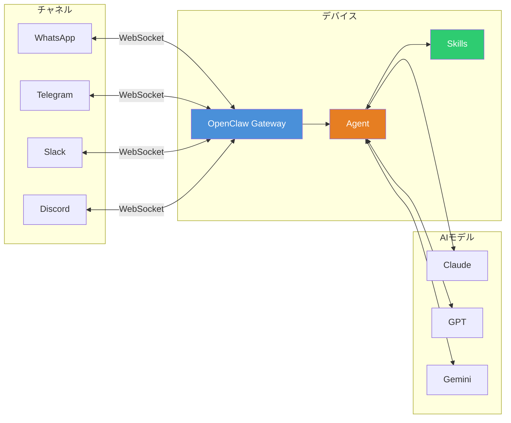
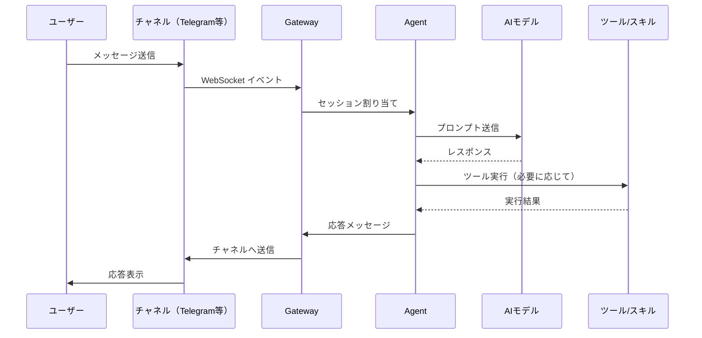
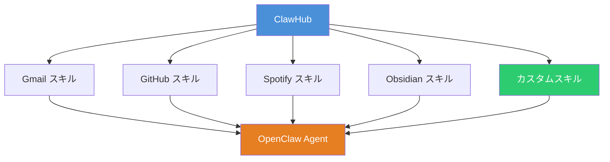

# OpenClaw 実践ガイド ― ローカルファーストなパーソナルAIアシスタントの導入と活用

AI アシスタントの多くはクラウド完結型であり、ユーザーのデバイスやメッセージングチャネルとの統合が限定的である。OpenClaw はローカル環境にゲートウェイを立て、複数のメッセージングプラットフォームを横断して動作するオープンソースのパーソナル AI アシスタントである。TypeScript で書かれており、拡張性と可読性を重視した設計になっている。

本記事では、OpenClaw のアーキテクチャ・導入手順・実践的な活用法を解説する。

## OpenClaw とは

OpenClaw は「自分のデバイスで動く AI アシスタント」をコンセプトに開発されたオープンソースプロジェクトである。Peter Steinberger 氏によって 2025 年 11 月に公開され、2026 年 1 月に大きな注目を集めた。



### 主な特徴

| 特徴                   | 説明                                                                |
| ---------------------- | ------------------------------------------------------------------- |
| **ローカルファースト** | Gateway がローカルで動作し、データが手元に残る                      |
| **マルチチャネル**     | WhatsApp・Telegram・Slack・Discord 等 12 以上のプラットフォーム対応 |
| **マルチモデル**       | Claude・GPT・Gemini など複数 AI モデルをサポート                    |
| **スキルシステム**     | ClawHub を通じて機能を拡張可能                                      |
| **ブラウザ自動化**     | Chromium を制御してウェブ操作を自動化                               |
| **音声対応**           | ElevenLabs 連携による音声インタラクション                           |

## インストール

**前提条件**: Node.js >= 22。macOS・Linux・Windows（WSL2）で動作する。

### ワンライナーインストール（推奨）

```bash
curl -fsSL https://openclaw.ai/install.sh | bash
```

### npm グローバルインストール

```bash
npm install -g openclaw@latest
```

### ソースからビルド（開発者向け）

```bash
git clone https://github.com/openclaw/openclaw.git
cd openclaw
pnpm install
pnpm build
```

### オンボーディングウィザード

インストール後、対話形式のセットアップウィザードを実行する。Gateway・ワークスペース・チャネル・スキルの設定を順に行える。

```bash
openclaw onboard --install-daemon
```

## アーキテクチャ

OpenClaw のコアはローカルで動作する WebSocket ベースの Gateway である。全てのセッション管理とイベントルーティングがこの Gateway を通じて行われる。



### Gateway の起動

```bash
# デフォルトポートで起動
openclaw gateway

# カスタムポート・詳細ログ付きで起動
openclaw gateway --port 18789 --verbose
```

Gateway は `ws://127.0.0.1:18789` でリッスンし、全チャネルからのイベントを受け付ける。

## 設定

メイン設定ファイルは `~/.openclaw/openclaw.json` に配置する。

### 最小構成（モデル選択のみ）

```json
{
  "agent": {
    "model": "anthropic/claude-opus-4-6"
  }
}
```

### マルチチャネル構成

```json
{
  "agent": {
    "model": "anthropic/claude-opus-4-6"
  },
  "channels": {
    "telegram": {
      "enabled": true,
      "token": "${TELEGRAM_BOT_TOKEN}"
    },
    "slack": {
      "enabled": true,
      "token": "${SLACK_BOT_TOKEN}"
    }
  }
}
```

### サンドボックスモード

セキュリティを強化するため、メイン以外のセッションを Docker コンテナ内で実行できる。

```json
{
  "agents": {
    "defaults": {
      "sandbox": {
        "mode": "non-main"
      }
    }
  }
}
```

## CLI コマンドリファレンス

### ターミナルから直接使うコマンド

| コマンド                                              | 説明                             |
| ----------------------------------------------------- | -------------------------------- |
| `openclaw gateway`                                    | Gateway を起動                   |
| `openclaw agent --message "質問内容"`                 | CLI から直接質問                 |
| `openclaw agent --message "分析して" --thinking high` | 高い推論深度で実行               |
| `openclaw message send`                               | 接続チャネル経由でメッセージ送信 |
| `openclaw onboard --install-daemon`                   | セットアップウィザード実行       |

### チャット内コマンド

接続した任意のメッセージングチャネル内で使用できるコマンドである。

| コマンド               | 説明                 |
| ---------------------- | -------------------- |
| `/status`              | セッション情報の表示 |
| `/new` または `/reset` | セッションのリセット |
| `/think <level>`       | 推論深度の調整       |
| `/verbose on\|off`     | 詳細出力の切り替え   |
| `/usage`               | トークン・コスト追跡 |

## 実践的な活用シナリオ

### 1. GitHub ワークフロー自動化

Telegram からプルリクエストのレビューやマージを指示できる。

```
あなた: PR #142 のコード変更をレビューして
OpenClaw: PR #142 を確認しました。3ファイルの変更があります。
         - src/auth.ts: JWT検証ロジックの追加（問題なし）
         - src/middleware.ts: 型定義の修正（LGTM）
         - test/auth.test.ts: テスト追加（カバレッジ十分）
         全体的に問題ありません。マージしますか？
```

### 2. 定期タスクの自動化（Cron）

Cron ジョブを設定して、定期的なタスクを自動実行できる。

```json
{
  "cron": [
    {
      "schedule": "0 9 * * 1-5",
      "action": "今日のGitHubの未対応Issueをまとめて報告して"
    },
    {
      "schedule": "0 18 * * *",
      "action": "今日のコミットログを要約してSlackに投稿して"
    }
  ]
}
```

### 3. ブラウザ自動化による情報収集

OpenClaw は Chromium を直接制御してウェブサイトの操作・情報抽出を行える。

```
あなた: Hacker News のトップ10記事のタイトルとURLを取得して
OpenClaw: [ブラウザを操作中...]
         1. "Understanding Rust's Borrow Checker" - https://...
         2. "The State of WebAssembly in 2026" - https://...
         ...
```

### 4. スキルの活用

ClawHub からスキルをインストールして機能を拡張できる。



50 以上の公式・コミュニティスキルが利用可能である。Gmail・GitHub・Spotify・Obsidian・Notion・Trello など主要サービスとの統合が提供されている。

## セキュリティに関する注意

OpenClaw はローカルで動作するため、適切なセキュリティ設定が重要である。

| 項目                 | 推奨設定                                                     |
| -------------------- | ------------------------------------------------------------ |
| **実行ユーザー**     | 非特権ユーザーで実行する                                     |
| **ファイルアクセス** | 専用ディレクトリに限定する                                   |
| **DM ポリシー**      | ペアリングコードによる認証を維持する                         |
| **サンドボックス**   | 信頼できないコンテキストでは Docker サンドボックスを使用する |
| **初回テスト**       | 使い捨て環境で動作確認を行う                                 |

## まとめ

OpenClaw は「ローカルファースト」「マルチチャネル」「マルチモデル」という 3 つの柱を持つパーソナル AI アシスタントである。TypeScript で構築されており、スキルシステムによる拡張性が高い。Telegram や Slack など普段使っているメッセージングツールから AI を呼び出せるため、開発ワークフローにシームレスに統合できる。

特に以下のようなユースケースで威力を発揮する。

- 複数チャネルを横断した AI アシスタントの構築
- GitHub 操作やブラウザ自動化による開発効率化
- Cron ジョブによる定期タスクの自動化
- ClawHub スキルによる既存サービスとの統合

## 参考

- [OpenClaw - GitHub](https://github.com/openclaw/openclaw)
- [OpenClaw 公式ドキュメント](https://docs.openclaw.ai/)
- [OpenClaw 公式サイト](https://openclaw.ai/)
- [ClawHub - スキルマーケットプレイス](https://github.com/openclaw/clawhub)
- [OpenClaw Tutorial: Installation to First Chat Setup - Codecademy](https://www.codecademy.com/article/open-claw-tutorial-installation-to-first-chat-setup)
- [What is OpenClaw? - DigitalOcean](https://www.digitalocean.com/resources/articles/what-is-openclaw)
