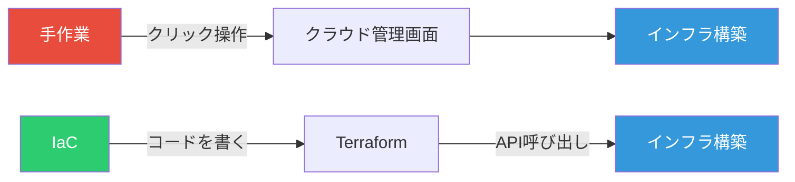
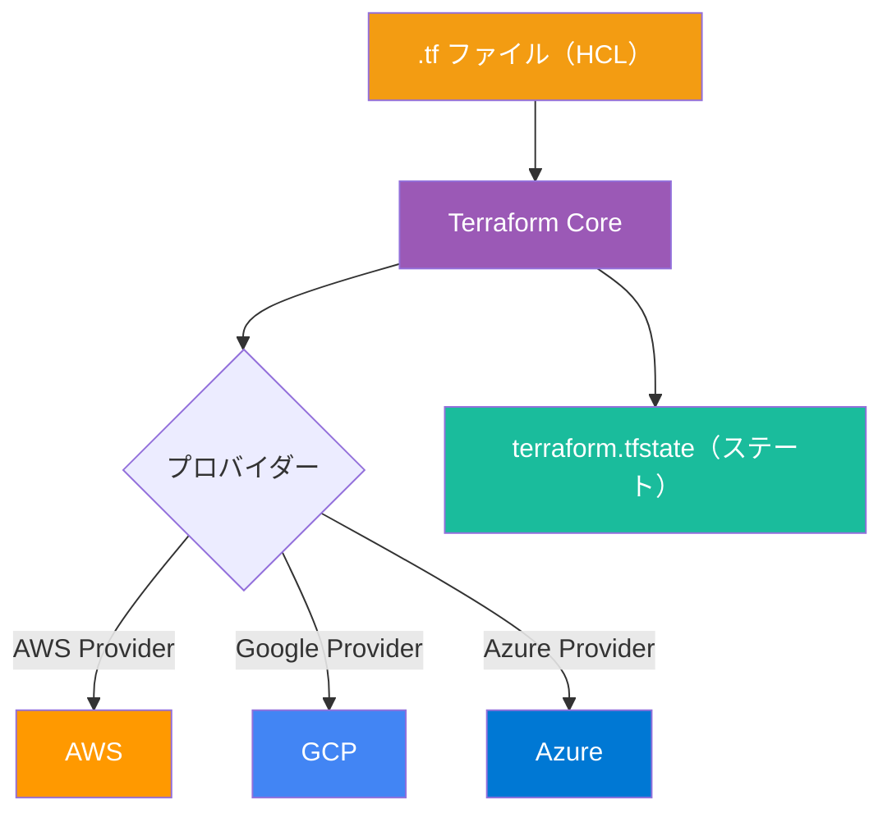
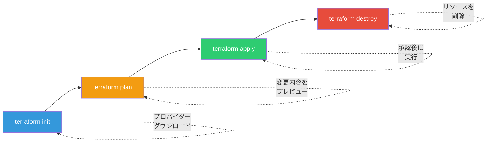
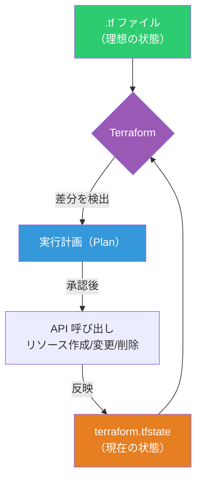

# Terraform 入門ガイド ― インフラをコードで管理する第一歩

クラウド上にサーバーを立てたり、データベースを用意したりする作業を「インフラ構築」と呼ぶ。通常はクラウドの管理画面（AWS コンソールなど）でボタンをクリックして設定するが、手作業は再現性がなく、設定ミスも起きやすい。Terraform はこのインフラ構築を **コード（テキストファイル）** で管理するツールである。本記事では、インフラの知識がゼロの状態からでも理解できるように、Terraform の基本概念と使い方を解説する。

## Infrastructure as Code（IaC）とは

IaC とは「インフラの設計図をコードとして書く」考え方である。家を建てるときに設計図が必要なように、サーバーやネットワークの構成も設計図として記述する。



| 手作業                       | IaC（Terraform）                     |
| ---------------------------- | ------------------------------------ |
| 手順を覚えておく必要がある   | コードに手順が残る                   |
| 同じ環境を作り直すのが大変   | コードを実行すれば何度でも再現できる |
| 誰が何を変更したかわからない | Git で変更履歴を追跡できる           |
| 設定ミスに気づきにくい       | コードレビューでチェックできる       |

## Terraform の全体像

Terraform は HashiCorp 社が開発する IaC ツールである。設定ファイル（HCL）を書くと、Terraform がクラウドの API を呼び出してリソースを作成・変更・削除する。



### 主要な構成要素

| 要素             | 役割                       | たとえるなら                       |
| ---------------- | -------------------------- | ---------------------------------- |
| **HCL**          | Terraform の設定言語       | 設計図の書式                       |
| **プロバイダー** | クラウドとの接続プラグイン | 各国語の翻訳者                     |
| **リソース**     | 作成したいインフラ部品     | 建物の部品（壁、窓、ドア）         |
| **ステート**     | 現在のインフラ状態の記録   | 台帳・在庫リスト                   |
| **モジュール**   | 再利用可能な設定のまとまり | 部品のセット（キッチンセットなど） |

## インストール

```bash
# macOS（Homebrew）
brew tap hashicorp/tap
brew install hashicorp/tap/terraform

# Linux（Ubuntu / Debian）
wget -O- https://apt.releases.hashicorp.com/gpg | \
  sudo gpg --dearmor -o /usr/share/keyrings/hashicorp-archive-keyring.gpg
echo "deb [signed-by=/usr/share/keyrings/hashicorp-archive-keyring.gpg] \
  https://apt.releases.hashicorp.com $(lsb_release -cs) main" | \
  sudo tee /etc/apt/sources.list.d/hashicorp.list
sudo apt update && sudo apt install terraform

# Windows（Chocolatey）
choco install terraform
```

インストール後、バージョンを確認する。

```bash
terraform version
# Terraform v1.14.5
```

## 基本ワークフロー ― init → plan → apply

Terraform の操作は 3 ステップで完結する。



| コマンド            | 説明                                         |
| ------------------- | -------------------------------------------- |
| `terraform init`    | プロバイダーのダウンロードなど初期化を行う   |
| `terraform plan`    | 何が作成・変更・削除されるかを事前に確認する |
| `terraform apply`   | 確認後 `yes` を入力してインフラを構築する    |
| `terraform destroy` | 作成したリソースをすべて削除する             |

`plan` で事前に確認できるため、**いきなり本番環境を壊してしまうリスクが低い**。これが Terraform の大きな安全装置である。

## 実践：AWS で EC2 インスタンスを作成する

最もシンプルな例として、AWS 上にサーバー（EC2 インスタンス）を 1 台作成する。

### プロジェクト構成

```
learn-terraform/
├── main.tf          # リソース定義
├── variables.tf     # 変数定義
└── outputs.tf       # 出力定義
```

### main.tf

```hcl
terraform {
  required_providers {
    aws = {
      source  = "hashicorp/aws"
      version = "~> 5.0"
    }
  }
}

# AWS の東京リージョンを使用
provider "aws" {
  region = "ap-northeast-1"
}

# Ubuntu の最新 AMI を自動取得
data "aws_ami" "ubuntu" {
  most_recent = true

  filter {
    name   = "name"
    values = ["ubuntu/images/hvm-ssd-gp3/ubuntu-noble-24.04-amd64-server-*"]
  }

  owners = ["099720109477"] # Canonical
}

# EC2 インスタンスを作成
resource "aws_instance" "web" {
  ami           = data.aws_ami.ubuntu.id
  instance_type = var.instance_type

  tags = {
    Name = "learn-terraform"
  }
}
```

### variables.tf

```hcl
variable "instance_type" {
  description = "EC2 インスタンスタイプ"
  type        = string
  default     = "t2.micro" # 無料枠対象
}
```

### outputs.tf

```hcl
output "instance_id" {
  description = "作成された EC2 インスタンスの ID"
  value       = aws_instance.web.id
}

output "public_ip" {
  description = "パブリック IP アドレス"
  value       = aws_instance.web.public_ip
}
```

### 実行手順

```bash
# 1. AWS の認証情報を設定（事前に AWS CLI をインストール）
aws configure
# → アクセスキーとシークレットキーを入力

# 2. 初期化
terraform init

# 3. 実行計画を確認
terraform plan
# → "Plan: 1 to add, 0 to change, 0 to destroy." と表示される

# 4. インフラを構築
terraform apply
# → "yes" と入力

# 5. 作成されたリソースの確認
terraform show

# 6. 不要になったら削除
terraform destroy
```

## マルチクラウド対応

Terraform の強みは、同じ HCL 構文で複数のクラウドを扱える点である。プロバイダーを差し替えるだけで対応できる。

### GCP の場合

```hcl
provider "google" {
  project = "my-project-id"
  region  = "asia-northeast1"
}

resource "google_compute_instance" "web" {
  name         = "learn-terraform"
  machine_type = "e2-micro"
  zone         = "asia-northeast1-a"

  boot_disk {
    initialize_params {
      image = "debian-cloud/debian-12"
    }
  }

  network_interface {
    network = "default"
  }
}
```

### Azure の場合

```hcl
provider "azurerm" {
  features {}
}

resource "azurerm_resource_group" "example" {
  name     = "learn-terraform-rg"
  location = "Japan East"
}
```

## ステート管理の基本

Terraform は `terraform.tfstate` ファイルに「今どんなリソースが存在するか」を記録する。次回 `plan` を実行したとき、このステートと `.tf` ファイルを比較して差分を検出する。



チームで利用する場合は、ステートファイルをリモート（S3 バケットなど）に保存して共有する。

```hcl
terraform {
  backend "s3" {
    bucket = "my-terraform-state"
    key    = "prod/terraform.tfstate"
    region = "ap-northeast-1"
  }
}
```

## よくあるつまずきポイント

| つまずき                               | 原因と対処法                                                                |
| -------------------------------------- | --------------------------------------------------------------------------- |
| `terraform init` が失敗する            | ネットワーク接続を確認。プロキシ環境では `HTTP_PROXY` を設定する            |
| 認証エラーが出る                       | `aws configure` でアクセスキーを正しく設定したか確認する                    |
| `terraform.tfstate` を消してしまった   | Terraform がリソースの存在を認識できなくなる。`terraform import` で復旧可能 |
| `plan` では問題ないのに `apply` で失敗 | クラウド側の権限不足やクォータ上限が原因であることが多い                    |
| 同じリソースを手動で変更した           | `terraform refresh` でステートを最新化し、`plan` で差分を確認する           |

## まとめ

Terraform を使えば、インフラの構築・変更・削除をすべてコードで管理できる。`plan` による事前確認、Git によるバージョン管理、マルチクラウド対応といった利点は、チーム開発においても個人開発においても大きな価値がある。まずは無料枠のあるクラウドアカウントを用意して、小さなリソースから試してみるとよい。

## 参考

- [Terraform 公式ドキュメント](https://developer.hashicorp.com/terraform)
- [Terraform Introduction](https://developer.hashicorp.com/terraform/intro)
- [Terraform Registry](https://registry.terraform.io/)
- [AWS Get Started Tutorial](https://developer.hashicorp.com/terraform/tutorials/aws-get-started)
- [Azure 上の Terraform の概要 - Microsoft Learn](https://learn.microsoft.com/ja-jp/azure/developer/terraform/overview)
- [GitHub - hashicorp/terraform](https://github.com/hashicorp/terraform)
