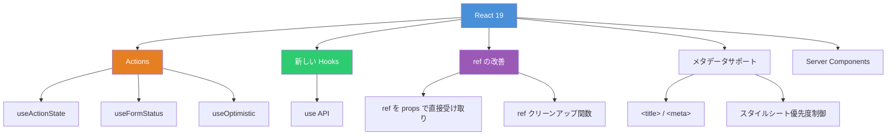
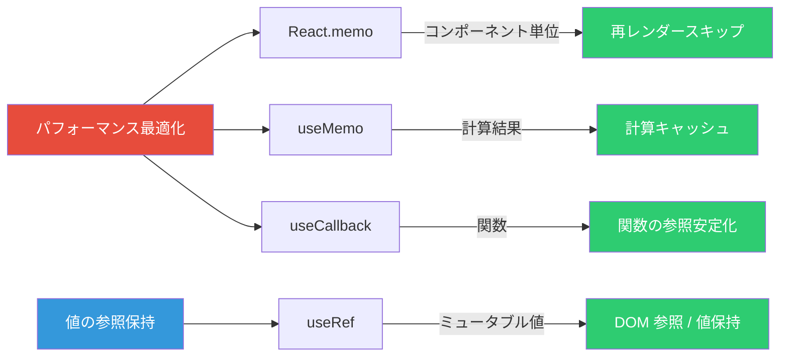
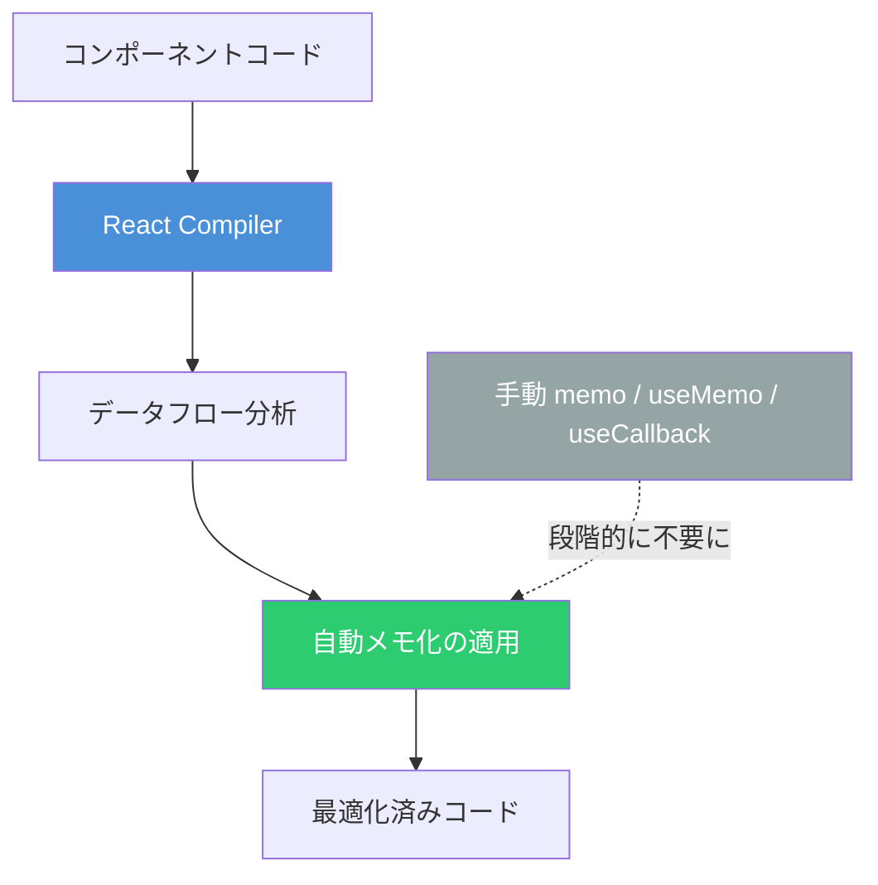

# React 19 新機能と Hooks 完全ガイド ― memo・useCallback・useRef から新 API まで

React 19 は 2024 年 12 月に正式リリースされた。アクション、新しい Hooks、`ref` の改善、ドキュメントメタデータサポートなど多くの機能が追加されている。本記事では React 19 の主要な新機能を整理し、既存の Hooks（`memo`、`useCallback`、`useRef`、`useMemo`）の最新ベストプラクティスまで体系的にまとめる。

## React 19 の全体像



## Actions ― 非同期処理の統一パターン

React 19 最大のテーマは **Actions** である。データ送信・状態更新・楽観的更新といった一連の非同期操作を統一的に扱う仕組みが導入された。

```tsx
function UpdateName() {
  const [name, setName] = useState('')
  const [error, setError] = useState<string | null>(null)
  const [isPending, startTransition] = useTransition()

  const handleSubmit = () => {
    startTransition(async () => {
      const error = await updateName(name)
      if (error) {
        setError(error)
        return
      }
      redirect('/profile')
    })
  }

  return (
    <div>
      <input value={name} onChange={(e) => setName(e.target.value)} />
      <button onClick={handleSubmit} disabled={isPending}>
        更新
      </button>
      {error && <p>{error}</p>}
    </div>
  )
}
```

`startTransition` に非同期関数を渡すことで、`isPending` が自動管理される。

## 新しい Hooks・API

### useActionState

フォームアクションの結果に基づいて state を更新するフック。`react` パッケージからインポートする。

```tsx
import { useActionState } from 'react'

async function increment(previousState: number, formData: FormData) {
  return previousState + 1
}

function StatefulForm() {
  const [state, formAction, isPending] = useActionState(increment, 0)

  return (
    <form>
      <p>カウント: {state}</p>
      <button formAction={formAction} disabled={isPending}>
        インクリメント
      </button>
    </form>
  )
}
```

| 戻り値       | 説明                                                          |
| ------------ | ------------------------------------------------------------- |
| `state`      | アクション実行後の最新 state                                  |
| `formAction` | `<form>` の `action` や `<button>` の `formAction` に渡す関数 |
| `isPending`  | アクション実行中かどうか                                      |

### useFormStatus

親フォームの送信ステータスを読み取るフック。`react-dom` からインポートする。

```tsx
import { useFormStatus } from 'react-dom'

function SubmitButton() {
  const { pending, data, method, action } = useFormStatus()

  return (
    <button type="submit" disabled={pending}>
      {pending ? '送信中...' : '送信'}
    </button>
  )
}
```

**重要**: `<form>` 内でレンダーされる子コンポーネントから呼び出す必要がある。同じコンポーネント内で直接レンダーしたフォームのステータスは取得できない。

### useOptimistic

非同期処理の完了を待たずに UI を楽観的に更新するフック。

```tsx
import { useOptimistic } from 'react'

type Message = { text: string; sending?: boolean }

function Chat({ messages }: { messages: Message[] }) {
  const [optimisticMessages, addOptimisticMessage] = useOptimistic(
    messages,
    (state: Message[], newMessage: string) => [...state, { text: newMessage, sending: true }],
  )

  async function sendMessage(formData: FormData) {
    const message = formData.get('message') as string
    addOptimisticMessage(message)
    await deliverMessage(message)
  }

  return (
    <>
      {optimisticMessages.map((msg, i) => (
        <div key={i}>
          {msg.text}
          {msg.sending && <small>（送信中...）</small>}
        </div>
      ))}
      <form action={sendMessage}>
        <input name="message" />
        <button type="submit">送信</button>
      </form>
    </>
  )
}
```

非同期リクエストが完了すると、楽観的更新は元の state に置き換わる。

### use

Promise または Context からレンダー中に値を読み取る新 API。他の Hooks と異なり、**`if` 文やループ内でも呼び出せる**。

```tsx
import { use, Suspense } from 'react'

function Comments({ commentsPromise }: { commentsPromise: Promise<Comment[]> }) {
  const comments = use(commentsPromise)

  return (
    <ul>
      {comments.map((c) => (
        <li key={c.id}>{c.text}</li>
      ))}
    </ul>
  )
}

function Page({ commentsPromise }: { commentsPromise: Promise<Comment[]> }) {
  return (
    <Suspense fallback={<p>読み込み中...</p>}>
      <Comments commentsPromise={commentsPromise} />
    </Suspense>
  )
}
```

Context にも使用可能で、`useContext` の代替として条件分岐内でも動作する。

```tsx
import { use } from 'react'

function ThemeComponent({ show }: { show: boolean }) {
  if (show) {
    const theme = use(ThemeContext)
    return <div className={theme}>テーマ適用</div>
  }
  return null
}
```

## ref の改善

### ref を props として直接渡す

React 19 では `forwardRef` が不要になった。関数コンポーネントで `ref` を通常の props として受け取れる。

```tsx
// React 19: forwardRef 不要
function MyInput({ placeholder, ref }: { placeholder: string; ref: React.Ref<HTMLInputElement> }) {
  return <input placeholder={placeholder} ref={ref} />
}

// 使用側
;<MyInput ref={inputRef} placeholder="入力してください" />
```

### ref クリーンアップ関数

ref コールバックからクリーンアップ関数を返せるようになった。

```tsx
<input
  ref={(node) => {
    // マウント時の処理
    node?.focus()

    // クリーンアップ関数を返す
    return () => {
      // アンマウント時の処理
    }
  }}
/>
```

## 既存 Hooks のベストプラクティス



### React.memo ― コンポーネントのメモ化

props が変わらない限り再レンダーをスキップする。

```tsx
import { memo } from 'react'

const ExpensiveList = memo(function ExpensiveList({ items }: { items: string[] }) {
  console.log('ExpensiveList レンダー')
  return (
    <ul>
      {items.map((item) => (
        <li key={item}>{item}</li>
      ))}
    </ul>
  )
})
```

カスタム比較関数も渡せる。

```tsx
const Chart = memo(
  function Chart({ data }: { data: number[] }) {
    return <canvas />
  },
  (prevProps, nextProps) => {
    return (
      prevProps.data.length === nextProps.data.length &&
      prevProps.data.every((v, i) => v === nextProps.data[i])
    )
  },
)
```

### useMemo ― 計算結果のメモ化

依存配列が変わらない限り、前回の計算結果を再利用する。

```tsx
import { useMemo } from 'react'

function TodoList({ todos, filter }: { todos: Todo[]; filter: string }) {
  const filteredTodos = useMemo(() => {
    return todos.filter((todo) => todo.title.toLowerCase().includes(filter.toLowerCase()))
  }, [todos, filter])

  return (
    <ul>
      {filteredTodos.map((todo) => (
        <li key={todo.id}>{todo.title}</li>
      ))}
    </ul>
  )
}
```

**使うべきケース**:

- フィルタリング・ソートなど高コストな計算
- `memo` でラップしたコンポーネントにオブジェクトや配列を渡す場合
- 他の Hooks の依存配列に含める値の安定化

### useCallback ― 関数のメモ化

依存配列が変わらない限り、同じ関数参照を返す。

```tsx
import { useCallback } from 'react'

function SearchPage() {
  const [query, setQuery] = useState('')

  const handleSearch = useCallback(
    (text: string) => {
      console.log(`検索: ${text}, フィルタ: ${query}`)
    },
    [query],
  )

  return <SearchBar onSearch={handleSearch} />
}

const SearchBar = memo(function SearchBar({ onSearch }: { onSearch: (text: string) => void }) {
  const [text, setText] = useState('')
  return (
    <div>
      <input value={text} onChange={(e) => setText(e.target.value)} />
      <button onClick={() => onSearch(text)}>検索</button>
    </div>
  )
})
```

`useCallback` は `useMemo` の特殊形であり、以下は同等である。

```tsx
// useCallback 版
const handleClick = useCallback(() => {
  doSomething(a, b)
}, [a, b])

// useMemo 版（同等）
const handleClick = useMemo(
  () => () => {
    doSomething(a, b)
  },
  [a, b],
)
```

### useRef ― ミュータブルな値の保持

レンダー間で値を保持しつつ、変更しても再レンダーをトリガーしない。

```tsx
import { useRef } from 'react'

function Stopwatch() {
  const [time, setTime] = useState(0)
  const intervalRef = useRef<ReturnType<typeof setInterval> | null>(null)

  function handleStart() {
    intervalRef.current = setInterval(() => {
      setTime((t) => t + 1)
    }, 1000)
  }

  function handleStop() {
    if (intervalRef.current) {
      clearInterval(intervalRef.current)
    }
  }

  return (
    <div>
      <p>{time}秒</p>
      <button onClick={handleStart}>開始</button>
      <button onClick={handleStop}>停止</button>
    </div>
  )
}
```

**注意**: React 19 の TypeScript では `useRef` に引数が必須になった。

```tsx
// React 19
const ref = useRef<HTMLDivElement>(null) // 引数必須
```

## React Compiler と手動メモ化の未来



React Compiler（v1.0）はビルド時にコンポーネントとカスタム Hooks 内の値・関数を**自動的にメモ化**する。これにより `useMemo`・`useCallback`・`React.memo` を手動で書く必要性は大幅に減少する。

| 状況                       | 推奨                                               |
| -------------------------- | -------------------------------------------------- |
| 新規コード + Compiler あり | 自動メモ化に委ね、手動メモ化は最小限に             |
| 既存コード + Compiler 導入 | 既存のメモ化は残し、テスト後に段階的に削除         |
| Compiler なし              | 従来通り `useMemo` / `useCallback` / `memo` を活用 |

Meta の Quest Store での実測では、初期読み込みが最大 12% 改善し、特定のインタラクションで 2.5 倍以上の高速化が報告されている。

## その他の注目機能

### ドキュメントメタデータ

コンポーネント内で `<title>`・`<meta>`・`<link>` を直接レンダーでき、React が自動的に `<head>` に巻き上げる。

```tsx
function BlogPost({ post }: { post: Post }) {
  return (
    <article>
      <title>{post.title}</title>
      <meta name="description" content={post.summary} />
      <h1>{post.title}</h1>
      <p>{post.body}</p>
    </article>
  )
}
```

### Context の簡略化

`<Context.Provider>` の代わりに `<Context>` を直接使用可能。

```tsx
const ThemeContext = createContext('light')

// React 19: Provider 不要
function App() {
  return (
    <ThemeContext value="dark">
      <Page />
    </ThemeContext>
  )
}
```

## 参考

- [React v19 公式ブログ（日本語）](https://ja.react.dev/blog/2024/12/05/react-19)
- [React Hooks リファレンス](https://ja.react.dev/reference/react/hooks)
- [React Compiler Introduction](https://react.dev/learn/react-compiler/introduction)
- [React 19 アップグレードガイド](https://ja.react.dev/blog/2024/04/25/react-19-upgrade-guide)
