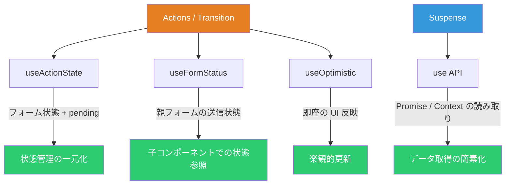
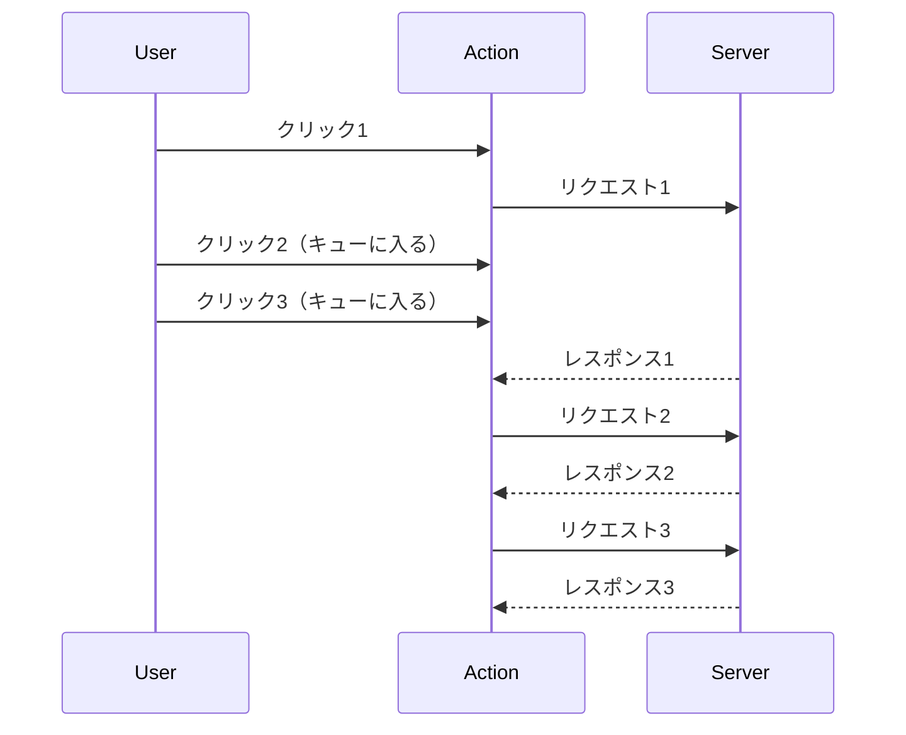
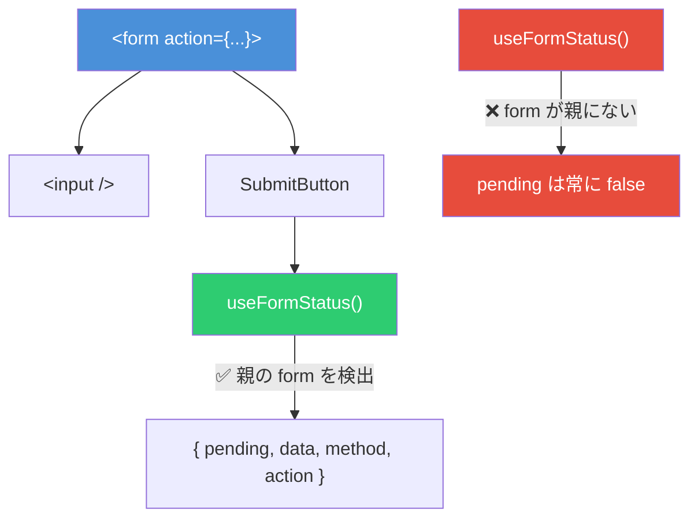
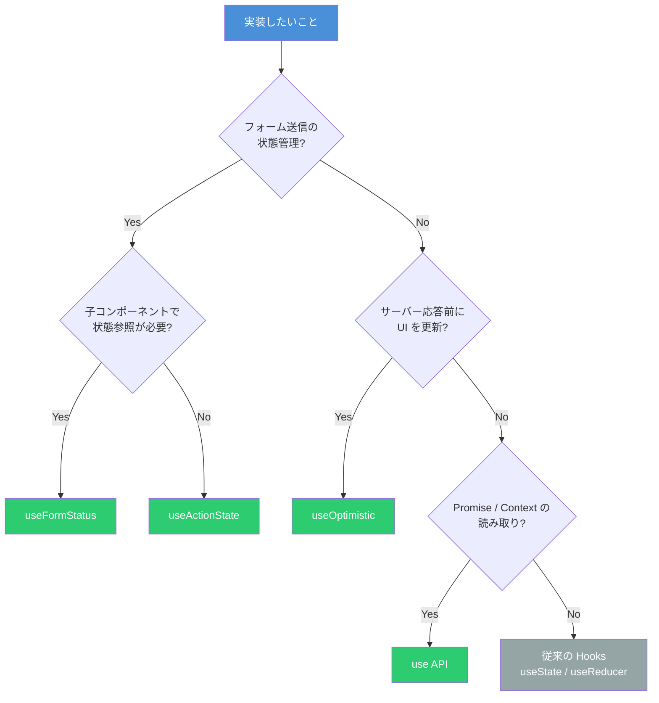

# React 19 Hooks 実践ガイド ― 何を解決し、どこで躓くのか

React 19 では `useActionState`・`useFormStatus`・`useOptimistic`・`use` という4つの Hook/API が新たに追加された。これらは従来 `useState` + `useEffect` + 手動フラグ管理で実装していたパターンを宣言的に置き換えるものである。しかし、各 Hook には明確な適用範囲と「やってはいけない使い方」が存在する。本記事ではそれぞれの Hook が**何を解決し、どこで躓くのか**を具体的に解説する。

## 全体像 ― 4つの Hook の位置づけ



| Hook             | インポート元 | 解決する課題                                  |
| ---------------- | ------------ | --------------------------------------------- |
| `useActionState` | `react`      | フォーム送信の状態・pending・エラーの一元管理 |
| `useFormStatus`  | `react-dom`  | 親フォームの送信状態を子コンポーネントで参照  |
| `useOptimistic`  | `react`      | 非同期処理完了前の即座な UI 反映              |
| `use`            | `react`      | Promise / Context の宣言的な読み取り          |

## useActionState ― フォーム状態の一元管理

### 何を解決するのか

従来、フォーム送信を実装すると以下のように複数の `useState` が乱立していた。

```tsx
// ❌ React 18 以前の典型パターン
function OldForm() {
  const [data, setData] = useState<Result | null>(null)
  const [error, setError] = useState<string | null>(null)
  const [isPending, setIsPending] = useState(false)

  async function handleSubmit(e: React.FormEvent) {
    e.preventDefault()
    setIsPending(true)
    setError(null)
    try {
      const result = await submitForm()
      setData(result)
    } catch (err) {
      setError(err instanceof Error ? err.message : '不明なエラー')
    } finally {
      setIsPending(false)
    }
  }

  return <form onSubmit={handleSubmit}>...</form>
}
```

`useActionState` はこの3つの状態を1つの Hook に統合する。

```tsx
// ✅ React 19
import { useActionState } from 'react'

type FormState = {
  data: Result | null
  error: string | null
}

async function submitAction(prev: FormState, formData: FormData): Promise<FormState> {
  try {
    const result = await submitForm(formData)
    return { data: result, error: null }
  } catch (err) {
    return { data: null, error: err instanceof Error ? err.message : '不明なエラー' }
  }
}

function NewForm() {
  const [state, formAction, isPending] = useActionState(submitAction, {
    data: null,
    error: null,
  })

  return (
    <form action={formAction}>
      <input name="name" />
      <button type="submit" disabled={isPending}>
        {isPending ? '送信中...' : '送信'}
      </button>
      {state.error && <p className="error">{state.error}</p>}
    </form>
  )
}
```

### 何がだめなのか ― アンチパターン

**1. Action 外からの呼び出し**

`formAction` は `<form action>` または `startTransition` 内で呼び出す必要がある。通常のイベントハンドラから直接呼ぶとエラーになる。

```tsx
// ❌ エラーになる
function handleClick() {
  formAction(new FormData())
}

// ✅ startTransition で囲む
import { useTransition } from 'react'

function handleClick() {
  startTransition(() => {
    formAction(new FormData())
  })
}
```

**2. 連続クリックによるキュー詰まり**

`useActionState` はアクションを**逐次実行**する。ボタンを4回連打すると、各リクエストが前のリクエストの完了を待つため、合計待ち時間が積み上がる。



対策として、ボタンの `disabled` 制御で連打を防ぐか、`AbortController` で前のリクエストをキャンセルする。

**3. エラー throw で後続アクションが全滅**

reducer 関数内で例外を throw すると、キューに入っている後続のアクションがすべてスキップされる。**必ず try-catch で囲んでエラーを state として返す**こと。

```tsx
// ❌ throw するとキューが壊れる
async function badAction(prev: number) {
  const result = await fetchData()
  if (!result.ok) throw new Error('失敗') // 後続アクション全滅
  return prev + 1
}

// ✅ エラーも state として返す
async function goodAction(prev: FormState, formData: FormData): Promise<FormState> {
  try {
    const result = await fetchData(formData)
    return { success: true, error: null }
  } catch (err) {
    return { success: false, error: '送信に失敗しました' }
  }
}
```

## useFormStatus ― 子コンポーネントでのフォーム状態参照

### 何を解決するのか

フォーム内のボタンやインプットで送信状態を表示するために、従来は props のバケツリレーか Context が必要だった。`useFormStatus` は親の `<form>` の送信状態を**子コンポーネントから直接参照**できる。

```tsx
import { useFormStatus } from 'react-dom'

function SubmitButton() {
  const { pending, data } = useFormStatus()

  return (
    <button type="submit" disabled={pending}>
      {pending ? '送信中...' : '送信'}
    </button>
  )
}

function ContactForm() {
  return (
    <form action={submitAction}>
      <input name="email" />
      <input name="message" />
      <SubmitButton />
    </form>
  )
}
```

### 何がだめなのか ― 最も多い間違い

**同じコンポーネント内で呼ぶと動かない**。これは最もよくあるミスである。

```tsx
// ❌ pending は常に false になる
function BrokenForm() {
  const { pending } = useFormStatus() // ここでは親フォームが存在しない
  return (
    <form action={submitAction}>
      <button disabled={pending}>送信</button>
    </form>
  )
}

// ✅ 子コンポーネントに分離する
function SubmitButton() {
  const { pending } = useFormStatus() // 親の <form> を検出する
  return <button disabled={pending}>送信</button>
}

function WorkingForm() {
  return (
    <form action={submitAction}>
      <SubmitButton />
    </form>
  )
}
```



この制約が存在する理由は、`useFormStatus` が DOM ツリー上の**直近の祖先 `<form>`** を探す仕組みだからである。同じコンポーネントでレンダーした `<form>` は「自分自身」であり「親」ではない。

## useOptimistic ― 即座な UI 反映

### 何を解決するのか

「いいね」ボタンを押したとき、サーバーレスポンスを待ってから UI を更新すると、ユーザーには遅延として感じられる。`useOptimistic` はリクエスト中に**仮の値を即座に表示**し、完了後に実際の値に収束させる。

```tsx
import { useOptimistic, useState, useTransition } from 'react'

function LikeButton({ initialLiked }: { initialLiked: boolean }) {
  const [isLiked, setIsLiked] = useState(initialLiked)
  const [optimisticLiked, setOptimisticLiked] = useOptimistic(isLiked)
  const [, startTransition] = useTransition()

  function handleClick() {
    startTransition(async () => {
      setOptimisticLiked(!optimisticLiked) // 即座に反映
      const result = await toggleLike(!isLiked) // サーバーに送信
      setIsLiked(result) // 実際の値で収束
    })
  }

  return <button onClick={handleClick}>{optimisticLiked ? '❤️' : '🤍'}</button>
}
```

失敗時は自動的にロールバックされるため、手動でのリバート処理が不要になる。

### 何がだめなのか ― 典型的なミス

**1. Transition の外で呼ぶと一瞬だけ表示されて消える**

```tsx
// ❌ Transition 外での呼び出し
function handleClick() {
  setOptimisticLiked(true) // 一瞬表示されて即座にリバート
  await toggleLike(true)
}

// ✅ startTransition で囲む
function handleClick() {
  startTransition(async () => {
    setOptimisticLiked(true)
    await toggleLike(true)
  })
}
```

**2. 単純な値セットで古い状態を参照する**

ベースの state が外部から更新される可能性がある場合、直接値をセットすると古い値を参照してしまう。

```tsx
// ❌ 他のユーザーがカウントを変更した場合に不整合
const [optimisticCount, setOptimisticCount] = useOptimistic(count)
setOptimisticCount(count + 1) // count が古い可能性

// ✅ reducer を使って相対的に更新
const [optimisticCount, adjustCount] = useOptimistic(
  count,
  (current, delta: number) => current + delta,
)
adjustCount(1) // 常に最新の current に対して +1
```

**3. 楽観的更新を永続化しようとする**

`useOptimistic` の値は Transition 完了と同時に消える。永続化したい場合は別途 `useState` で管理する必要がある。

## use ― Promise と Context の宣言的な読み取り

### 何を解決するのか

`use` は2つの課題を解決する。

**課題1: データ取得の `useEffect` 地獄からの解放**

```tsx
// ❌ 従来のパターン - useEffect + useState の組み合わせ
function OldComments({ postId }: { postId: string }) {
  const [comments, setComments] = useState<Comment[]>([])
  const [loading, setLoading] = useState(true)
  const [error, setError] = useState<Error | null>(null)

  useEffect(() => {
    let cancelled = false
    setLoading(true)
    fetchComments(postId)
      .then((data) => {
        if (!cancelled) setComments(data)
      })
      .catch((err) => {
        if (!cancelled) setError(err)
      })
      .finally(() => {
        if (!cancelled) setLoading(false)
      })
    return () => {
      cancelled = true
    }
  }, [postId])

  if (loading) return <p>読み込み中...</p>
  if (error) return <p>エラー: {error.message}</p>
  return (
    <ul>
      {comments.map((c) => (
        <li key={c.id}>{c.text}</li>
      ))}
    </ul>
  )
}

// ✅ React 19 - use + Suspense
import { use, Suspense } from 'react'

function Comments({ commentsPromise }: { commentsPromise: Promise<Comment[]> }) {
  const comments = use(commentsPromise)
  return (
    <ul>
      {comments.map((c) => (
        <li key={c.id}>{c.text}</li>
      ))}
    </ul>
  )
}

function Page({ postId }: { postId: string }) {
  const commentsPromise = fetchComments(postId)
  return (
    <Suspense fallback={<p>読み込み中...</p>}>
      <Comments commentsPromise={commentsPromise} />
    </Suspense>
  )
}
```

**課題2: Context の条件付き参照**

`useContext` はコンポーネントのトップレベルでしか呼べないが、`use` は `if` 文やループ内で呼べる。

```tsx
// ❌ useContext は条件分岐で使えない
function Component({ show }: { show: boolean }) {
  // if (show) { const theme = useContext(ThemeContext) } // ルール違反

  const theme = useContext(ThemeContext) // 常に呼ぶ必要がある
  if (!show) return null
  return <div className={theme}>コンテンツ</div>
}

// ✅ use は条件分岐内で呼べる
function Component({ show }: { show: boolean }) {
  if (!show) return null
  const theme = use(ThemeContext) // 早期リターン後でも OK
  return <div className={theme}>コンテンツ</div>
}
```

### 何がだめなのか ― 注意すべきポイント

**1. クライアントコンポーネント内で Promise を生成しない**

レンダーのたびに新しい Promise が生成され、毎回 Suspense が発火する。

```tsx
// ❌ 毎回新しい Promise が作られる
function BadComponent() {
  const data = use(fetch('/api/data').then((r) => r.json()))
  return <div>{data.name}</div>
}

// ✅ 親コンポーネントまたは Server Component で Promise を生成
function Parent() {
  const dataPromise = useMemo(() => fetchData(), [])
  return (
    <Suspense fallback={<p>読み込み中...</p>}>
      <Child dataPromise={dataPromise} />
    </Suspense>
  )
}

function Child({ dataPromise }: { dataPromise: Promise<Data> }) {
  const data = use(dataPromise)
  return <div>{data.name}</div>
}
```

**2. try-catch で囲めない**

`use` は Suspense の仕組みを利用するため、try-catch では例外を捕捉できない。エラーハンドリングは Error Boundary か `Promise.catch` で行う。

```tsx
// ❌ try-catch は使えない
function Bad({ promise }: { promise: Promise<string> }) {
  try {
    const value = use(promise) // Suspense 例外が発生
  } catch (e) {
    // ここには来ない
  }
}

// ✅ Error Boundary を使う
function Parent() {
  return (
    <ErrorBoundary fallback={<p>エラーが発生しました</p>}>
      <Suspense fallback={<p>読み込み中...</p>}>
        <Child promise={dataPromise} />
      </Suspense>
    </ErrorBoundary>
  )
}

// ✅ または Promise.catch でフォールバック値を返す
const safePromise = fetchData().catch(() => ({ name: 'デフォルト' }))
```

## 判断フローチャート ― どの Hook を使うべきか



## まとめ

| Hook             | 解決する課題                               | 主な落とし穴                                      |
| ---------------- | ------------------------------------------ | ------------------------------------------------- |
| `useActionState` | 複数 `useState` の一元化、pending 自動管理 | Transition 外での呼び出し、throw によるキュー破壊 |
| `useFormStatus`  | props バケツリレーの排除                   | 同じコンポーネント内で呼ぶと動かない              |
| `useOptimistic`  | レスポンス待ちの体感遅延の解消             | Transition 外で呼ぶと即リバート、古い状態の参照   |
| `use`            | useEffect データ取得パターンの簡素化       | Client での Promise 再生成、try-catch 不可        |

React 19 の新しい Hook は「よくある実装パターン」を宣言的に置き換えるものだが、それぞれに明確な制約がある。制約を理解せずに使うと、「pending が常に false」「楽観的更新が一瞬で消える」「毎レンダーで Suspense が発火する」といった分かりにくいバグに遭遇する。各 Hook の適用範囲を正しく把握し、アンチパターンを避けることが重要である。

## 参考

- [React v19 公式ブログ](https://react.dev/blog/2024/12/05/react-19)
- [useActionState リファレンス](https://react.dev/reference/react/useActionState)
- [useOptimistic リファレンス](https://react.dev/reference/react/useOptimistic)
- [useFormStatus リファレンス](https://react.dev/reference/react-dom/hooks/useFormStatus)
- [use API リファレンス](https://react.dev/reference/react/use)
- [React 19 New Hooks Explained with Examples - freeCodeCamp](https://www.freecodecamp.org/news/react-19-new-hooks-explained-with-examples/)
