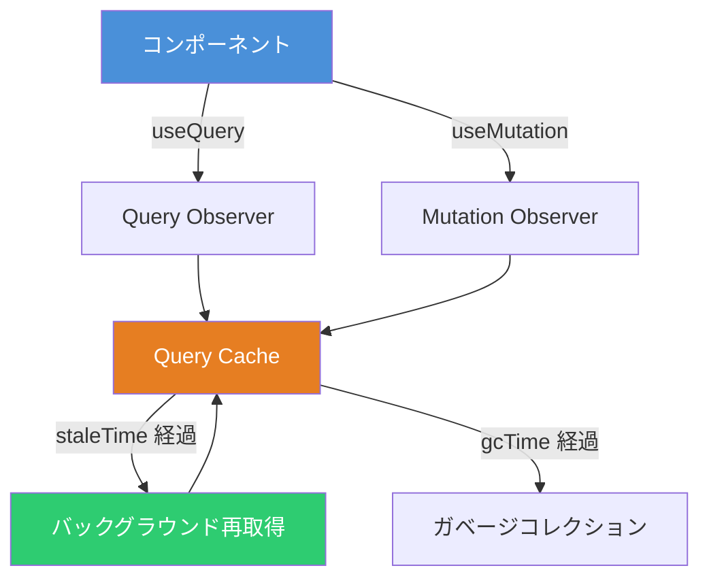
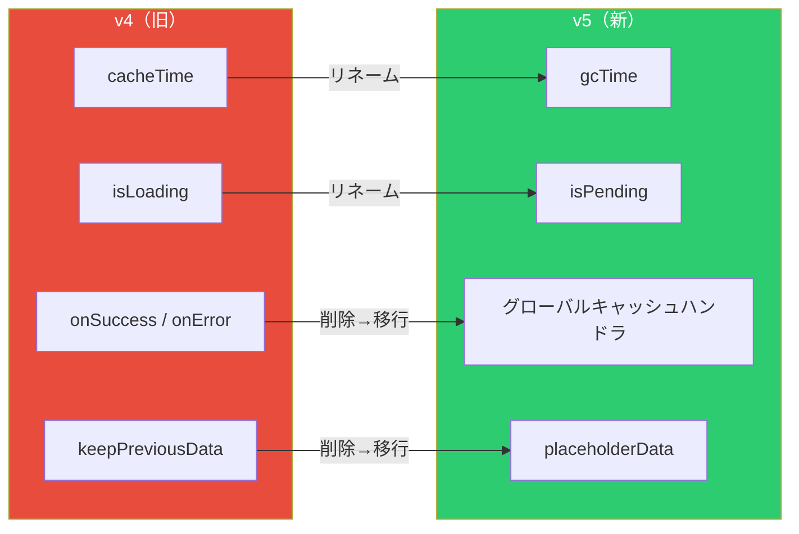
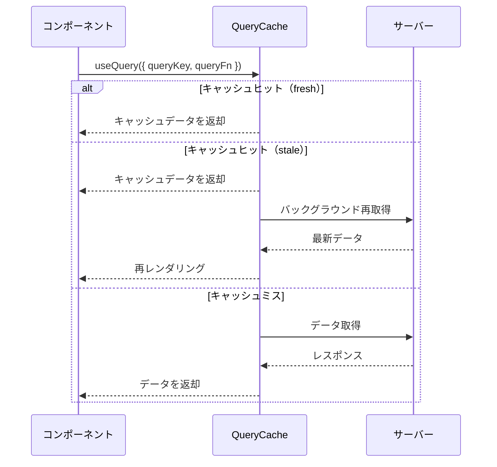

# TanStack Query v5 実践ガイド ― サーバー状態管理の決定版

React アプリケーションにおけるサーバー状態管理は、`useState` + `useEffect` の組み合わせでは煩雑になりがちである。TanStack Query（旧 React Query）は、データの取得・キャッシュ・同期・更新を宣言的に扱えるライブラリであり、v5 では API の統一、Suspense の正式サポート、バンドルサイズの 20% 削減など大幅な改善が行われた。

## TanStack Query のアーキテクチャ



QueryClient が管理するキャッシュを中心に、各コンポーネントの Observer がデータの変更を購読する。`staleTime` を超えたデータはバックグラウンドで再取得され、`gcTime` を超えた未使用データはガベージコレクションされる。

## セットアップ

```bash
npm install @tanstack/react-query
```

```typescript
import { QueryClient, QueryClientProvider } from '@tanstack/react-query'

const queryClient = new QueryClient({
	defaultOptions: {
		queries: {
			staleTime: 60 * 1000,
			gcTime: 5 * 60 * 1000,
			retry: 3,
			refetchOnWindowFocus: false,
		},
	},
})

function App() {
	return (
		<QueryClientProvider client={queryClient}>
			<MyApp />
		</QueryClientProvider>
	)
}
```

## 主要フックの使い方

### useQuery ― データ取得の基本

```typescript
import { useQuery } from '@tanstack/react-query'

interface Todo {
	id: number
	title: string
	completed: boolean
}

function TodoList() {
	const { data, isPending, isError, error } = useQuery({
		queryKey: ['todos'],
		queryFn: async (): Promise<Todo[]> => {
			const res = await fetch('/api/todos')
			if (!res.ok) throw new Error('Failed to fetch')
			return res.json()
		},
		staleTime: 5 * 60 * 1000,
	})

	if (isPending) return <p>読み込み中...</p>
	if (isError) return <p>エラー: {error.message}</p>

	return (
		<ul>
			{data.map((todo) => (
				<li key={todo.id}>{todo.title}</li>
			))}
		</ul>
	)
}
```

v5 では引数がすべて**単一オブジェクト形式**に統一された。また `status: 'loading'` は `status: 'pending'` に、`isLoading` は `isPending` にリネームされている。

### useMutation ― データ更新

```typescript
import { useMutation, useQueryClient } from '@tanstack/react-query'

function AddTodo() {
	const queryClient = useQueryClient()

	const mutation = useMutation({
		mutationFn: async (newTodo: { title: string }) => {
			const res = await fetch('/api/todos', {
				method: 'POST',
				headers: { 'Content-Type': 'application/json' },
				body: JSON.stringify(newTodo),
			})
			return res.json()
		},
		onSuccess: () => {
			queryClient.invalidateQueries({ queryKey: ['todos'] })
		},
	})

	const handleSubmit = (title: string) => {
		mutation.mutate({ title })
	}

	return (
		<div>
			<button
				onClick={() => handleSubmit('新しいタスク')}
				disabled={mutation.isPending}
			>
				{mutation.isPending ? '送信中...' : '追加'}
			</button>
			{mutation.isError && <p>エラー: {mutation.error.message}</p>}
		</div>
	)
}
```

`onSuccess` コールバックは `useQuery` からは削除されたが、`useMutation` では引き続き利用できる。

### useSuspenseQuery ― Suspense 対応

v5 で正式サポートされた Suspense 用フックである。`data` が `undefined` にならないことが型レベルで保証される。

```typescript
import { useSuspenseQuery } from '@tanstack/react-query'
import { Suspense } from 'react'
import { ErrorBoundary } from 'react-error-boundary'

function TodoListContent() {
	const { data } = useSuspenseQuery({
		queryKey: ['todos'],
		queryFn: fetchTodos,
	})

	// data は Todo[] 型（Todo[] | undefined ではない）
	return (
		<ul>
			{data.map((todo) => (
				<li key={todo.id}>{todo.title}</li>
			))}
		</ul>
	)
}

function TodoPage() {
	return (
		<ErrorBoundary fallback={<p>エラーが発生した</p>}>
			<Suspense fallback={<p>読み込み中...</p>}>
				<TodoListContent />
			</Suspense>
		</ErrorBoundary>
	)
}
```

## v4 → v5 主要な変更点



| v4                      | v5                    | 変更理由                                   |
| ----------------------- | --------------------- | ------------------------------------------ |
| `cacheTime`             | `gcTime`              | ガベージコレクション時間であることを明確化 |
| `isLoading`             | `isPending`           | ステータス名 `pending` との統一            |
| `onSuccess` / `onError` | 削除（useQuery のみ） | グローバルキャッシュハンドラへ移行         |
| `keepPreviousData`      | `placeholderData`     | `(prev) => prev` パターンで代替            |
| 複数引数オーバーロード  | 単一オブジェクト      | 型推論の改善・API の統一                   |

## queryOptions による型安全な共有

v5 で追加された `queryOptions` を使うと、`useQuery` と `queryClient` のメソッド間でクエリ定義を型安全に共有できる。

```typescript
import { queryOptions, useQuery, useQueryClient } from '@tanstack/react-query'

function todosQueryOptions(status?: string) {
  return queryOptions({
    queryKey: ['todos', { status }] as const,
    queryFn: () => fetchTodos(status),
    staleTime: 5 * 60 * 1000,
  })
}

// コンポーネントでの使用
function TodoList() {
  const { data } = useQuery(todosQueryOptions('active'))
  // ...
}

// プリフェッチでの使用
function usePrefetchTodos() {
  const queryClient = useQueryClient()
  return () => queryClient.prefetchQuery(todosQueryOptions())
}
```

## データフローの全体像



キャッシュの状態（fresh / stale / inactive）に応じて自動的に最適な戦略が選択される。`staleTime` と `gcTime` の設定により、ネットワークリクエストの頻度とメモリ消費のバランスを制御できる。

## useMutationState ― コンポーネント横断の状態共有

v5 で新たに追加された `useMutationState` を使うと、特定の Mutation の状態を別のコンポーネントから参照できる。

```typescript
import { useMutationState } from '@tanstack/react-query'

function GlobalSaveIndicator() {
	const pendingMutations = useMutationState({
		filters: { status: 'pending' },
		select: (mutation) => mutation.state.variables,
	})

	if (pendingMutations.length === 0) return null

	return <div>保存中... ({pendingMutations.length} 件)</div>
}
```

## まとめ

TanStack Query v5 は、API の統一（単一オブジェクト形式）、Suspense の正式サポート、`queryOptions` による型安全な設計パターンにより、サーバー状態管理のベストプラクティスをさらに推し進めたライブラリである。`useState` + `useEffect` でのデータ取得に限界を感じているなら、導入を検討する価値は十分にある。

## 参考

- [TanStack Query 公式ドキュメント](https://tanstack.com/query/latest/docs/overview)
- [Announcing TanStack Query v5（公式ブログ）](https://tanstack.com/blog/announcing-tanstack-query-v5)
- [Migrating to TanStack Query v5（公式移行ガイド）](https://tanstack.com/query/v5/docs/framework/react/guides/migrating-to-v5)
- [GitHub - TanStack/query](https://github.com/TanStack/query)
- [Zenn - Next.jsでTanStack Queryを使ってみた](https://zenn.dev/devtatsu/articles/tanstack-query)
