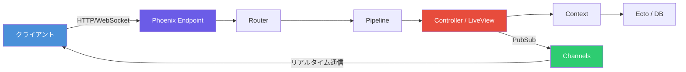
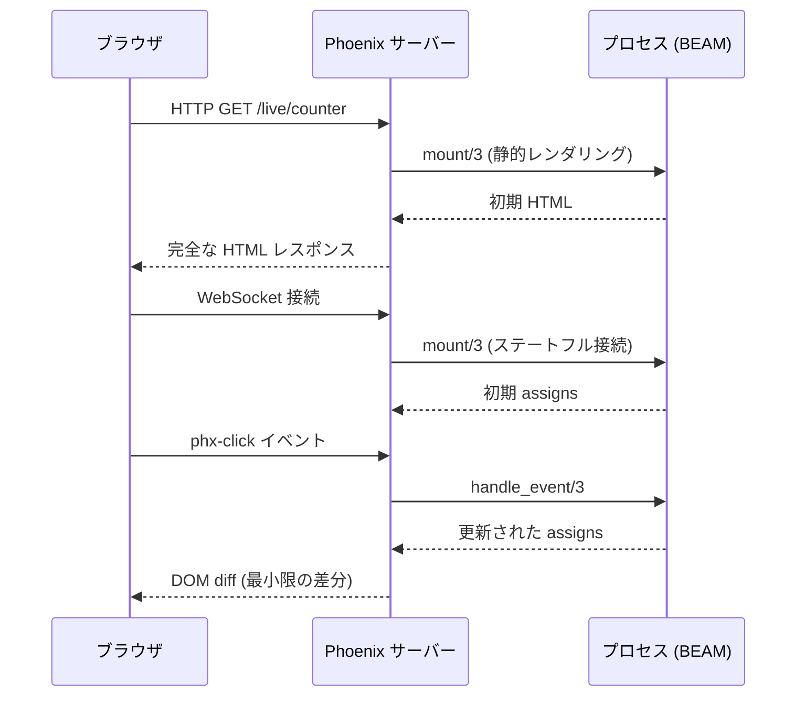
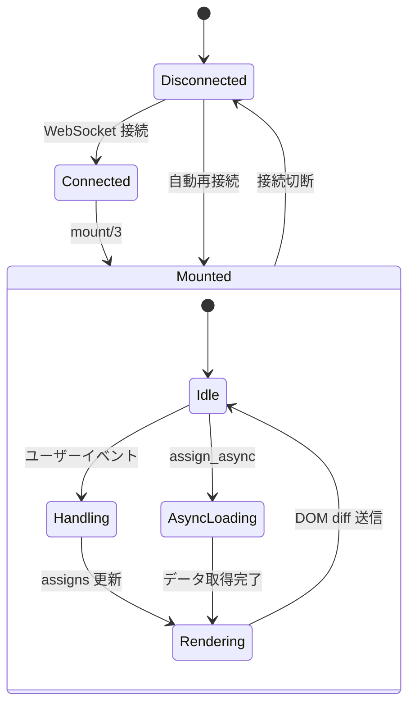

# Phoenix Framework と LiveView 実践ガイド ― Elixir によるリアルタイム Web 開発

## Phoenix Framework とは

[Phoenix Framework](https://www.phoenixframework.org/) は、Elixir 言語で構築された Web フレームワークである。Erlang VM（BEAM）上で動作し、高い並行性・耐障害性・ホットコードアップグレードを特徴とする。Stack Overflow の調査で 3 年連続「最も愛されている Web フレームワーク」に選出された実績を持つ。



### 主要な特徴

| 特徴                  | 詳細                                          |
| --------------------- | --------------------------------------------- |
| **BEAM VM**           | 数百万の同時 WebSocket 接続をサポート         |
| **PubSub & Channels** | 分散ノード間のリアルタイム通信                |
| **Ecto**              | PostgreSQL / MySQL / SQLite 対応の ORM        |
| **HEEx テンプレート** | コンパイル時検証付きテンプレートエンジン      |
| **Live Dashboard**    | 組み込みのパフォーマンス監視                  |
| **認証生成**          | `mix phx.gen.auth` による認証スキャフォールド |

### Phoenix 1.8 の新機能（2025 年 8 月リリース）

Phoenix 1.8 では以下の重要な機能が追加された。

- **Scopes**: リクエスト情報（現在のユーザー・組織）を一元管理する構造体。マルチテナンシーやロール検証を簡潔に実現
- **DaisyUI 統合**: Tailwind プラグインによるコンポーネントとテーマ機能。ライト/ダークテーマのトグルが標準装備
- **Magic Link 認証**: `phx.gen.auth` がパスワードレスのマジックリンク認証をデフォルトに変更
- **AGENTS.md**: LLM 支援開発のためのガイドラインファイルを新規プロジェクトに自動生成

## Phoenix LiveView とは

[Phoenix LiveView](https://hexdocs.pm/phoenix_live_view/Phoenix.LiveView.html) は、**カスタム JavaScript を書かずに**サーバーサイドでリアルタイムインタラクティブ UI を構築する仕組みである。サーバー上にステートフルなビューを保持し、WebSocket 経由でインクリメンタルな DOM diff をブラウザにプッシュする。



### LiveView のライフサイクル

LiveView は以下のコールバックで構成される。

```elixir
defmodule MyAppWeb.CounterLive do
  use MyAppWeb, :live_view

  # 1. マウント - 初期状態の設定
  @impl true
  def mount(_params, _session, socket) do
    {:ok, assign(socket, count: 0)}
  end

  # 2. レンダリング - HEEx テンプレート
  @impl true
  def render(assigns) do
    ~H"""
    <div class="counter">
      <h1>カウント: {@count}</h1>
      <button phx-click="increment">+1</button>
      <button phx-click="decrement">-1</button>
    </div>
    """
  end

  # 3. イベントハンドラ
  @impl true
  def handle_event("increment", _params, socket) do
    {:noreply, update(socket, :count, &(&1 + 1))}
  end

  def handle_event("decrement", _params, socket) do
    {:noreply, update(socket, :count, &(&1 - 1))}
  end
end
```

### LiveView 1.1 の新機能（2025 年 7 月リリース）

LiveView 1.1 では開発体験を大幅に向上させる機能が追加された。

#### Colocated Hooks

JavaScript フックを HEEx コンポーネント内に直接記述できるようになった。コンパイル時に自動抽出される。

```elixir
defmodule MyAppWeb.ChartComponent do
  use MyAppWeb, :live_component

  def render(assigns) do
    ~H"""
    <canvas id="chart" phx-hook={@hook}>
    </canvas>

    <script :type={Phoenix.LiveView.ColocatedHook}>
      export default {
        mounted() {
          this.chart = new Chart(this.el, {
            type: 'line',
            data: JSON.parse(this.el.dataset.chartData)
          })
        },
        updated() {
          this.chart.update()
        }
      }
    </script>
    """
  end
end
```

#### Portals

React や Vue の Portal と同様に、DOM 階層の外側にレンダリングする機能。モーダルやツールチップの z-index 問題を解決する。

#### Keyed Comprehensions

リスト描画時の差分追跡が `:key` 属性により最適化された。

```elixir
<ul>
  <li :for={item <- @items} :key={item.id}>
    {item.name}
  </li>
</ul>
```

## 実践的なユースケース

### リアルタイムフォームバリデーション

```elixir
defmodule MyAppWeb.RegistrationLive do
  use MyAppWeb, :live_view

  alias MyApp.Accounts
  alias MyApp.Accounts.User

  @impl true
  def mount(_params, _session, socket) do
    changeset = Accounts.change_user(%User{})
    {:ok, assign(socket, form: to_form(changeset))}
  end

  @impl true
  def render(assigns) do
    ~H"""
    <.form for={@form} phx-change="validate" phx-submit="save">
      <.input field={@form[:email]} label="メールアドレス" />
      <.input field={@form[:username]} label="ユーザー名" />
      <.input field={@form[:password]} label="パスワード" type="password" />
      <button type="submit">登録</button>
    </.form>
    """
  end

  @impl true
  def handle_event("validate", %{"user" => params}, socket) do
    changeset =
      %User{}
      |> Accounts.change_user(params)
      |> Map.put(:action, :validate)

    {:noreply, assign(socket, form: to_form(changeset))}
  end

  def handle_event("save", %{"user" => params}, socket) do
    case Accounts.create_user(params) do
      {:ok, _user} ->
        {:noreply,
         socket
         |> put_flash(:info, "登録完了")
         |> push_navigate(to: ~p"/dashboard")}

      {:error, changeset} ->
        {:noreply, assign(socket, form: to_form(changeset))}
    end
  end
end
```

### Streams による大量データ表示

`stream` を使うと、大量のデータをサーバーメモリに保持せずにクライアント側で管理できる。

```elixir
defmodule MyAppWeb.TimelineLive do
  use MyAppWeb, :live_view

  @impl true
  def mount(_params, _session, socket) do
    posts = Timeline.list_recent_posts()
    {:ok, stream(socket, :posts, posts)}
  end

  @impl true
  def render(assigns) do
    ~H"""
    <div id="timeline" phx-update="stream">
      <div :for={{dom_id, post} <- @streams.posts} id={dom_id}>
        <h3>{post.title}</h3>
        <p>{post.body}</p>
        <time>{post.inserted_at}</time>
      </div>
    </div>
    """
  end

  @impl true
  def handle_info({:new_post, post}, socket) do
    {:noreply, stream_insert(socket, :posts, post, at: 0)}
  end
end
```



## 導入実績

Phoenix / Elixir は多くの企業で本番運用されている。

| 企業                | 用途                         | 成果                                                        |
| ------------------- | ---------------------------- | ----------------------------------------------------------- |
| **Discord**         | リアルタイムチャット基盤     | 数百万の同時接続ユーザーを処理                              |
| **Bleacher Report** | スポーツニュース配信         | サーバー台数を **150 → 5** に削減、8 倍のトラフィックを処理 |
| **Pinterest**       | レートリミット               | サーバーコストを年間 200 万ドル以上削減                     |
| **Frame.io**        | 動画コラボレーション         | Netflix・NASA 等が利用。[frame.io](https://frame.io)        |
| **Livebook**        | インタラクティブノートブック | LiveView で構築。[livebook.dev](https://livebook.dev)       |

### サンプルアプリケーション

実際に動作するデモを確認できる。

| プロジェクト               | 説明                                          | リンク                                                               |
| -------------------------- | --------------------------------------------- | -------------------------------------------------------------------- |
| **LiveBeats**              | 公式ソーシャル音楽アプリ                      | [GitHub](https://github.com/fly-apps/live_beats)                     |
| **Livebook**               | Elixir のインタラクティブノートブック         | [livebook.dev](https://livebook.dev)                                 |
| **Phoenix Live Dashboard** | パフォーマンス監視（全 Phoenix アプリに組込） | [GitHub](https://github.com/phoenixframework/phoenix_live_dashboard) |
| **LiveView Examples**      | カウンター・ゲーム・エディタ等                | [GitHub](https://github.com/chrismccord/phoenix_live_view_example)   |

## プロジェクトの始め方

```bash
# Elixir のインストール（macOS）
brew install elixir

# Phoenix のインストール
mix archive.install hex phx_new

# 新規プロジェクト作成
mix phx.new my_app

# セットアップと起動
cd my_app
mix setup
mix phx.server
```

`http://localhost:4000` でアプリケーションが起動する。LiveView はデフォルトで有効になっている。

## 参考

- [Phoenix Framework 公式サイト](https://www.phoenixframework.org/)
- [Phoenix LiveView ドキュメント](https://hexdocs.pm/phoenix_live_view/Phoenix.LiveView.html)
- [Phoenix 1.8 リリースブログ](https://www.phoenixframework.org/blog/phoenix-1-8-released)
- [Phoenix LiveView 1.1 リリースブログ](https://www.phoenixframework.org/blog/phoenix-liveview-1-1-released)
- [Phoenix GitHub リポジトリ](https://github.com/phoenixframework/phoenix)
- [Fly.io - The Phoenix Files](https://fly.io/phoenix-files/)
