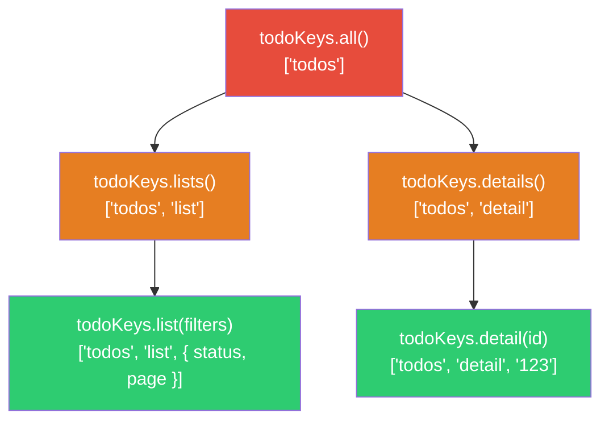
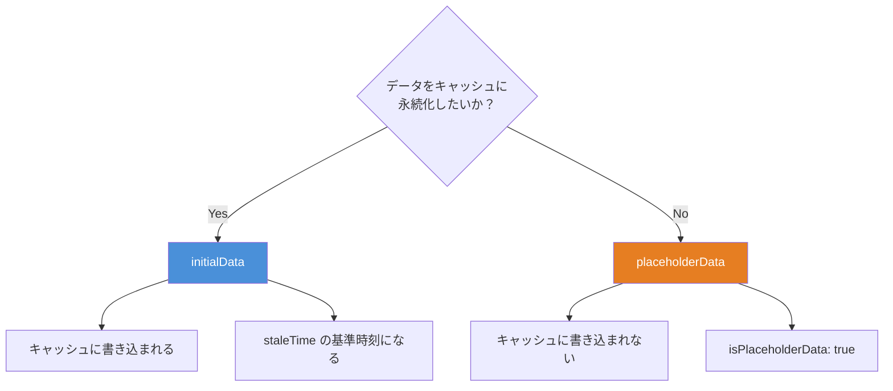
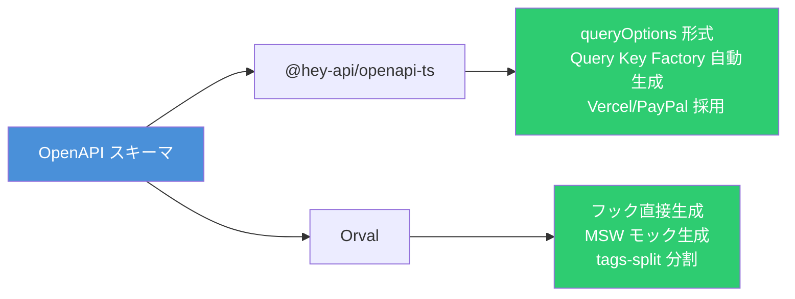

# TanStack Query v5 完全攻略 ― Query Key 設計から OpenAPI 自動生成まで

TanStack Query v5 は React のサーバー状態管理ライブラリとして事実上の標準的な地位を確立している。基本的な `useQuery` / `useMutation` の使い方は広く知られているが、実務ではキャッシュ戦略の設計、楽観的更新の実装、OpenAPI スキーマからのコード自動生成など、より踏み込んだ知識が求められる。本記事では「重箱の隅」を突かれても問題ないレベルで、v5 の主要パターンを網羅的に解説する。

## Query Key の設計パターン

Query Key は TanStack Query のキャッシュ管理の根幹である。設計を誤ると、意図しないキャッシュヒットやキャッシュ無効化の漏れが発生する。

### 基本ルール

Query Key は**配列**でなければならない。v5 ではこれが厳格に強制される。

```typescript
// 単純なキー
useQuery({ queryKey: ['todos'], queryFn: fetchTodos })

// パラメータ付き
useQuery({ queryKey: ['todo', 5], queryFn: () => fetchTodoById(5) })

// フィルター付き
useQuery({ queryKey: ['todos', { status: 'done', page: 1 }], queryFn: fetchTodos })
```

### 決定論的ハッシュの挙動

オブジェクトのキー順序は無視される（同一と見なされる）が、配列の要素順序は区別される。

```typescript
// これらは同一のキーとしてハッシュされる
useQuery({ queryKey: ['todos', { status: 'done', page: 1 }] })
useQuery({ queryKey: ['todos', { page: 1, status: 'done' }] })

// これらは異なるキーとしてハッシュされる
useQuery({ queryKey: ['todos', 'done', 1] })
useQuery({ queryKey: ['todos', 1, 'done'] })
```

### Query Key Factory パターン

実務で最も重要な設計パターンである。階層的なキー構造を関数として定義し、キャッシュ無効化の粒度を制御する。

```typescript
const todoKeys = {
  all: () => ['todos'] as const,
  lists: () => [...todoKeys.all(), 'list'] as const,
  list: (filters: TodoFilters) => [...todoKeys.lists(), { ...filters }] as const,
  details: () => [...todoKeys.all(), 'detail'] as const,
  detail: (id: string) => [...todoKeys.details(), id] as const,
}
```



この階層構造により、キャッシュ無効化の粒度を自在にコントロールできる。

```typescript
// すべての todo 関連キャッシュを無効化
queryClient.invalidateQueries({ queryKey: todoKeys.all() })

// リスト系のみ無効化（詳細は残す）
queryClient.invalidateQueries({ queryKey: todoKeys.lists() })

// 特定フィルタのリストのみ無効化
queryClient.invalidateQueries({ queryKey: todoKeys.list({ status: 'done' }) })
```

`invalidateQueries` はデフォルトで**前方一致**（部分一致）で動作する。`{ exact: true }` を指定すると完全一致になる。

### queryOptions ヘルパー

v5 で追加された `queryOptions` は、クエリ定義を型安全に再利用するためのユーティリティである。

```typescript
import { queryOptions } from '@tanstack/react-query'

function todoDetailOptions(id: string) {
  return queryOptions({
    queryKey: todoKeys.detail(id),
    queryFn: () => fetchTodoById(id),
    staleTime: 5 * 60 * 1000,
  })
}

// useQuery で使用
const { data } = useQuery(todoDetailOptions('123'))

// useSuspenseQuery で使用
const { data } = useSuspenseQuery(todoDetailOptions('123'))

// プリフェッチで使用
queryClient.prefetchQuery(todoDetailOptions('123'))

// キャッシュの直接操作
queryClient.setQueryData(todoDetailOptions('123').queryKey, updatedTodo)
```

`queryOptions` を経由することで、`queryKey` と `queryFn` の戻り値の型が一貫して推論される。`setQueryData` に渡すデータの型も自動的にチェックされるため、型の不整合をコンパイル時に検出できる。

## Query Function の詳細

### QueryFunctionContext

Query Function は `QueryFunctionContext` オブジェクトを引数として受け取る。

```typescript
useQuery({
  queryKey: ['todos', { status: 'active' }],
  queryFn: async ({ queryKey, signal, meta }) => {
    const [_key, { status }] = queryKey
    const res = await fetch(`/api/todos?status=${status}`, { signal })
    if (!res.ok) throw new Error('Failed to fetch')
    return res.json()
  },
  meta: { errorMessage: 'Todo の取得に失敗した' },
})
```

| プロパティ | 型                        | 用途                               |
| ---------- | ------------------------- | ---------------------------------- |
| `queryKey` | `QueryKey`                | クエリキー（変数の抽出に使用）     |
| `signal`   | `AbortSignal`             | リクエストのキャンセル             |
| `meta`     | `Record<string, unknown>` | メタデータ（エラーハンドリング等） |

### AbortSignal によるキャンセル

クエリが不要になった場合（コンポーネントのアンマウント、キーの変更）、TanStack Query は自動的に `signal` を abort する。

```typescript
// fetch の場合
useQuery({
  queryKey: ['todos'],
  queryFn: ({ signal }) => fetch('/api/todos', { signal }).then((r) => r.json()),
})

// axios の場合（v0.22.0 以降）
useQuery({
  queryKey: ['todos'],
  queryFn: ({ signal }) => axios.get('/api/todos', { signal }),
})
```

手動キャンセルも可能である。

```typescript
queryClient.cancelQueries({ queryKey: ['todos'] })
```

### meta を活用したグローバルエラーハンドリング

`meta` と `QueryCache` のグローバルコールバックを組み合わせることで、クエリごとにカスタムエラーメッセージを表示できる。

```typescript
const queryClient = new QueryClient({
  queryCache: new QueryCache({
    onError: (error, query) => {
      if (query.meta?.errorMessage) {
        toast.error(query.meta.errorMessage as string)
      }
    },
  }),
})
```

## 依存クエリと並列クエリ

### 依存クエリ（enabled オプション）

あるクエリの結果を別のクエリのパラメータとして使う場合、`enabled` オプションで実行タイミングを制御する。

```typescript
const { data: user } = useQuery({
  queryKey: ['user', email],
  queryFn: () => getUserByEmail(email),
})

const { data: projects } = useQuery({
  queryKey: ['projects', user?.id],
  queryFn: () => getProjectsByUserId(user!.id),
  enabled: !!user?.id,
})
```

`enabled: false` の状態では `status: 'pending'` かつ `fetchStatus: 'idle'` になる。`enabled` が `true` に変わると `fetchStatus: 'fetching'` に遷移してリクエストが発行される。

```mermaid
stateDiagram-v2
    [*] --> PendingIdle: enabled: false
    PendingIdle --> PendingFetching: enabled → true
    PendingFetching --> Success: データ取得成功
    PendingFetching --> Error: データ取得失敗

    state PendingIdle {
        note right of PendingIdle
            status: pending
            fetchStatus: idle
        end note
    }

    state PendingFetching {
        note right of PendingFetching
            status: pending
            fetchStatus: fetching
        end note
    }
```

### 動的並列クエリ（useQueries）

配列の要素数が動的な場合、`useQueries` を使用する。

```typescript
const userQueries = useQueries({
  queries: userIds.map((id) => ({
    queryKey: ['user', id],
    queryFn: () => fetchUserById(id),
  })),
})
```

### combine オプション（v5 新機能）

`useQueries` の結果を単一のオブジェクトに合成できる。

```typescript
const { data, isPending } = useQueries({
  queries: userIds.map((id) => ({
    queryKey: ['user', id],
    queryFn: () => fetchUserById(id),
  })),
  combine: (results) => ({
    data: results.map((r) => r.data).filter(Boolean),
    isPending: results.some((r) => r.isPending),
  }),
})
```

`combine` 関数の戻り値は構造共有（structural sharing）されるため、データが変更されていなければ参照が保持される。

## 楽観的更新

楽観的更新には 2 つのアプローチがある。

### アプローチ 1: UI 経由（シンプル）

`useMutation` の `variables` を使ってレンダリング時に一時データを表示する。

```typescript
function TodoList() {
	const queryClient = useQueryClient()
	const { data: todos } = useQuery({ queryKey: ['todos'], queryFn: fetchTodos })

	const addMutation = useMutation({
		mutationFn: (newTodo: string) =>
			fetch('/api/todos', {
				method: 'POST',
				body: JSON.stringify({ title: newTodo }),
			}).then((r) => r.json()),
		onSettled: () => queryClient.invalidateQueries({ queryKey: ['todos'] }),
	})

	return (
		<ul>
			{todos?.map((todo) => <li key={todo.id}>{todo.title}</li>)}
			{addMutation.isPending && (
				<li style={{ opacity: 0.5 }}>{addMutation.variables}</li>
			)}
		</ul>
	)
}
```

### アプローチ 2: キャッシュ経由（複数コンポーネントへの伝播）

`onMutate` でキャッシュを直接操作し、エラー時にロールバックする。

```typescript
const updateMutation = useMutation({
  mutationFn: updateTodo,
  onMutate: async (newTodo) => {
    // 1. 進行中のリフェッチをキャンセル（楽観的更新との競合を防ぐ）
    await queryClient.cancelQueries({ queryKey: ['todos'] })

    // 2. 現在のキャッシュをスナップショット
    const previousTodos = queryClient.getQueryData(['todos'])

    // 3. キャッシュを楽観的に更新
    queryClient.setQueryData(['todos'], (old: Todo[]) =>
      old.map((t) => (t.id === newTodo.id ? { ...t, ...newTodo } : t)),
    )

    // 4. ロールバック用にスナップショットを返す
    return { previousTodos }
  },
  onError: (_err, _newTodo, context) => {
    // エラー時にロールバック
    queryClient.setQueryData(['todos'], context?.previousTodos)
  },
  onSettled: () => {
    // 成功・失敗問わず、サーバーの真の状態を取得
    queryClient.invalidateQueries({ queryKey: ['todos'] })
  },
})
```

### useMutationState によるコンポーネント横断アクセス

別のコンポーネントから進行中の Mutation の状態を参照できる。

```typescript
const pendingTodos = useMutationState<string>({
  filters: { mutationKey: ['addTodo'], status: 'pending' },
  select: (mutation) => mutation.state.variables,
})
```

## プリフェッチ

### イベントハンドラでのプリフェッチ

ユーザーがリンクにホバーした時点でデータを先読みする。

```typescript
function TodoLink({ id }: { id: string }) {
	const queryClient = useQueryClient()

	const prefetch = () => {
		queryClient.prefetchQuery({
			...todoDetailOptions(id),
			staleTime: 60 * 1000,
		})
	}

	return (
		<Link to={`/todos/${id}`} onMouseEnter={prefetch} onFocus={prefetch}>
			Todo #{id}
		</Link>
	)
}
```

`prefetchQuery` は `Promise<void>` を返し、データも返さずエラーもスローしない。`staleTime` を設定しないとデフォルト `0` のため、すでにキャッシュにデータがあっても毎回リフェッチされる点に注意が必要である。

### ルーター統合

TanStack Router や React Router のローダーでプリフェッチを実行する。

```typescript
// TanStack Router の例
const todoRoute = createRoute({
  loader: async ({ context: { queryClient } }) => {
    // ブロッキング（データ取得完了まで遷移しない）
    await queryClient.ensureQueryData(todoListOptions())
  },
})
```

`prefetchQuery`（非ブロッキング）と `ensureQueryData`（ブロッキング）を使い分けることで、クリティカルデータは待機し、補助データはバックグラウンドで取得するパターンが実現できる。

## 無限スクロール（useInfiniteQuery）

### カーソルベースのページネーション

```typescript
const { data, fetchNextPage, hasNextPage, isFetchingNextPage } = useInfiniteQuery({
  queryKey: ['projects'],
  queryFn: ({ pageParam }) => fetch(`/api/projects?cursor=${pageParam}`).then((r) => r.json()),
  initialPageParam: 0,
  getNextPageParam: (lastPage) => lastPage.nextCursor ?? undefined,
})

// データは data.pages に格納される
const allProjects = data?.pages.flatMap((page) => page.items) ?? []
```

`getNextPageParam` が `undefined` または `null` を返すと `hasNextPage` が `false` になる。

### maxPages による性能最適化（v5 新機能）

大量のページを保持するとメモリとリフェッチのコストが増大する。`maxPages` でキャッシュするページ数を制限できる。

```typescript
useInfiniteQuery({
  queryKey: ['projects'],
  queryFn: fetchProjects,
  initialPageParam: 0,
  getNextPageParam: (lastPage) => lastPage.nextCursor,
  getPreviousPageParam: (firstPage) => firstPage.prevCursor,
  maxPages: 3,
})
```

`maxPages: 3` の場合、新しいページが追加されると古いページが自動的に破棄される。双方向スクロールを有効にするには `getPreviousPageParam` も設定する。

### 安全な無限スクロール実装

```typescript
function ProjectList() {
	const { data, fetchNextPage, hasNextPage, isFetchingNextPage } =
		useInfiniteQuery({ /* ... */ })

	const loadMore = () => {
		if (hasNextPage && !isFetchingNextPage) {
			fetchNextPage()
		}
	}

	return (
		<div>
			{data?.pages.flatMap((page) =>
				page.items.map((project) => (
					<ProjectCard key={project.id} project={project} />
				)),
			)}
			<button onClick={loadMore} disabled={!hasNextPage || isFetchingNextPage}>
				{isFetchingNextPage ? '読み込み中...' : hasNextPage ? 'もっと見る' : '全件表示済み'}
			</button>
		</div>
	)
}
```

## select によるデータ変換

`select` オプションは、キャッシュされたデータを変換してコンポーネントに渡す。キャッシュ自体は変更されない。

```typescript
// 完了済みの todo のみ取得
const { data: completedTodos } = useQuery({
  queryKey: ['todos'],
  queryFn: fetchTodos,
  select: (data) => data.filter((todo) => todo.completed),
})

// 件数のみ取得
const { data: todoCount } = useQuery({
  queryKey: ['todos'],
  queryFn: fetchTodos,
  select: (data) => data.length,
})
```

インライン関数はレンダリングごとに再生成されるため、`useCallback` で安定した参照を渡すか、コンポーネント外に関数を定義する。

```typescript
// コンポーネント外に定義（推奨）
const selectCompletedTodos = (data: Todo[]) => data.filter((t) => t.completed)

function CompletedTodos() {
  const { data } = useQuery({
    queryKey: ['todos'],
    queryFn: fetchTodos,
    select: selectCompletedTodos,
  })
}
```

TanStack Query は構造共有（structural sharing）を適用するため、`select` の結果が前回と同一であれば参照が保持され、不要な再レンダリングが抑制される。

## placeholderData と initialData の使い分け



### placeholderData

キャッシュには書き込まれず、実データが取得されるまでの仮表示として使う。

```typescript
// 前回のデータを保持（v4 の keepPreviousData 相当）
import { keepPreviousData } from '@tanstack/react-query'

useQuery({
  queryKey: ['todos', { page }],
  queryFn: () => fetchTodos(page),
  placeholderData: keepPreviousData,
})

// 別のキャッシュから引用
useQuery({
  queryKey: ['todo', todoId],
  queryFn: () => fetchTodoById(todoId),
  placeholderData: () => queryClient.getQueryData<Todo[]>(['todos'])?.find((t) => t.id === todoId),
})
```

`isPlaceholderData` フラグで仮データかどうかを判定し、UI にフィードバックを表示できる。

### initialData

キャッシュに永続化される「本物のデータ」として扱われる。`staleTime` の起点にもなる。

```typescript
useQuery({
  queryKey: ['todo', todoId],
  queryFn: () => fetchTodoById(todoId),
  initialData: () => queryClient.getQueryData<Todo[]>(['todos'])?.find((t) => t.id === todoId),
  // initialData がいつ取得されたかを指定（staleTime の計算に使用）
  initialDataUpdatedAt: () => queryClient.getQueryState(['todos'])?.dataUpdatedAt,
})
```

`initialDataUpdatedAt` を省略すると、コンポーネントのマウント時刻が基準になり、`staleTime` 内であれば不要なリフェッチが発生する可能性がある。

## Suspense モード

### useSuspenseQuery

v5 で追加された専用フック。`data` が `T` 型（`T | undefined` ではない）であることが型レベルで保証される。

```typescript
import { useSuspenseQuery } from '@tanstack/react-query'

function TodoList() {
	// data は Todo[] 型（undefined の可能性なし）
	const { data } = useSuspenseQuery({
		queryKey: ['todos'],
		queryFn: fetchTodos,
	})

	return <ul>{data.map((t) => <li key={t.id}>{t.title}</li>)}</ul>
}
```

### 注意点

- `enabled` オプションは使用不可（データは常に `T` であるため）
- `placeholderData` も使用不可
- 同一コンポーネント内で複数の `useSuspenseQuery` を使うと**シーケンシャルに**実行される（ウォーターフォール）

ウォーターフォールを回避するには、`useSuspenseQueries` を使うか、クエリごとにコンポーネントを分割する。

```typescript
// useSuspenseQueries でウォーターフォール回避
const [todosQuery, usersQuery] = useSuspenseQueries({
  queries: [
    { queryKey: ['todos'], queryFn: fetchTodos },
    { queryKey: ['users'], queryFn: fetchUsers },
  ],
})
```

### QueryErrorResetBoundary

Suspense モードでのエラーリカバリには `QueryErrorResetBoundary` を使用する。

```typescript
import { QueryErrorResetBoundary } from '@tanstack/react-query'
import { ErrorBoundary } from 'react-error-boundary'

function App() {
	return (
		<QueryErrorResetBoundary>
			{({ reset }) => (
				<ErrorBoundary
					onReset={reset}
					fallbackRender={({ resetErrorBoundary }) => (
						<div>
							<p>エラーが発生した</p>
							<button onClick={resetErrorBoundary}>再試行</button>
						</div>
					)}
				>
					<Suspense fallback={<p>読み込み中...</p>}>
						<TodoList />
					</Suspense>
				</ErrorBoundary>
			)}
		</QueryErrorResetBoundary>
	)
}
```

## リトライとウィンドウフォーカスリフェッチ

### リトライ設定

デフォルトはクライアント側で 3 回、サーバー側（SSR）で 0 回。指数バックオフが適用される。

```typescript
useQuery({
  queryKey: ['todos'],
  queryFn: fetchTodos,
  retry: (failureCount, error) => {
    // 404 はリトライしない
    if (error instanceof Response && error.status === 404) return false
    return failureCount < 3
  },
  // デフォルトの指数バックオフ: min(1000 * 2^attempt, 30000)
  retryDelay: (attemptIndex) => Math.min(1000 * 2 ** attemptIndex, 30000),
})
```

### ウィンドウフォーカスリフェッチ

デフォルトで有効。`visibilitychange` イベントを使用してタブが再アクティブ化された時に stale なクエリをリフェッチする。

```typescript
// グローバルで無効化
const queryClient = new QueryClient({
  defaultOptions: {
    queries: { refetchOnWindowFocus: false },
  },
})

// クエリ単位で無効化
useQuery({
  queryKey: ['todos'],
  queryFn: fetchTodos,
  refetchOnWindowFocus: false,
})
```

## オフラインサポート（Network Mode）

| モード                   | 挙動                                                            |
| ------------------------ | --------------------------------------------------------------- |
| `'online'`（デフォルト） | ネットワークがない場合はクエリを実行しない                      |
| `'always'`               | ネットワーク状態を無視して常に実行                              |
| `'offlineFirst'`         | 最初の 1 回は実行し、失敗時のリトライはネットワーク復帰まで待機 |

```typescript
// Service Worker やキャッシュを活用する場合
useQuery({
  queryKey: ['todos'],
  queryFn: fetchTodos,
  networkMode: 'offlineFirst',
})
```

`fetchStatus` の値で現在の状態を判定できる。

| fetchStatus  | 意味                     |
| ------------ | ------------------------ |
| `'fetching'` | queryFn を実行中         |
| `'paused'`   | ネットワーク復帰を待機中 |
| `'idle'`     | フェッチ未実行           |

## OpenAPI からの自動生成

手書きの `queryFn` と Query Key をすべて手動管理するのは、エンドポイント数が増えるほど困難になる。OpenAPI スキーマからの自動生成により、型安全なフックを効率的に量産できる。

### @hey-api/openapi-ts

Vercel や PayPal でも採用されているコード生成ツール。TanStack Query プラグインにより、型安全なフックを自動生成する。

```bash
npm install @hey-api/openapi-ts -D
```

```typescript
// openapi-ts.config.ts
import { defineConfig } from '@hey-api/openapi-ts'

export default defineConfig({
  input: './openapi.json',
  output: 'src/client',
  plugins: ['@tanstack/react-query'],
})
```

```bash
npx @hey-api/openapi-ts
```

生成されたコードの使用例：

```typescript
import { useQuery, useMutation } from '@tanstack/react-query'
import { getPetByIdOptions, getPetByIdQueryKey, addPetMutation } from './client'

// Query
const { data } = useQuery({
  ...getPetByIdOptions({ path: { petId: 1 } }),
})

// Query Key の直接参照
const queryKey = getPetByIdQueryKey({ path: { petId: 1 } })
queryClient.invalidateQueries({ queryKey })

// Mutation
const addPet = useMutation({ ...addPetMutation() })
addPet.mutate({ body: { name: 'Tama' } })
```

生成される Query Key の構造：

```typescript
// @hey-api/openapi-ts が生成するキー構造
;[
  {
    _id: 'getPetById',
    baseUrl: 'https://api.example.com',
    path: { petId: 1 },
    tags: ['pets', 'one', 'get'],
  },
]
```

### Orval

OpenAPI v3 / Swagger v2 から React Query フックを生成するツール。MSW によるモック生成もサポートする。

```bash
npm install orval -D
```

```typescript
// orval.config.ts
import { defineConfig } from 'orval'

export default defineConfig({
  petstore: {
    output: {
      mode: 'tags-split',
      target: 'src/gen/petstore.ts',
      schemas: 'src/gen/models',
      client: 'react-query',
      clean: true,
      override: {
        mutator: {
          path: './src/lib/custom-fetch.ts',
          name: 'customFetch',
        },
      },
    },
    input: {
      target: './petstore.yaml',
    },
  },
})
```

```bash
npx orval
```

Orval の特徴：

| 機能                    | 説明                                 |
| ----------------------- | ------------------------------------ |
| `tags-split` モード     | OpenAPI のタグごとにファイルを分割   |
| `mutator`               | カスタム HTTP クライアントの注入     |
| `mock: true`            | MSW + Faker によるモック自動生成     |
| `useInfiniteQuery` 対応 | ページネーションパラメータの自動検出 |

### 比較



どちらのツールも CI/CD パイプラインに組み込み、スキーマの変更を検知して自動再生成するのがベストプラクティスである。

## DevTools

```bash
npm install @tanstack/react-query-devtools -D
```

```typescript
import { ReactQueryDevtools } from '@tanstack/react-query-devtools'

function App() {
	return (
		<QueryClientProvider client={queryClient}>
			<MyApp />
			<ReactQueryDevtools initialIsOpen={false} buttonPosition="bottom-right" />
		</QueryClientProvider>
	)
}
```

本番ビルドでは自動的にバンドルから除外される（`process.env.NODE_ENV === 'development'` による tree-shaking）。

本番環境で一時的にデバッグしたい場合は遅延ロードを使用する。

```typescript
const ReactQueryDevtoolsProduction = lazy(() =>
  import('@tanstack/react-query-devtools/build/modern/production.js').then((d) => ({
    default: d.ReactQueryDevtools,
  })),
)
```

## デフォルト値一覧

実務で頻出するデフォルト値をまとめておく。

| オプション             | デフォルト値                 | 備考                        |
| ---------------------- | ---------------------------- | --------------------------- |
| `staleTime`            | `0`                          | データは即座に stale になる |
| `gcTime`               | `300000`（5 分）             | 未使用データの GC 時間      |
| `retry`                | `3`（client）/ `0`（server） | v5 でサーバー側が 0 に変更  |
| `retryDelay`           | 指数バックオフ（最大 30 秒） | `min(1000 * 2^n, 30000)`    |
| `refetchOnMount`       | `true`                       | マウント時にリフェッチ      |
| `refetchOnWindowFocus` | `true`                       | フォーカス時にリフェッチ    |
| `refetchOnReconnect`   | `true`                       | 再接続時にリフェッチ        |
| `structuralSharing`    | `true`                       | 構造共有による参照安定化    |
| `networkMode`          | `'online'`                   | オンライン時のみ実行        |
| `throwOnError`         | `false`                      | Error Boundary への伝播     |

## まとめ

TanStack Query v5 は単なるデータフェッチライブラリではなく、キャッシュ設計・楽観的更新・オフライン対応・コード自動生成まで含めた包括的なサーバー状態管理基盤である。Query Key Factory パターンによるキャッシュ階層の設計、`queryOptions` による型安全な定義の共有、OpenAPI からのコード自動生成を組み合わせることで、スケーラブルかつ保守性の高いデータ層を構築できる。

## 参考

- [TanStack Query v5 公式ドキュメント](https://tanstack.com/query/v5/docs/framework/react/overview)
- [TanStack Query - Query Keys](https://tanstack.com/query/v5/docs/framework/react/guides/query-keys)
- [TanStack Query - Query Options](https://tanstack.com/query/v5/docs/framework/react/guides/query-options)
- [GitHub - TanStack/query](https://github.com/TanStack/query)
- [@hey-api/openapi-ts TanStack Query Plugin](https://heyapi.dev/openapi-ts/plugins/tanstack-query)
- [Orval - React Query](https://orval.dev/guides/react-query)
- [TkDodo - Effective React Query Keys](https://tkdodo.eu/blog/effective-react-query-keys)
