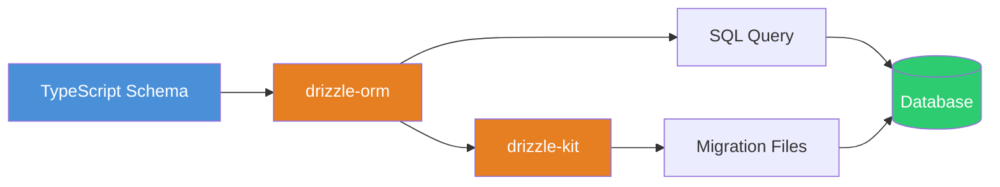
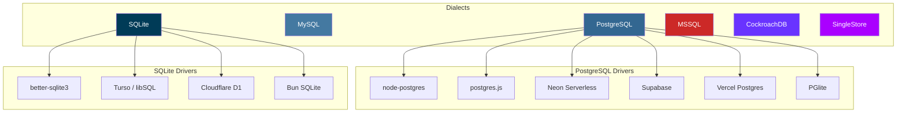
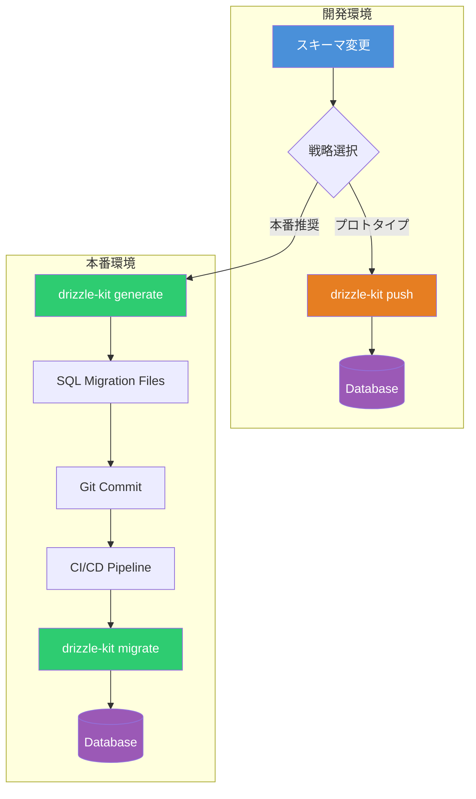

# Drizzle ORM 実践ガイド ― スキーマ定義・クエリ・マイグレーション・本番運用まで

## Drizzle ORM とは

Drizzle ORM は TypeScript 製の軽量 ORM である。**SQL を知っていればすぐ使える** という設計思想のもと、ゼロ依存・軽量バンドル（約 7.4kb min+gzip）を実現している。サーバーレス環境でのコールドスタートが極めて高速であり、Neon・Supabase・Cloudflare D1・Turso など主要なサーバーレスデータベースと統合できる。



### 主な特徴

| 特徴             | 詳細                                          |
| ---------------- | --------------------------------------------- |
| ゼロ依存         | 外部ライブラリに一切依存しない                |
| SQL ファースト   | SQL を知っていれば学習コスト最小              |
| デュアル API     | SQL ライクビルダー + リレーショナルクエリ API |
| 1 クエリ出力     | 常に 1 つの SQL を生成し N+1 問題を排除       |
| 型推論           | スキーマから自動推論、コード生成不要          |
| サーバーレス対応 | コールドスタート 500ms 未満                   |

## サポートデータベース



## セットアップ

PostgreSQL（node-postgres）を例にセットアップ手順を示す。

```bash
# ORM 本体とドライバ
npm install drizzle-orm pg
npm install -D drizzle-kit @types/pg
```

`drizzle.config.ts` を作成する。

```typescript
import 'dotenv/config'
import { defineConfig } from 'drizzle-kit'

export default defineConfig({
  dialect: 'postgresql',
  schema: './src/db/schema.ts',
  out: './drizzle',
  dbCredentials: {
    url: process.env.DATABASE_URL!,
  },
  verbose: true,
  strict: true,
})
```

データベースクライアントの初期化は以下のように行う。

```typescript
import { drizzle } from 'drizzle-orm/node-postgres'
import * as schema from './schema'

// URL 指定（推奨）
const db = drizzle({
  connection: process.env.DATABASE_URL!,
  schema,
  casing: 'snake_case', // TypeScript camelCase → DB snake_case 自動変換
})

export { db }
```

## スキーマ定義

### テーブル定義

```typescript
import {
  pgTable,
  serial,
  varchar,
  text,
  integer,
  timestamp,
  boolean,
  pgEnum,
} from 'drizzle-orm/pg-core'

// Enum 定義
export const roleEnum = pgEnum('role', ['admin', 'editor', 'viewer'])

// 共通カラムヘルパー
const timestamps = {
  createdAt: timestamp('created_at').defaultNow().notNull(),
  updatedAt: timestamp('updated_at')
    .defaultNow()
    .$onUpdate(() => new Date())
    .notNull(),
}

// ユーザーテーブル
export const users = pgTable('users', {
  id: serial('id').primaryKey(),
  name: varchar('name', { length: 255 }).notNull(),
  email: varchar('email', { length: 255 }).notNull().unique(),
  role: roleEnum('role').default('viewer').notNull(),
  isActive: boolean('is_active').default(true).notNull(),
  ...timestamps,
})

// 投稿テーブル
export const posts = pgTable('posts', {
  id: serial('id').primaryKey(),
  title: varchar('title', { length: 500 }).notNull(),
  content: text('content').notNull(),
  authorId: integer('author_id')
    .references(() => users.id, { onDelete: 'cascade' })
    .notNull(),
  publishedAt: timestamp('published_at'),
  ...timestamps,
})

// タグテーブル
export const tags = pgTable('tags', {
  id: serial('id').primaryKey(),
  name: varchar('name', { length: 100 }).notNull().unique(),
})

// 多対多の中間テーブル
export const postsToTags = pgTable('posts_to_tags', {
  postId: integer('post_id')
    .references(() => posts.id, { onDelete: 'cascade' })
    .notNull(),
  tagId: integer('tag_id')
    .references(() => tags.id, { onDelete: 'cascade' })
    .notNull(),
})
```

### インデックスとコンポジットキー

```typescript
import { pgTable, integer, index, uniqueIndex, primaryKey } from 'drizzle-orm/pg-core'

export const postsToTags = pgTable(
  'posts_to_tags',
  {
    postId: integer('post_id')
      .references(() => posts.id, { onDelete: 'cascade' })
      .notNull(),
    tagId: integer('tag_id')
      .references(() => tags.id, { onDelete: 'cascade' })
      .notNull(),
  },
  (table) => [
    primaryKey({ columns: [table.postId, table.tagId] }),
    index('idx_posts_to_tags_tag_id').on(table.tagId),
  ],
)
```

### リレーション定義

リレーションはアプリケーションレベルの抽象であり、データベースの外部キー制約とは独立している。リレーショナルクエリ API を利用する際に必要となる。

```typescript
import { relations } from 'drizzle-orm'

export const usersRelations = relations(users, ({ many }) => ({
  posts: many(posts),
}))

export const postsRelations = relations(posts, ({ one, many }) => ({
  author: one(users, {
    fields: [posts.authorId],
    references: [users.id],
  }),
  postsToTags: many(postsToTags),
}))

export const tagsRelations = relations(tags, ({ many }) => ({
  postsToTags: many(postsToTags),
}))

export const postsToTagsRelations = relations(postsToTags, ({ one }) => ({
  post: one(posts, {
    fields: [postsToTags.postId],
    references: [posts.id],
  }),
  tag: one(tags, {
    fields: [postsToTags.tagId],
    references: [tags.id],
  }),
}))
```

### 型推論ヘルパー

スキーマから Insert 型と Select 型を自動推論できる。

```typescript
type NewUser = typeof users.$inferInsert
type User = typeof users.$inferSelect
// User = { id: number; name: string; email: string; role: 'admin' | 'editor' | 'viewer'; ... }
```

## クエリ操作

### SQL ライクビルダー

SQL に近い構文でクエリを組み立てる。

```typescript
import { eq, and, gt, like, sql, count, desc, asc } from 'drizzle-orm'

// SELECT
const allUsers = await db.select().from(users)

// WHERE
const admins = await db
  .select()
  .from(users)
  .where(and(eq(users.role, 'admin'), eq(users.isActive, true)))

// 部分カラム選択
const names = await db.select({ id: users.id, name: users.name }).from(users)

// JOIN
const postsWithAuthors = await db
  .select({
    postTitle: posts.title,
    authorName: users.name,
  })
  .from(posts)
  .leftJoin(users, eq(posts.authorId, users.id))

// GROUP BY + 集計
const postCountByUser = await db
  .select({
    authorId: posts.authorId,
    postCount: count(),
  })
  .from(posts)
  .groupBy(posts.authorId)

// ORDER BY + LIMIT + OFFSET
const paginatedPosts = await db
  .select()
  .from(posts)
  .orderBy(desc(posts.createdAt))
  .limit(20)
  .offset(40)
```

### INSERT

```typescript
// 単一挿入
await db.insert(users).values({
  name: 'Tanaka',
  email: 'tanaka@example.com',
  role: 'editor',
})

// バッチ挿入
await db.insert(users).values([
  { name: 'Sato', email: 'sato@example.com' },
  { name: 'Suzuki', email: 'suzuki@example.com' },
])

// RETURNING（挿入結果を取得）
const [newUser] = await db
  .insert(users)
  .values({ name: 'Yamada', email: 'yamada@example.com' })
  .returning()

// UPSERT（ON CONFLICT）
await db
  .insert(users)
  .values({ id: 1, name: 'Updated Name', email: 'updated@example.com' })
  .onConflictDoUpdate({
    target: users.email,
    set: { name: 'Updated Name' },
  })
```

### UPDATE / DELETE

```typescript
// UPDATE
await db
  .update(users)
  .set({ role: 'admin' })
  .where(eq(users.email, 'tanaka@example.com'))
  .returning({ id: users.id, role: users.role })

// DELETE
await db.delete(posts).where(eq(posts.id, 42)).returning()
```

### リレーショナルクエリ API

ネストされたリレーションを 1 クエリで取得できる。

```typescript
// ユーザーと投稿をネストして取得
const usersWithPosts = await db.query.users.findMany({
  with: {
    posts: {
      with: {
        postsToTags: {
          with: { tag: true },
        },
      },
      orderBy: (posts, { desc }) => [desc(posts.createdAt)],
      limit: 5,
    },
  },
  where: (users, { eq }) => eq(users.isActive, true),
})

// findFirst（1 件取得）
const user = await db.query.users.findFirst({
  where: (users, { eq }) => eq(users.id, 1),
  columns: { id: true, name: true, email: true },
})

// extras（計算フィールド）
const usersWithPostCount = await db.query.users.findMany({
  extras: {
    postCount: sql<number>`(
      SELECT count(*) FROM posts WHERE posts.author_id = users.id
    )`.as('post_count'),
  },
})
```

## トランザクション

```typescript
// 基本的なトランザクション
await db.transaction(async (tx) => {
  const [sender] = await tx
    .update(accounts)
    .set({ balance: sql`${accounts.balance} - 1000` })
    .where(eq(accounts.userId, senderId))
    .returning()

  if (sender.balance < 0) {
    tx.rollback() // 残高不足でロールバック
  }

  await tx
    .update(accounts)
    .set({ balance: sql`${accounts.balance} + 1000` })
    .where(eq(accounts.userId, receiverId))

  await tx.insert(transfers).values({
    fromUserId: senderId,
    toUserId: receiverId,
    amount: 1000,
  })
})

// トランザクション分離レベルの指定（PostgreSQL）
await db.transaction(
  async (tx) => {
    // ...
  },
  {
    isolationLevel: 'serializable',
    accessMode: 'read write',
    deferrable: true,
  },
)

// ネストトランザクション（SAVEPOINT）
await db.transaction(async (tx) => {
  await tx.insert(orders).values({ userId: 1, total: 5000 })

  await tx.transaction(async (tx2) => {
    await tx2.insert(orderItems).values({ orderId: 1, productId: 10 })
    // ここで失敗しても外側のトランザクションは維持される
  })
})
```

## Prepared Statements

頻繁に実行するクエリはプリペアドステートメントで最適化できる。

```typescript
const getUserById = db
  .select()
  .from(users)
  .where(eq(users.id, sql.placeholder('id')))
  .prepare('get_user_by_id')

// 繰り返し実行（パース済みプランを再利用）
const user1 = await getUserById.execute({ id: 1 })
const user2 = await getUserById.execute({ id: 42 })
```

## マイグレーション戦略

Drizzle Kit はスキーマ変更をデータベースに適用するための CLI ツールである。目的に応じて複数の戦略が用意されている。



### コマンド一覧

| コマンド               | 用途                                                | 本番利用     |
| ---------------------- | --------------------------------------------------- | ------------ |
| `drizzle-kit generate` | スキーマ差分から SQL マイグレーションファイルを生成 | 推奨         |
| `drizzle-kit migrate`  | 未適用のマイグレーションを実行                      | 推奨         |
| `drizzle-kit push`     | SQL ファイルなしでスキーマを直接適用                | 開発のみ     |
| `drizzle-kit pull`     | 既存 DB からスキーマを逆生成                        | 初期導入時   |
| `drizzle-kit export`   | 外部ツール連携用に SQL を出力                       | 必要に応じて |

### generate + migrate（本番推奨）

```bash
# 1. スキーマを変更した後、マイグレーションファイルを生成
npx drizzle-kit generate

# 生成される構造（v1 beta Folders v3）
# drizzle/
# ├── 0000_initial/
# │   └── migration.sql
# ├── 0001_add_posts_table/
# │   └── migration.sql
# └── 0002_add_tags/
#     └── migration.sql

# 2. マイグレーションを適用
npx drizzle-kit migrate
```

生成された SQL ファイルは Git にコミットし、コードレビューの対象にする。これにより、どのような DDL が実行されるかチーム全体で確認できる。

### push（開発用高速イテレーション）

```bash
# SQL ファイル生成をスキップして直接適用
npx drizzle-kit push
```

プロトタイピングやローカル開発で有効だが、本番環境では使用しない。

### pull（データベースファースト）

既存のデータベースから TypeScript スキーマを逆生成する。レガシーシステムへの Drizzle 導入時に便利である。

```bash
# DB からスキーマを抽出
npx drizzle-kit pull

# 初回マイグレーション状態として記録
npx drizzle-kit pull --init
```

### ランタイムマイグレーション

サーバーレス環境やモノリスアプリケーションでは、アプリケーション起動時にマイグレーションを実行できる。

```typescript
import { drizzle } from 'drizzle-orm/node-postgres'
import { migrate } from 'drizzle-orm/node-postgres/migrator'

const db = drizzle(process.env.DATABASE_URL!)

// アプリ起動時にマイグレーション実行
await migrate(db, { migrationsFolder: './drizzle' })
```

## 本番デプロイのベストプラクティス

### CI/CD パイプライン構成例

```yaml
# GitHub Actions の例
name: Deploy with Migration
on:
  push:
    branches: [main]

jobs:
  migrate:
    runs-on: ubuntu-latest
    steps:
      - uses: actions/checkout@v4
      - uses: oven-sh/setup-bun@v2
      - run: bun install
      - run: npx drizzle-kit migrate
        env:
          DATABASE_URL: ${{ secrets.DATABASE_URL }}

  deploy:
    needs: migrate
    runs-on: ubuntu-latest
    steps:
      - uses: actions/checkout@v4
      # アプリのデプロイ処理
```

### 安全なマイグレーション原則

1. **加算的変更を優先する** - カラム追加は安全。カラム削除やリネームは段階的に行う
2. **リネームは 2 段階で実施する** - 新カラム追加 → データコピー → 旧カラム削除
3. **インデックスは `CONCURRENTLY` で作成する** - ロックを最小化する
4. **マイグレーションは冪等に設計する** - `IF NOT EXISTS` を活用する
5. **ロールバック手順を用意する** - 各マイグレーションに対応する逆操作を文書化する

```typescript
// カラムリネームの安全な手順例

// Step 1: 新カラムを追加（マイグレーション 1）
// ALTER TABLE users ADD COLUMN display_name VARCHAR(255);
// UPDATE users SET display_name = name;

// Step 2: アプリケーションで両カラムに書き込む（デプロイ）

// Step 3: 旧カラムを削除（マイグレーション 2 - 数日後）
// ALTER TABLE users DROP COLUMN name;
```

### 環境別設定

```bash
# 環境ごとに設定ファイルを分離
npx drizzle-kit generate --config=drizzle.dev.config.ts
npx drizzle-kit migrate --config=drizzle.prod.config.ts
```

```typescript
// drizzle.prod.config.ts
import { defineConfig } from 'drizzle-kit'

export default defineConfig({
  dialect: 'postgresql',
  schema: './src/db/schema.ts',
  out: './drizzle',
  dbCredentials: {
    url: process.env.DATABASE_URL!,
  },
  migrations: {
    table: '__drizzle_migrations',
    schema: 'public',
  },
  strict: true,
  verbose: true,
})
```

## Prisma との比較

| 観点             | Drizzle ORM                    | Prisma                                  |
| ---------------- | ------------------------------ | --------------------------------------- |
| アプローチ       | コードファースト（TypeScript） | スキーマファースト（.prisma + codegen） |
| バンドルサイズ   | 約 7.4kb（min+gzip）           | 数百 KB                                 |
| 型安全性         | スキーマから推論（即時）       | codegen 必要（`prisma generate`）       |
| SQL の近さ       | SQL ほぼそのまま               | 独自の抽象 API                          |
| クエリ出力       | 常に 1 SQL                     | 複数 SQL になる場合あり                 |
| マイグレーション | CLI ベース・手動制御           | 宣言的・自動                            |
| サーバーレス     | 設計段階から対応               | Prisma 7 で改善                         |
| 学習コスト       | SQL 経験者に低い               | ORM 経験者に低い                        |
| エコシステム     | CLI + Studio                   | Accelerate・Pulse・Studio               |

## v1.0.0-beta の主な変更点

- **MSSQL・CockroachDB** のフルサポート追加
- **Folders v3** - `journal.json` 廃止、フォルダ単位のマイグレーション管理で Git コンフリクト削減
- **スキーマイントロスペクション** の高速化（10 秒 → 1 秒未満）
- **drizzle-kit の完全書き直し** - DDL スナップショットベースの差分検出
- **カラムエイリアス** の簡略構文
- **`.enableRLS()` → `pgTable.withRLS()`** に移行

## 参考

- [Drizzle ORM 公式ドキュメント](https://orm.drizzle.team/)
- [Drizzle ORM GitHub リポジトリ](https://github.com/drizzle-team/drizzle-orm)
- [Drizzle ORM v1.0.0-beta.2 リリースノート](https://orm.drizzle.team/docs/latest-releases/drizzle-orm-v1beta2)
- [Drizzle vs Prisma 比較 - Bytebase](https://www.bytebase.com/blog/drizzle-vs-prisma/)
