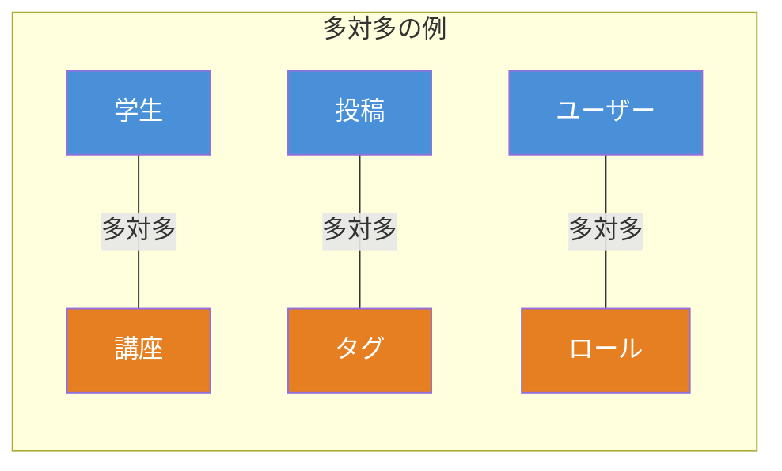
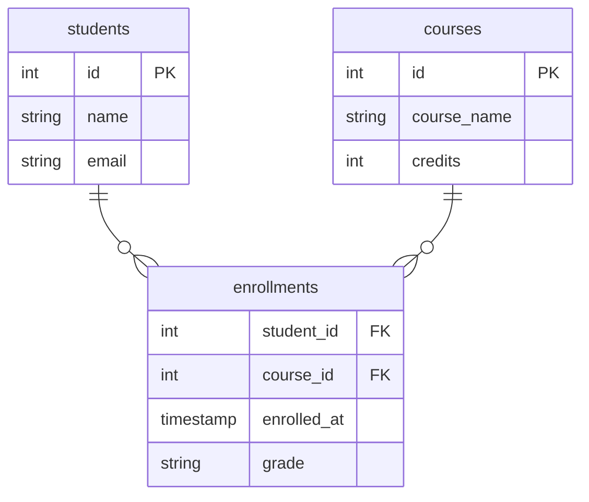
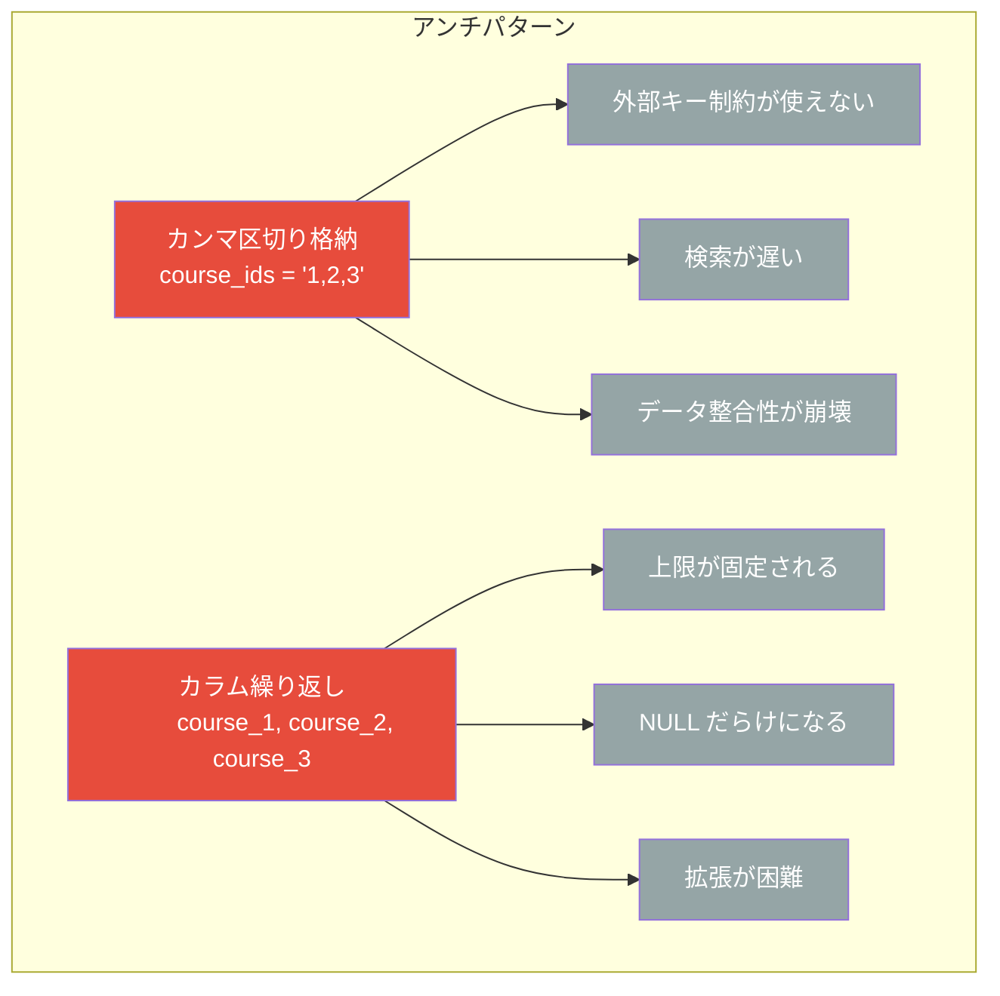

# 多対多リレーションと中間テーブル ― 初心者のための完全ガイド

## 多対多リレーションとは

データベース設計において、テーブル間の関係（リレーション）には 3 種類ある。

| リレーション | 例                      |
| ------------ | ----------------------- |
| 一対一       | ユーザー ↔ プロフィール |
| 一対多       | ユーザー → 投稿         |
| **多対多**   | **学生 ↔ 講座**         |

**多対多（Many-to-Many）** とは、テーブル A の 1 レコードがテーブル B の複数レコードに関連し、同時にテーブル B の 1 レコードもテーブル A の複数レコードに関連する関係である。

身近な例を挙げると以下のようになる。

- **学生と講座** ― 1 人の学生は複数の講座を受講でき、1 つの講座には複数の学生が参加する
- **投稿とタグ** ― 1 つの投稿に複数のタグを付けられ、1 つのタグは複数の投稿に使われる
- **ユーザーとロール** ― 1 人のユーザーは複数のロールを持ち、1 つのロールは複数のユーザーに割り当てられる



## なぜ中間テーブルが必要なのか

リレーショナルデータベースでは、2 つのテーブルだけで多対多を直接表現できない。そこで **中間テーブル（Junction Table）** を使い、多対多を **2 つの一対多** に分解する。



中間テーブルを置くことで、以下のメリットが得られる。

1. **外部キー制約** で参照整合性を保証できる
2. **複合主キー** で重複する関連を防げる
3. **関連に属性を追加** できる（例: 受講日、成績）
4. **インデックス** による高速な検索が可能になる

## SQL で中間テーブルを作る

### テーブル定義

```sql
-- 親テーブル
CREATE TABLE students (
    id SERIAL PRIMARY KEY,
    name VARCHAR(100) NOT NULL,
    email VARCHAR(255) UNIQUE
);

CREATE TABLE courses (
    id SERIAL PRIMARY KEY,
    course_name VARCHAR(200) NOT NULL,
    credits INTEGER
);

-- 中間テーブル
CREATE TABLE enrollments (
    student_id INTEGER NOT NULL,
    course_id  INTEGER NOT NULL,
    enrolled_at TIMESTAMP DEFAULT CURRENT_TIMESTAMP,
    grade VARCHAR(5),
    PRIMARY KEY (student_id, course_id),
    FOREIGN KEY (student_id) REFERENCES students(id) ON DELETE CASCADE,
    FOREIGN KEY (course_id) REFERENCES courses(id) ON DELETE CASCADE
);
```

ポイントは 3 つである。

- `PRIMARY KEY (student_id, course_id)` ― 複合主キーで同じ組み合わせの重複を防ぐ
- `FOREIGN KEY ... REFERENCES` ― 外部キーで参照整合性を保証する
- `ON DELETE CASCADE` ― 親レコード削除時に関連レコードも自動削除する

### データの挿入

```sql
-- 学生を追加
INSERT INTO students (name, email) VALUES ('田中太郎', 'tanaka@example.com');
INSERT INTO students (name, email) VALUES ('鈴木花子', 'suzuki@example.com');

-- 講座を追加
INSERT INTO courses (course_name, credits) VALUES ('データベース入門', 3);
INSERT INTO courses (course_name, credits) VALUES ('Web開発基礎', 4);

-- 受講登録（中間テーブルにレコードを追加）
INSERT INTO enrollments (student_id, course_id) VALUES (1, 1);
INSERT INTO enrollments (student_id, course_id) VALUES (1, 2);
INSERT INTO enrollments (student_id, course_id) VALUES (2, 1);
```

### JOIN で取得する

```sql
-- 学生ごとの受講講座一覧
SELECT s.name, c.course_name, e.enrolled_at
FROM students s
JOIN enrollments e ON s.id = e.student_id
JOIN courses c ON e.course_id = c.id;
```

| name     | course_name      | enrolled_at         |
| -------- | ---------------- | ------------------- |
| 田中太郎 | データベース入門 | 2026-03-05 10:00:00 |
| 田中太郎 | Web開発基礎      | 2026-03-05 10:01:00 |
| 鈴木花子 | データベース入門 | 2026-03-05 10:02:00 |

```sql
-- 講座ごとの受講者数
SELECT c.course_name, COUNT(e.student_id) AS enrollment_count
FROM courses c
LEFT JOIN enrollments e ON c.id = e.course_id
GROUP BY c.id, c.course_name;
```

## Drizzle ORM での実装

前回の記事で紹介した Drizzle ORM を使い、TypeScript で多対多リレーションを実装する例を示す。

### スキーマ定義

```typescript
import { relations } from 'drizzle-orm'
import { integer, pgTable, primaryKey, serial, timestamp, varchar } from 'drizzle-orm/pg-core'

// 学生テーブル
export const students = pgTable('students', {
  id: serial('id').primaryKey(),
  name: varchar('name', { length: 100 }).notNull(),
  email: varchar('email', { length: 255 }).notNull().unique(),
})

// 講座テーブル
export const courses = pgTable('courses', {
  id: serial('id').primaryKey(),
  courseName: varchar('course_name', { length: 200 }).notNull(),
  credits: integer('credits'),
})

// 中間テーブル
export const enrollments = pgTable(
  'enrollments',
  {
    studentId: integer('student_id')
      .notNull()
      .references(() => students.id, { onDelete: 'cascade' }),
    courseId: integer('course_id')
      .notNull()
      .references(() => courses.id, { onDelete: 'cascade' }),
    enrolledAt: timestamp('enrolled_at').defaultNow().notNull(),
    grade: varchar('grade', { length: 5 }),
  },
  (table) => [primaryKey({ columns: [table.studentId, table.courseId] })],
)
```

### リレーション定義

```typescript
export const studentsRelations = relations(students, ({ many }) => ({
  enrollments: many(enrollments),
}))

export const coursesRelations = relations(courses, ({ many }) => ({
  enrollments: many(enrollments),
}))

export const enrollmentsRelations = relations(enrollments, ({ one }) => ({
  student: one(students, {
    fields: [enrollments.studentId],
    references: [students.id],
  }),
  course: one(courses, {
    fields: [enrollments.courseId],
    references: [courses.id],
  }),
}))
```

### クエリ

```typescript
// 学生一覧と受講講座を取得
const studentsWithCourses = await db.query.students.findMany({
  with: {
    enrollments: {
      with: {
        course: true,
      },
    },
  },
})

// 結果の型:
// {
//   id: number
//   name: string
//   email: string
//   enrollments: {
//     studentId: number
//     courseId: number
//     enrolledAt: Date
//     grade: string | null
//     course: { id: number; courseName: string; credits: number | null }
//   }[]
// }[]
```

## やってはいけないアンチパターン

中間テーブルを使わずに多対多を表現しようとすると、深刻な問題が発生する。



| アンチパターン                 | 問題点                                                  |
| ------------------------------ | ------------------------------------------------------- |
| カンマ区切りで ID を格納       | 第一正規形違反。FK 制約不可、LIKE 検索が必要になり低速  |
| カラムを繰り返す               | 関連数に上限ができ、NULL が大量発生。スキーマ変更が頻発 |
| 中間テーブルに複合主キーがない | 同じ関連が重複して登録される                            |

## ベストプラクティス

| 項目           | 推奨事項                                                         |
| -------------- | ---------------------------------------------------------------- |
| 主キー         | 両方の FK を組み合わせた複合主キーを設定する                     |
| 外部キー       | `ON DELETE` の挙動（`CASCADE` / `RESTRICT`）を明示する           |
| インデックス   | 各 FK カラムにインデックスを作成し JOIN を高速化する             |
| テーブル命名   | `enrollments`、`post_tags` など意味のある名前を付ける            |
| 属性の追加     | 関連に付随する情報（日時、ステータス等）は中間テーブルに持たせる |
| タイムスタンプ | 監査が必要な場合は `created_at` / `updated_at` を追加する        |

## 参考

- [PostgreSQL 公式ドキュメント - CREATE TABLE](https://www.postgresql.org/docs/current/sql-createtable.html)
- [Drizzle ORM - Relations](https://orm.drizzle.team/docs/relations)
- [Drizzle ORM - Relations v2](https://orm.drizzle.team/docs/relations-v2)
- [Prisma - Many-to-Many Relations](https://www.prisma.io/docs/orm/prisma-schema/data-model/relations/many-to-many-relations)
