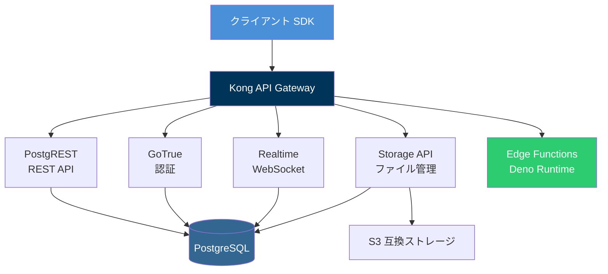
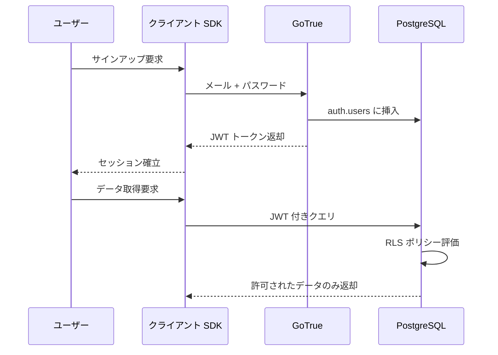
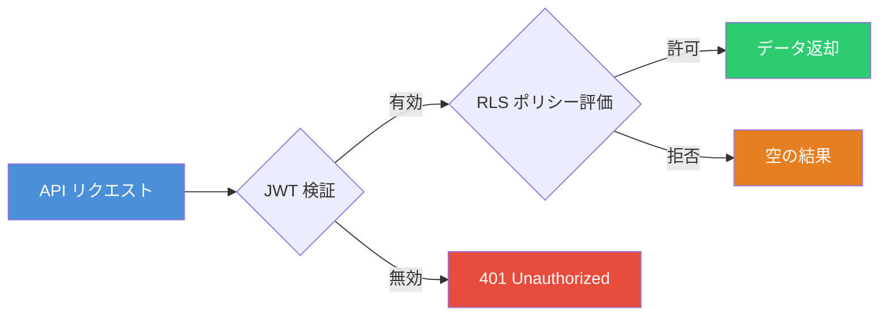
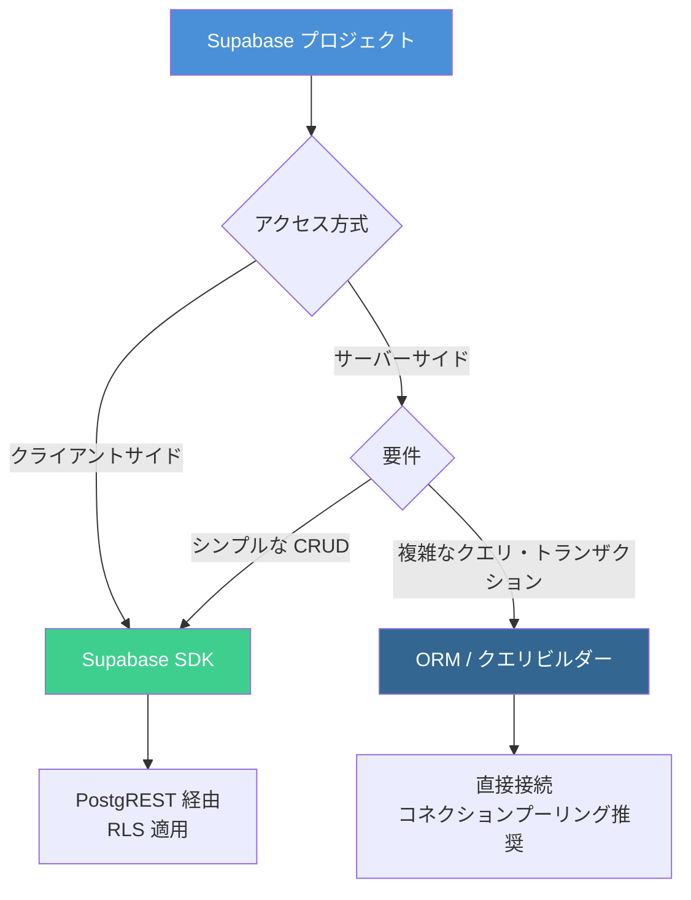

# Supabase 実践ガイド ― PostgreSQL ベースの BaaS でバックエンドを構築する

Supabase は PostgreSQL を中核に据えたオープンソースの Backend as a Service（BaaS）プラットフォームである。Firebase の代替として登場し、リレーショナルデータベースの堅牢さとリアルタイム機能・認証・ストレージ・Edge Functions を統合的に提供する。本記事では、Supabase のアーキテクチャから各機能の実践的な使い方までを解説する。

## アーキテクチャの全体像

Supabase は複数のオープンソースツールを組み合わせたプラットフォームであり、各コンポーネントが独立して動作しつつ相互に連携する設計になっている。



各コンポーネントの役割は以下の通りである。

| コンポーネント     | 役割                                                               |
| ------------------ | ------------------------------------------------------------------ |
| **PostgreSQL**     | 中核データベース。RLS・拡張機能をフル活用可能                      |
| **Kong**           | API ゲートウェイ。全サービスへのルーティングと認証を統括           |
| **PostgREST**      | PostgreSQL スキーマから REST / GraphQL API を自動生成              |
| **GoTrue**         | JWT ベースの認証・ユーザー管理サービス                             |
| **Realtime**       | WebSocket によるデータベース変更通知・プレゼンス・ブロードキャスト |
| **Storage API**    | S3 互換のオブジェクトストレージ。メタデータは PostgreSQL で管理    |
| **Edge Functions** | Deno ランタイムでグローバル分散実行される TypeScript 関数          |

## プロジェクトのセットアップ

### Supabase CLI のインストール

```bash
# npm でインストール
npm install -g supabase

# プロジェクト初期化
supabase init

# ローカル開発環境の起動
supabase start
```

### クライアント SDK のセットアップ

```typescript
import { createClient } from '@supabase/supabase-js'

const supabaseUrl = process.env.SUPABASE_URL!
const supabaseAnonKey = process.env.SUPABASE_ANON_KEY!

const supabase = createClient(supabaseUrl, supabaseAnonKey)
```

TypeScript の型安全性を確保するには、CLI で型を生成する。

```bash
supabase gen types typescript --project-id your-project-id > src/types/database.ts
```

生成された型をクライアントに適用する。

```typescript
import { createClient } from '@supabase/supabase-js'
import type { Database } from './types/database'

const supabase = createClient<Database>(supabaseUrl, supabaseAnonKey)
```

## データベース操作

### テーブル定義

Supabase ではマイグレーションファイルで SQL を直接記述する。

```sql
-- supabase/migrations/001_create_posts.sql
create table posts (
  id uuid primary key default gen_random_uuid(),
  title text not null,
  content text not null,
  author_id uuid references auth.users(id) on delete cascade,
  published boolean default false,
  created_at timestamptz default now(),
  updated_at timestamptz default now()
);

-- 更新日時の自動更新トリガー
create or replace function update_updated_at()
returns trigger as $$
begin
  new.updated_at = now();
  return new;
end;
$$ language plpgsql;

create trigger posts_updated_at
  before update on posts
  for each row execute function update_updated_at();
```

### CRUD 操作

PostgREST を通じたクエリは、クライアント SDK で直感的に記述できる。

```typescript
// 取得（フィルタ・ソート・ページネーション）
const { data: posts, error } = await supabase
  .from('posts')
  .select('id, title, content, created_at')
  .eq('published', true)
  .order('created_at', { ascending: false })
  .range(0, 9)

// リレーション付き取得
const { data } = await supabase
  .from('posts')
  .select(
    `
    id,
    title,
    author:auth.users(id, email),
    comments(id, body, created_at)
  `,
  )
  .eq('id', postId)
  .single()

// 挿入
const { data: newPost, error } = await supabase
  .from('posts')
  .insert({
    title: '新しい記事',
    content: '記事の本文',
    author_id: userId,
  })
  .select()
  .single()

// 更新
const { error } = await supabase.from('posts').update({ published: true }).eq('id', postId)

// 削除
const { error } = await supabase.from('posts').delete().eq('id', postId)
```

## 認証（Auth）

GoTrue による認証は、20 以上のソーシャルプロバイダーに対応しており、メール・パスワード、マジックリンク、電話番号、SSO など多様な認証方式をサポートする。



### 認証の実装

```typescript
// サインアップ
const { data, error } = await supabase.auth.signUp({
  email: 'user@example.com',
  password: 'secure-password',
})

// サインイン
const { data, error } = await supabase.auth.signInWithPassword({
  email: 'user@example.com',
  password: 'secure-password',
})

// OAuth（GitHub）
const { data, error } = await supabase.auth.signInWithOAuth({
  provider: 'github',
  options: {
    redirectTo: 'https://your-app.com/callback',
  },
})

// セッション監視
supabase.auth.onAuthStateChange((event, session) => {
  if (event === 'SIGNED_IN') {
    console.log('ログイン:', session?.user.email)
  }
  if (event === 'SIGNED_OUT') {
    console.log('ログアウト')
  }
})

// サインアウト
await supabase.auth.signOut()
```

## Row Level Security（RLS）

RLS は Supabase のセキュリティモデルの中核であり、データベースレベルでアクセス制御を行う仕組みである。API キーが公開されてもデータが保護される点が大きな利点である。

```sql
-- RLS を有効化
alter table posts enable row level security;

-- 公開記事は誰でも閲覧可能
create policy "公開記事は誰でも閲覧可能"
  on posts for select
  using (published = true);

-- 自分の記事のみ全操作可能
create policy "自分の記事は全操作可能"
  on posts for all
  using (auth.uid() = author_id)
  with check (auth.uid() = author_id);

-- 認証済みユーザーのみ記事を作成可能
create policy "認証済みユーザーのみ作成可能"
  on posts for insert
  with check (auth.uid() = author_id);
```



## Realtime

Realtime 機能は WebSocket を通じてデータベースの変更通知、クライアント間のブロードキャスト、プレゼンス管理を提供する。

```typescript
// データベース変更のリアルタイム監視
const channel = supabase
  .channel('posts-changes')
  .on(
    'postgres_changes',
    {
      event: '*',
      schema: 'public',
      table: 'posts',
      filter: 'published=eq.true',
    },
    (payload) => {
      console.log('変更検出:', payload.eventType, payload.new)
    },
  )
  .subscribe()

// プレゼンス（オンラインユーザー管理）
const presenceChannel = supabase.channel('online-users')

presenceChannel
  .on('presence', { event: 'sync' }, () => {
    const state = presenceChannel.presenceState()
    console.log('オンラインユーザー:', Object.keys(state).length)
  })
  .subscribe(async (status) => {
    if (status === 'SUBSCRIBED') {
      await presenceChannel.track({
        user_id: userId,
        online_at: new Date().toISOString(),
      })
    }
  })

// ブロードキャスト（チャット等）
const chatChannel = supabase.channel('chat-room')

chatChannel
  .on('broadcast', { event: 'message' }, ({ payload }) => {
    console.log('受信:', payload.text)
  })
  .subscribe()

// メッセージ送信
await chatChannel.send({
  type: 'broadcast',
  event: 'message',
  payload: { text: 'こんにちは', user_id: userId },
})
```

## Storage

Storage API は S3 互換のオブジェクトストレージを提供し、RLS と統合されたアクセス制御が可能である。

```typescript
// バケット作成（SQL）
// create policy でアクセス制御を設定

// ファイルアップロード
const { data, error } = await supabase.storage
  .from('avatars')
  .upload(`${userId}/avatar.png`, file, {
    contentType: 'image/png',
    upsert: true,
  })

// 公開 URL の取得
const { data } = supabase.storage.from('avatars').getPublicUrl(`${userId}/avatar.png`)

// 署名付き URL の取得（期限付き）
const { data, error } = await supabase.storage
  .from('private-docs')
  .createSignedUrl('report.pdf', 3600)

// 画像の変換（リサイズ）
const { data } = supabase.storage.from('avatars').getPublicUrl(`${userId}/avatar.png`, {
  transform: {
    width: 200,
    height: 200,
    resize: 'cover',
  },
})
```

## Edge Functions

Edge Functions は Deno ランタイム上で動作する TypeScript 関数であり、グローバルに分散配置されて低遅延で実行される。外部 API 連携やサーバーサイド処理に適している。

```bash
# Edge Function の作成
supabase functions new send-notification

# ローカルでのテスト
supabase functions serve send-notification

# デプロイ
supabase functions deploy send-notification
```

```typescript
// supabase/functions/send-notification/index.ts
import { createClient } from 'https://esm.sh/@supabase/supabase-js@2'

Deno.serve(async (req) => {
  const supabase = createClient(
    Deno.env.get('SUPABASE_URL')!,
    Deno.env.get('SUPABASE_SERVICE_ROLE_KEY')!,
  )

  const { userId, message } = await req.json()

  // データベースに通知を保存
  const { error } = await supabase.from('notifications').insert({
    user_id: userId,
    message,
    read: false,
  })

  if (error) {
    return new Response(JSON.stringify({ error: error.message }), {
      status: 400,
      headers: { 'Content-Type': 'application/json' },
    })
  }

  return new Response(JSON.stringify({ success: true }), {
    headers: { 'Content-Type': 'application/json' },
  })
})
```

## ORM との連携

Supabase のクライアント SDK はクエリビルダーとして優秀だが、複雑なビジネスロジックやマイグレーション管理を伴うプロジェクトでは ORM の導入が有効である。Supabase の実体は標準的な PostgreSQL であるため、接続文字列さえあれば任意の ORM をそのまま利用できる。

### クライアント SDK vs ORM の使い分け



| 方式                        | 適するケース                                                         |
| --------------------------- | -------------------------------------------------------------------- |
| **Supabase SDK**            | クライアントサイド、RLS を活用したアクセス制御、リアルタイム連携     |
| **ORM（Drizzle / Prisma）** | サーバーサイドの複雑なクエリ、トランザクション、マイグレーション管理 |
| **生 SQL**                  | パフォーマンスクリティカルなクエリ、RPC 関数、DB 関数定義            |

### Drizzle ORM との連携

Drizzle は軽量で SQL に近い記述ができるため、Supabase との相性が良い。

```bash
npm install drizzle-orm postgres
npm install -D drizzle-kit
```

```typescript
// db/schema.ts
import { pgTable, uuid, text, boolean, timestamp } from 'drizzle-orm/pg-core'

export const posts = pgTable('posts', {
  id: uuid('id').primaryKey().defaultRandom(),
  title: text('title').notNull(),
  content: text('content').notNull(),
  authorId: uuid('author_id').notNull(),
  published: boolean('published').default(false),
  createdAt: timestamp('created_at', { withTimezone: true }).defaultNow(),
  updatedAt: timestamp('updated_at', { withTimezone: true }).defaultNow(),
})
```

```typescript
// db/index.ts
import { drizzle } from 'drizzle-orm/postgres-js'
import postgres from 'postgres'
import * as schema from './schema'

// Supabase のダッシュボードから接続文字列を取得
// Transaction モードのコネクションプーリング URL を使用する
const connectionString = process.env.DATABASE_URL!

const client = postgres(connectionString)
export const db = drizzle(client, { schema })
```

```typescript
// クエリ例
import { eq, and, desc } from 'drizzle-orm'
import { db } from './db'
import { posts } from './db/schema'

// 公開記事の一覧取得
const publishedPosts = await db
  .select()
  .from(posts)
  .where(eq(posts.published, true))
  .orderBy(desc(posts.createdAt))
  .limit(10)

// トランザクション（SDK では直接扱えない）
await db.transaction(async (tx) => {
  const [post] = await tx
    .insert(posts)
    .values({
      title: '新しい記事',
      content: '本文',
      authorId: userId,
    })
    .returning()

  await tx.insert(postTags).values(tagIds.map((tagId) => ({ postId: post.id, tagId })))
})
```

### Prisma との連携

Prisma は豊富なエコシステムと直感的なスキーマ定義が特徴である。

```bash
npm install prisma @prisma/client
npx prisma init
```

```prisma
// prisma/schema.prisma
datasource db {
  provider  = "postgresql"
  url       = env("DATABASE_URL")
  directUrl = env("DIRECT_URL")
}

generator client {
  provider = "prisma-client-js"
}

model Post {
  id        String   @id @default(dbgenerated("gen_random_uuid()")) @db.Uuid
  title     String
  content   String
  authorId  String   @map("author_id") @db.Uuid
  published Boolean  @default(false)
  createdAt DateTime @default(now()) @map("created_at") @db.Timestamptz
  updatedAt DateTime @updatedAt @map("updated_at") @db.Timestamptz

  @@map("posts")
}
```

```typescript
import { PrismaClient } from '@prisma/client'

const prisma = new PrismaClient()

// リレーション付き取得
const post = await prisma.post.findUnique({
  where: { id: postId },
  include: { comments: true },
})

// トランザクション
const [post, tags] = await prisma.$transaction([
  prisma.post.create({ data: { title, content, authorId } }),
  prisma.postTag.createMany({ data: tagEntries }),
])
```

### 接続時の注意点

Supabase で ORM を使う場合、接続方式の選択が重要である。

| 接続方式                       | URL 形式                                            | 用途                                           |
| ------------------------------ | --------------------------------------------------- | ---------------------------------------------- |
| **Pooler（Transaction mode）** | `postgresql://...pooler.supabase.com:6543/postgres` | サーバーレス環境、Edge Functions               |
| **Pooler（Session mode）**     | `postgresql://...pooler.supabase.com:5432/postgres` | Prisma のマイグレーション、prepared statements |
| **直接接続**                   | `postgresql://...supabase.com:5432/postgres`        | 長時間接続が必要な場合                         |

サーバーレス環境（Vercel、Cloudflare Workers 等）では、コネクションプーリング経由の接続が必須である。Supabase はプロジェクトごとに Supavisor ベースのコネクションプーラーを提供しているため、追加の設定なしで利用できる。

## 本番運用のベストプラクティス

### セキュリティ

- **すべてのテーブルで RLS を有効化**する。RLS が無効のテーブルは API 経由で誰でもアクセス可能になる
- **`anon` キーはクライアント向け**、**`service_role` キーはサーバーサイド専用**として厳密に分離する
- Edge Functions 内で `service_role` キーを使用し、信頼されたサーバーサイド処理を実行する

### パフォーマンス

- 適切なインデックスを作成し、PostgREST のクエリパフォーマンスを最適化する
- `select` で必要なカラムのみを指定し、データ転送量を削減する
- Realtime のサブスクリプションにはフィルタを設定し、不要なイベントを除外する

### 型安全性

- CLI の `supabase gen types` を CI に組み込み、型定義を常に最新に保つ
- データベーススキーマ変更時は型の再生成を忘れずに行う

## 参考

- [Supabase 公式ドキュメント](https://supabase.com/docs)
- [Supabase Architecture](https://supabase.com/docs/guides/getting-started/architecture)
- [Supabase Auth ガイド](https://supabase.com/docs/guides/auth)
- [Supabase GitHub リポジトリ](https://github.com/supabase/supabase)
- [Supabase Edge Functions Architecture](https://supabase.com/docs/guides/functions/architecture)
