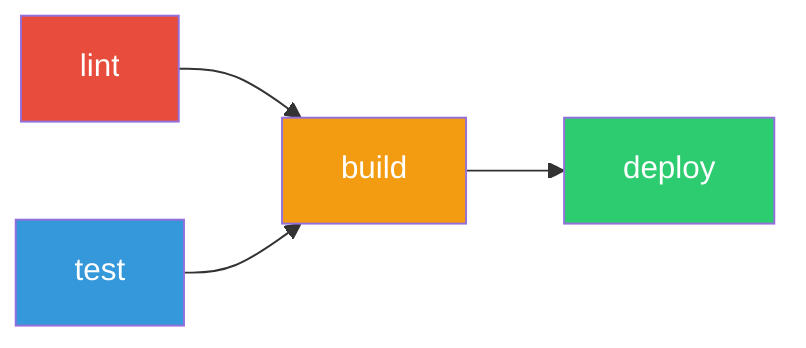
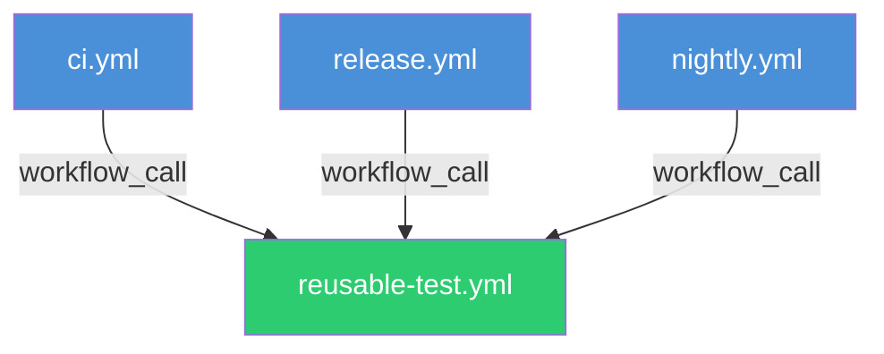
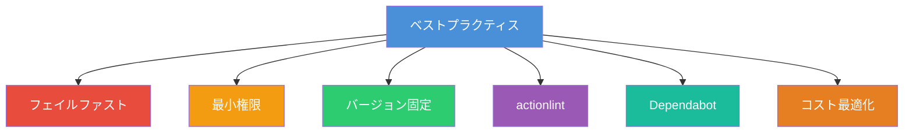

# GitHub Actions 完全ガイド ― ワークフロー構文からベストプラクティスまで

GitHub Actions は GitHub が提供する CI/CD プラットフォームである。リポジトリ内のイベント（プッシュ、プルリクエスト、Issue 作成など）をトリガーにワークフローを自動実行し、ビルド・テスト・デプロイを一元管理できる。本記事では、基本概念から実務で使える設計パターンまでを網羅的に解説する。

## GitHub Actions の全体像

GitHub Actions は「イベント駆動」で動作する自動化基盤である。リポジトリで発生するあらゆるイベントに反応し、定義済みのワークフローを実行する。


## 基本概念

GitHub Actions を理解するうえで押さえるべき 6 つの概念を整理する。

| 概念         | 説明                                                                    |
| ------------ | ----------------------------------------------------------------------- |
| **Workflow** | `.github/workflows/` に配置する YAML ファイル。自動化の単位             |
| **Event**    | ワークフローを起動するトリガー（push, pull_request など）               |
| **Job**      | ワークフロー内の実行単位。デフォルトで並列実行される                    |
| **Step**     | ジョブ内の個々のタスク。順番に実行される                                |
| **Action**   | 再利用可能な処理の最小単位（`actions/checkout` など）                   |
| **Runner**   | ワークフローを実行するサーバー（GitHub ホステッド or セルフホステッド） |

## ワークフローファイルの基本構造

ワークフローは `.github/workflows/` ディレクトリに YAML 形式で配置する。

```yaml
# .github/workflows/ci.yml
name: CI

on:
  push:
    branches: [main]
  pull_request:
    branches: [main]

jobs:
  build:
    runs-on: ubuntu-latest
    steps:
      - uses: actions/checkout@v4
      - name: Setup Node.js
        uses: actions/setup-node@v4
        with:
          node-version: '20'
      - run: npm ci
      - run: npm test
```

この例では `main` ブランチへのプッシュまたはプルリクエストで、Node.js のテストを実行する。

## トリガーイベント（on）

`on` キーでワークフローの起動条件を指定する。GitHub Actions は 30 以上のイベントをサポートしている。

### よく使うイベント一覧

```yaml
on:
  # コードのプッシュ時
  push:
    branches: [main, develop]
    paths:
      - 'src/**'
      - '!src/**/*.test.ts' # テストファイルは除外
    tags:
      - 'v*' # v で始まるタグ

  # プルリクエスト時
  pull_request:
    branches: [main]
    types: [opened, synchronize, reopened]

  # 手動実行
  workflow_dispatch:
    inputs:
      environment:
        description: 'デプロイ先環境'
        required: true
        type: choice
        options:
          - staging
          - production

  # スケジュール実行（POSIX cron 形式）
  schedule:
    - cron: '0 9 * * 1-5' # 平日 9:00 UTC

  # 他のワークフローから呼び出し
  workflow_call:
    inputs:
      node-version:
        required: true
        type: string
```

### パスフィルターの詳細

`paths` と `paths-ignore` を使い分けることで、無駄なワークフロー実行を防げる。

```yaml
on:
  push:
    # paths と paths-ignore は併用不可
    # 以下は src/ 配下の変更のみ反応する
    paths:
      - 'src/**'
      - 'package.json'
      - 'tsconfig.json'
```

`paths-ignore` を使う場合：

```yaml
on:
  push:
    paths-ignore:
      - '**/*.md'
      - 'docs/**'
      - '.vscode/**'
```

> **注意**: `paths` と `paths-ignore` は同一イベント内で併用できない。どちらか一方を選択する。

### ブランチフィルターのパターン

```yaml
on:
  push:
    branches:
      - main
      - 'release/**' # release/ で始まるブランチ
      - '!release/**-rc' # ただし -rc で終わるものは除外
```

## ジョブの設計

### ジョブの依存関係（needs）

`needs` キーでジョブ間の実行順序を制御する。

```yaml
jobs:
  lint:
    runs-on: ubuntu-latest
    steps:
      - uses: actions/checkout@v4
      - run: npm run lint

  test:
    runs-on: ubuntu-latest
    steps:
      - uses: actions/checkout@v4
      - run: npm test

  build:
    needs: [lint, test] # lint と test の両方が成功したら実行
    runs-on: ubuntu-latest
    steps:
      - uses: actions/checkout@v4
      - run: npm run build

  deploy:
    needs: build
    runs-on: ubuntu-latest
    if: github.ref == 'refs/heads/main'
    steps:
      - run: echo "Deploying..."
```



### マトリックスビルド（strategy.matrix）

複数の環境・バージョンで並列テストを実行する。

```yaml
jobs:
  test:
    runs-on: ${{ matrix.os }}
    strategy:
      matrix:
        os: [ubuntu-latest, macos-latest, windows-latest]
        node-version: [18, 20, 22]
        exclude:
          # Windows + Node 18 は除外
          - os: windows-latest
            node-version: 18
        include:
          # 特定の組み合わせを追加
          - os: ubuntu-latest
            node-version: 22
            experimental: true
      fail-fast: false # 1つ失敗しても他を続行
    steps:
      - uses: actions/checkout@v4
      - uses: actions/setup-node@v4
        with:
          node-version: ${{ matrix.node-version }}
      - run: npm ci
      - run: npm test
```

`exclude` で不要な組み合わせを除外し、`include` で追加の組み合わせやパラメータを付与できる。`fail-fast: false` を指定すると、1 つのジョブが失敗しても残りのジョブは続行される。

## 環境変数とシークレット

### 環境変数の階層

環境変数はワークフロー・ジョブ・ステップの 3 階層で定義でき、下位が上位を上書きする。

```yaml
env:
  # ワークフローレベル
  NODE_ENV: production
  APP_NAME: my-app

jobs:
  build:
    runs-on: ubuntu-latest
    env:
      # ジョブレベル（ワークフローレベルを上書き可能）
      NODE_ENV: test
    steps:
      - name: Show env
        env:
          # ステップレベル（ジョブレベルを上書き可能）
          DEBUG: 'true'
        run: |
          echo "NODE_ENV=$NODE_ENV"    # test
          echo "APP_NAME=$APP_NAME"    # my-app
          echo "DEBUG=$DEBUG"          # true
```

### シークレットの使い方

リポジトリの Settings > Secrets and variables > Actions でシークレットを登録し、`secrets` コンテキストで参照する。

```yaml
steps:
  - name: Deploy
    env:
      AWS_ACCESS_KEY_ID: ${{ secrets.AWS_ACCESS_KEY_ID }}
      AWS_SECRET_ACCESS_KEY: ${{ secrets.AWS_SECRET_ACCESS_KEY }}
    run: aws s3 sync ./dist s3://my-bucket
```

> **重要**: シークレットはログにマスクされるが、`echo` で意図的に出力すると漏洩する。`run` ステップ内で直接展開せず、環境変数経由で渡すのが安全である。

### GITHUB_TOKEN

`GITHUB_TOKEN` はワークフロー実行ごとに自動生成されるトークンである。`permissions` で権限を明示的に制御するべきである。

```yaml
permissions:
  contents: read
  pull-requests: write
  issues: write

jobs:
  comment:
    runs-on: ubuntu-latest
    steps:
      - name: Comment on PR
        uses: actions/github-script@v7
        with:
          script: |
            github.rest.issues.createComment({
              issue_number: context.issue.number,
              owner: context.repo.owner,
              repo: context.repo.repo,
              body: 'CI passed!'
            })
```

## キャッシュ戦略

依存関係のキャッシュはビルド時間短縮に直結する。

### actions/cache を使ったキャッシュ

```yaml
steps:
  - uses: actions/checkout@v4
  - uses: actions/setup-node@v4
    with:
      node-version: '20'
  - name: Cache node_modules
    uses: actions/cache@v4
    id: cache-deps
    with:
      path: node_modules
      key: deps-${{ runner.os }}-${{ hashFiles('package-lock.json') }}
      restore-keys: |
        deps-${{ runner.os }}-
  - name: Install dependencies
    if: steps.cache-deps.outputs.cache-hit != 'true'
    run: npm ci
  - run: npm test
```

### setup-node 組み込みキャッシュ

`actions/setup-node` は `cache` オプションで依存関係を自動キャッシュできる。

```yaml
- uses: actions/setup-node@v4
  with:
    node-version: '20'
    cache: 'npm' # npm, yarn, pnpm に対応
```

## アーティファクト

ジョブ間でファイルを共有したり、ビルド成果物を保存するにはアーティファクトを使用する。

```yaml
jobs:
  build:
    runs-on: ubuntu-latest
    steps:
      - uses: actions/checkout@v4
      - run: npm ci && npm run build
      - uses: actions/upload-artifact@v4
        with:
          name: build-output
          path: dist/
          retention-days: 7

  deploy:
    needs: build
    runs-on: ubuntu-latest
    steps:
      - uses: actions/download-artifact@v4
        with:
          name: build-output
          path: dist/
      - run: echo "Deploying dist/ ..."
```

## 条件分岐（if）

ステップやジョブの実行条件を `if` で制御する。

```yaml
steps:
  # main ブランチへのプッシュ時のみ実行
  - name: Deploy to production
    if: github.ref == 'refs/heads/main' && github.event_name == 'push'
    run: ./deploy.sh

  # 前のステップが失敗しても実行
  - name: Notify on failure
    if: failure()
    run: curl -X POST "$SLACK_WEBHOOK" -d '{"text":"CI failed!"}'

  # 常に実行（成功・失敗・キャンセルに関わらず）
  - name: Cleanup
    if: always()
    run: rm -rf ./tmp
```

### よく使うステータス関数

| 関数          | 説明                                   |
| ------------- | -------------------------------------- |
| `success()`   | 前のステップがすべて成功（デフォルト） |
| `failure()`   | 前のステップのいずれかが失敗           |
| `cancelled()` | ワークフローがキャンセルされた         |
| `always()`    | 常に実行                               |

## 並行実行制御（concurrency）

同一ブランチへの連続プッシュで古いワークフローをキャンセルし、リソースを節約する。

```yaml
concurrency:
  group: ${{ github.workflow }}-${{ github.ref }}
  cancel-in-progress: true
```

これにより、同じブランチで新しいプッシュがあると実行中のワークフローが自動キャンセルされる。プルリクエストの連続プッシュ時に特に有効である。

## Reusable Workflows（再利用可能ワークフロー）

共通処理を別ファイルに切り出し、複数のワークフローから呼び出す仕組みである。

### 呼び出される側（callee）

```yaml
# .github/workflows/reusable-test.yml
name: Reusable Test

on:
  workflow_call:
    inputs:
      node-version:
        required: false
        type: string
        default: '20'
    secrets:
      npm-token:
        required: false

jobs:
  test:
    runs-on: ubuntu-latest
    steps:
      - uses: actions/checkout@v4
      - uses: actions/setup-node@v4
        with:
          node-version: ${{ inputs.node-version }}
      - run: npm ci
        env:
          NPM_TOKEN: ${{ secrets.npm-token }}
      - run: npm test
```

### 呼び出す側（caller）

```yaml
# .github/workflows/ci.yml
name: CI

on:
  push:
    branches: [main]

jobs:
  test:
    uses: ./.github/workflows/reusable-test.yml
    with:
      node-version: '22'
    secrets:
      npm-token: ${{ secrets.NPM_TOKEN }}
```



## Composite Actions（複合アクション）

ステップレベルで再利用可能な処理を定義する。Reusable Workflows がジョブ単位の再利用なのに対し、Composite Actions はステップ単位の再利用である。

```yaml
# .github/actions/setup-project/action.yml
name: Setup Project
description: プロジェクトのセットアップ

inputs:
  node-version:
    description: 'Node.js version'
    required: false
    default: '20'

runs:
  using: 'composite'
  steps:
    - uses: actions/checkout@v4
      with:
        fetch-depth: 0
    - uses: actions/setup-node@v4
      with:
        node-version: ${{ inputs.node-version }}
        cache: 'npm'
    - run: npm ci
      shell: bash
```

呼び出し側：

```yaml
steps:
  - uses: ./.github/actions/setup-project
    with:
      node-version: '22'
  - run: npm test
```

## 実践パターン：CI/CD パイプライン

フロントエンドプロジェクトの本格的な CI/CD パイプラインの例を示す。

```yaml
name: CI/CD Pipeline

on:
  push:
    branches: [main]
  pull_request:
    branches: [main]

concurrency:
  group: ${{ github.workflow }}-${{ github.ref }}
  cancel-in-progress: true

permissions:
  contents: read
  pull-requests: write

jobs:
  lint:
    runs-on: ubuntu-latest
    steps:
      - uses: actions/checkout@v4
      - uses: actions/setup-node@v4
        with:
          node-version: '20'
          cache: 'npm'
      - run: npm ci
      - run: npm run lint
      - run: npm run typecheck

  test:
    runs-on: ubuntu-latest
    steps:
      - uses: actions/checkout@v4
      - uses: actions/setup-node@v4
        with:
          node-version: '20'
          cache: 'npm'
      - run: npm ci
      - run: npm test -- --coverage
      - uses: actions/upload-artifact@v4
        with:
          name: coverage
          path: coverage/

  build:
    needs: [lint, test]
    runs-on: ubuntu-latest
    steps:
      - uses: actions/checkout@v4
      - uses: actions/setup-node@v4
        with:
          node-version: '20'
          cache: 'npm'
      - run: npm ci
      - run: npm run build
      - uses: actions/upload-artifact@v4
        with:
          name: dist
          path: dist/

  deploy:
    needs: build
    if: github.ref == 'refs/heads/main' && github.event_name == 'push'
    runs-on: ubuntu-latest
    environment: production
    steps:
      - uses: actions/download-artifact@v4
        with:
          name: dist
          path: dist/
      - name: Deploy to production
        env:
          DEPLOY_TOKEN: ${{ secrets.DEPLOY_TOKEN }}
        run: |
          echo "Deploying to production..."
```

## ベストプラクティス

### 1. フェイルファストの原則

軽量なチェック（lint, typecheck）を先に実行し、重いジョブ（ビルド、E2E テスト）は後段に配置する。失敗を早期に検出することで待ち時間とコストを削減できる。

### 2. 最小権限の原則

`permissions` を明示的に指定し、必要最小限の権限のみ付与する。

```yaml
# ワークフロー全体でデフォルト権限を制限
permissions:
  contents: read
```

### 3. アクションのバージョン固定

アクションはコミットハッシュで固定するのが最も安全である。

```yaml
# 推奨: コミットハッシュで固定
- uses: actions/checkout@11bd71901bbe5b1630ceea73d27597364c9af683 # v4.2.2

# 許容: メジャーバージョンで固定
- uses: actions/checkout@v4

# 非推奨: ブランチ指定（変更される可能性がある）
- uses: actions/checkout@main
```

### 4. actionlint の導入

ローカルでワークフロー構文を検証できるツールである。CI で実行する前に問題を検出できる。

```bash
# インストール
brew install actionlint

# 実行
actionlint
```

### 5. Dependabot でアクションを自動更新

```yaml
# .github/dependabot.yml
version: 2
updates:
  - package-ecosystem: 'github-actions'
    directory: '/'
    schedule:
      interval: 'weekly'
```

### 6. コスト意識

GitHub ホステッドランナーには OS ごとに料金の乗率がある。

| OS      | 乗率 |
| ------- | ---- |
| Ubuntu  | 1x   |
| macOS   | 10x  |
| Windows | 2x   |

可能な限り Ubuntu ランナーを選択することでコストを抑えられる。



## まとめ

GitHub Actions はリポジトリと密接に統合された CI/CD プラットフォームであり、ワークフローの記述だけで強力な自動化を実現できる。本記事で解説した要点を整理する。

- **イベント駆動**: `push`、`pull_request`、`schedule`、`workflow_dispatch` など多様なトリガーに対応
- **ジョブ設計**: `needs` による依存関係、`matrix` による並列テスト、`concurrency` による制御
- **再利用**: Reusable Workflows（ジョブ単位）と Composite Actions（ステップ単位）の使い分け
- **セキュリティ**: `permissions` による最小権限、シークレット管理、アクションのバージョン固定
- **効率化**: キャッシュ、アーティファクト、フェイルファスト設計でビルド時間とコストを最適化

まずは小さなワークフローから始め、Reusable Workflows や Composite Actions で徐々に共通化していくのがよいアプローチである。

## 参考

- [GitHub Actions Documentation](https://docs.github.com/en/actions)
- [Workflow syntax for GitHub Actions](https://docs.github.com/en/actions/writing-workflows/workflow-syntax-for-github-actions)
- [なんとなくから脱却する GitHub Actionsグッドプラクティス11選 | gihyo.jp](https://gihyo.jp/article/2024/10/good-practices-for-github-actions)
- [GitHub Actions Workflow チェックリスト | CyberAgent Developers Blog](https://developers.cyberagent.co.jp/blog/archives/36423/)
- [GitHub、Agentic Workflowsをテクニカルプレビューで提供開始 | gihyo.jp](https://gihyo.jp/article/2026/02/github-agentic-workflow)
