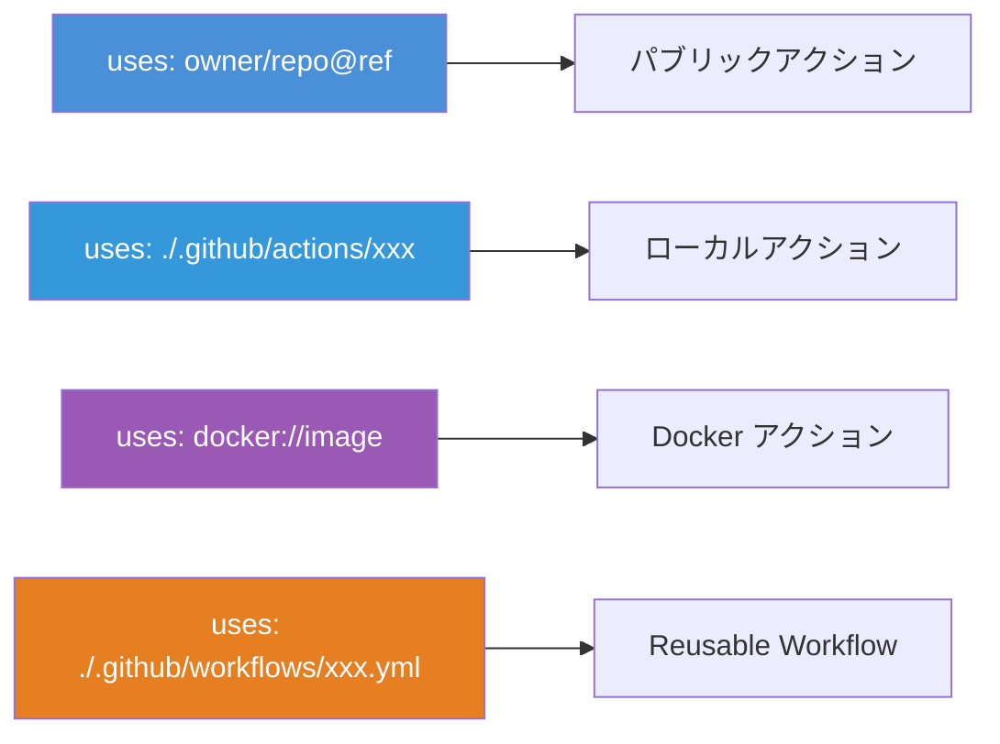
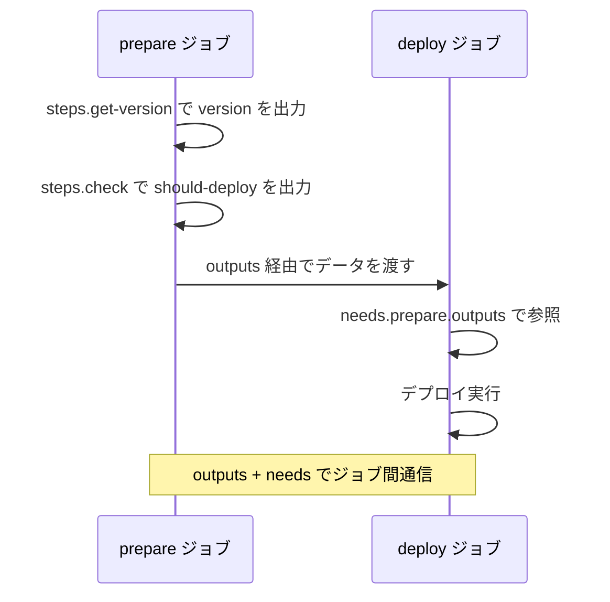

# GitHub Actions ワークフロー構文詳解 ― name・uses・run・with の使い方を徹底解説

GitHub Actions のワークフローは YAML で記述する。`name`、`uses`、`run`、`with` など多数のキーワードが登場するが、それぞれどの階層で使えるのか、どのような役割を持つのかを正確に把握しているだろうか。本記事では、ワークフロー構文の各ディレクティブを体系的に整理し、実践的なコード例とともに解説する。

## ワークフロー構文の階層構造

GitHub Actions の YAML は **ワークフロー → ジョブ → ステップ** の 3 階層で構成される。各キーワードが使える階層を理解することが構文マスターへの第一歩である。

```mermaid
flowchart TD
    W[Workflow] --> |"name, on, env, permissions, concurrency, defaults"| W
    W --> J[Jobs]
    J --> |"name, runs-on, needs, if, env, outputs, strategy, timeout-minutes, continue-on-error"| J
    J --> S[Steps]
    S --> |"name, id, uses, with, run, env, if, shell, working-directory, timeout-minutes, continue-on-error"| S

    style W fill:#4a90d9,color:#fff
    style J fill:#f39c12,color:#fff
    style S fill:#2ecc71,color:#fff
```



## name ― 表示名の設定

`name` はワークフロー・ジョブ・ステップの 3 階層すべてで使用できるキーワードである。GitHub UI 上での表示名を制御する。

### ワークフローレベルの name

```yaml
# .github/workflows/ci.yml
name: CI Pipeline
```

省略した場合、ファイルパス（`.github/workflows/ci.yml`）がそのまま表示される。リポジトリの Actions タブで識別しやすい名前を付けるべきである。

### ジョブレベルの name

```yaml
jobs:
  build:
    name: Build & Test # GitHub UI に表示されるジョブ名
    runs-on: ubuntu-latest
    steps:
      - run: echo "building..."
```

ジョブ ID（`build`）は YAML のキーとして使う内部識別子であり、`name` は UI 表示用である。`name` を省略するとジョブ ID がそのまま表示される。

### ステップレベルの name

```yaml
steps:
  - name: Install dependencies
    run: npm ci

  - name: Run tests
    run: npm test
```

ステップに `name` を付けると、ログ出力で各ステップの目的が明確になる。`run` だけのステップでも必ず `name` を付けることを推奨する。

### マトリックスと組み合わせた動的な name

```yaml
jobs:
  test:
    name: Test (Node ${{ matrix.node-version }}, ${{ matrix.os }})
    runs-on: ${{ matrix.os }}
    strategy:
      matrix:
        os: [ubuntu-latest, macos-latest]
        node-version: [18, 20, 22]
    steps:
      - uses: actions/checkout@v4
      - uses: actions/setup-node@v4
        with:
          node-version: ${{ matrix.node-version }}
      - run: npm test
```

式（`${{ }}`）を使うことで、マトリックスの各組み合わせに応じた動的な名前を生成できる。

## uses ― アクションの呼び出し

`uses` はステップレベル専用のキーワードで、再利用可能なアクションを呼び出す。呼び出し方は 4 つのパターンがある。

### パブリックリポジトリのアクション

```yaml
steps:
  # owner/repo@ref 形式
  - uses: actions/checkout@v4

  # コミットハッシュ指定（最も安全）
  - uses: actions/checkout@11bd71901bbe5b1630ceea73d27597364c9af683 # v4.2.2
```

`@ref` にはタグ（`v4`）、ブランチ名（`main`）、コミットハッシュを指定できる。サプライチェーン攻撃を防ぐため、**コミットハッシュでの固定が推奨**される。

### ローカルアクション

```yaml
steps:
  # リポジトリ内のカスタムアクション
  - uses: ./.github/actions/setup-project
```

リポジトリ内に定義した Composite Action や JavaScript Action を参照する。パスはリポジトリルートからの相対パスで指定する。

### Docker コンテナアクション

```yaml
steps:
  # Docker Hub のイメージ
  - uses: docker://node:20-alpine

  # GitHub Container Registry のイメージ
  - uses: docker://ghcr.io/owner/image:tag
```

任意の Docker イメージをアクションとして実行できる。

### Reusable Workflow の呼び出し

```yaml
jobs:
  call-test:
    # ジョブレベルで uses を指定（ステップではなくジョブ全体）
    uses: ./.github/workflows/reusable-test.yml
    with:
      node-version: '20'
    secrets: inherit
```

Reusable Workflow の場合のみ、`uses` はジョブレベルで使用する。この場合、同じジョブ内に `steps` は定義できない。



## with ― アクションへの入力パラメータ

`with` は `uses` と組み合わせて使用するキーワードで、アクションに入力パラメータを渡す。

### 基本的な使い方

```yaml
steps:
  - uses: actions/setup-node@v4
    with:
      node-version: '20'
      cache: 'npm'
      registry-url: 'https://npm.pkg.github.com'
```

各アクションの `action.yml` で定義された `inputs` に対応するキーを指定する。

### args と entrypoint（Docker アクション用）

Docker アクションに対しては特別なキー `args` と `entrypoint` を使用できる。

```yaml
steps:
  - uses: docker://alpine:3.19
    with:
      entrypoint: /bin/sh
      args: -c "echo Hello from Docker"
```

`args` はコンテナの `CMD` を上書きし、`entrypoint` は `ENTRYPOINT` を上書きする。

### Reusable Workflow への入力

```yaml
jobs:
  deploy:
    uses: ./.github/workflows/deploy.yml
    with:
      environment: production
      version: '1.2.3'
    secrets:
      deploy-token: ${{ secrets.DEPLOY_TOKEN }}
```

Reusable Workflow の場合は `with` でワークフロー入力を、`secrets` でシークレットを渡す。

## run ― シェルコマンドの実行

`run` はステップレベル専用のキーワードで、シェルコマンドを直接実行する。`uses` とは**排他的**であり、同一ステップで両方を指定することはできない。

### 単一コマンド

```yaml
steps:
  - name: Install
    run: npm ci
```

### 複数行コマンド

```yaml
steps:
  - name: Build and test
    run: |
      npm ci
      npm run build
      npm test
```

`|`（リテラルブロック）を使うことで複数行のコマンドを記述できる。各行は順番に実行される。

### shell の指定

```yaml
steps:
  - name: PowerShell script
    run: Write-Host "Hello from PowerShell"
    shell: pwsh

  - name: Python script
    run: |
      import json
      data = {"key": "value"}
      print(json.dumps(data))
    shell: python
```

`shell` キーで実行シェルを変更できる。対応シェルは以下の通りである。

| shell        | プラットフォーム   | 説明                  |
| ------------ | ------------------ | --------------------- |
| `bash`       | Linux / macOS      | デフォルト            |
| `sh`         | Linux / macOS      | bash がない環境用     |
| `pwsh`       | 全プラットフォーム | PowerShell Core       |
| `powershell` | Windows            | Windows PowerShell    |
| `cmd`        | Windows            | コマンドプロンプト    |
| `python`     | 全プラットフォーム | Python スクリプト実行 |

### working-directory の指定

```yaml
steps:
  - name: Build frontend
    run: npm run build
    working-directory: ./packages/frontend
```

### defaults.run でデフォルトを設定

```yaml
defaults:
  run:
    shell: bash
    working-directory: ./src

jobs:
  build:
    runs-on: ubuntu-latest
    steps:
      # すべての run ステップに shell: bash と working-directory: ./src が適用
      - run: echo "Default shell and directory"
```

ワークフローレベルまたはジョブレベルで `defaults.run` を定義すると、すべての `run` ステップにデフォルト値が適用される。

## id ― ステップの識別子

`id` はステップに一意の識別子を付与するキーワードである。他のステップから出力値を参照するために使用する。

```yaml
steps:
  - name: Get version
    id: version
    run: echo "value=$(cat package.json | jq -r .version)" >> "$GITHUB_OUTPUT"

  - name: Use version
    run: echo "Version is ${{ steps.version.outputs.value }}"
```

`id` を設定したステップの出力は `steps.<id>.outputs.<key>` で参照できる。`$GITHUB_OUTPUT` 環境ファイルに `key=value` 形式で書き込むことで出力を設定する。

### id の命名規則

```yaml
# OK: ハイフン、アンダースコア、英数字
- id: my-step
- id: my_step
- id: step1

# NG: スペースや特殊文字
- id: my step # 不可
- id: my.step # 不可
```

## if ― 条件付き実行

`if` はジョブレベルとステップレベルで使用でき、式が `true` に評価されたときのみ実行する。

### ステップの条件分岐

```yaml
steps:
  - name: Deploy
    if: github.ref == 'refs/heads/main'
    run: ./deploy.sh

  - name: Comment on PR
    if: github.event_name == 'pull_request'
    uses: actions/github-script@v7
    with:
      script: |
        github.rest.issues.createComment({
          issue_number: context.issue.number,
          owner: context.repo.owner,
          repo: context.repo.repo,
          body: 'Build succeeded!'
        })
```

### ステータス関数

```yaml
steps:
  - name: Always cleanup
    if: always()
    run: rm -rf ./tmp

  - name: Notify failure
    if: failure()
    run: curl -X POST "$WEBHOOK_URL" -d '{"text":"CI failed"}'

  - name: On cancel
    if: cancelled()
    run: echo "Workflow was cancelled"
```

`if` の中では `${{ }}` を省略できる（自動的に式として評価される）。

### 複合条件

```yaml
steps:
  - name: Production deploy
    if: |
      github.ref == 'refs/heads/main' &&
      github.event_name == 'push' &&
      !contains(github.event.head_commit.message, '[skip deploy]')
    run: ./deploy.sh
```

`&&`（AND）、`||`（OR）、`!`（NOT）で条件を組み合わせられる。

## outputs ― ジョブ間のデータ受け渡し

`outputs` はジョブレベルで定義し、他のジョブにデータを渡す仕組みである。

```yaml
jobs:
  prepare:
    runs-on: ubuntu-latest
    outputs:
      version: ${{ steps.get-version.outputs.version }}
      should-deploy: ${{ steps.check.outputs.deploy }}
    steps:
      - id: get-version
        run: echo "version=1.2.3" >> "$GITHUB_OUTPUT"
      - id: check
        run: echo "deploy=true" >> "$GITHUB_OUTPUT"

  deploy:
    needs: prepare
    if: needs.prepare.outputs.should-deploy == 'true'
    runs-on: ubuntu-latest
    steps:
      - run: echo "Deploying version ${{ needs.prepare.outputs.version }}"
```



## env ― 環境変数の定義

`env` はワークフロー・ジョブ・ステップの 3 階層すべてで使用でき、下位の定義が上位を上書きする。

```yaml
env:
  APP_ENV: production # ワークフローレベル

jobs:
  test:
    runs-on: ubuntu-latest
    env:
      APP_ENV: test # ジョブレベル（上書き）
      DB_HOST: localhost
    steps:
      - name: Show env
        env:
          DEBUG: 'true' # ステップレベル
        run: |
          echo "$APP_ENV"   # test
          echo "$DB_HOST"   # localhost
          echo "$DEBUG"     # true
```

### 動的な環境変数

```yaml
steps:
  - name: Set dynamic env
    run: echo "BUILD_TIME=$(date -u +%Y-%m-%dT%H:%M:%SZ)" >> "$GITHUB_ENV"

  - name: Use dynamic env
    run: echo "Built at $BUILD_TIME"
```

`$GITHUB_ENV` に書き込むと、以降のステップで環境変数として利用できる。

## その他の重要なキーワード

### timeout-minutes

```yaml
jobs:
  test:
    runs-on: ubuntu-latest
    timeout-minutes: 30 # ジョブ全体のタイムアウト
    steps:
      - name: E2E tests
        timeout-minutes: 15 # ステップ単位のタイムアウト
        run: npm run test:e2e
```

デフォルトのタイムアウトは 360 分（6 時間）である。無限ループやハングを防ぐために適切な値を設定するべきである。

### continue-on-error

```yaml
jobs:
  test:
    runs-on: ubuntu-latest
    continue-on-error: true # ジョブが失敗しても後続ジョブを実行
    steps:
      - name: Experimental test
        continue-on-error: true # このステップが失敗しても次のステップへ進む
        run: npm run test:experimental

      - name: Report
        run: echo "This runs regardless of the previous step"
```

### permissions

```yaml
permissions:
  contents: read
  pull-requests: write
  issues: write
  packages: read
```

ワークフローレベルまたはジョブレベルで `GITHUB_TOKEN` の権限を明示的に制御する。最小権限の原則に従い、必要な権限のみ付与する。

## 全キーワードの階層対応表

| キーワード          | Workflow | Job | Step | 説明                 |
| ------------------- | :------: | :-: | :--: | -------------------- |
| `name`              |    ✅    | ✅  |  ✅  | 表示名               |
| `on`                |    ✅    |  -  |  -   | トリガーイベント     |
| `env`               |    ✅    | ✅  |  ✅  | 環境変数             |
| `permissions`       |    ✅    | ✅  |  -   | GITHUB_TOKEN の権限  |
| `defaults`          |    ✅    | ✅  |  -   | run のデフォルト設定 |
| `concurrency`       |    ✅    | ✅  |  -   | 並行実行制御         |
| `runs-on`           |    -     | ✅  |  -   | ランナー指定         |
| `needs`             |    -     | ✅  |  -   | ジョブ依存関係       |
| `if`                |    -     | ✅  |  ✅  | 条件付き実行         |
| `outputs`           |    -     | ✅  |  -   | ジョブ出力           |
| `strategy`          |    -     | ✅  |  -   | マトリックスビルド   |
| `timeout-minutes`   |    -     | ✅  |  ✅  | タイムアウト         |
| `continue-on-error` |    -     | ✅  |  ✅  | エラー時も続行       |
| `uses`              |    -     |  -  |  ✅  | アクション呼び出し   |
| `with`              |    -     |  -  |  ✅  | アクションへの入力   |
| `run`               |    -     |  -  |  ✅  | シェルコマンド実行   |
| `id`                |    -     |  -  |  ✅  | ステップ識別子       |
| `shell`             |    -     |  -  |  ✅  | 実行シェル指定       |
| `working-directory` |    -     |  -  |  ✅  | 作業ディレクトリ     |

## まとめ

GitHub Actions のワークフロー構文は多くのキーワードで構成されるが、階層構造を理解すれば整理しやすい。本記事のポイントを振り返る。

- **name** はワークフロー・ジョブ・ステップの全階層で使用でき、UI 上の可読性を向上させる
- **uses** はアクション呼び出し専用で、パブリック・ローカル・Docker・Reusable Workflow の 4 パターンがある
- **run** はシェルコマンド実行専用で、`uses` とは排他的関係にある
- **with** は `uses` で呼び出すアクションに入力パラメータを渡す
- **id** と **outputs** を組み合わせることで、ステップ間・ジョブ間のデータ受け渡しが可能になる
- **if** による条件分岐とステータス関数で柔軟な実行制御ができる
- **env** は 3 階層で定義可能で、下位が上位を上書きする

各キーワードの役割と使える階層を正確に把握しておくことで、ワークフローの設計・デバッグが格段にスムーズになるはずである。

## 参考

- [Workflow syntax for GitHub Actions - GitHub Docs](https://docs.github.com/en/actions/writing-workflows/workflow-syntax-for-github-actions)
- [Understanding GitHub Actions - GitHub Docs](https://docs.github.com/en/actions/get-started/understand-github-actions)
- [GitHub Actionsとは？書き方、デバッグ設定、仕組みや構造も含めて徹底解説 - Qiita](https://qiita.com/shun198/items/14cdba2d8e58ab96cf95)
- [GitHub Actions入門 - Zenn](https://zenn.dev/praha/articles/9e561bdaac1d23)
