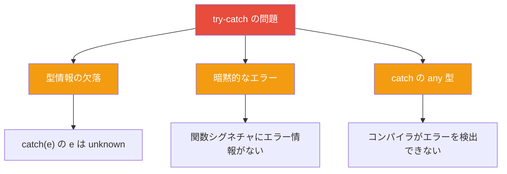
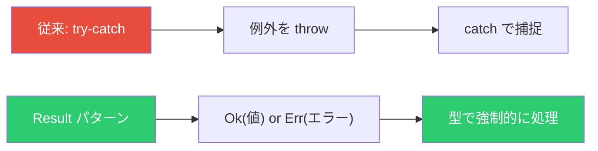
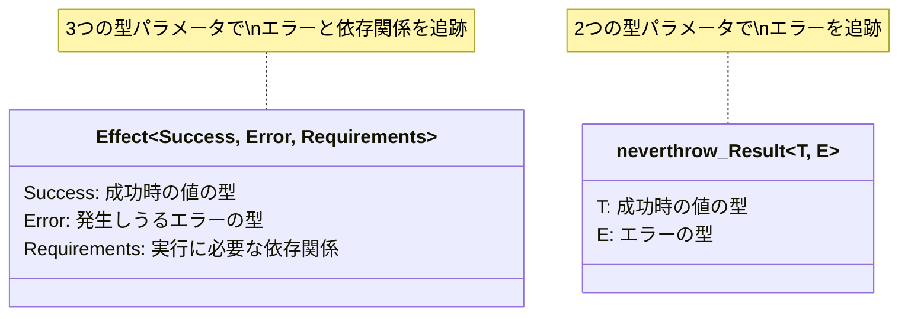
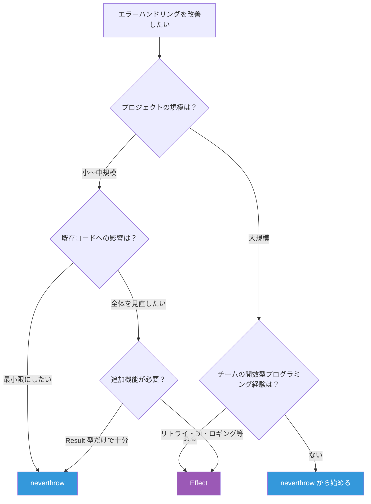

# Effect vs neverthrow ― TypeScript で型安全なエラーハンドリングを実現する2つのアプローチ

TypeScript でアプリケーションを開発していると、エラーハンドリングの難しさに直面する。`try-catch` は型情報を失い、どの関数がどんなエラーを投げるのか把握できない。この問題を解決するライブラリとして **Effect** と **neverthrow** がある。本記事では、この2つを比較し、それぞれの強みと使い分けを解説する。

## なぜ try-catch では不十分なのか

まず、従来の `try-catch` が抱える問題を確認する。

```typescript
// try-catch の問題点
function parseJSON(input: string): unknown {
  return JSON.parse(input) // 例外を投げる可能性がある
}

// 呼び出し側は例外の可能性に気づけない
const data = parseJSON('invalid json') // 実行時にクラッシュ
```

`try-catch` の問題は以下の3点に集約される。



- **型情報の欠落**: `catch` ブロックの `e` は `unknown` 型で、どんなエラーが来るかわからない
- **暗黙的なエラー**: 関数のシグネチャを見ただけでは例外を投げるかどうか判断できない
- **処理漏れ**: `try-catch` を書き忘れてもコンパイルが通ってしまう

## 解決策: エラーを「値」として扱う

Effect と neverthrow はどちらも **「エラーを例外ではなく値として扱う」** というアプローチを取る。これは Rust の `Result` 型に影響を受けた考え方である。



関数の戻り値として成功と失敗を表現することで、コンパイラがエラーの処理漏れを検出できるようになる。

## neverthrow ― シンプルな Result 型

[neverthrow](https://github.com/supermacro/neverthrow) は **軽量な Result 型ライブラリ** である。Rust の `Result<T, E>` に似たシンプルな API を提供する。

### 基本的な使い方

```typescript
import { ok, err, Result } from 'neverthrow'

// 成功は ok()、失敗は err() で表現
function parseJSON(input: string): Result<unknown, Error> {
  try {
    return ok(JSON.parse(input))
  } catch (e) {
    return err(new Error('Invalid JSON'))
  }
}

// 戻り値の型を見れば失敗の可能性がわかる
const result = parseJSON('{"name": "Alice"}')

// match で成功・失敗を処理
const message = result.match(
  (data) => `Parsed: ${JSON.stringify(data)}`,
  (error) => `Error: ${error.message}`,
)
```

### チェーン処理

`map` や `andThen` で処理をつなげられる。

```typescript
import { ok, err, Result } from 'neverthrow'

interface User {
  name: string
  age: number
}

function parseJSON(input: string): Result<unknown, Error> {
  try {
    return ok(JSON.parse(input))
  } catch {
    return err(new Error('Invalid JSON'))
  }
}

function validateUser(data: unknown): Result<User, Error> {
  if (typeof data === 'object' && data !== null && 'name' in data && 'age' in data) {
    return ok(data as User)
  }
  return err(new Error('Invalid user data'))
}

// andThen でチェーン
const result = parseJSON('{"name": "Alice", "age": 30}')
  .andThen(validateUser)
  .map((user) => `${user.name} (${user.age})`)

console.log(result) // Ok("Alice (30)")
```

### 非同期処理

`ResultAsync` を使って非同期処理にも対応できる。

```typescript
import { ResultAsync } from 'neverthrow'

const fetchUser = (id: number): ResultAsync<User, Error> =>
  ResultAsync.fromPromise(
    fetch(`/api/users/${id}`).then((r) => r.json()),
    () => new Error('Failed to fetch user'),
  )

// 非同期でもチェーン可能
const result = await fetchUser(1)
  .map((user) => user.name)
  .match(
    (name) => `Hello, ${name}`,
    (error) => `Error: ${error.message}`,
  )
```

## Effect ― 包括的な型安全フレームワーク

[Effect](https://effect.website/) は **単なるエラーハンドリングライブラリではなく、TypeScript アプリケーション全体を型安全に構築するためのフレームワーク** である。

### Effect 型の構造

Effect の中心にあるのは `Effect<Success, Error, Requirements>` 型である。

```typescript
import { Effect } from 'effect'

//                  成功時の型  エラーの型  依存関係
// Effect<Success,   Error,    Requirements>
```



neverthrow の `Result<T, E>` が2つの型パラメータなのに対し、Effect は3つ目の **Requirements**（依存関係）を持つ。これにより依存性注入も型レベルで管理できる。

### 基本的な使い方

```typescript
import { Effect } from 'effect'

// 成功する Effect
const success = Effect.succeed(42)
// Effect<number, never, never>

// 失敗する Effect
const failure = Effect.fail(new Error('Something went wrong'))
// Effect<never, Error, never>

// 例外を安全にキャッチ
const parseJSON = (input: string) =>
  Effect.try({
    try: () => JSON.parse(input) as unknown,
    catch: () => new Error('Invalid JSON'),
  })
// Effect<unknown, Error, never>
```

### パイプラインとジェネレータ

Effect は `pipe` によるパイプライン構築と、`Effect.gen` によるジェネレータ構文の2つの書き方をサポートする。

```typescript
import { Effect, pipe } from 'effect'

// pipe スタイル
const program1 = pipe(
  Effect.succeed(10),
  Effect.map((n) => n * 2),
  Effect.flatMap((n) => (n > 0 ? Effect.succeed(n) : Effect.fail(new Error('Negative')))),
)

// ジェネレータスタイル（async/await に近い書き方）
const program2 = Effect.gen(function* () {
  const a = yield* Effect.succeed(10)
  const b = yield* Effect.succeed(20)
  if (a + b <= 0) {
    yield* Effect.fail(new Error('Negative'))
  }
  return a + b
})
```

### 実行

Effect は **遅延実行** される。定義しただけでは何も起こらず、`run` 系の関数で明示的に実行する。

```typescript
import { Effect } from 'effect'

const program = Effect.succeed(42)

// 同期実行
const result1 = Effect.runSync(program) // 42

// Promise として実行
const result2 = await Effect.runPromise(program) // 42
```

## 比較表

| 項目                         | neverthrow         | Effect                                 |
| ---------------------------- | ------------------ | -------------------------------------- |
| **目的**                     | 型安全な Result 型 | 包括的なアプリケーションフレームワーク |
| **バンドルサイズ**           | 軽量（約 6KB）     | 大きい（約 50KB+）                     |
| **学習コスト**               | 低い               | 高い                                   |
| **エラー型の追跡**           | `Result<T, E>`     | `Effect<A, E, R>`                      |
| **依存性注入**               | なし               | 型レベルで管理                         |
| **非同期処理**               | `ResultAsync`      | `Effect` で統一                        |
| **リトライ・タイムアウト**   | なし               | 組み込みで提供                         |
| **ロギング・トレーシング**   | なし               | 組み込みで提供                         |
| **並行処理**                 | なし               | `Effect.all` 等で対応                  |
| **既存プロジェクトへの導入** | 容易               | 大規模な書き換えが必要                 |

## どちらを選ぶべきか



### neverthrow を選ぶケース

- **既存プロジェクトに部分的に導入したい**: 特定の関数だけ `Result` 型に変えられる
- **学習コストを抑えたい**: API がシンプルで、Rust の Result 型に馴染みがあればすぐに使える
- **バンドルサイズを気にする**: フロントエンドで軽量に使いたい場合

### Effect を選ぶケース

- **新規プロジェクトをゼロから設計する**: アプリケーション全体の基盤として活用できる
- **複雑な非同期処理やリトライが必要**: 組み込みのスケジューリング・リトライ機能が役立つ
- **依存性注入を型安全に管理したい**: `Requirements` 型パラメータで DI を実現
- **関数型プログラミングの経験がある**: Effect のパラダイムを活かせる

## まとめ

neverthrow と Effect はどちらも「エラーを値として扱う」という同じ哲学を持つが、そのスコープが大きく異なる。

- **neverthrow** は「Result 型」というひとつの問題を解決する **ライブラリ**
- **Effect** はエラーハンドリングを含む TypeScript 開発全体を改善する **フレームワーク**

まずは neverthrow でエラーを値として扱う感覚を身につけ、より高度な機能が必要になったら Effect への移行を検討するのが現実的なアプローチである。

## 参考

- [Effect - 公式サイト](https://effect.website/)
- [Effect - Getting Started](https://effect.website/docs/getting-started/introduction/)
- [neverthrow - GitHub リポジトリ](https://github.com/supermacro/neverthrow)
- [neverthrow - npm](https://www.npmjs.com/package/neverthrow)
