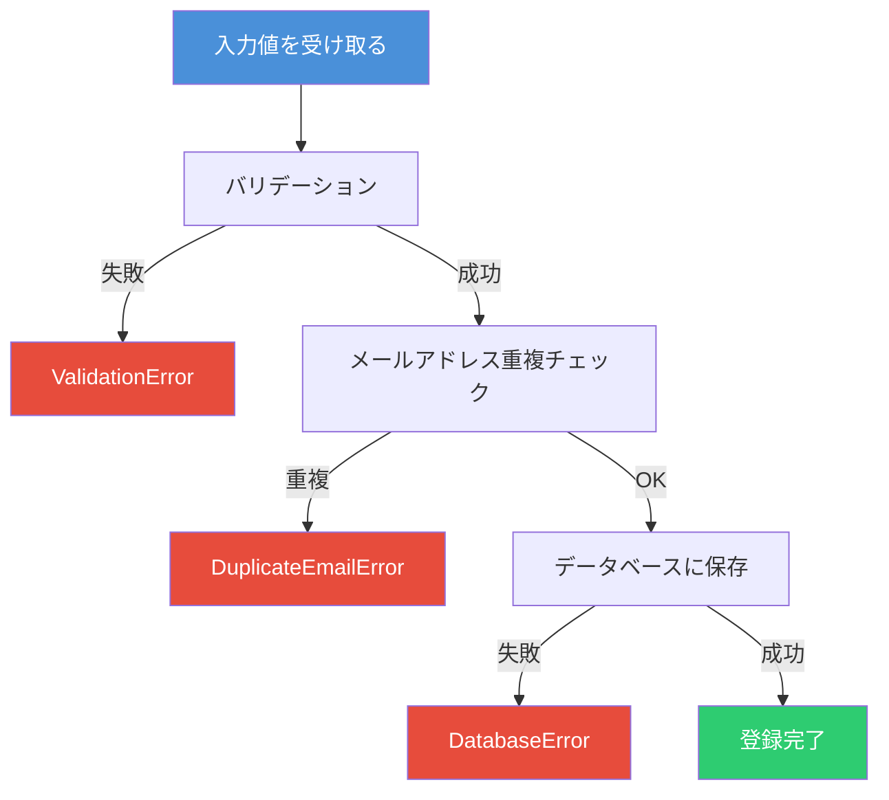
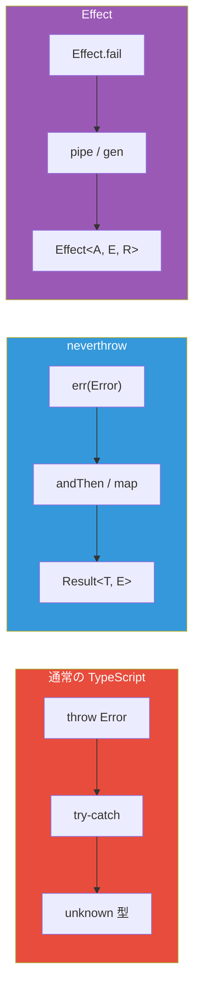
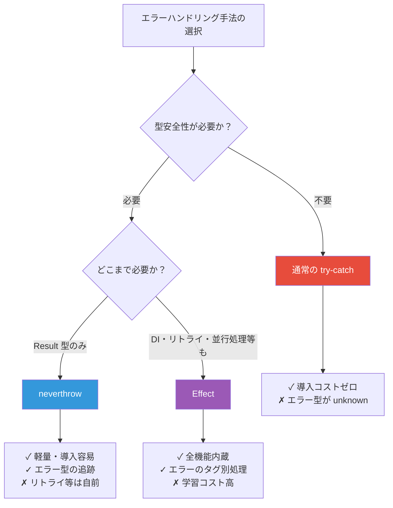

# 通常の TypeScript・neverthrow・Effect ― 同じユースケースで学ぶエラーハンドリング実践比較

前回の記事では Effect と neverthrow の概要を比較した。本記事ではさらに踏み込み、**同じユースケースを3つのアプローチで実装**することで、それぞれの違いを体感的に理解する。

## 題材: ユーザー登録処理

以下の処理フローを3つの方法で実装する。



### 共通の型定義

```typescript
interface UserInput {
  email: string
  password: string
  name: string
}

interface User {
  id: string
  email: string
  name: string
  createdAt: Date
}
```

## 1. 通常の TypeScript（try-catch）

### 実装

```typescript
// エラークラスの定義
class ValidationError extends Error {
  constructor(message: string) {
    super(message)
    this.name = 'ValidationError'
  }
}

class DuplicateEmailError extends Error {
  constructor(email: string) {
    super(`Email already exists: ${email}`)
    this.name = 'DuplicateEmailError'
  }
}

class DatabaseError extends Error {
  constructor(message: string) {
    super(message)
    this.name = 'DatabaseError'
  }
}

// バリデーション
function validateInput(input: UserInput): UserInput {
  if (!input.email.includes('@')) {
    throw new ValidationError('Invalid email format')
  }
  if (input.password.length < 8) {
    throw new ValidationError('Password must be at least 8 characters')
  }
  if (input.name.trim() === '') {
    throw new ValidationError('Name is required')
  }
  return input
}

// メール重複チェック
async function checkDuplicateEmail(email: string): Promise<void> {
  const exists = await db.findUserByEmail(email)
  if (exists) {
    throw new DuplicateEmailError(email)
  }
}

// ユーザー保存
async function saveUser(input: UserInput): Promise<User> {
  try {
    return await db.insert('users', {
      email: input.email,
      name: input.name,
      password: await hash(input.password),
    })
  } catch {
    throw new DatabaseError('Failed to save user')
  }
}

// メイン処理
async function registerUser(input: UserInput): Promise<User> {
  try {
    const validated = validateInput(input)
    await checkDuplicateEmail(validated.email)
    return await saveUser(validated)
  } catch (error) {
    // error は unknown 型 ― どのエラーが来るか型からは分からない
    if (error instanceof ValidationError) {
      console.error('Validation failed:', error.message)
    } else if (error instanceof DuplicateEmailError) {
      console.error('Duplicate email:', error.message)
    } else if (error instanceof DatabaseError) {
      console.error('Database error:', error.message)
    } else {
      console.error('Unknown error:', error)
    }
    throw error
  }
}
```

### 問題点

```typescript
// 1. 関数シグネチャにエラー情報がない
async function registerUser(input: UserInput): Promise<User>
// ↑ どのエラーが発生するか型を見ても分からない

// 2. 新しいエラー型を追加しても catch 側に通知されない
// → RateLimitError を追加しても、コンパイラは catch の更新を要求しない

// 3. エラーハンドリングを忘れてもコンパイルが通る
const user = await registerUser(input)
// ↑ try-catch なしでも問題なく通る
```

## 2. neverthrow による実装

### 実装

```typescript
import { ok, err, Result, ResultAsync } from 'neverthrow'

// エラー型を Union で定義
type RegisterError = ValidationError | DuplicateEmailError | DatabaseError

// バリデーション ― Result を返す
function validateInput(input: UserInput): Result<UserInput, ValidationError> {
  if (!input.email.includes('@')) {
    return err(new ValidationError('Invalid email format'))
  }
  if (input.password.length < 8) {
    return err(new ValidationError('Password must be at least 8 characters'))
  }
  if (input.name.trim() === '') {
    return err(new ValidationError('Name is required'))
  }
  return ok(input)
}

// メール重複チェック ― ResultAsync を返す
function checkDuplicateEmail(email: string): ResultAsync<string, DuplicateEmailError> {
  return ResultAsync.fromPromise(
    db.findUserByEmail(email),
    () => new DuplicateEmailError(email),
  ).andThen((exists) => (exists ? err(new DuplicateEmailError(email)) : ok(email)))
}

// ユーザー保存
function saveUser(input: UserInput): ResultAsync<User, DatabaseError> {
  return ResultAsync.fromPromise(
    db.insert('users', {
      email: input.email,
      name: input.name,
      password: input.password,
    }),
    () => new DatabaseError('Failed to save user'),
  )
}

// メイン処理 ― エラー型が自動的に合成される
function registerUser(input: UserInput): ResultAsync<User, RegisterError> {
  return ResultAsync.fromResult(validateInput(input))
    .andThen((validated) => checkDuplicateEmail(validated.email).map(() => validated))
    .andThen(saveUser)
}

// 呼び出し側 ― match で網羅的に処理
const result = await registerUser({
  email: 'alice@example.com',
  password: 'securepass',
  name: 'Alice',
})

result.match(
  (user) => console.log('Registered:', user.id),
  (error) => {
    // error は ValidationError | DuplicateEmailError | DatabaseError
    switch (error.name) {
      case 'ValidationError':
        console.error('入力エラー:', error.message)
        break
      case 'DuplicateEmailError':
        console.error('重複:', error.message)
        break
      case 'DatabaseError':
        console.error('DB エラー:', error.message)
        break
    }
  },
)
```

### neverthrow の特徴

- 関数の戻り値型にエラーが明示される
- `andThen` でチェーンするとエラー型が自動で Union に合成される
- `match` で成功・失敗の両方を処理しないとコンパイルが通らない

## 3. Effect による実装

### 実装

```typescript
import { Effect, Data } from 'effect'

// タグ付きエラー型の定義
class ValidationError extends Data.TaggedError('ValidationError')<{
  readonly message: string
}> {}

class DuplicateEmailError extends Data.TaggedError('DuplicateEmailError')<{
  readonly email: string
}> {}

class DatabaseError extends Data.TaggedError('DatabaseError')<{
  readonly cause: string
}> {}

// バリデーション
function validateInput(input: UserInput): Effect.Effect<UserInput, ValidationError> {
  return Effect.gen(function* () {
    if (!input.email.includes('@')) {
      yield* new ValidationError({ message: 'Invalid email format' })
    }
    if (input.password.length < 8) {
      yield* new ValidationError({
        message: 'Password must be at least 8 characters',
      })
    }
    if (input.name.trim() === '') {
      yield* new ValidationError({ message: 'Name is required' })
    }
    return input
  })
}

// メール重複チェック
function checkDuplicateEmail(email: string): Effect.Effect<string, DuplicateEmailError> {
  return Effect.gen(function* () {
    const exists = yield* Effect.tryPromise({
      try: () => db.findUserByEmail(email),
      catch: () => new DuplicateEmailError({ email }),
    })
    if (exists) {
      yield* new DuplicateEmailError({ email })
    }
    return email
  })
}

// ユーザー保存
function saveUser(input: UserInput): Effect.Effect<User, DatabaseError> {
  return Effect.tryPromise({
    try: () =>
      db.insert('users', {
        email: input.email,
        name: input.name,
        password: input.password,
      }),
    catch: () => new DatabaseError({ cause: 'Failed to save user' }),
  })
}

// メイン処理 ― ジェネレータスタイル
const registerUser = (
  input: UserInput,
): Effect.Effect<User, ValidationError | DuplicateEmailError | DatabaseError> =>
  Effect.gen(function* () {
    const validated = yield* validateInput(input)
    yield* checkDuplicateEmail(validated.email)
    return yield* saveUser(validated)
  })

// 実行と特定エラーのハンドリング
const program = registerUser({
  email: 'alice@example.com',
  password: 'securepass',
  name: 'Alice',
}).pipe(
  // 特定のエラーだけをタグで捕捉できる
  Effect.catchTag('DuplicateEmailError', (e) =>
    Effect.fail(
      new ValidationError({
        message: `このメールアドレスは既に使用されている: ${e.email}`,
      }),
    ),
  ),
)

// Effect.runPromise で実行
const user = await Effect.runPromise(program)
```

## 3つのアプローチの比較



### エラー型の追跡

```typescript
// 通常の TypeScript ― エラー型は不明
async function registerUser(input: UserInput): Promise<User>
// → どのエラーが起きるか分からない

// neverthrow ― エラー型が戻り値に含まれる
function registerUser(input: UserInput): ResultAsync<User, RegisterError>
// → RegisterError の中身を確認できる

// Effect ― エラー型が第2型パラメータに含まれる
function registerUser(
  input: UserInput,
): Effect<User, ValidationError | DuplicateEmailError | DatabaseError>
// → 各エラーをタグで個別にハンドリング可能
```

### エラーの個別ハンドリング

```typescript
// 通常の TypeScript ― instanceof でチェック（漏れても検出できない）
try {
	await registerUser(input)
} catch (error) {
	if (error instanceof ValidationError) { /* ... */ }
	// ↑ 新しいエラー型を追加しても、ここの更新を忘れる可能性がある
}

// neverthrow ― match で処理（エラー型は Union だが個別判定は手動）
result.match(
	(user) => { /* 成功 */ },
	(error) => {
		// error: ValidationError | DuplicateEmailError | DatabaseError
		// switch で分岐する必要がある
	},
)

// Effect ― catchTag で特定エラーだけ処理（残りは型に残る）
program.pipe(
	Effect.catchTag('ValidationError', (e) => /* ... */),
	// ↑ この時点で残りのエラーは DuplicateEmailError | DatabaseError
	Effect.catchTag('DuplicateEmailError', (e) => /* ... */),
	// ↑ この時点で残りのエラーは DatabaseError
)
```

### 合成可能性（Composability）

```typescript
// neverthrow ― andThen でチェーン、エラー型は自動で Union に
validateInput(input) // Result<UserInput, ValidationError>
  .andThen(checkEmail) // Result<string, ValidationError | DuplicateEmailError>
  .andThen(save) // Result<User, ValidationError | DuplicateEmailError | DatabaseError>

// Effect ― gen の中で yield* するだけ、エラー型は自動で合成
Effect.gen(function* () {
  const a = yield* validateInput(input) // ValidationError が追加
  yield* checkDuplicateEmail(a.email) // DuplicateEmailError が追加
  return yield* saveUser(a) // DatabaseError が追加
})
// → Effect<User, ValidationError | DuplicateEmailError | DatabaseError>
```

## 実践的な差が出るケース

### バリデーションエラーの蓄積

通常の `try-catch` や neverthrow の `andThen` は **最初のエラーで停止**する。複数のバリデーションエラーをまとめて返したい場合、それぞれ異なるアプローチが必要になる。

```typescript
// 通常の TypeScript ― 手動でエラーを集める
function validateAll(input: UserInput): string[] {
  const errors: string[] = []
  if (!input.email.includes('@')) errors.push('Invalid email')
  if (input.password.length < 8) errors.push('Password too short')
  if (input.name.trim() === '') errors.push('Name required')
  return errors // 空配列なら OK
}

// neverthrow ― Result.combine は最初のエラーで停止するため工夫が必要
function validateAll(input: UserInput): Result<UserInput, ValidationError[]> {
  const errors: ValidationError[] = []
  if (!input.email.includes('@')) errors.push(new ValidationError('Invalid email'))
  if (input.password.length < 8) errors.push(new ValidationError('Password too short'))
  if (input.name.trim() === '') errors.push(new ValidationError('Name required'))

  return errors.length > 0 ? err(errors) : ok(input)
}

// Effect ― Effect.validate / Effect.all の { mode: 'validate' } で蓄積
const validateAll = (input: UserInput) =>
  Effect.all(
    [
      input.email.includes('@')
        ? Effect.succeed(input.email)
        : Effect.fail(new ValidationError({ message: 'Invalid email' })),
      input.password.length >= 8
        ? Effect.succeed(input.password)
        : Effect.fail(new ValidationError({ message: 'Password too short' })),
      input.name.trim() !== ''
        ? Effect.succeed(input.name)
        : Effect.fail(new ValidationError({ message: 'Name required' })),
    ],
    { concurrency: 'unbounded', mode: 'validate' },
  )
// → エラーは Array<ValidationError> として蓄積される
```

### リトライとタイムアウト

```typescript
// 通常の TypeScript ― 自前で実装する必要がある
async function withRetry<T>(fn: () => Promise<T>, maxRetries: number): Promise<T> {
  for (let i = 0; i < maxRetries; i++) {
    try {
      return await fn()
    } catch (error) {
      if (i === maxRetries - 1) throw error
    }
  }
  throw new Error('Unreachable')
}

// neverthrow ― リトライ機能はない（自前で実装）

// Effect ― 組み込みで提供
import { Schedule } from 'effect'

const reliableSave = saveUser(input).pipe(
  Effect.retry(Schedule.exponential('100 millis').pipe(Schedule.compose(Schedule.recurs(3)))),
  Effect.timeout('5 seconds'),
)
```

## 比較まとめ



| 観点                 | 通常の TypeScript | neverthrow         | Effect             |
| -------------------- | ----------------- | ------------------ | ------------------ |
| **エラー型の追跡**   | なし（`unknown`） | `Result<T, E>`     | `Effect<A, E, R>`  |
| **エラーの個別処理** | `instanceof`      | `switch` / `match` | `catchTag`         |
| **エラー蓄積**       | 手動で配列管理    | 手動で配列管理     | `mode: 'validate'` |
| **合成可能性**       | 低い              | `andThen` チェーン | `gen` / `pipe`     |
| **非同期統合**       | `async/await`     | `ResultAsync`      | `Effect` で統一    |
| **リトライ**         | 自前実装          | 自前実装           | `Effect.retry`     |
| **依存性注入**       | 外部ライブラリ    | 外部ライブラリ     | `Requirements` 型  |
| **導入コスト**       | ゼロ              | 低い               | 高い               |
| **バンドルサイズ**   | 0KB               | 約 6KB             | 約 50KB+           |

## 参考

- [Effect - 公式ドキュメント](https://effect.website/docs/getting-started/introduction/)
- [Effect - Error Management](https://effect.website/docs/error-management/expected-errors/)
- [neverthrow - GitHub リポジトリ](https://github.com/supermacro/neverthrow)
- [TypeScript Handbook - Narrowing](https://www.typescriptlang.org/docs/handbook/2/narrowing.html)
