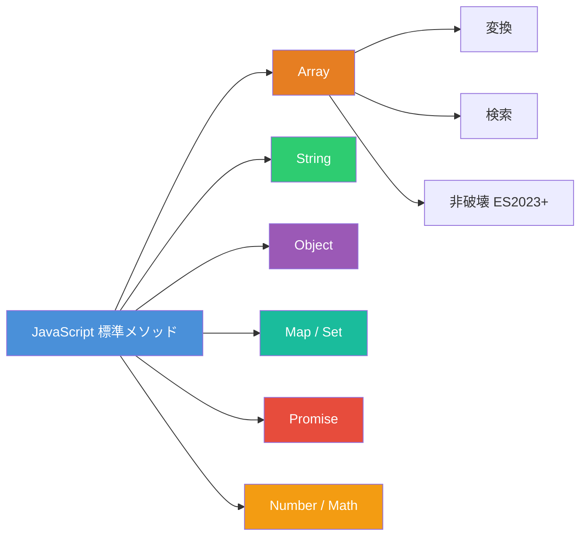
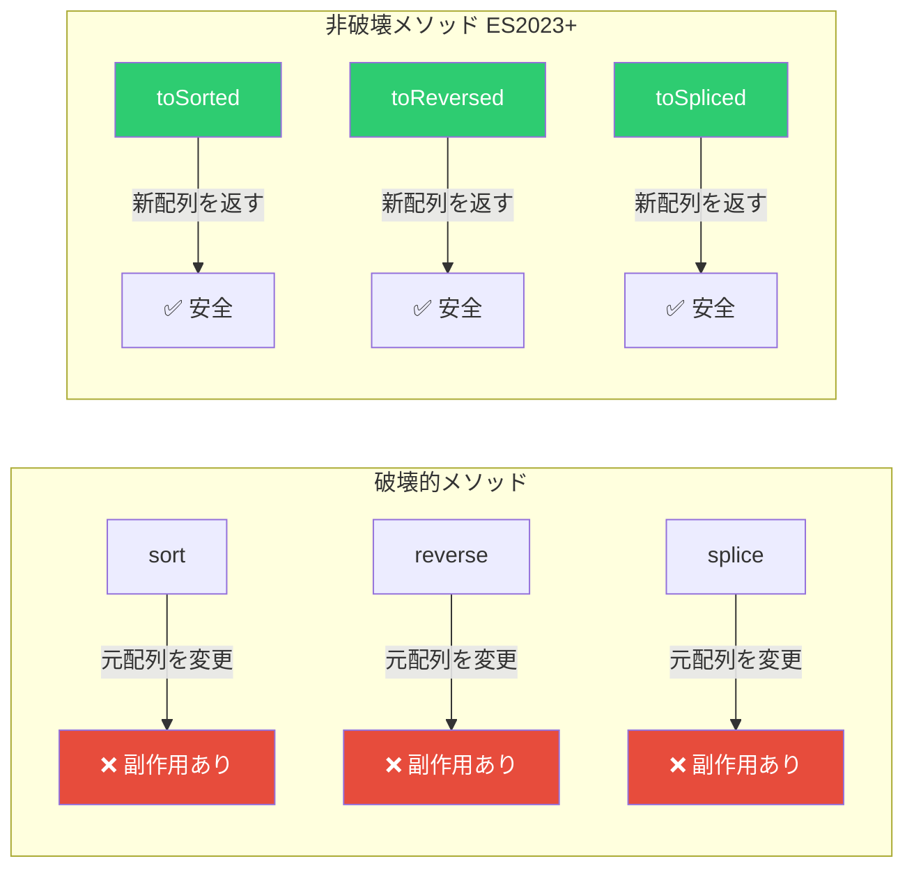
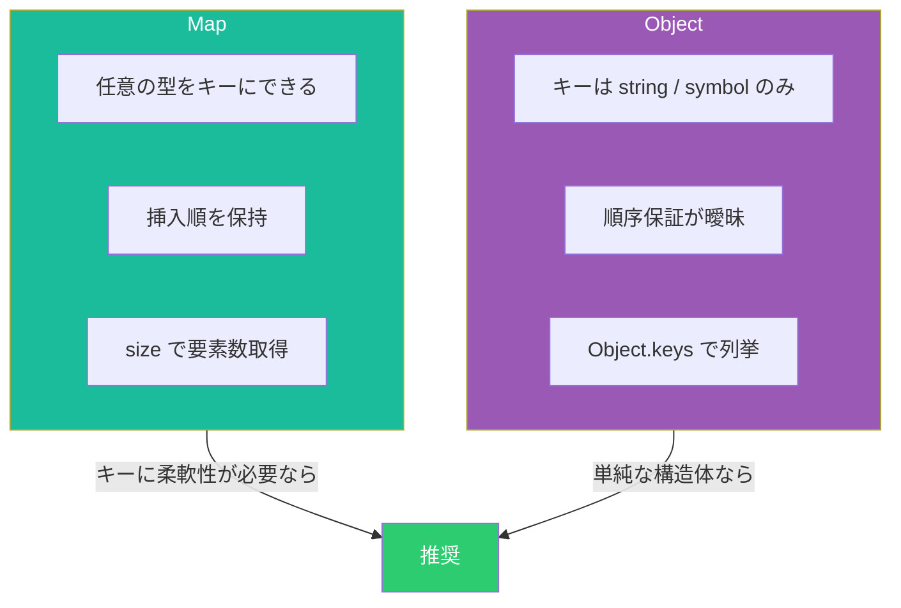
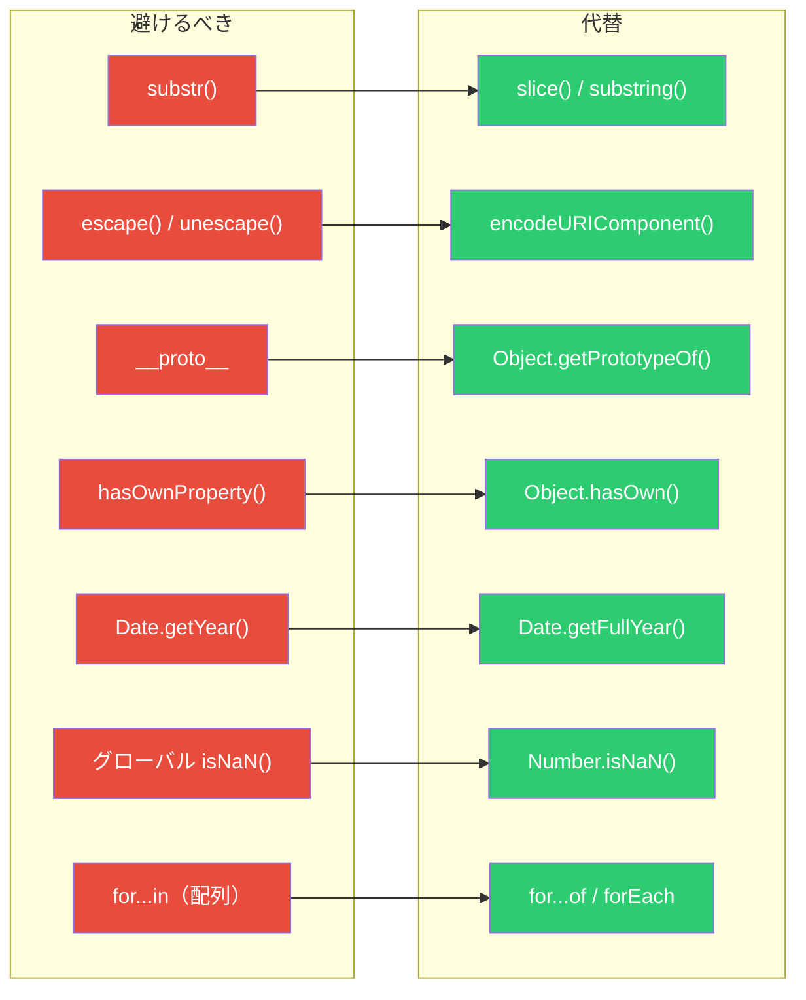

# JavaScript / TypeScript 標準メソッド チートシート ― 使うべきメソッドと避けるべきメソッド

JavaScript / TypeScript で日常的に使う標準メソッドを **カテゴリ別** にまとめる。ES2023〜ES2025 で追加された非破壊メソッドや `Object.groupBy` なども含め、**避けるべき非推奨メソッド** も併せて整理する。

## 全体マップ



---

## Array メソッド

### 変換・生成

```typescript
const nums = [1, 2, 3, 4, 5]

// map — 各要素を変換して新しい配列を返す
const doubled = nums.map((n) => n * 2)
// [2, 4, 6, 8, 10]

// filter — 条件に合う要素だけ抽出
const evens = nums.filter((n) => n % 2 === 0)
// [2, 4]

// reduce — 畳み込み
const sum = nums.reduce((acc, n) => acc + n, 0)
// 15

// flatMap — map + flatten（1階層）
const nested = [
  [1, 2],
  [3, 4],
]
const flat = nested.flatMap((arr) => arr)
// [1, 2, 3, 4]

// Array.from — イテラブルから配列生成
const chars = Array.from('hello')
// ['h', 'e', 'l', 'l', 'o']
```

### 検索・判定

```typescript
const users = [
  { id: 1, name: 'Alice' },
  { id: 2, name: 'Bob' },
  { id: 3, name: 'Charlie' },
]

// find — 条件に一致する最初の要素
const bob = users.find((u) => u.name === 'Bob')
// { id: 2, name: 'Bob' }

// findIndex — 条件に一致する最初のインデックス
const idx = users.findIndex((u) => u.name === 'Charlie')
// 2

// some — 1つでも条件を満たすか
const hasAlice = users.some((u) => u.name === 'Alice')
// true

// every — 全要素が条件を満たすか
const allHaveId = users.every((u) => u.id > 0)
// true

// includes — 値が含まれるか（プリミティブ向け）
const has3 = [1, 2, 3].includes(3)
// true
```

### 非破壊メソッド（ES2023+）

従来の `sort()` / `reverse()` / `splice()` は**元の配列を変更（破壊的）**する。ES2023 で追加された非破壊版を使うべきである。



```typescript
const original = [3, 1, 4, 1, 5]

// toSorted — 非破壊ソート
const sorted = original.toSorted((a, b) => a - b)
// sorted:   [1, 1, 3, 4, 5]
// original: [3, 1, 4, 1, 5]（変更されない）

// toReversed — 非破壊リバース
const reversed = original.toReversed()
// reversed: [5, 1, 4, 1, 3]
// original: [3, 1, 4, 1, 5]（変更されない）

// toSpliced — 非破壊スプライス
const spliced = original.toSpliced(1, 2, 99)
// spliced:  [3, 99, 1, 5]
// original: [3, 1, 4, 1, 5]（変更されない）

// with — インデックス指定で非破壊置換
const replaced = original.with(0, 100)
// replaced: [100, 1, 4, 1, 5]
// original: [3, 1, 4, 1, 5]（変更されない）
```

### Object.groupBy / Map.groupBy（ES2024）

```typescript
interface Product {
  name: string
  category: string
  price: number
}

const products: Product[] = [
  { name: 'Apple', category: 'fruit', price: 120 },
  { name: 'Carrot', category: 'vegetable', price: 80 },
  { name: 'Banana', category: 'fruit', price: 100 },
  { name: 'Spinach', category: 'vegetable', price: 150 },
]

// Object.groupBy — カテゴリでグルーピング
const grouped = Object.groupBy(products, (p) => p.category)
// { fruit: [Apple, Banana], vegetable: [Carrot, Spinach] }

// Map.groupBy — Map として取得
const groupedMap = Map.groupBy(products, (p) => p.category)
groupedMap.get('fruit')
// [Apple, Banana]
```

---

## String メソッド

```typescript
const text = '  Hello, TypeScript World!  '

// trim / trimStart / trimEnd — 空白除去
text.trim() // 'Hello, TypeScript World!'
text.trimStart() // 'Hello, TypeScript World!  '
text.trimEnd() // '  Hello, TypeScript World!'

// includes / startsWith / endsWith — 判定
'hello'.includes('ell') // true
'hello'.startsWith('he') // true
'hello'.endsWith('lo') // true

// slice — 部分文字列（非破壊）
'abcdef'.slice(1, 4) // 'bcd'
'abcdef'.slice(-3) // 'def'

// replaceAll — 全置換
'aabbcc'.replaceAll('a', 'x') // 'xxbbcc'

// padStart / padEnd — パディング
'42'.padStart(5, '0') // '00042'
'hi'.padEnd(5, '.') // 'hi...'

// repeat — 繰り返し
'ha'.repeat(3) // 'hahaha'

// split — 分割
'a,b,c'.split(',') // ['a', 'b', 'c']

// at — インデックスアクセス（負数対応）
'hello'.at(-1) // 'o'
```

---

## Object メソッド

```typescript
const user = { name: 'Alice', age: 30, role: 'admin' }

// Object.keys / values / entries — 列挙
Object.keys(user) // ['name', 'age', 'role']
Object.values(user) // ['Alice', 30, 'admin']
Object.entries(user) // [['name','Alice'], ['age',30], ['role','admin']]

// Object.fromEntries — entries の逆変換
const entries: [string, number][] = [
  ['a', 1],
  ['b', 2],
]
Object.fromEntries(entries) // { a: 1, b: 2 }

// Object.assign — 浅いマージ（スプレッドの方が推奨）
const merged = { ...user, age: 31 }

// Object.freeze — 変更不可にする
const frozen = Object.freeze({ x: 1, y: 2 })
// frozen.x = 10  // TypeError in strict mode

// Object.hasOwn — プロパティ存在チェック（ES2022）
Object.hasOwn(user, 'name') // true
// obj.hasOwnProperty() より安全（プロトタイプ汚染の影響を受けない）

// structuredClone — ディープコピー
const original = { a: 1, nested: { b: 2 } }
const cloned = structuredClone(original)
cloned.nested.b = 99
// original.nested.b は 2 のまま
```

---

## Map / Set



```typescript
// --- Map ---
const map = new Map<string, number>()
map.set('a', 1)
map.set('b', 2)
map.get('a') // 1
map.has('b') // true
map.delete('b') // true
map.size // 1

// Map のイテレーション
for (const [key, value] of map) {
  console.log(key, value)
}

// --- Set ---
const set = new Set<number>([1, 2, 3, 2, 1])
set.size // 3（重複は除去される）
set.has(2) // true
set.add(4)
set.delete(1)

// 配列の重複除去
const unique = [...new Set([1, 2, 2, 3, 3, 3])]
// [1, 2, 3]

// Set の集合演算（ES2025）
const a = new Set([1, 2, 3, 4])
const b = new Set([3, 4, 5, 6])

a.intersection(b) // Set {3, 4}
a.union(b) // Set {1, 2, 3, 4, 5, 6}
a.difference(b) // Set {1, 2}
a.symmetricDifference(b) // Set {1, 2, 5, 6}
a.isSubsetOf(b) // false
a.isSupersetOf(b) // false
```

---

## Promise メソッド

```typescript
const p1 = Promise.resolve(1)
const p2 = Promise.resolve(2)
const p3 = Promise.reject(new Error('fail'))

// Promise.all — 全て成功なら結果配列、1つでも失敗なら reject
const all = await Promise.all([p1, p2])
// [1, 2]

// Promise.allSettled — 成否に関わらず全結果を取得
const settled = await Promise.allSettled([p1, p3])
// [{ status: 'fulfilled', value: 1 }, { status: 'rejected', reason: Error }]

// Promise.race — 最初に解決（成功/失敗）した結果
const race = await Promise.race([p1, p2])
// 1

// Promise.any — 最初に成功した結果（全失敗なら AggregateError）
const any = await Promise.any([p3, p1])
// 1

// Promise.withResolvers（ES2024）— 外部から resolve/reject
const { promise, resolve, reject } = Promise.withResolvers<string>()
setTimeout(() => resolve('done'), 1000)
const result = await promise // 'done'
```

| メソッド     | 成功条件   | 失敗条件    | 用途                     |
| ------------ | ---------- | ----------- | ------------------------ |
| `all`        | 全て成功   | 1つでも失敗 | 並列実行して全結果が必要 |
| `allSettled` | 常に成功   | —           | 成否を問わず全結果が必要 |
| `race`       | 最初の解決 | 最初の解決  | タイムアウト処理         |
| `any`        | 最初の成功 | 全て失敗    | フォールバック処理       |

---

## Number / Math

```typescript
// Number メソッド
Number.isFinite(42) // true
Number.isFinite(Infinity) // false
Number.isNaN(NaN) // true
Number.isInteger(3.0) // true
Number.parseInt('42px') // 42
Number.parseFloat('3.14') // 3.14

// Math メソッド
Math.floor(3.7) // 3
Math.ceil(3.2) // 4
Math.round(3.5) // 4
Math.trunc(3.9) // 3（小数部を切り捨て）
Math.max(1, 5, 3) // 5
Math.min(1, 5, 3) // 1
Math.abs(-5) // 5
Math.random() // 0〜1 の乱数

// clamp パターン（標準には無いがよく使う）
const clamp = (n: number, min: number, max: number) => Math.min(Math.max(n, min), max)

clamp(15, 0, 10) // 10
clamp(-5, 0, 10) // 0
```

---

## 避けるべきメソッド・パターン

以下の非推奨メソッドは使用を避け、代替メソッドを使うべきである。



### 具体的な例

```typescript
// ❌ substr — 非推奨
'hello'.substr(1, 3)
// ✅ slice を使う
'hello'.slice(1, 4) // 'ell'

// ❌ escape / unescape — 非推奨
escape('hello world')
// ✅ encodeURIComponent を使う
encodeURIComponent('hello world') // 'hello%20world'

// ❌ __proto__ — 非推奨
const proto = obj.__proto__
// ✅ Object.getPrototypeOf を使う
const proto2 = Object.getPrototypeOf(obj)

// ❌ hasOwnProperty — プロトタイプ汚染に弱い
obj.hasOwnProperty('key')
// ✅ Object.hasOwn（ES2022）を使う
Object.hasOwn(obj, 'key')

// ❌ getYear — 2桁年を返す
new Date().getYear() // 126（2026 - 1900）
// ✅ getFullYear を使う
new Date().getFullYear() // 2026

// ❌ グローバル isNaN — 型変換してから判定
isNaN('hello') // true（意図しない挙動）
// ✅ Number.isNaN — 厳密な NaN 判定
Number.isNaN('hello') // false
Number.isNaN(NaN) // true

// ❌ for...in で配列を走査 — プロトタイプのプロパティも列挙される
for (const i in [1, 2, 3]) {
  /* ... */
}
// ✅ for...of を使う
for (const v of [1, 2, 3]) {
  /* ... */
}

// ❌ arguments.callee — strict mode で使用不可
// ✅ 名前付き関数を使う
const factorial = (n: number): number => (n <= 1 ? 1 : n * factorial(n - 1))

// ❌ with 文 — スコープが曖昧になる（strict mode で禁止）
// ✅ 分割代入を使う
const { x, y, z } = someObject

// ❌ 破壊的な sort / reverse / splice
const arr = [3, 1, 2]
arr.sort() // arr 自体が変更される
// ✅ 非破壊版を使う（ES2023+）
const sorted = arr.toSorted((a, b) => a - b)
```

### 非推奨メソッド一覧表

| 非推奨                         | 代替                                                  | 理由                              |
| ------------------------------ | ----------------------------------------------------- | --------------------------------- |
| `String.prototype.substr()`    | `slice()` / `substring()`                             | ECMA 仕様の Annex B（互換性のみ） |
| `escape()` / `unescape()`      | `encodeURIComponent()` / `decodeURIComponent()`       | Unicode 未対応                    |
| `Object.prototype.__proto__`   | `Object.getPrototypeOf()` / `Object.setPrototypeOf()` | 非標準アクセサ                    |
| `obj.hasOwnProperty()`         | `Object.hasOwn()`                                     | プロトタイプ汚染耐性              |
| `Date.prototype.getYear()`     | `getFullYear()`                                       | Y2K 問題（1900 基準）             |
| `Date.prototype.toGMTString()` | `toUTCString()`                                       | 名称が不正確                      |
| `RegExp.$1`〜`$9`              | `match()` の戻り値を使う                              | グローバル状態への依存            |
| `arguments.callee`             | 名前付き関数                                          | strict mode で使用不可            |
| `with` 文                      | 分割代入                                              | スコープ汚染                      |
| `trimLeft()` / `trimRight()`   | `trimStart()` / `trimEnd()`                           | 名称の標準化                      |
| グローバル `isNaN()`           | `Number.isNaN()`                                      | 暗黙の型変換                      |
| グローバル `parseInt()`        | `Number.parseInt()`                                   | 明示的な名前空間                  |

---

## まとめ

本チートシートのポイントを整理する。

1. **非破壊メソッドを優先** — `toSorted()` / `toReversed()` / `toSpliced()` / `with()` を使い、元の配列を変更しない
2. **ES2024+ の新機能を活用** — `Object.groupBy()`、`Promise.withResolvers()`、Set の集合演算
3. **非推奨メソッドを避ける** — `substr()`、`escape()`、`__proto__`、`getYear()` などは代替メソッドに置き換える
4. **`Object.hasOwn()` を使う** — `hasOwnProperty()` よりプロトタイプ汚染に強い
5. **`Number.isNaN()` を使う** — グローバル `isNaN()` は暗黙の型変換で予期しない結果を返す

## 参考

- [MDN - Deprecated and obsolete features](https://developer.mozilla.org/en-US/docs/Web/JavaScript/Reference/Deprecated_and_obsolete_features)
- [MDN - Array](https://developer.mozilla.org/en-US/docs/Web/JavaScript/Reference/Global_Objects/Array)
- [MDN - Map](https://developer.mozilla.org/en-US/docs/Web/JavaScript/Reference/Global_Objects/Map)
- [ECMAScript 2024 Language Specification](https://tc39.es/ecma262/)
- [ES2025 New Features - DEV Community](https://dev.to/curry/es2025-is-coming-5-new-features-that-will-change-how-you-write-javascript-3mdi)
