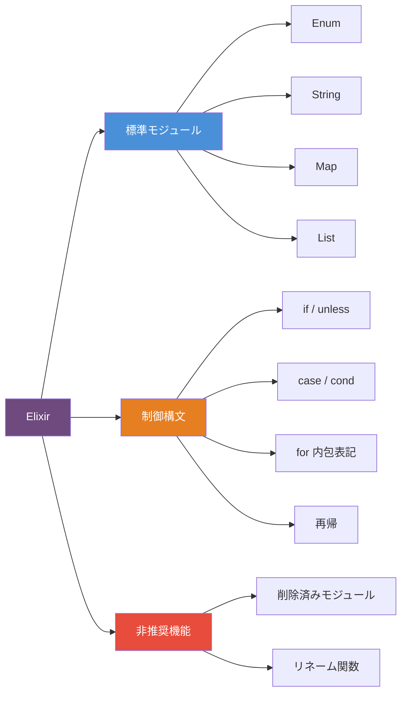
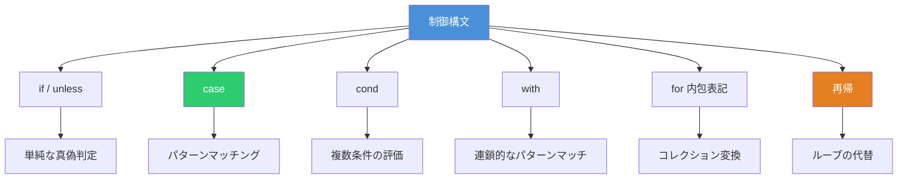
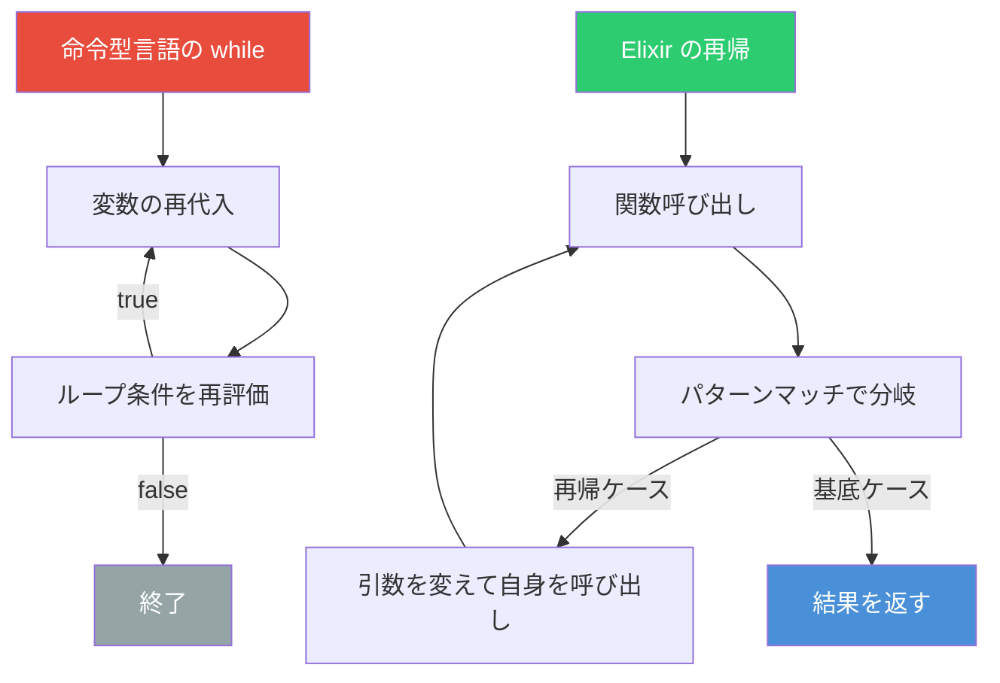
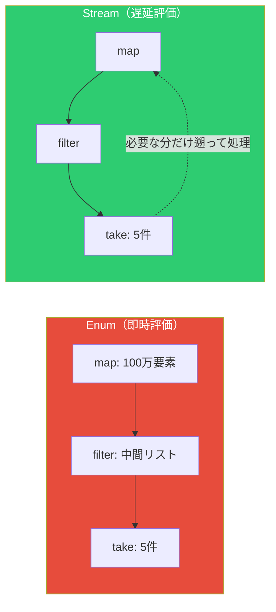

# Elixir 標準モジュール・制御構文・非推奨機能 完全ガイド

Elixir は Erlang VM（BEAM）上で動作する関数型言語である。パターンマッチング・イミュータブルなデータ・パイプ演算子など、関数型プログラミングの強力な機能を簡潔な構文で提供する。

本記事では、主要な標準モジュールの頻出関数、制御構文（`if` / `case` / `cond` / `for`）、`while` が存在しない理由と再帰パターン、そして避けるべき非推奨機能を網羅的に解説する。



## 標準モジュール チートシート

### Enum モジュール

リスト・マップ・レンジなど `Enumerable` プロトコルを実装するデータ型に対して使用できる。Elixir で最も頻繁に使うモジュールである。

#### 変換・フィルタ

```elixir
# map - 各要素を変換
Enum.map([1, 2, 3], fn x -> x * 2 end)
# => [2, 4, 6]

# filter - 条件に合う要素を抽出
Enum.filter([1, 2, 3, 4, 5], fn x -> rem(x, 2) == 0 end)
# => [2, 4]

# reject - 条件に合う要素を除外（filter の逆）
Enum.reject([1, 2, 3, 4, 5], fn x -> rem(x, 2) == 0 end)
# => [1, 3, 5]

# flat_map - 変換 + フラット化
Enum.flat_map(["hello world", "foo bar"], &String.split/1)
# => ["hello", "world", "foo", "bar"]
```

#### 集約・検索

```elixir
# reduce - 畳み込み
Enum.reduce([1, 2, 3], 0, fn x, acc -> x + acc end)
# => 6

# sum / count
Enum.sum([1, 2, 3])       # => 6
Enum.count([1, 2, 3])     # => 3

# find - 最初に条件を満たす要素
Enum.find([2, 4, 6, 7], fn x -> rem(x, 2) != 0 end)
# => 7

# any? / all?
Enum.any?([1, 2, 3], fn x -> x > 2 end)  # => true
Enum.all?([1, 2, 3], fn x -> x > 0 end)  # => true
```

#### ソート・グルーピング

```elixir
# sort
Enum.sort([3, 1, 2])                    # => [1, 2, 3]
Enum.sort([3, 1, 2], :desc)             # => [3, 2, 1]

# group_by
Enum.group_by(["cat", "cow", "dog"], &String.first/1)
# => %{"c" => ["cat", "cow"], "d" => ["dog"]}

# chunk_every
Enum.chunk_every([1, 2, 3, 4, 5], 2)
# => [[1, 2], [3, 4], [5]]

# zip
Enum.zip([:a, :b, :c], [1, 2, 3])
# => [a: 1, b: 2, c: 3]
```

#### ユーティリティ

```elixir
# each - 副作用のみ（戻り値は :ok）
Enum.each([1, 2, 3], &IO.puts/1)

# take / drop
Enum.take([1, 2, 3, 4, 5], 3)   # => [1, 2, 3]
Enum.drop([1, 2, 3, 4, 5], 2)   # => [3, 4, 5]

# uniq / uniq_by
Enum.uniq([1, 2, 2, 3, 3])      # => [1, 2, 3]

# reverse
Enum.reverse([1, 2, 3])         # => [3, 2, 1]

# パイプ演算子と組み合わせ
[1, 2, 3, 4, 5]
|> Enum.filter(fn x -> rem(x, 2) == 0 end)
|> Enum.map(fn x -> x * 10 end)
# => [20, 40]
```

### String モジュール

UTF-8 文字列操作のための関数群である。

```elixir
# 基本操作
String.length("こんにちは")        # => 5
String.reverse("hello")           # => "olleh"
String.upcase("hello")            # => "HELLO"
String.downcase("HELLO")          # => "hello"
String.capitalize("hello world")  # => "Hello world"

# 検索・判定
String.contains?("hello world", "world")  # => true
String.starts_with?("hello", "he")        # => true
String.ends_with?("hello", "lo")          # => true

# 分割・結合
String.split("a,b,c", ",")         # => ["a", "b", "c"]
String.trim("  hello  ")           # => "hello"
String.replace("hello", "l", "r")  # => "herro"

# アクセス
String.at("hello", 0)              # => "h"
String.slice("hello", 1..3)        # => "ell"
String.first("hello")              # => "h"
String.last("hello")               # => "o"

# 変換
String.to_integer("42")            # => 42
String.to_float("3.14")            # => 3.14
String.to_charlist("hello")        # => ~c"hello"
```

### Map モジュール

キーバリューストアとしてのマップ操作を行う。

```elixir
# 作成
map = Map.new([{:a, 1}, {:b, 2}])  # => %{a: 1, b: 2}
Map.from_keys([:a, :b, :c], 0)     # => %{a: 0, b: 0, c: 0}

# 取得
Map.get(%{a: 1, b: 2}, :a)         # => 1
Map.get(%{a: 1}, :c, "default")    # => "default"
Map.fetch(%{a: 1}, :a)             # => {:ok, 1}
Map.fetch(%{a: 1}, :c)             # => :error
Map.fetch!(%{a: 1}, :a)            # => 1（キーがなければ KeyError）
Map.has_key?(%{a: 1}, :a)          # => true

# 追加・更新
Map.put(%{a: 1}, :b, 2)            # => %{a: 1, b: 2}
Map.put_new(%{a: 1}, :a, 99)       # => %{a: 1}（既存キーは上書きしない）
Map.update(%{a: 1}, :a, 0, fn v -> v + 1 end)  # => %{a: 2}
Map.replace(%{a: 1}, :a, 99)       # => %{a: 99}

# 削除・分割
Map.delete(%{a: 1, b: 2}, :a)      # => %{b: 2}
Map.pop(%{a: 1, b: 2}, :a)         # => {1, %{b: 2}}
Map.split(%{a: 1, b: 2, c: 3}, [:a, :b])
# => {%{a: 1, b: 2}, %{c: 3}}

# 合成・一覧
Map.merge(%{a: 1}, %{b: 2})        # => %{a: 1, b: 2}
Map.keys(%{a: 1, b: 2})            # => [:a, :b]
Map.values(%{a: 1, b: 2})          # => [1, 2]
```

### List モジュール

連結リスト操作に特化した関数群である。

```elixir
# 基本操作
List.first([1, 2, 3])              # => 1
List.last([1, 2, 3])               # => 3
List.flatten([1, [2, [3, 4]]])     # => [1, 2, 3, 4]

# 挿入・削除
List.insert_at([1, 2, 3], 1, :a)   # => [1, :a, 2, 3]
List.delete([1, 2, 3, 2], 2)       # => [1, 3, 2]（最初の一致のみ）
List.delete_at([1, 2, 3], 0)       # => [2, 3]

# 更新
List.replace_at([1, 2, 3], 1, :b)  # => [1, :b, 3]
List.update_at([1, 2, 3], 1, fn x -> x * 10 end)  # => [1, 20, 3]

# タプルリスト操作（Keyword リスト互換）
List.keyfind([{:a, 1}, {:b, 2}], :a, 0)  # => {:a, 1}
```

## 制御構文



### if / unless

Elixir では `if` は**式**であり、値を返す。`nil` と `false` のみが falsy で、それ以外はすべて truthy である。

```elixir
# if 式
result = if 1 + 1 == 2 do
  "正しい"
else
  "間違い"
end
# => "正しい"

# ワンライナー
if true, do: "yes", else: "no"

# unless（if の逆）
unless false do
  "実行される"
end
```

> **注意**: Elixir では `if` / `unless` の多用は推奨されない。パターンマッチングや `case` を使う方が Elixir らしいコードになる。

### case

値に対するパターンマッチングを行い、最初にマッチした節のコードを実行する。Elixir で最も頻繁に使う制御構文である。

```elixir
case {1, 2, 3} do
  {1, x, 3} ->
    "マッチ: x = #{x}"
  {4, 5, 6} ->
    "マッチしない"
  _ ->
    "デフォルト"
end
# => "マッチ: x = 2"

# ガード条件付き
case %{name: "Alice", age: 30} do
  %{age: age} when age >= 18 ->
    "成人"
  %{age: _age} ->
    "未成年"
end
# => "成人"

# リストのパターンマッチ
case [1, 2, 3] do
  [head | _tail] -> "先頭: #{head}"
  [] -> "空リスト"
end
# => "先頭: 1"
```

### cond

複数の条件を順番に評価し、最初に truthy となった条件の結果を返す。他言語の `else if` チェーンに相当する。

```elixir
cond do
  2 + 2 == 5 ->
    "ここには来ない"
  2 * 2 == 3 ->
    "ここにも来ない"
  1 + 1 == 2 ->
    "ここが実行される"
  true ->
    "デフォルト（else に相当）"
end
```

### with

複数のパターンマッチを連鎖させ、すべて成功した場合のみ `do` ブロックを実行する。エラーハンドリングに便利である。

```elixir
user = %{name: "Alice", email: "alice@example.com"}
config = %{max_length: 50}

with {:ok, name} <- Map.fetch(user, :name),
     {:ok, email} <- Map.fetch(user, :email),
     {:ok, max} <- Map.fetch(config, :max_length),
     true <- String.length(email) <= max do
  "#{name} <#{email}> は有効"
else
  :error -> "必須フィールドが見つからない"
  false -> "メールアドレスが長すぎる"
end
# => "Alice <alice@example.com> は有効"
```

### for（内包表記）

`for` はリスト内包表記であり、コレクションの変換・フィルタを簡潔に記述できる。命令型言語のループとは異なり、**新しいリストを生成する式**である。

```elixir
# 基本の for
for x <- [1, 2, 3, 4, 5], do: x * 2
# => [2, 4, 6, 8, 10]

# フィルタ付き
for x <- 1..10, rem(x, 2) == 0, do: x
# => [2, 4, 6, 8, 10]

# 複数ジェネレータ（ネストしたループ）
for x <- [1, 2], y <- [:a, :b], do: {x, y}
# => [{1, :a}, {1, :b}, {2, :a}, {2, :b}]

# into でマップに変換
for {k, v} <- %{a: 1, b: 2}, into: %{}, do: {k, v * 10}
# => %{a: 10, b: 20}

# uniq で重複排除
for x <- [1, 1, 2, 2, 3], uniq: true, do: x * 2
# => [2, 4, 6]

# reduce で畳み込み
for x <- 1..5, reduce: 0 do
  acc -> acc + x
end
# => 15
```

### while は存在しない ― 再帰で代替する

Elixir には **`while` ループが存在しない**。データがイミュータブルであるため、変数の再代入によるループカウンタ更新ができないからである。代わりに**再帰**と**パターンマッチング**を使用する。



```elixir
# 命令型言語の while (Python)
# i = 0
# while i < 5:
#     print(i)
#     i += 1

# Elixir での再帰
defmodule Loop do
  def count_up(n, max) when n >= max, do: :ok

  def count_up(n, max) do
    IO.puts(n)
    count_up(n + 1, max)
  end
end

Loop.count_up(0, 5)
# 0, 1, 2, 3, 4 が出力される

# リストの合計を再帰で計算
defmodule MyList do
  def sum([]), do: 0
  def sum([head | tail]), do: head + sum(tail)

  # 末尾再帰最適化版
  def sum_tail(list), do: do_sum(list, 0)
  defp do_sum([], acc), do: acc
  defp do_sum([head | tail], acc), do: do_sum(tail, acc + head)
end

MyList.sum([1, 2, 3, 4, 5])       # => 15
MyList.sum_tail([1, 2, 3, 4, 5])  # => 15
```

> **ポイント**: 末尾再帰（Tail Recursion）を使うと、BEAM VM がスタックフレームを再利用するため、メモリ効率が良い。ただし実際には `Enum.reduce/3` や `for` を使う方が一般的である。

## 非推奨モジュール・関数

### 削除済み・非推奨モジュール

以下のモジュールは古いバージョンの Elixir で使われていたが、現在は非推奨または削除されている。

| 非推奨モジュール | 移行先                     | 利用可能バージョン |
| :--------------- | :------------------------- | :----------------- |
| `HashDict`       | `Map`                      | v1.2 以降          |
| `HashSet`        | `MapSet`                   | v1.1 以降          |
| `Dict`           | `Map` / `Keyword`          | v1.0 以降          |
| `Set`            | `MapSet`                   | v1.1 以降          |
| `GenEvent`       | `Supervisor` + `GenServer` | v1.0 以降          |

```elixir
# NG: HashDict（非推奨）
# dict = HashDict.new([a: 1, b: 2])

# OK: Map を使用
map = Map.new([a: 1, b: 2])
```

### 非推奨関数

| 非推奨関数              | 移行先                 | バージョン |
| :---------------------- | :--------------------- | :--------- |
| `Enum.uniq/2`           | `Enum.uniq_by/2`       | v1.4       |
| `Tuple.append/2`        | `Tuple.insert_at/3`    | v1.0       |
| `List.zip/1`            | `Enum.zip/1`           | v1.0       |
| `Atom.to_char_list/1`   | `Atom.to_charlist/1`   | v1.3       |
| `String.to_char_list/1` | `String.to_charlist/1` | v1.3       |
| `to_char_list/1`        | `to_charlist/1`        | v1.3       |

### その他の非推奨構文

```elixir
# NG: シングルクォートの charlist（v1.17 で非推奨）
# chars = 'hello'

# OK: ~c シギルを使用
chars = ~c"hello"

# NG: EEx のコメント <%# ...（v1.18 で非推奨）
# <%# これはコメント %>

# OK: 新しいコメント構文
# <%!-- これはコメント --%>

# NG: mix do でのカンマ区切り（v1.19 で非推奨）
# mix do compile, test

# OK: + 区切り
# mix do compile + test

# NG: 負のステップの暗黙指定（v1.18 で非推奨）
# range = 10..1

# OK: 明示的にステップを指定
range = 10..1//-1
```

## Enum vs Stream ― 遅延評価

大きなデータセットを扱う場合、`Stream` モジュールで遅延評価を行うことで効率的に処理できる。

```elixir
# Enum（即時評価）- 中間リストが毎回生成される
result =
  1..1_000_000
  |> Enum.map(fn x -> x * 2 end)
  |> Enum.filter(fn x -> rem(x, 3) == 0 end)
  |> Enum.take(5)

# Stream（遅延評価）- 必要な分だけ処理される
result =
  1..1_000_000
  |> Stream.map(fn x -> x * 2 end)
  |> Stream.filter(fn x -> rem(x, 3) == 0 end)
  |> Enum.take(5)

# どちらも結果は同じ: [6, 12, 18, 24, 30]
```



## 参考

- [Elixir 公式ドキュメント - Enum](https://hexdocs.pm/elixir/Enum.html)
- [Elixir 公式ドキュメント - String](https://hexdocs.pm/elixir/String.html)
- [Elixir 公式ドキュメント - Map](https://hexdocs.pm/elixir/Map.html)
- [Elixir 公式ドキュメント - case, cond, and if](https://hexdocs.pm/elixir/case-cond-and-if.html)
- [Elixir 公式ドキュメント - Compatibility and Deprecations](https://hexdocs.pm/elixir/compatibility-and-deprecations.html)
- [Elixir School - Enum](https://elixirschool.com/en/lessons/basics/enum)
- [Elixir School - Control Structures](https://elixirschool.com/en/lessons/basics/control_structures)
