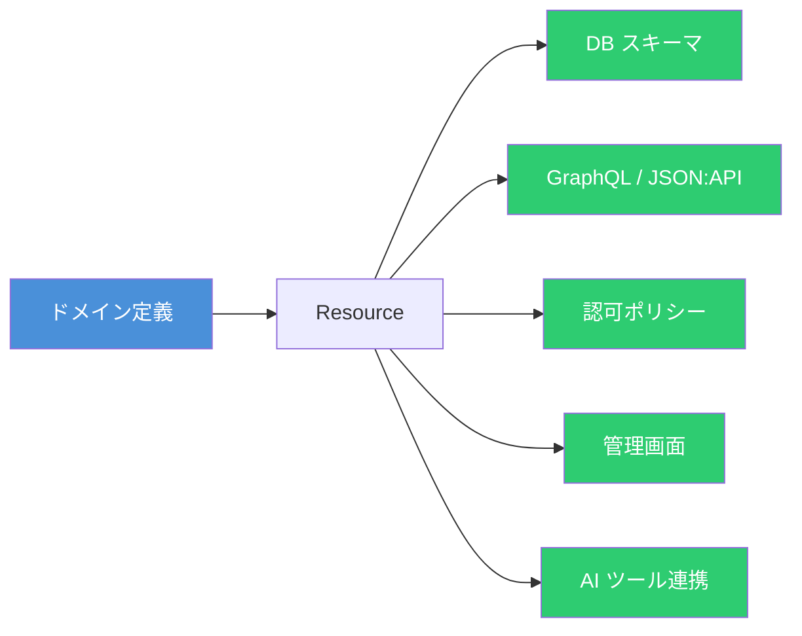
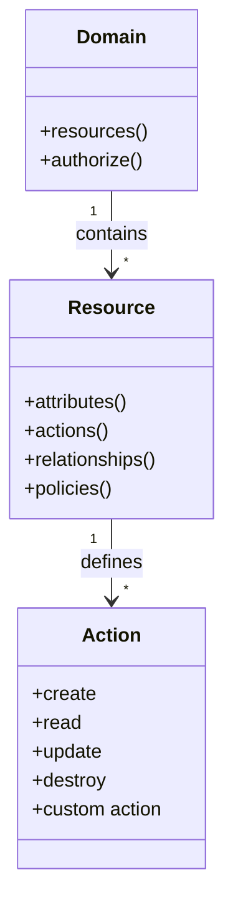
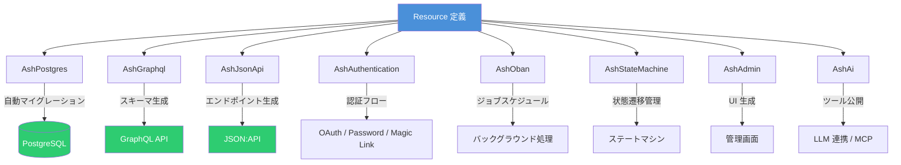

# Ash Framework 入門 ― Elixir の宣言的ドメインモデリングフレームワーク

## Ash Framework とは

[Ash](https://ash-hq.org/) は Elixir 向けの宣言的アプリケーションフレームワークである。コンセプトは **"Model your domain, derive the rest"** ― ドメインモデルを宣言的に定義すれば、データベーススキーマ・API エンドポイント・認可ルールなどが自動的に導出される。



従来の Elixir/Phoenix 開発では Context・Schema・Controller・Resolver などを個別に記述する必要があったが、Ash ではリソース定義に集約することでボイラープレートを大幅に削減する。

## コア概念

Ash のアーキテクチャは 3 つの中心概念で構成される。



### Resource（リソース）

ドメインモデルの中心単位である。属性・アクション・リレーション・バリデーション・ポリシーを一か所に集約して定義する。

### Domain（ドメイン）

複数のリソースをグループ化し、外部に公開する API の境界を形成する。

### Action（アクション）

リソースに対する操作を定義する。CRUD のデフォルトアクションに加え、ドメイン固有のカスタムアクションを定義できる。

## セットアップ

### 新規プロジェクト作成

```bash
mix archive.install hex igniter_new
mix igniter.new my_app --install ash
cd my_app
```

### 既存プロジェクトへの追加

```bash
mix igniter.install ash
```

## 基本的なリソース定義

ヘルプデスクアプリを例に、チケットリソースを定義する。

### Domain の定義

```elixir
defmodule Helpdesk.Support do
  use Ash.Domain

  resources do
    resource Helpdesk.Support.Ticket
    resource Helpdesk.Support.Representative
  end
end
```

`config/config.exs` に Domain を登録する。

```elixir
config :helpdesk, :ash_domains, [Helpdesk.Support]
```

### Resource の定義

```elixir
defmodule Helpdesk.Support.Ticket do
  use Ash.Resource,
    domain: Helpdesk.Support,
    data_layer: AshPostgres.DataLayer

  postgres do
    table "tickets"
    repo Helpdesk.Repo
  end

  attributes do
    uuid_primary_key :id

    attribute :subject, :string, allow_nil?: false
    attribute :body, :string

    attribute :status, :atom do
      constraints one_of: [:open, :in_progress, :closed]
      default :open
      allow_nil? false
    end

    timestamps()
  end

  relationships do
    belongs_to :representative, Helpdesk.Support.Representative
  end

  actions do
    defaults [:read, :destroy]

    create :open do
      accept [:subject, :body]
    end

    update :assign do
      accept []
      argument :representative_id, :uuid, allow_nil?: false
      change manage_relationship(:representative_id, :representative, type: :append)
    end

    update :close do
      accept []

      validate attribute_does_not_equal(:status, :closed) do
        message "Ticket is already closed"
      end

      change set_attribute(:status, :closed)
    end
  end
end
```

ポイントは以下の通りである。

- **`attributes`** でスキーマを宣言的に定義する
- **`actions`** で許可される操作を明示的に列挙する（暗黙の CRUD ではない）
- **`relationships`** で他リソースとの関連を定義する
- **`data_layer`** でデータ永続化先を指定する

### リソースの操作

```elixir
# チケット作成
Helpdesk.Support.Ticket
|> Ash.Changeset.for_create(:open, %{subject: "ログインできない"})
|> Ash.create!()

# チケット一覧取得
Helpdesk.Support.Ticket
|> Ash.read!()

# チケットをクローズ
ticket
|> Ash.Changeset.for_update(:close)
|> Ash.update!()
```

## ポリシーによる認可制御

Ash はリソース単位でポリシーベースの認可を組み込める。

```elixir
defmodule Helpdesk.Support.Ticket do
  use Ash.Resource, ...

  policies do
    policy action_type(:read) do
      authorize_if always()
    end

    policy action_type(:create) do
      authorize_if actor_attribute_equals(:role, :support_agent)
    end

    policy action(:close) do
      authorize_if relates_to_actor_via(:representative)
    end
  end
end
```

ポリシーはコードレビューで一目でわかる宣言的な記述であり、ビジネスルールとして読み下せる。

## エコシステム

Ash の真価はリソース定義から多様な機能を自動導出するエコシステムにある。



### 主要な拡張パッケージ

| パッケージ            | 用途                                            |
| --------------------- | ----------------------------------------------- |
| **AshPostgres**       | PostgreSQL データレイヤー・自動マイグレーション |
| **AshSqlite**         | SQLite データレイヤー                           |
| **AshGraphql**        | GraphQL API 自動生成                            |
| **AshJsonApi**        | JSON:API 準拠の REST API 生成                   |
| **AshAuthentication** | パスワード・OAuth・マジックリンク認証           |
| **AshOban**           | Oban ベースのバックグラウンドジョブ             |
| **AshStateMachine**   | 宣言的ステートマシン                            |
| **AshPaperTrail**     | 変更履歴の自動記録                              |
| **AshAdmin**          | Phoenix LiveView ベースの管理画面               |
| **AshAi**             | LLM 連携・構造化出力・MCP サーバー              |

### AshGraphql による API 生成例

リソースに数行追加するだけで GraphQL API が生成される。

```elixir
defmodule Helpdesk.Support.Ticket do
  use Ash.Resource, ...

  graphql do
    type :ticket

    queries do
      get :get_ticket, :read
      list :list_tickets, :read
    end

    mutations do
      create :open_ticket, :open
      update :close_ticket, :close
    end
  end
end
```

コントローラーやリゾルバーを書く必要はない。リソース定義から型・バリデーション・認可がすべて引き継がれる。

### AshStateMachine によるステート管理

```elixir
defmodule Helpdesk.Support.Ticket do
  use Ash.Resource, ...
  use AshStateMachine

  state_machine do
    initial_states [:open]
    default_initial_state :open

    transitions do
      transition :assign, from: :open, to: :in_progress
      transition :close, from: [:open, :in_progress], to: :closed
      transition :reopen, from: :closed, to: :open
    end
  end
end
```

不正な状態遷移はコンパイル時・実行時の両方で検出される。

## Ash を選ぶ判断基準

| 向いているケース          | 向いていないケース           |
| ------------------------- | ---------------------------- |
| CRUD 中心のビジネスアプリ | 極端にカスタムな UI/UX       |
| 複数 API 形式の同時提供   | 単純なスクリプト・バッチ     |
| 複雑な認可ルール          | Elixir 以外の言語制約        |
| ドメイン駆動設計の実践    | 学習コストを最小にしたい場合 |
| 管理画面の迅速な構築      |                              |

## まとめ

Ash は **宣言的なリソース定義を中心に、データ永続化・API 公開・認可・ステート管理・AI 連携まで自動導出する** Elixir フレームワークである。ドメインモデルを一度定義すれば、あとは必要な拡張パッケージを追加するだけで機能が広がる設計は、ビジネスロジックに集中したい開発チームにとって強力な選択肢となる。

## 参考

- [Ash Framework 公式サイト](https://ash-hq.org/)
- [What is Ash? — Ash v3.19 ドキュメント](https://hexdocs.pm/ash/what-is-ash.html)
- [GitHub - ash-project/ash](https://github.com/ash-project/ash)
- [Domains and Resources in Ash for Elixir — AppSignal Blog](https://blog.appsignal.com/2026/01/13/domains-and-resources-in-ash-for-elixir.html)
- [Ash Framework — Pragmatic Bookshelf](https://pragprog.com/titles/ldash/ash-framework/)
