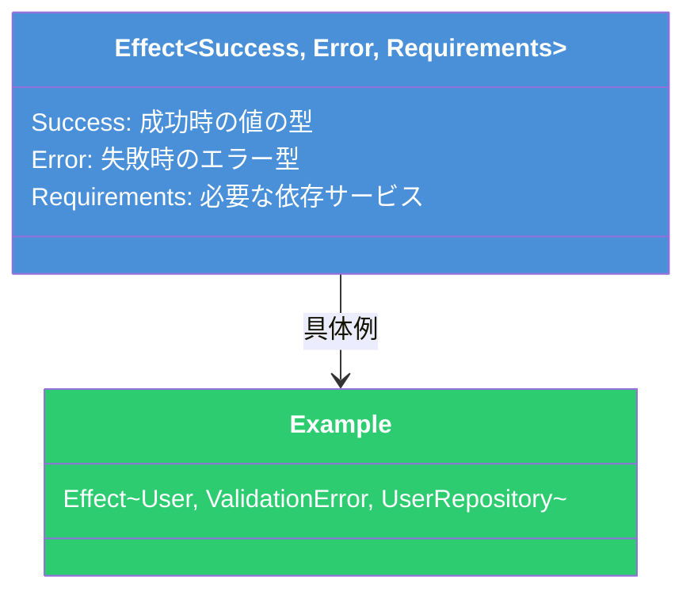
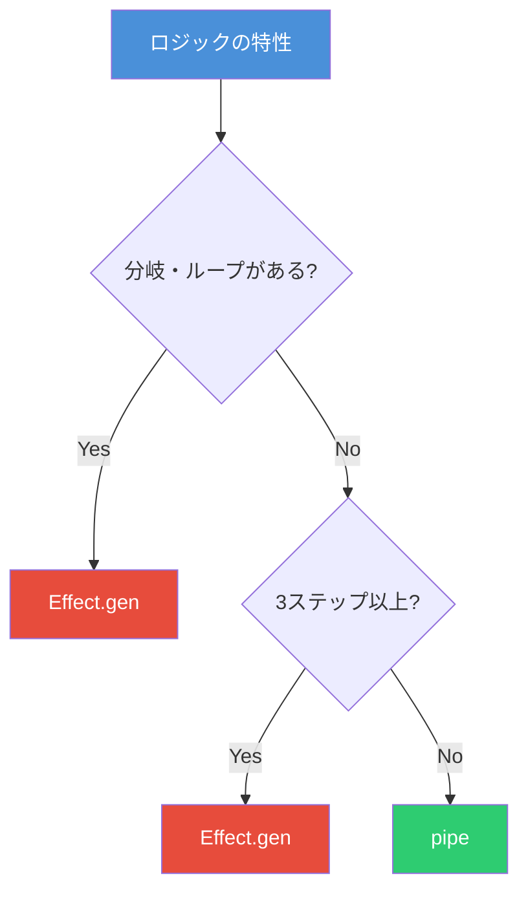
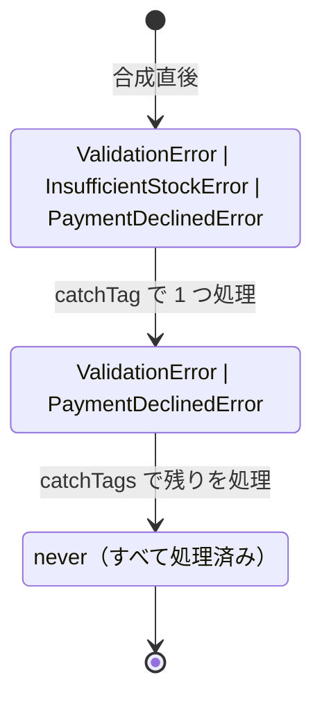
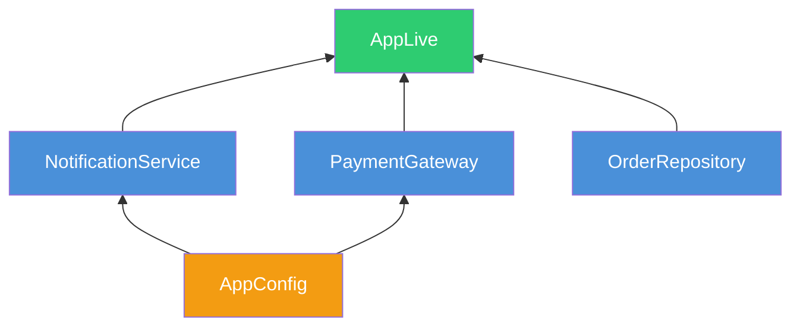

# Effect によるビジネスロジック合成 ― 型安全なパイプライン・エラー処理・依存性注入

## Effect とは

[Effect](https://effect.website/) は TypeScript 向けの型安全なエフェクトシステムライブラリである。非同期処理・エラーハンドリング・依存性注入・並行処理といった横断的関心事を、**型レベルで追跡**しながら合成可能にする。

Effect の中核となる型は `Effect<Success, Error, Requirements>` の 3 つの型パラメータを持つ。



この 3 パラメータにより、**何を返すか・どう失敗するか・何に依存するか**がすべてコンパイル時に検証される。

## 2 つの合成スタイル

Effect はビジネスロジックを合成するための 2 つのスタイルを提供する。

### pipe（パイプラインスタイル）

関数を直列につなぐポイントフリー記法である。データの変換フローを宣言的に記述できる。

```typescript
import { Effect, pipe } from 'effect'

const finalAmount = pipe(
  fetchTransactionAmount,
  Effect.map((amount) => amount + 100), // サービス料加算
  Effect.flatMap((amount) => applyDiscount(amount, 5)), // 割引適用
  Effect.tap((result) => logTransaction(result)), // ログ出力（値は変えない）
)
```

### Effect.gen（ジェネレータスタイル）

`async/await` に似た逐次的な記法で、分岐やループを含む複雑なロジックに向く。

```typescript
import { Effect } from 'effect'

const processOrder = Effect.gen(function* () {
  const user = yield* fetchUser(userId)
  const inventory = yield* checkInventory(productId)
  const order = yield* createOrder(user, inventory)
  const confirmation = yield* sendConfirmation(order)
  return confirmation
})
```

`yield*` は Effect の値をアンラップし、エラー発生時はその時点で短絡する。

### 使い分けの指針



| 演算子    | 用途                                     | シグネチャ               |
| --------- | ---------------------------------------- | ------------------------ |
| `map`     | 成功値を変換（新たな Effect を生まない） | `A => B`                 |
| `flatMap` | 依存する Effect を連鎖（最も頻用）       | `A => Effect<B, E2, R2>` |
| `andThen` | 柔軟な連鎖（値・関数・Effect を受ける）  | `A => B \| Effect<B>`    |
| `tap`     | 副作用（ログ・メトリクス）を挟む         | `A => Effect<void>`      |

## 型安全なエラーハンドリング

Effect は **期待されるエラー（Expected Errors）** と **予期しないエラー（Defects）** を明確に区別する。期待されるエラーは型パラメータ `Error` で追跡され、コンパイル時に処理漏れを検出できる。

### TaggedError によるドメインエラー定義

```typescript
import { Data } from 'effect'

class ValidationError extends Data.TaggedError('ValidationError')<{
  field: string
  message: string
}> {}

class InsufficientStockError extends Data.TaggedError('InsufficientStockError')<{
  productId: string
  requested: number
  available: number
}> {}

class PaymentDeclinedError extends Data.TaggedError('PaymentDeclinedError')<{
  reason: string
}> {}
```

`Data.TaggedError` は `_tag` プロパティを持つ不変のエラークラスを生成する。この `_tag` が後述の `catchTag` によるパターンマッチの判別子となる。

### エラーの自動合成

複数の Effect を合成すると、エラー型は**自動的にユニオンになる**。

```typescript
// validateOrder: Effect<Order, ValidationError>
// checkInventory: Effect<Reservation, InsufficientStockError>
// processPayment: Effect<Receipt, PaymentDeclinedError>

const placeOrder = Effect.gen(function* () {
  const order = yield* validateOrder(input)
  const reservation = yield* checkInventory(order.items)
  const receipt = yield* processPayment(order.total)
  return { order, reservation, receipt }
})
// 推論型: Effect<Result, ValidationError | InsufficientStockError | PaymentDeclinedError>
```

### エラーハンドリング演算子

```typescript
const handled = placeOrder.pipe(
  // 特定のエラーだけをハンドル
  Effect.catchTag('InsufficientStockError', (e) =>
    Effect.succeed({ status: 'backordered' as const, productId: e.productId }),
  ),
  // 複数のエラーを一括ハンドル
  Effect.catchTags({
    ValidationError: (e) => Effect.succeed({ status: 'invalid' as const, field: e.field }),
    PaymentDeclinedError: (e) =>
      Effect.succeed({ status: 'payment_failed' as const, reason: e.reason }),
  }),
)
```

`catchTag` でエラーを処理するたびに、**型レベルでそのエラーがユニオンから除去される**。すべてのエラーを処理すれば `Error` チャネルは `never` になる。



## Service / Layer による依存性注入

Effect のビジネスロジック合成で最も強力な機能が **Service** と **Layer** による依存性注入である。

### Service の定義

`Context.Tag` でサービスのインターフェースを定義する。

```typescript
import { Context, Effect } from 'effect'

class OrderRepository extends Context.Tag('OrderRepository')<
  OrderRepository,
  {
    readonly findById: (id: string) => Effect.Effect<Order, OrderNotFoundError>
    readonly save: (order: Order) => Effect.Effect<Order>
  }
>() {}

class PaymentGateway extends Context.Tag('PaymentGateway')<
  PaymentGateway,
  {
    readonly charge: (
      amount: number,
      method: PaymentMethod,
    ) => Effect.Effect<Receipt, PaymentDeclinedError>
  }
>() {}

class NotificationService extends Context.Tag('NotificationService')<
  NotificationService,
  {
    readonly sendOrderConfirmation: (order: Order) => Effect.Effect<void>
  }
>() {}
```

**重要**: サービスインターフェースのメソッドが返す Effect の `Requirements` は `never` にする。依存関係は Layer の構築時に注入する。

### ビジネスロジックの合成

サービスを `yield*` で取得し、ビジネスロジックを組み立てる。

```typescript
const processOrder = (input: OrderInput) =>
  Effect.gen(function* () {
    const repo = yield* OrderRepository
    const payment = yield* PaymentGateway
    const notification = yield* NotificationService

    // 1. バリデーション
    if (input.items.length === 0) {
      return yield* Effect.fail(
        new ValidationError({
          field: 'items',
          message: '注文には最低1つの商品が必要',
        }),
      )
    }

    // 2. 在庫確認
    const reservation = yield* checkInventory(input.items)

    // 3. 決済処理
    const receipt = yield* payment.charge(input.total, input.paymentMethod)

    // 4. 注文永続化
    const order = yield* repo.save({
      items: input.items,
      reservationId: reservation.id,
      receiptId: receipt.id,
      status: 'confirmed',
    })

    // 5. 通知送信（失敗しても注文自体は成功）
    yield* notification.sendOrderConfirmation(order).pipe(Effect.catchAll(() => Effect.void))

    return order
  })
// 型: Effect<Order, ValidationError | InsufficientStockError | PaymentDeclinedError,
//          OrderRepository | PaymentGateway | NotificationService>
```

`Requirements` パラメータが必要なサービスを自動追跡するため、依存の注入漏れはコンパイルエラーとなる。

### Layer によるサービスの実装と合成

```typescript
import { Layer } from 'effect'

// 依存なしの Layer
const OrderRepositoryLive = Layer.succeed(OrderRepository, {
  findById: (id) =>
    Effect.tryPromise(() => db.orders.findUnique({ where: { id } })).pipe(
      Effect.mapError(() => new OrderNotFoundError({ orderId: id })),
    ),
  save: (order) => Effect.tryPromise(() => db.orders.create({ data: order })),
})

// 依存ありの Layer
const NotificationServiceLive = Layer.effect(
  NotificationService,
  Effect.gen(function* () {
    const config = yield* AppConfig
    return {
      sendOrderConfirmation: (order) =>
        Effect.tryPromise(() =>
          fetch(config.webhookUrl, {
            method: 'POST',
            body: JSON.stringify({ orderId: order.id }),
          }),
        ).pipe(Effect.asVoid),
    }
  }),
)
```

### Layer の合成パターン



```typescript
// 独立した Layer を並列合成
const BaseLive = Layer.merge(OrderRepositoryLive, Layer.merge(AppConfigLive, PaymentGatewayLive))

// 依存のある Layer に提供
const AppLive = NotificationServiceLive.pipe(Layer.provideMerge(BaseLive))

// 実行
const main = processOrder(orderInput).pipe(Effect.provide(AppLive))

Effect.runPromise(main)
```

### テスト用 Layer への差し替え

```typescript
const OrderRepositoryTest = Layer.succeed(OrderRepository, {
  findById: (id) => Effect.succeed({ id, items: [], status: 'pending' }),
  save: (order) => Effect.succeed(order),
})

const PaymentGatewayTest = Layer.succeed(PaymentGateway, {
  charge: (_amount, _method) => Effect.succeed({ id: 'test-receipt', amount: _amount }),
})

// テスト実行
const TestLive = Layer.merge(
  OrderRepositoryTest,
  Layer.merge(PaymentGatewayTest, NotificationServiceTest),
)

const result = await Effect.runPromise(processOrder(testInput).pipe(Effect.provide(TestLive)))
```

**ビジネスロジックのコードを一切変更せず**、Layer の差し替えだけでテスト可能になる。これが Effect の依存性注入の最大の利点である。

## まとめ

| 概念                     | 役割               | ビジネスロジックへの効果         |
| ------------------------ | ------------------ | -------------------------------- |
| `pipe` / `Effect.gen`    | 処理の合成         | 宣言的なワークフロー記述         |
| `TaggedError`            | 型付きエラー       | エラー処理漏れのコンパイル時検出 |
| `catchTag` / `catchTags` | エラーハンドリング | 型レベルでのエラー除去           |
| `Context.Tag`            | サービス定義       | 依存の型安全な追跡               |
| `Layer`                  | サービス実装の提供 | テスト容易性と関心の分離         |

Effect を採用することで、ビジネスロジックは**合成可能で型安全なパイプライン**となる。エラーの処理漏れや依存の注入漏れがコンパイル時に検出されるため、ランタイムエラーのリスクを大幅に低減できる。

## 参考

- [Effect 公式ドキュメント](https://effect.website/docs/getting-started/introduction)
- [Effect - Building Pipelines](https://effect.website/docs/getting-started/building-pipelines)
- [Effect - Expected Errors](https://effect.website/docs/composable-error-management/expected-errors)
- [Effect - Managing Services](https://effect.website/docs/requirements-management/services)
- [Effect - Managing Layers](https://effect.website/docs/requirements-management/layers)
- [GitHub - Effect-TS/effect](https://github.com/Effect-TS/effect)
